# 认知工作流规则引擎设计文档

## 概述

基于产生式规则的层次化认知工作流系统，采用领域驱动设计（DDD）架构模式，核心理念为自然语言驱动的产生式规则执行引擎，支持智能决策、自适应优化和层次化协作。

## 系统架构概览

### 规则引擎执行流程图

```mermaid
%%{init: {'theme':'base', 'themeVariables': {'primaryColor':'#2e7d32', 'primaryTextColor':'#ffffff', 'primaryBorderColor':'#1565c0', 'lineColor':'#424242', 'tertiaryColor':'#f5f5f5', 'background':'#ffffff', 'fontFamily':'Arial, sans-serif', 'fontSize':'14px'}}}%%
flowchart TD
    Start([开始执行]) --> Init[初始化规则引擎]
    Init --> LoadRules[加载产生式规则集]
    LoadRules --> StateInit[初始化全局状态]
    
    StateInit --> MainLoop{主执行循环}
    MainLoop --> MatchRules[规则匹配阶段]
    
    MatchRules --> HasMatch{找到匹配规则?}
    HasMatch -->|是| SelectRule[选择最佳规则]
    HasMatch -->|否| GenNewRule[生成新规则]
    
    SelectRule --> ExecRule[执行规则动作]
    GenNewRule --> AddRule[添加规则到集合]
    AddRule --> ExecRule
    
    ExecRule --> UpdateState[更新系统状态]
    UpdateState --> CheckGoal{目标达成?}
    
    CheckGoal -->|否| CheckLoop{检测循环?}
    CheckGoal -->|是| Success[执行成功]
    
    CheckLoop -->|无循环| CheckMaxIter{达到最大迭代?}
    CheckLoop -->|检测到循环| HandleLoop[处理循环]
    
    CheckMaxIter -->|否| MainLoop
    CheckMaxIter -->|是| Timeout[执行超时]
    
    HandleLoop --> ForceExit[强制退出]
    Success --> CleanUp[清理资源]
    Timeout --> CleanUp
    ForceExit --> CleanUp
    CleanUp --> End([执行结束])
    
    style Start fill:#2e7d32,stroke:#1565c0,stroke-width:3px,color:#ffffff
    style Init fill:#1976d2,stroke:#0d47a1,stroke-width:2px,color:#ffffff
    style LoadRules fill:#1976d2,stroke:#0d47a1,stroke-width:2px,color:#ffffff
    style StateInit fill:#1976d2,stroke:#0d47a1,stroke-width:2px,color:#ffffff
    style MainLoop fill:#ff6f00,stroke:#e65100,stroke-width:3px,color:#ffffff
    style MatchRules fill:#1976d2,stroke:#0d47a1,stroke-width:2px,color:#ffffff
    style HasMatch fill:#ff6f00,stroke:#e65100,stroke-width:3px,color:#ffffff
    style SelectRule fill:#388e3c,stroke:#2e7d32,stroke-width:2px,color:#ffffff
    style GenNewRule fill:#7b1fa2,stroke:#4a148c,stroke-width:2px,color:#ffffff
    style ExecRule fill:#388e3c,stroke:#2e7d32,stroke-width:2px,color:#ffffff
    style AddRule fill:#7b1fa2,stroke:#4a148c,stroke-width:2px,color:#ffffff
    style UpdateState fill:#1976d2,stroke:#0d47a1,stroke-width:2px,color:#ffffff
    style CheckGoal fill:#ff6f00,stroke:#e65100,stroke-width:3px,color:#ffffff
    style CheckLoop fill:#ff6f00,stroke:#e65100,stroke-width:3px,color:#ffffff
    style Success fill:#4caf50,stroke:#2e7d32,stroke-width:3px,color:#ffffff
    style CheckMaxIter fill:#ff6f00,stroke:#e65100,stroke-width:3px,color:#ffffff
    style HandleLoop fill:#f57c00,stroke:#e65100,stroke-width:2px,color:#ffffff
    style Timeout fill:#f57c00,stroke:#e65100,stroke-width:3px,color:#ffffff
    style ForceExit fill:#d32f2f,stroke:#b71c1c,stroke-width:3px,color:#ffffff
    style CleanUp fill:#1976d2,stroke:#0d47a1,stroke-width:2px,color:#ffffff
    style End fill:#2e7d32,stroke:#1565c0,stroke-width:3px,color:#ffffff
```

### 系统架构分层图

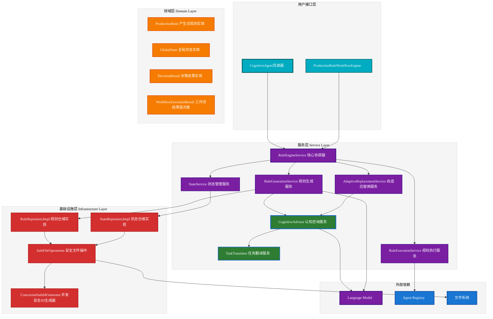

### 认知咨询与任务翻译集成流程

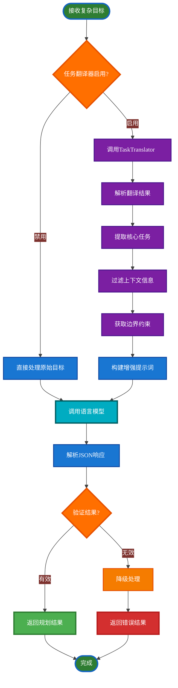

### 任务翻译器详细流程

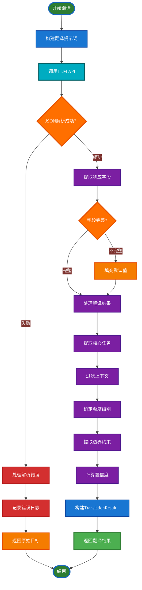

### 简化工作流交互序列

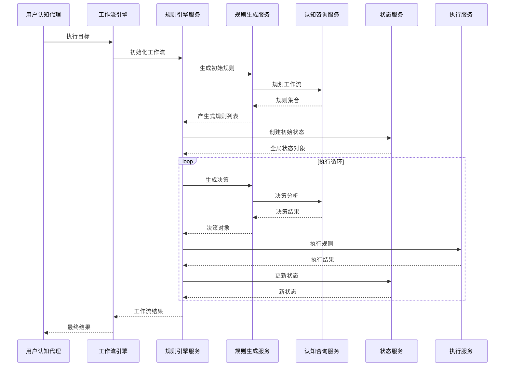

### 系统数据流架构图

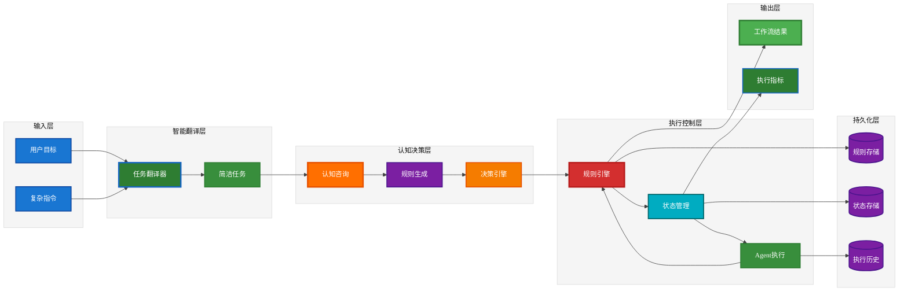

## 指令分类与路由决策流程

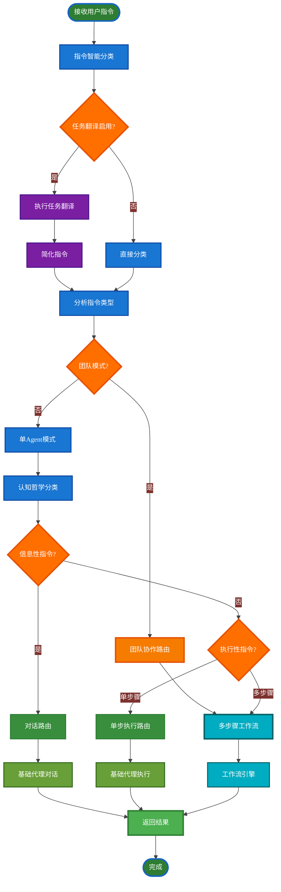

## 领域模型类图

### 核心领域实体

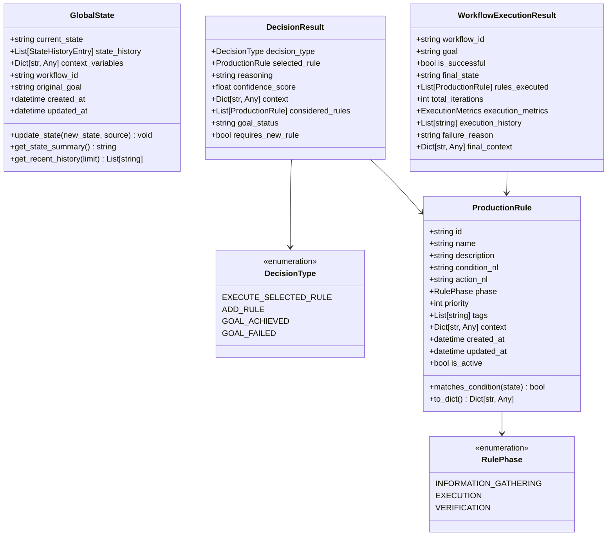

### 服务层类图

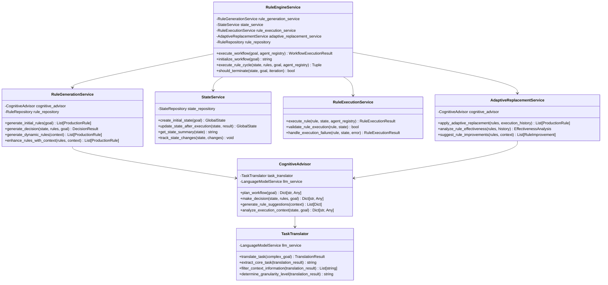

### 基础设施层类图

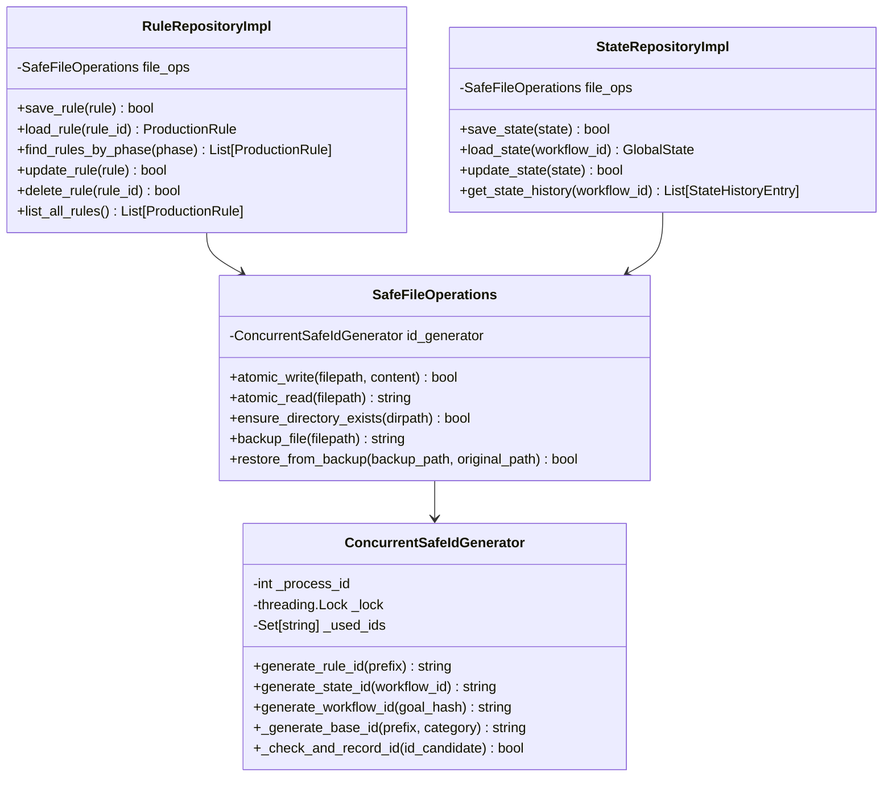

## 核心工作流时序图

### 工作流执行主流程

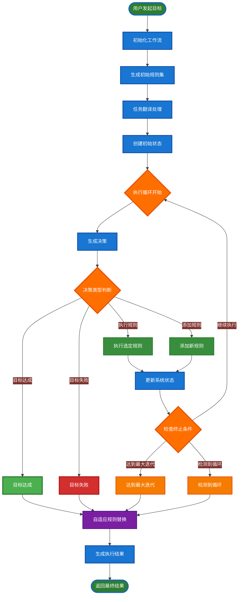

### 指令分类与执行路由流程

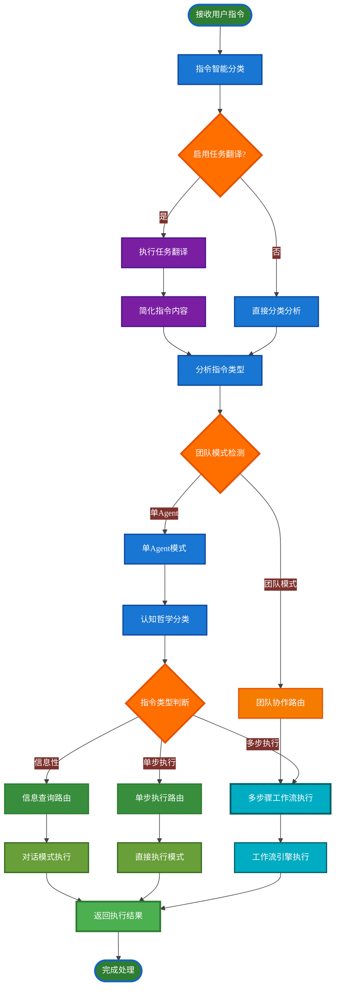

## 重要方法流程图

### RuleEngineService.execute_workflow 流程

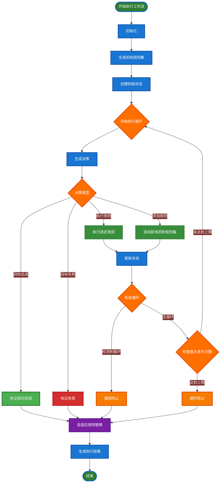

## 关键设计决策

### 1. 任务翻译层设计
- **目的**：解决层次化认知架构中的上下文污染问题
- **实现**：LLM驱动的智能翻译，提取核心任务，过滤无关信息
- **集成点**：CognitiveAdvisor.plan_workflow() 和 CognitiveAgent.classify_instruction()

### 2. 产生式规则架构
- **自然语言条件**：IF部分使用自然语言描述
- **自然语言动作**：THEN部分使用自然语言描述
- **语义匹配**：基于LLM的语义理解而非字符串匹配

### 3. 缓存优化策略
- **移除随机元素**：去除UUID和时间戳等随机字段
- **确定性ID**：基于内容哈希的可预测ID生成
- **LLM缓存依赖**：信任底层LLM的缓存机制

### 4. 层次化认知架构
- **包装器模式**：CognitiveAgent包装基础Agent
- **智能路由**：根据指令类型选择执行方式
- **认知哲学**：基于探索未知vs确定性执行的分类理念

### 5. 错误处理与容错
- **自动恢复**：失败时生成修复规则
- **循环检测**：防止决策死循环
- **并发安全**：多进程安全的文件操作

## 性能与扩展性

### 性能优化
- **LLM调用优化**：依赖底层缓存，避免重复实现
- **并发安全**：支持多进程并发执行
- **内存管理**：适当的缓存策略，避免内存泄漏

### 扩展性设计
- **插件化服务**：每个服务可独立扩展
- **Agent注册机制**：支持动态Agent注册
- **规则库扩展**：支持自定义规则类型
- **仓储抽象**：支持不同存储后端

## 未来发展方向

1. **分布式执行**：支持跨节点的规则执行
2. **实时监控**：执行过程的实时监控和调试
3. **规则学习**：基于执行历史的规则自动学习
4. **性能分析**：更详细的性能分析和优化建议
5. **可视化界面**：规则编辑和执行过程的可视化界面

---

*本文档描述了认知工作流规则引擎的完整架构设计，为系统的开发、维护和扩展提供了详细的技术指导。*