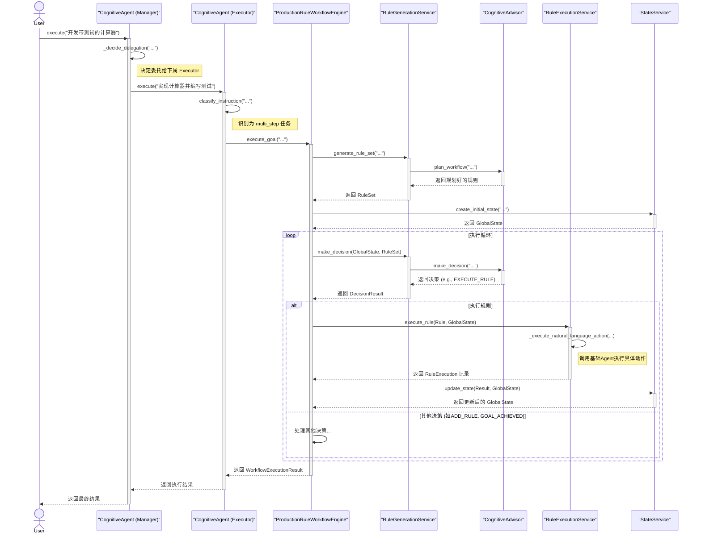

# 产生式规则认知工作流架构文档

**版本**: 3.0 (由Gemini根据代码分析生成)
**日期**: 2025年7月1日

## 1. 核心理念：统一与递归的认知智能体

本系统是一个基于**产生式规则 (Production Rule)** 的高级认知工作流框架。其核心设计理念是，通过一个统一的、可递归组合的 `CognitiveAgent` 单元，来构建能够解决复杂问题的、任意层次的智能系统。

与传统的固定层次（如“经理-员工”）模型不同，本架构遵循“**组合优于继承**”的原则。系统中的每一个智能体 `CognitiveAgent` 都是一个独立的“认知细胞”，它既可以作为**执行者 (Executor)** 独立完成任务，也可以作为**管理者 (Manager)**，将其团队（`team_members`）中的其他 `CognitiveAgent` 组织起来，协同完成更宏大的目标。

这种递归结构使得系统具备极高的**灵活性**和**可扩展性**，能够自然地模拟从个人、小组到复杂组织等不同规模的协作模式。

## 2. 系统分层架构 (DDD)

系统遵循**领域驱动设�� (Domain-Driven Design)** 的思想，将代码清晰地划分为以下几个层次：

-   **Domain (领域层)**: 定义了系统的核心业务实体（Entities）和值对象（Value Objects）。这是系统中最纯粹、最核心的部分，不依赖任何技术实现。
    -   **关键实体**: `ProductionRule`, `RuleSet`, `GlobalState`, `AgentRegistry`, `DecisionResult`。
    -   **关键值对象**: `RulePhase`, `ExecutionStatus`, `SituationScore`。

-   **Services (服务层)**: 封装了核心的业务逻辑。服务层编排领域对象来完成具体的业务操作。
    -   `RuleEngineService`: **系统总协调器**，负责驱动整个工作流的执行。
    -   `RuleGenerationService`: **规则生成器**，负责根据目标动态创建规则。
    -   `RuleExecutionService`: **规则执行器**，负责执行单条规则。
    -   `StateService`: **状态管理器**，负责更新和维护工作流的全局状态。
    -   `AgentService`: **智能体管理器**，负责获取和管理 `CognitiveAgent` 实例。
    -   `CognitiveAdvisor`: **认知顾问**，一个特殊的智能体，为规则生成和决策提供高级规划能力。
    -   `AdaptiveReplacementService`: **自适应优化器**，负责在运行时动态优化规则集。

-   **Engine (引擎层)**: 提供了系统的统一入口和控制中心。
    -   `ProductionRuleWorkflowEngine`: 封装了 `RuleEngineService`，提供了如 `execute_goal` 等面向用户的接口。

-   **Infrastructure (基础设施层)**: 提供了技术实现细节，如数据持久化。
    -   `RuleRepositoryImpl`, `StateRepositoryImpl`, `ExecutionRepositoryImpl`: 提供了基于文件系统的仓储实现。

-   **Utils (工具层)**: 提供跨层的辅助工具。
    -   `ConcurrentSafeIdGenerator`: 用于在并发环境中生成唯一的ID。

## 3. 核心组件与执行流程

### 3.1. `CognitiveAgent` (认知智能体)

这是系统的核心单元，定义在 `cognitive_workflow_agent_wrapper.py` 中。

-   **双重角色**:
    1.  **管理者**: 当 `__init__` 时传入 `team_members`，它就成为一个管理者。
    2.  **执行者**: 如果没有 `team_members`，它就是一个叶节点执行者。

-   **统一入口 `execute(instruction)`**:
    -   当作为管理者时，它会调用内部的 `_decide_delegation` 方法判断是否需要将任务委托给下属。如果需要，它会递归地调用下属成员的 `execute` 方法。
    -   当作为执行者（或决定亲自执行）时，它会调用 `execute_instruction_syn` 方法。

-   **内部执行逻辑 `execute_instruction_syn`**:
    1.  **指令分类**: 调用 `classify_instruction`，使用LLM将指令��为 `informational`, `single_step`, `multi_step`。
    2.  **执行路由**:
        -   `informational` -> 调用基础Agent的 `chat` 方法。
        -   `single_step` -> 调用基础Agent的 `execute` 方法。
        -   `multi_step` -> 启动自己内部的 `ProductionRuleWorkflowEngine` 来解决这个多步子任务。

### 3.2. `ProductionRuleWorkflowEngine` (工作流引擎)

每个 `CognitiveAgent` 在作为执行者处理 `multi_step` 任务时，都会在内部实例化并运行一个属于自己的小型工作流引擎。

-   **启动**: 通过 `execute_goal` 方法启动。
-   **核心循环**:
    1.  **规则生成**: 调用 `RuleGenerationService` 的 `generate_rule_set` 方法，后者会利用 `CognitiveAdvisor` 进行规划，生成一个 `RuleSet`。
    2.  **状态初始化**: 调用 `StateService` 创建初始 `GlobalState`。
    3.  **迭代执行**:
        -   调用 `RuleGenerationService` 的 `make_decision` 方法（内部同样使用 `CognitiveAdvisor`）来决定下一步行动（如 `EXECUTE_SELECTED_RULE`）。
        -   如果决策是执行规则，则调用 `RuleExecutionService` 的 `execute_rule` 方法。
        -   `RuleExecutionService` 会通过 `AgentService` 获取对应的Agent实例，并执行规则中的 `action`。
        -   执行结果返回后，调用 `StateService` 的 `update_state` 方法更新 `GlobalState`。
    4.  **循环与自优化**:
        -   如果执行失败，`RuleEngineService` 会调用 `handle_rule_failure`，后者通过 `RuleGenerationService` 生成恢复规则。
        -   `AdaptiveReplacementService` 会被调用，以智能的方式将新规则（无论是新生成的还是用于恢复的）合并到现有规则集中，实现规则集的自适应优化。
        -   循环继续，直到目标达成或达到最大迭代次数。

### 3.3. 核心交互序列图

下面的序列图展示了一个典型的、跨越多层的任务执行流程：

## 4. 自我学习与优化 (Phase 3)

系统包含多个用于自我优化的高级服务，这表明其架构具备向更高阶智能演进的潜力：

-   `IntelligentPerformanceBenchmark`: 提供了一个完整的基准测试框架，用于科学地评估系统性能。
-   `AdvancedPatternRecognitionEngine`: 能够从执行历史中识别出时间、上下文、性能等多种模式，为预测和主动优化提供依据。
-   `PredictiveOptimizationFramework`: 基于模式识别的预测，创建主动的优化计划，使系统从“被动响应”变为“主动优化”。
-   `ReinforcementLearningOptimizer` & `DynamicParameterOptimizer`: 提供了基于强化学习和贝叶斯优化等算法的超参数自动调优能力，使系统能够通过持续学习来优化自身的核心参数。

## 5. 总结

该系统是一个���计精良、高度模块化、可扩展的认知架构。它通过统一的、可递归的 `CognitiveAgent` 概念，优雅地解决了多智能体协作的复杂性。其分层的服务和先进的自优化组件，为构建能够学习和进化的复杂AI系统提供了坚实的基础。
