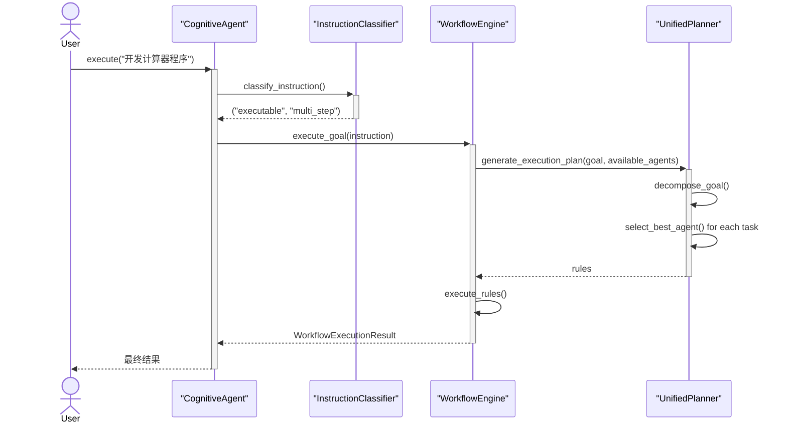

# 产生式规则认知工作流架构文档

**版本**: 4.0 (基于深度架构讨论优化)
**日期**: 2025年7月1日

## 1. 核心理念：统一与简洁的认知智能体

本系统是一个基于**产生式规则 (Production Rule)** 的高级认知工作流框架。经过深度架构分析，我们确立了"**统一规划，智能适配**"的核心设计理念。

### 1.1 设计哲学的重大简化

**原有复杂概念** → **统一简洁概念**
- ~~委托决策 + 工作流规划~~ → **统一工作流规划**
- ~~单Agent路径 + 多Agent路径~~ → **统一执行路径**
- ~~isTeam判断 + 复杂条件~~ → **自适应Agent池**

### 1.2 核心洞察

1. **生成计划就是委托** - 工作流规划本身包含了所有必要的任务分配逻辑
2. **一切皆规划** - 无论简单任务还是复杂任务，统一通过工作流处理
3. **自适应Agent池** - available_agents = {"self": self, **self.team}，无需额外判断

## 2. 简化后的系统架构

### 2.1 统一的CognitiveAgent设计

```python
class CognitiveAgent:
    def __init__(self, base_agent, team_members=None):
        self.base_agent = base_agent
        self.team = team_members or {}
        
        # 统一的Agent池：自己 + 团队成员
        self.available_agents = {"self": self, **self.team}
        
        # 初始化统一工作流引擎
        self.workflow_engine = ProductionRuleWorkflowEngine(
            available_agents=self.available_agents
        )
    
    def execute(self, instruction: str):
        """极简的统一执行逻辑"""
        instruction_type, complexity = self.classify_instruction(instruction)
        
        if instruction_type == "informational":
            return self.base_agent.chat_sync(instruction)
        elif complexity == "single_step":
            return self.base_agent.execute_sync(instruction)
        else:  # multi_step
            return self.workflow_engine.execute_goal(instruction)
```

### 2.2 移除的冗余概念

以下概念在新架构中被移除或简化：

- ~~`_decide_delegation()`~~ - 委托决策逻辑
- ~~`delegation_mode`~~ - 委托模式配置
- ~~`is_team_leader`~~ - 团队领导标识
- ~~`has_team` 判断~~ - 团队存在检查
- ~~多条执行路径~~ - 复杂的路径选择逻辑

## 3. 统一工作流规划引擎

### 3.1 核心设计原理

**一个规划方法处理所有场景**：

```python
class UnifiedWorkflowPlanner:
    def generate_execution_plan(self, goal: str, available_agents: dict):
        """
        统一规划算法：自动适配任何数量的Agent
        """
        # 1. 智能任务分解
        subtasks = self.decompose_goal(goal)
        
        # 2. 智能Agent匹配
        rules = []
        for task in subtasks:
            best_agent = self.select_best_agent(task, available_agents)
            rules.append(Rule(agent=best_agent, action=task.action))
        
        return rules
    
    def select_best_agent(self, task, available_agents):
        """
        智能Agent选择：统一处理1个或多个Agent
        """
        if len(available_agents) == 1:
            return list(available_agents.keys())[0]
        else:
            return self.match_agent_to_task(task, available_agents)
```

### 3.2 自适应场景处理

| 场景 | available_agents | 规划结果 | 特点 |
|------|------------------|----------|------|
| **个人专家** | `{"self": coder}` | 单Agent多步骤规划 | 所有任务分配给self |
| **双人团队** | `{"self": manager, "coder": coder}` | 智能协作规划 | 根据能力匹配分配 |
| **多人团队** | `{"self": pm, "coder": c, "tester": t}` | 复杂协作规划 | 最优能力匹配 |

### 3.3 统一规划的执行示例

**目标**: "开发一个计算器程序"

```python
# 单Agent场景 (available_agents = {"self": coder})
rules = [
    Rule(agent="self", action="设计程序结构"),
    Rule(agent="self", action="实现加法功能"),
    Rule(agent="self", action="实现减法功能"),
    Rule(agent="self", action="测试所有功能")
]

# 多Agent场景 (available_agents = {"self": manager, "coder": coder, "tester": tester})
rules = [
    Rule(agent="self", action="制定开发计划"),      # manager最适合规划
    Rule(agent="coder", action="实现计算器功能"),   # coder最适合编程
    Rule(agent="tester", action="编写测试用例"),    # tester最适合测试
    Rule(agent="tester", action="执行测试验证")
]
```

## 4. 简化的执行流程

### 4.1 统一执行序列



### 4.2 关键简化点

1. **单一入口** - 所有任务通过`execute()`统一处理
2. **统一分类** - 只需区分信息性、单步骤、多步骤
3. **统一规划** - 一个规划器处理所有Agent配置
4. **自动适配** - 无需手动配置委托或团队模式

## 5. 架构优势总结

### 5.1 简洁性优势

| 方面 | 原架构 | 新架构 | 改进 |
|------|--------|--------|------|
| **核心概念** | 委托+规划+分类 | 规划+分类 | 减少33% |
| **执行路径** | 多条路径 | 单一路径 | 统一化 |
| **配置复杂度** | 高(delegation_mode等) | 低(team_members) | 大幅简化 |
| **代码维护** | 多套逻辑 | 统一逻辑 | 维护成本降低 |

### 5.2 智能性保持

虽然架构简化，但智能性不降反升：

- **更智能的任务分解** - 统一规划器专注优化分解算法
- **更精准的Agent匹配** - 基于能力的智能匹配
- **更好的错误恢复** - 统一的错误处理机制
- **更强的扩展性** - 新增Agent无需修改核心逻辑

## 6. 使用指南

### 6.1 基本使用模式

```python
# 个人专家模式
expert_agent = CognitiveAgent(base_agent=coder_agent)
result = expert_agent.execute_instruction_syn("开发计算器程序")

# 团队协作模式  
team_leader = CognitiveAgent(
    base_agent=manager_agent,
    team_members={"coder": coder_agent, "tester": tester_agent}
)
result = team_leader.execute_instruction_syn("开发带测试的完整项目")
```

### 6.2 最佳实践

1. **专注于团队构建** - 合理配置team_members
2. **信任智能规划** - 让工作流引擎自动分配任务
3. **简化用户指令** - 提供高层次目标即可
4. **利用自适应性** - 同一Agent可处理不同复杂度任务

## 7. 未来演进方向

### 7.1 持续简化原则

- **奥卡姆剃刀** - 如无必要，勿增实体
- **统一性优先** - 优先考虑统一的解决方案
- **智能自适应** - 减少用户配置，增强系统智能

### 7.2 潜在增强

- **动态团队组建** - 根据任务自动邀请合适的Agent
- **学习型规划** - 从历史执行中学习优化规划策略
- **预测性优化** - 提前预测任务需求和资源分配

## 8. 结论

经过深度架构讨论，新设计实现了：

1. **概念统一** - 消除了委托与规划的概念重复
2. **逻辑简化** - 单一执行路径，统一处理逻辑
3. **智能保持** - 简化的同时保持甚至增强了系统智能性
4. **扩展友好** - 更容易添加新功能和新Agent类型

这个架构真正体现了"**简洁即美**"的设计哲学，为构建下一代认知智能系统奠定了坚实基础。

---

*本文档基于深度架构讨论生成，体现了从复杂到简洁的设计演进过程*