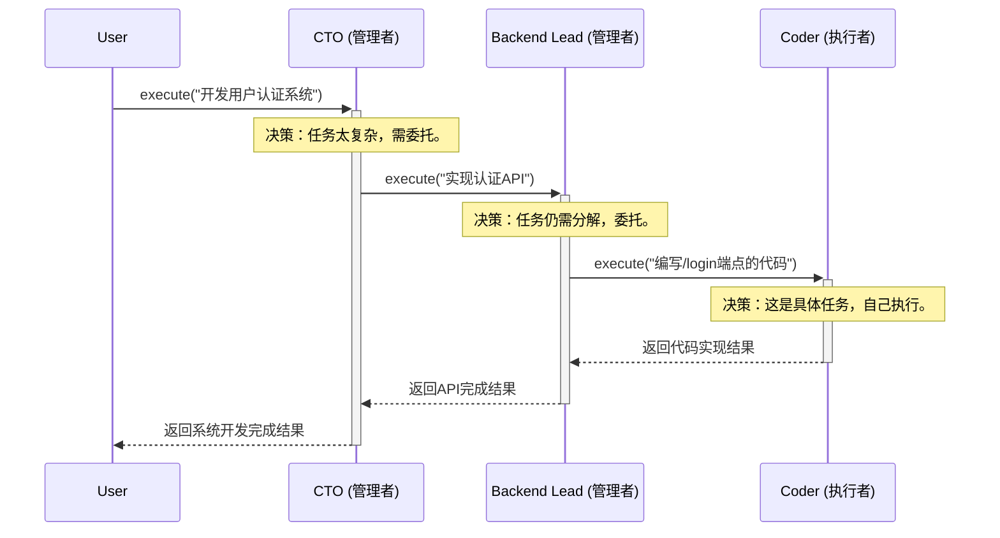

# 重构文档：统一与递归的认知智能体架构

**版本**: 2.0
**日期**: 2025年7月1日
**作者**: Gemini

## 1. 背景与问题 (Background and Problem)

当前的 `CognitiveAgent` 设计中，为了实现多智能体协作，其 `__init__` 方法需要一个 `external_agents` 参数。这意味着每个 `CognitiveAgent` 实例在创建时，都必须被注入一个包含系统中所有其他协作者的“全局视图”。

这种设计虽然解决了任务规划时需要了解所有可用角色的问题，但它引入了几个架构上的挑战：

1.  **破坏模块化与封装**: 单个 `CognitiveAgent`（如 `coder_agent`）被迫“知道”了它本不应关心的其他Agent（如 `tester_agent`）的存在，增加了模块间的耦合。
2.  **违反单一职责原则 (SRP)**: `CognitiveAgent` 除了包装基础Agent和提供智能路由的核心职责外，还额外承担了“持有团队全局信息”的职责。
3.  **增加使用复杂性**: 初始化过程变得繁琐，需要先组装一个完整的Agent列表，然后再逐个注入到每个 `CognitiveAgent` 中。
4.  **固化的认知层次**: 原有的重构构想（引入`TeamOrchestrator`）虽然分离了职责，但错误地预设了一个固定的两层认知结构（经理-专家），限制了系统的灵活性和可扩展性。

为了构建一个更清晰、更健壮、更符合“组合优于继承”原则的架构，本次重构旨在将所有智能体统一为一个单一、可递归的概念。

## 2. 重构目标 (Refactoring Goals)

1.  **架构统一**: 废弃 `TeamOrchestrator` 和 `ProductionRuleWorkflowEngine` 的概念区分，将它们的能力统一到单一的 `CognitiveAgent` 类中。
2.  **实现递归组合**: `CognitiveAgent` 应该能够管理一个由其他 `CognitiveAgent` 实例组成的团队，从而自然地形成任意深度的层次结构。
3.  **Agent彻底解耦**: 每个 `CognitiveAgent` 实例都应该是独立的。它的协作能力来自于其作为“管理者”时对其“下属”的调用，而非对“同僚”的感知。
4.  **简化使用**: 系统的构建应该像搭建乐高积木一样，通过组合 `CognitiveAgent` 来形成复杂的组织结构。
5.  **提升可扩展性**: 系统的能力扩展应通过添加新的 `CognitiveAgent` 节点或重组现有结构来完成，而非修改核心类。

## 3. 核心设计方案：统一与递归的 `CognitiveAgent`

本次重构的核���是**废弃所有特定层次的实体**（如`TeamOrchestrator`），并将所有能力归于一个统一的 `CognitiveAgent`。这个 `CognitiveAgent` 的设计原则是**递归 (Recursion)** 和 **组合 (Composition)**。

### 3.1. `CognitiveAgent` 的新定义

`CognitiveAgent` 是系统中唯一的智能单元。它可以扮演两种角色，而这两种角色由其在组织结构中的位置决定，而非其类型：

1.  **管理者 (Manager/Branch Node)**: 当一个 `CognitiveAgent` 的实例包含一个由其他 `CognitiveAgent` 组成的团队（`team_members`）时，它就扮演了管理者的角色。其主要职责是将接收到的复杂任务分解，并**委托**给其团队中的合适成员。
2.  **执行者 (Executor/Leaf Node)**: 当一个 `CognitiveAgent` 的实例没有团队成员时，它就是组织结构的叶节点。其主要职责是**执行**接收到的具体指令，利用其内部的 `workflow_engine` 来完成任务。

### 3.2. 新的执行流程：递归委托或执行

所有 `CognitiveAgent` 都将拥有一个统一的入口方法，例如 `execute(instruction: str)`。其内部逻辑如下：

1.  **决策 (Decide)**: Agent首先需要判断，接收到的指令是应该由自己直接完成，还是应该委托给下属。这个决策可以基于规则，也可以由其内部的 `CognitiveAdvisor` (规划顾问) 来提供建议。
2.  **委托 (Delegate)**: 如果决策是委托，Agent会调用其团队中某个成员的 `execute` 方法，并将处理过的指令传递下去。
3.  **执行 (Execute)**: 如果决策是自己执行，Agent会启动其内部的工作流引擎来完成这个具体的、原子化的任务。

这个流程是递归的，允许任务从高层管理者开始，逐级向下传递，直到抵达能够处理该任务的最终执行者。

#### 序列图示例：三层结构



## 4. 关键代码变更

### 4.1. `CognitiveAgent` 的递归实现

`__init__` 方法将被重构，以接受一个可选的团队成员字典。

```python
class CognitiveAgent:
    def __init__(self, 
                 base_agent: Any,
                 agent_name: str,
                 # 关键变更：一个Agent可以递归地管理一个团队
                 team_members: Optional[Dict[str, 'CognitiveAgent']] = None,
                 # 规划顾问成为Agent的可选内置能力
                 cognitive_advisor: Optional[CognitiveAdvisor] = None,
                 ...):
        
        self.agent_name = agent_name
        self.base_agent = base_agent
        self.llm = base_agent.llm
        
        # 团队视图：如果存在，则该Agent可以扮演管理者角色
        self.team = team_members or {}
        
        # 规划能力：用于做出“委托或执行”的决策
        self.cognitive_advisor = cognitive_advisor
        
        # 内部执行引擎：用于处理叶节点任务
        self.workflow_engine = self._create_internal_workflow_engine()

    def execute(self, instruction: str) -> ExecutionResult:
        """
        统一的、递归的执行入口点。
        """
        # 1. 决策：判断是委托还是自��执行
        # 高级实现：调用 self.cognitive_advisor 进行规划
        # plan_result = self.cognitive_advisor.plan(instruction, self.team.keys())
        # decision = plan_result.next_step
        
        # 简化实现：
        should_delegate, target_agent_name, sub_instruction = self._decide_delegation(instruction)

        if should_delegate and target_agent_name in self.team:
            # 2. 委托给下属
            target_agent = self.team[target_agent_name]
            return target_agent.execute(sub_instruction)
        else:
            # 3. 自己执行叶节点任务
            return self.workflow_engine.run(instruction)

    def _decide_delegation(self, instruction: str) -> (bool, str, str):
        # 此方法是决策核心。它可以是一个简单的关键字匹配，
        # 也可以是调用LLM进行复杂分析。
        # 返回：(是否委托, 目标Agent名, 新的指令)
        ...
```

## 5. 重构收益 (Benefits of Refactoring)

1.  **架构统一与简洁**: 整个系统只围绕一个核心概念——`CognitiveAgent`，极大地降低了理解和维护的复杂性。
2.  **无限的层次化扩展**: 可以通过简单的组合，构建从两层到任意深度的复杂智能组织，完美适应未来需求。
3.  **真正的模块化**: 每个Agent都是一个独立���、可复用的“积木”。团队的重组和扩展无需修改任何Agent的内部代码。
4.  **灵活性与适应性**: 系统的行为可以通过改变其组织结构来动态调整，而不是通过修改僵化的代码逻辑。
5.  **涌现大于预设**: 复杂的协作行为是简单Agent递归组合后**涌现**出来的特性，而不是被预设在不同类型的类中的，这使得系统更加强大和富有生命力。

## 6. 迁移步骤 (Migration Steps)

1.  **删除 `TeamOrchestrator`**: 彻底移除此类及其所有引用。
2.  **重构 `CognitiveAgent`**:
    *   修改 `__init__` 方法，添加 `team_members` 参数。
    *   实现统一的 `execute` 方法，包含“决策-委托-执行”的递归逻辑。
    *   将 `CognitiveAdvisor` 变为其可选的内部组件。
3.  **更新系统入口**: 修改启动脚本（如 `main` 或示例文件），演示如何通过组合 `CognitiveAgent` 来构建一个层次化的团队，并调用顶层Agent的 `execute` 方法来启动任务。
4.  **调整测试用例**: 重写测试，以验证新的递归执行模型和团队组合功能。

## 7. 架构核心：递归组合与层次化认知

本次重构的核心哲学是：**系统的层次结构，应该是通过统一单元的递归组合而自然涌现的，而不应由不同类型的类来预先定义。**

*   **旧模式（僵化）**: `TeamOrchestrator` (类型A) 管理 `CognitiveAgent` (类型B)。这是一个固定的两层结构。
*   **新模式（灵活）**: `CognitiveAgent` (类型A) 管理一组 `CognitiveAgent` (类型A)。这是一个可以无限递归的结构。

这种统一和递归的设计，使得 `CognitiveAgent` 成为一个真正的“认知细胞”。单个细胞能力有限，但通过组合，它们可以形成大脑、团队、乃至整个组织，从而在不同尺度上展现出智能。这不仅是一个技术上的优化，更是一次向着更通用、更强大的人工智能系统架构的理念升级。