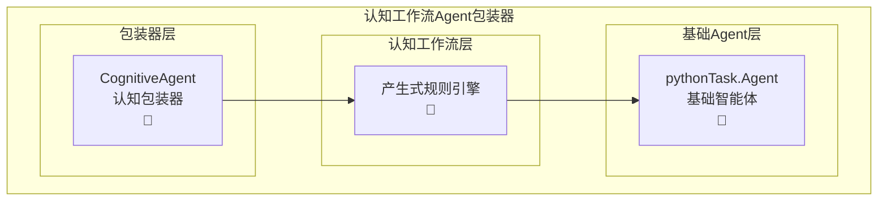

# 基于产生式规则的Agent包装器

## 概述

使用包装器设计模式，通过RuleEngineService将`pythonTask.py`中的基础`Agent`类包装成具备认知工作流能力的智能体。

**实现文件：** `cognitive_workflow_agent_wrapper.py`

**文件位置：** `CognitiveWorkflow/cognitive_workflow_rule_base/cognitive_workflow_agent_wrapper.py`

## 系统架构



## 包装器接口

### 核心包装器类

```python
class CognitiveAgent:
    """基于产生式规则的Agent包装器"""
    
    def __init__(self, 
                 base_agent: Agent,
                 enable_auto_recovery: bool = True):
        """
        初始化认知Agent包装器
        
        Args:
            base_agent: 基础Agent实例
            enable_auto_recovery: 是否启用自动错误恢复
        """
        self.base_agent = base_agent
        
        # 构建Agent集合
        self.agents = {"main_agent": base_agent}
        
        # 创建认知工作流引擎
        self.workflow_engine = create_production_rule_system(
            llm=base_agent.llm,
            agents=self.agents,
            enable_auto_recovery=enable_auto_recovery
        )
    
    def classify_instruction(self, instruction: str) -> tuple[str, str]:
        """
        指令分类方法
        
        Args:
            instruction: 输入指令
            
        Returns:
            tuple[str, str]: (指令类型, 执行方式)
            - 指令类型: "informational" | "executable" 
            - 执行方式: "single_step" | "multi_step" | "chat"
        """
        # 使用LLM分析指令类型
        classification_prompt = f"""
分析以下指令的类型：

指令: "{instruction}"

请判断这是：
1. 信息性指令 -> 返回: informational
   - 特征：询问、查询、解释、讨论、学习等
   - 行为：只通过chat_sync/chat_stream改变Agent的记忆和知识状态
   - 限制：不会对外部世界做观察或执行任何行为操作
   - 示例：什么是机器学习？解释Python装饰器、讨论算法复杂度
   
2. 执行性指令 -> 返回: executable
   - 特征：创建、编写、实现、开发、运行、测试等
   - 行为：需要对外部世界进行观察或执行具体操作
   - 包括：文件操作、代码执行、系统调用、网络请求等
   - 示例：写代码、创建文件、运行程序、部署应用

如果是执行性指令，进一步判断复杂度：
- 单步骤指令（简单任务，一步完成） -> 返回: single_step  
- 多步骤指令（复杂任务，需要多个步骤） -> 返回: multi_step

请只返回分类结果，格式：类型|步骤复杂度
例如：informational|chat 或 executable|single_step 或 executable|multi_step
"""
        
        try:
            response = self.base_agent.llm.invoke(classification_prompt).content.strip()
            parts = response.split('|')
            if len(parts) == 2:
                instruction_type = parts[0].strip()
                execution_mode = parts[1].strip()
                return instruction_type, execution_mode
            else:
                # 默认为多步骤执行性指令
                return "executable", "multi_step"
        except Exception:
            # 异常情况下默认为多步骤执行性指令
            return "executable", "multi_step"
    
    def execute_instruction_syn(self, instruction: str):
        """
        智能执行指令（同步版本）
        
        Args:
            instruction: 输入指令
            
        Returns:
            根据指令类型返回相应结果:
            - 信息性指令: chat_sync的返回值
            - 单步骤执行性指令: execute_sync的Result对象
            - 多步骤执行性指令: WorkflowExecutionResult对象
        """
        instruction_type, execution_mode = self.classify_instruction(instruction)
        
        if instruction_type == "informational":
            # 信息性指令：使用chat_sync方法
            return self.base_agent.chat_sync(instruction)
                
        elif instruction_type == "executable":
            if execution_mode == "single_step":
                # 单步骤执行性指令：使用execute_sync方法
                return self.base_agent.execute_sync(instruction)
            else:
                # 多步骤执行性指令：使用认知工作流
                return self.execute_multi_step(instruction)
        
        # 默认情况：使用认知工作流
        return self.execute_multi_step(instruction)
    
    def execute_instruction_stream(self, instruction: str) -> Iterator[object]:
        """
        智能执行指令（流式版本）
        
        Args:
            instruction: 输入指令
            
        Returns:
            Iterator[object]: 流式输出迭代器
            - 前面的元素：中间过程信息（字符串状态、进度提示等）
            - 最后一个元素：Result对象（最终执行结果）
            
        执行路由:
            - 信息性指令: chat_stream的迭代器
            - 单步骤执行性指令: execute_stream的迭代器  
            - 多步骤执行性指令: execute_multi_step_stream的迭代器
        """
        instruction_type, execution_mode = self.classify_instruction(instruction)
        
        yield f"🔍 指令分析: {instruction_type} | {execution_mode}"
        
        if instruction_type == "informational":
            # 信息性指令：使用chat_stream方法
            for result in self.base_agent.chat_stream(instruction):
                yield result
                
        elif instruction_type == "executable":
            if execution_mode == "single_step":
                # 单步骤执行性指令：使用execute_stream方法
                for result in self.base_agent.execute_stream(instruction):
                    yield result
            else:
                # 多步骤执行性指令：使用认知工作流
                for result in self.execute_multi_step_stream(instruction):
                    yield result
        else:
            # 默认情况：使用认知工作流
            for result in self.execute_multi_step_stream(instruction):
                yield result
    
    def execute_multi_step(self, goal: str) -> WorkflowExecutionResult:
        """执行多步骤目标任务（使用认知工作流）"""
        return self.workflow_engine.execute_goal(goal)
    
    def execute_multi_step_stream(self, goal: str) -> Iterator[object]:
        """执行多步骤目标任务（流式，使用认知工作流）"""
        yield f"🧠 开始认知工作流分析: {goal}"
        yield f"📋 生成执行规则..."
        
        workflow_result = self.execute_multi_step(goal)
        
        yield f"⚙️ 执行中... ({workflow_result.total_iterations}步骤)"
        yield f"✅ 认知工作流完成"
        yield workflow_result
    
    
```


## 使用示例

### 基础用法

```python
from pythonTask import Agent, llm_deepseek
from CognitiveWorkflow.cognitive_workflow_rule_base.cognitive_workflow_agent_wrapper import CognitiveAgent

# 创建基础Agent
base_agent = Agent(llm=llm_deepseek)

# 包装成认知Agent
cognitive_agent = CognitiveAgent(
    base_agent=base_agent,
    enable_auto_recovery=True
)

# 准备测试环境：创建命令文件
# echo "写个python的hello world程序" > command.txt

# 智能指令路由 - 自动识别指令类型并选择合适的执行方式
result1 = cognitive_agent.execute_instruction_syn("什么是机器学习？")     # 信息性指令 -> chat_sync
result2 = cognitive_agent.execute_instruction_syn("打印hello world")    # 单步骤指令 -> execute_sync  

# 假设存在文件 command.txt，内容为："写个python的hello world程序"
result3 = cognitive_agent.execute_instruction_syn("读取command.txt,并执行其中的指令") # 多步骤指令 -> 认知工作流

print(f"信息性结果: {result1}")                    # chat_sync返回值
print(f"单步骤结果: {result2.return_value}")        # Result对象
print(f"多步骤结果: {result3.final_message}")       # WorkflowExecutionResult对象（读取文件并执行指令的结果）
```

### 指令分类演示

```python
# 手动分类测试
instruction_type, execution_mode = cognitive_agent.classify_instruction("解释Python装饰器")
print(f"指令类型: {instruction_type}, 执行方式: {execution_mode}")
# 输出: 指令类型: informational, 执行方式: chat

instruction_type, execution_mode = cognitive_agent.classify_instruction("写一个排序函数")
print(f"指令类型: {instruction_type}, 执行方式: {execution_mode}")
# 输出: 指令类型: executable, 执行方式: single_step

instruction_type, execution_mode = cognitive_agent.classify_instruction("开发一个电商系统")
print(f"指令类型: {instruction_type}, 执行方式: {execution_mode}")
# 输出: 指令类型: executable, 执行方式: multi_step
```

### 流式执行

```python
# 流式执行 - 自动路由（前面是过程，最后是结果）
stream_results = list(cognitive_agent.execute_instruction_stream("创建一个计算器程序，包含测试"))

# 处理中间过程
for i, update in enumerate(stream_results):
    if i < len(stream_results) - 1:
        print(f"进度 {i+1}: {update}")  # 中间过程信息
    else:
        print(f"最终结果: {update}")     # 最后一个元素是Result对象

# 或者直接遍历
result=None
for update in cognitive_agent.execute_instruction_stream("解释Python GIL机制"):
    result=update
    # 判断result是否为字符串类型
    if isinstance(result, str):
        print(result, flush=True, end='')
        
print(f"最终结果: {result}")

# 获取最终结果的便捷方法
stream_iterator = cognitive_agent.execute_instruction_stream("运行python -c 'print(42)'")
*process_updates, final_result = stream_iterator
print(f"执行过程: {process_updates}")    # 所有中间过程
print(f"最终结果: {final_result}")       # Result对象
```

### 智能路由方法对比

```python
# 同步智能路由方法 - 返回不同类型的结果对象
chat_result = cognitive_agent.execute_instruction_syn("什么是Python？")
print(f"Chat结果类型: {type(chat_result)}")  # chat_sync的返回值

exec_result = cognitive_agent.execute_instruction_syn("计算1+1") 
print(f"执行结果类型: {type(exec_result)}")  # Result对象
print(f"执行结果值: {exec_result.return_value}")

workflow_result = cognitive_agent.execute_instruction_syn("开发Web应用")
print(f"工作流结果类型: {type(workflow_result)}")  # WorkflowExecutionResult对象
print(f"工作流成功: {workflow_result.is_successful}")

# 流式智能路由方法 - 统一返回Iterator[object]
# 前面是过程信息，最后是Result对象
stream_items = list(cognitive_agent.execute_instruction_stream("什么是机器学习？"))
for i, item in enumerate(stream_items):
    if i < len(stream_items) - 1:
        print(f"过程 {i+1}: {item}")      # 中间过程信息
    else:
        print(f"最终结果: {item}")        # Result对象
```

### 直接调用特定方法

```python
# 直接调用多步骤认知工作流
workflow_result = cognitive_agent.execute_multi_step(
    "创建一个包含用户认证的Web API"
)
print(f"任务成功: {workflow_result.is_successful}")
print(f"执行步骤: {workflow_result.total_iterations}")
print(f"最终结果: {workflow_result.final_message}")
```


## 总结

基于产生式规则的Agent包装器提供了一种简洁而强大的方式，将基础Agent升级为具备认知推理能力的智能体。通过**智能指令分类系统**和**IF-THEN规则引擎**，Agent能够：

### 🧠 **智能指令路由**
- **自动分类**：LLM驱动的指令类型识别
- **智能选择**：根据指令特征选择最优执行方式
- **透明执行**：保持原有Agent接口的完全兼容

### 🎯 **三级执行策略**
- **信息性指令** → `chat_sync/stream` (问答、解释类)
- **单步骤指令** → `execute_sync/stream` (简单任务)  
- **多步骤指令** → `认知工作流` (复杂任务)

### 🔄 **核心能力增强**
- 🎯 **智能理解**复杂任务意图和执行需求
- 🔄 **自动分解**多步骤执行计划和推理链
- 🧠 **动态推理**最优执行路径和资源调度
- 🛡️ **自我修正**错误恢复和规则优化
- 🔧 **无缝集成**现有Agent代码和工作流

这种包装器设计不仅保持了Agent接口的简洁性，还通过智能分类大幅提升了处理各类任务的精确性和效率，是Agent智能化升级的理想解决方案。 