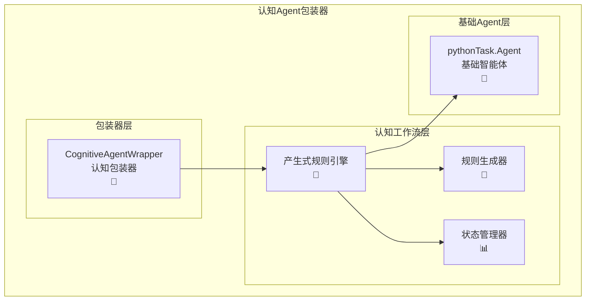
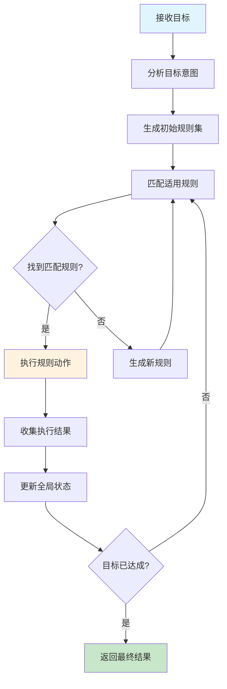

# 基于产生式规则的Agent包装器

## 概述

基于产生式规则的Agent包装器是一个简洁的设计模式，将`pythonTask.py`中的基础`Agent`类包装成具备认知推理能力的智能体。该包装器使用IF-THEN产生式规则系统，让Agent能够处理复杂的多步骤任务。

## 核心理念

### 产生式规则系统
- **IF-THEN规则**：基于自然语言的条件-动作模式
- **语义匹配**：LLM驱动的规则条件匹配
- **动态生成**：运行时智能生成新规则
- **自我修正**：基于执行结果的规则优化

## 系统架构



## 包装器接口

### 核心包装器类

```python
class CognitiveAgentWrapper:
    """基于产生式规则的Agent包装器"""
    
    def __init__(self, 
                 base_agent: Agent,
                 additional_agents: Dict[str, Agent] = None,
                 llm: BaseChatModel = None,
                 enable_auto_recovery: bool = True):
        """
        初始化认知Agent包装器
        
        Args:
            base_agent: 基础Agent实例
            additional_agents: 额外的专用Agent字典
            llm: 用于规则推理的语言模型
            enable_auto_recovery: 是否启用自动错误恢复
        """
        self.base_agent = base_agent
        self.llm = llm or base_agent.llm
        
        # 构建Agent集合
        self.agents = {"main_agent": base_agent}
        if additional_agents:
            self.agents.update(additional_agents)
        
        # 创建认知工作流引擎
        self.workflow_engine = create_production_rule_system(
            llm=self.llm,
            agents=self.agents,
            enable_auto_recovery=enable_auto_recovery
        )
    
    def execute_goal(self, goal: str) -> WorkflowExecutionResult:
        """执行目标任务"""
        return self.workflow_engine.execute_goal(goal)
    
    def execute_sync(self, instruction: str) -> Result:
        """保持Agent接口兼容性（同步）"""
        workflow_result = self.execute_goal(instruction)
        
        # 转换为Agent Result格式
        return Result(
            success=workflow_result.is_successful,
            stdout=workflow_result.final_message,
            stderr="" if workflow_result.is_successful else workflow_result.final_message,
            code="",
            return_value=workflow_result.final_message
        )
    
    def execute_stream(self, instruction: str) -> Iterator[object]:
        """保持Agent接口兼容性（流式）"""
        # 简化实现：直接返回最终结果
        result = self.execute_sync(instruction)
        yield f"开始执行认知工作流: {instruction}"
        yield f"使用产生式规则推理..."
        yield f"执行完成"
        yield result
```

## 产生式规则工作原理

### 1. 规则生成
系统会根据目标自动生成IF-THEN规则：
```
IF 需要编写Python代码 THEN 调用代码专家Agent
IF 需要测试代码 THEN 调用测试专家Agent  
IF 需要分析数据 THEN 调用数据分析Agent
```

### 2. 规则匹配
使用LLM进行语义匹配：
- 分析当前状态和目标
- 匹配适用的规则条件
- 选择最合适的规则执行

### 3. 动作执行
执行规则的THEN部分：
- 调用指定的Agent
- 执行自然语言指令
- 收集执行结果

### 4. 状态更新
根据执行结果更新全局状态：
- 记录执行历史
- 更新上下文变量
- 判断是否达成目标

## 使用示例

### 基础用法

```python
from pythonTask import Agent, llm_deepseek
from cognitive_workflow_rule_base import CognitiveAgentWrapper

# 创建基础Agent
base_agent = Agent(llm=llm_deepseek)

# 包装成认知Agent
cognitive_agent = CognitiveAgentWrapper(
    base_agent=base_agent,
    enable_auto_recovery=True
)

# 执行复杂任务
result = cognitive_agent.execute_goal(
    "创建一个计算器程序，包含加减乘除功能，并编写测试"
)

print(f"任务成功: {result.is_successful}")
print(f"执行步骤: {result.total_iterations}")
print(f"最终结果: {result.final_message}")
```

### 多Agent协作

```python
# 创建专用Agent
coder = Agent(llm=llm_deepseek)
coder.api_specification = "代码专家，擅长编写和调试代码"

tester = Agent(llm=llm_deepseek) 
tester.api_specification = "测试专家，擅长编写测试用例"

# 使用多Agent认知包装器
cognitive_agent = CognitiveAgentWrapper(
    base_agent=coder,
    additional_agents={
        "coder": coder,
        "tester": tester
    }
)

# 执行需要多Agent协作的任务
result = cognitive_agent.execute_goal(
    "开发一个Web API，包含用户认证功能，需要完整的测试覆盖"
)
```

### 兼容性使用

```python
# 作为普通Agent使用（保持接口兼容）
result = cognitive_agent.execute_sync("写一个hello world程序")
print(f"结果: {result.return_value}")

# 流式执行
for update in cognitive_agent.execute_stream("分析sales.csv数据"):
    if isinstance(update, str):
        print(f"进度: {update}")
    elif isinstance(update, Result):
        print(f"最终结果: {update.return_value}")
```

## 核心优势

### 🧠 智能推理
- **语义理解**：深度理解任务意图和上下文
- **自动规划**：智能分解复杂任务为执行步骤
- **动态适应**：根据执行结果调整策略

### 🔧 自动修正
- **错误恢复**：自动检测和修复执行错误
- **规则优化**：基于历史经验优化规则
- **知识学习**：从执行过程中学习新知识

### 🎯 简洁易用
- **统一接口**：保持Agent原有API不变
- **即插即用**：现有Agent代码无需修改
- **灵活配置**：支持单Agent或多Agent模式

### 📊 透明可控
- **规则可视**：清晰的IF-THEN规则逻辑
- **过程追踪**：详细的执行步骤记录
- **状态管理**：完整的上下文状态跟踪

## 工作流程图



## 配置选项

### 认知能力配置

```python
cognitive_agent = CognitiveAgentWrapper(
    base_agent=agent,
    enable_auto_recovery=True,        # 自动错误恢复
    enable_adaptive_replacement=True,  # 自适应规则替换
    max_iterations=20,                # 最大推理迭代次数
    rule_generation_strategy="smart"   # 规则生成策略
)
```

### Agent能力配置

```python
# 为Agent设置能力描述（提高规则匹配精度）
agent.api_specification = """
数据分析专家，擅长：
- CSV/Excel数据处理
- 统计分析和可视化
- 数据清洗和转换
"""

# 加载专业知识
agent.loadKnowledge("pandas和matplotlib使用最佳实践")
```

## 最佳实践

### 1. Agent能力描述
为每个Agent设置清晰的能力描述，帮助规则引擎正确选择Agent：

```python
coder.api_specification = "代码开发专家，精通Python、JavaScript、数据库设计"
tester.api_specification = "质量保证专家，精通单元测试、集成测试、性能测试"
```

### 2. 知识预加载
预先加载相关领域知识，提升执行效果：

```python
agent.loadKnowledge("项目使用FastAPI框架，数据库为PostgreSQL")
```

### 3. 渐进式任务分解
将复杂任务逐步分解为更具体的目标：

```python
# 好的做法：具体明确的目标
result = cognitive_agent.execute_goal(
    "使用FastAPI创建用户注册API，包含邮箱验证和密码加密功能"
)

# 避免：过于宽泛的目标
# "创建一个完整的社交媒体平台"
```

## 总结

基于产生式规则的Agent包装器提供了一种简洁而强大的方式，将基础Agent升级为具备认知推理能力的智能体。通过IF-THEN规则系统，Agent能够：

- 🎯 **智能理解**复杂任务意图
- 🔄 **自动分解**多步骤执行计划
- 🧠 **动态推理**最优执行路径
- 🛡️ **自我修正**错误和优化规则
- 🔧 **无缝集成**现有Agent代码

这种包装器设计既保持了Agent接口的简洁性，又大幅提升了处理复杂任务的能力，是Agent智能化升级的理想解决方案。 