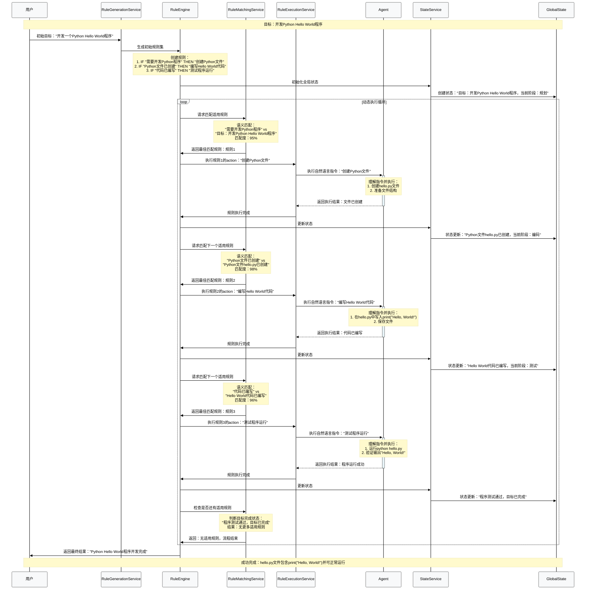
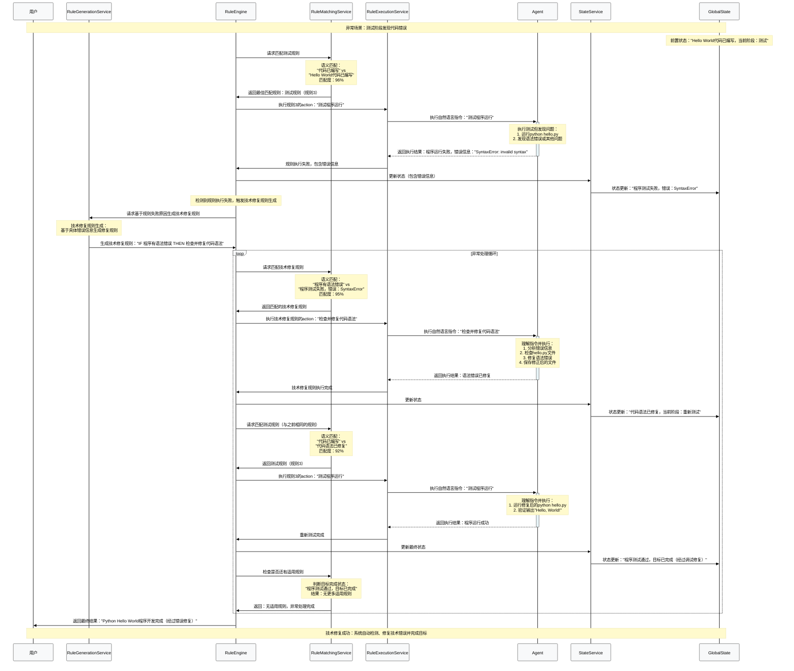
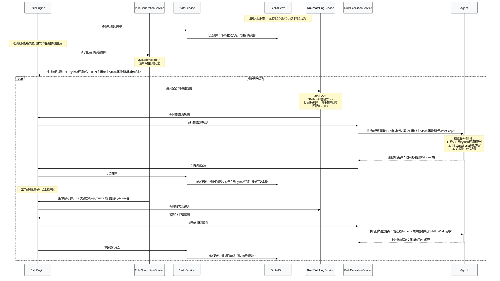

# 产生式规则认知工作流系统设计文档

## 1. 系统概述

基于产生式规则系统（Production Rule System）的理念，设计了一个真正的认知工作流系统。系统将传统的任务概念重新建模为产生式规则，实现了"IF-THEN"条件-动作模式的智能决策机制。采用Domain-Driven Design架构，将业务逻辑和技术实现清晰分离。

## 2. 架构设计

### 2.1 整体架构原则

- **Domain Model (领域模型)**：承载业务语义，定义核心业务实体和规则
- **Service Model (服务模型)**：实现业务逻辑，操作领域实体
- **依赖方向**：Service依赖Domain，Domain保持独立

### 2.2 架构分层

上面的架构分层图展示了认知工作流系统的三层架构：

- **Presentation Layer（表现层）**：ProductionRuleWorkflowEngine作为系统的统一入口
- **Service Layer（服务层）**：包含各种业务服务和技术实现组件
- **Domain Layer（领域层）**：纯业务概念和领域实体

虚线表示服务层对领域层的依赖关系，体现了DDD的分层原则。

## 3. Domain Model (领域模型)

```mermaid
%%{init: {'theme': 'base', 'themeVariables': { 'primaryColor': '#ffffff', 'primaryTextColor': '#000000', 'primaryBorderColor': '#333333', 'lineColor': '#333333', 'secondaryColor': '#f8f9fa', 'tertiaryColor': '#ffffff', 'background': '#ffffff', 'mainBkg': '#ffffff', 'secondBkg': '#f8f9fa', 'tertiaryBkg': '#ffffff'}}}%%
classDiagram
    %% Domain Layer - 纯业务概念和仓储接口
    
    %% 核心业务实体
    class ProductionRule {
        +String id
        +String name
        +String condition
        +String action
        +String agent_capability_id
        +int priority
        +RulePhase phase
        +String expected_outcome
        +DateTime created_at
        +DateTime updated_at
        +is_applicable(GlobalState) bool
    }
    
    class RuleSet {
        +String id
        +String goal
        +List rules
        +DateTime created_at
        +DateTime updated_at
        +int version
        +RuleSetStatus status
        +add_rule(ProductionRule) void
        +remove_rule(String) void
        +get_rules_by_phase(RulePhase) List
    }
    
    class RuleExecution {
        +String id
        +String rule_id
        +ExecutionStatus status
        +Optional result
        +DateTime started_at
        +Optional completed_at
        +Dict execution_context
        +Optional failure_reason
        +float confidence_score
        +is_successful() bool
        +get_execution_duration() Optional
    }
    
    class GlobalState {
        +String id
        +String description
        +Dict context_variables
        +DateTime timestamp
        +String workflow_id
        +update_from_result(Result) GlobalState
        +get_context_value(String) Any
        +set_context_value(String, Any) void
        +merge_context(Dict) void
    }
    
    class DecisionResult {
        +DecisionType decision_type
        +Optional selected_rule
        +String reasoning
        +float confidence
        +Dict context
        +DateTime timestamp
        +is_execution_decision() bool
        +is_goal_completion() bool
    }
    
    class AgentCapability {
        +String id
        +String name
        +String description
        +List supported_actions
        +String api_specification
        +Dict configuration
        +can_execute_action(String) bool
        +get_action_specification(String) Dict
    }
    
    class AgentRegistry {
        +Dict capabilities
        +register_capability(AgentCapability) void
        +get_capability(String) AgentCapability
        +find_capabilities_by_action(String) List
        +list_all_capabilities() List
    }
    
    class Result {
        +bool success
        +String message
        +Optional data
        +Optional error_details
        +Dict metadata
        +DateTime timestamp
        +is_error() bool
        +get_error_message() String
    }
    
    %% 仓储接口
    class RuleRepository {
        <<interface>>
        +save_rule_set(RuleSet) void
        +load_rule_set(String) RuleSet
        +find_rules_by_condition(String) List
        +find_rules_by_phase(RulePhase) List
    }
    
    class StateRepository {
        <<interface>>
        +save_state(GlobalState) void
        +load_state(String) GlobalState
        +get_state_history(String) List
        +save_state_snapshot(GlobalState, String) void
    }
    
    class ExecutionRepository {
        <<interface>>
        +save_execution(RuleExecution) void
        +load_execution(String) RuleExecution
        +find_executions_by_rule(String) List
        +find_failed_executions(Tuple) List
    }
    
    %% 枚举和值对象
    class RulePhase {
        <<enumeration>>
        INFORMATION_GATHERING
        PROBLEM_SOLVING
        VERIFICATION
        CLEANUP
    }
    
    class ExecutionStatus {
        <<enumeration>>
        PENDING
        RUNNING
        COMPLETED
        FAILED
        SKIPPED
        CANCELLED
    }
    
    class DecisionType {
        <<enumeration>>
        EXECUTE_SELECTED_RULE
        ADD_RULE
        GOAL_ACHIEVED
        GOAL_FAILED
    }
    
    class RuleSetStatus {
        <<enumeration>>
        DRAFT
        ACTIVE
        COMPLETED
        ABANDONED
    }
    
    %% 关系定义
    RuleSet "1" --> "*" ProductionRule : contains
    ProductionRule --> RulePhase : has
    RuleExecution --> ExecutionStatus : has
    RuleExecution --> ProductionRule : executes
    RuleExecution --> Result : produces
    DecisionResult --> DecisionType : has
    DecisionResult --> ProductionRule : may_select
    AgentRegistry "1" --> "*" AgentCapability : manages
    ProductionRule --> AgentCapability : requires
    RuleSet --> RuleSetStatus : has
```



上面的Domain Model类图展示了认知工作流系统的核心领域实体及其关系：

- **核心实体**：ProductionRule、RuleExecution、RuleSet、GlobalState、DecisionResult、AgentCapability、AgentRegistry
- **仓储接口**：RuleRepository、StateRepository、ExecutionRepository
- **值对象**：各种枚举类型
- **关键特征**：纯业务概念，不包含技术实现细节，体现DDD的领域建模原则

### 3.1 核心业务实体

#### 3.1.1 ProductionRule (产生式规则)
```python
@dataclass
class ProductionRule:
    id: str
    name: str
    condition: str            # 自然语言描述的触发条件 (IF部分)
    action: str              # 要执行的动作指令 (THEN部分)
    agent_capability_id: str  # 引用AgentCapability的ID
    priority: int            # 规则优先级，用于冲突解决
    phase: RulePhase         # 规则执行阶段
    expected_outcome: str    # 期望的执行结果
    created_at: datetime
    updated_at: datetime
    
    def is_applicable(self, global_state: GlobalState) -> Tuple[bool, float]
```

**核心特征**：
- **标准的产生式规则结构**：IF (condition) THEN (action)
- **自然语言条件描述**：condition字段使用自然语言描述触发条件，需要语言模型进行语义匹配
- **自然语言动作指令**：action字段使用自然语言描述要执行的动作，由对应的Agent执行
- **端到端自然语言处理**：从条件判断到动作执行，全程使用自然语言和语义理解
- **语义理解驱动**：规则匹配和动作执行均依赖语言模型的语义理解能力
- 包含规则优先级机制用于冲突解决
- 规则定义与执行状态完全分离

#### 3.1.2 RuleExecution (规则执行)
```python
@dataclass
class RuleExecution:
    id: str
    rule_id: str             # 关联的规则ID
    status: ExecutionStatus  # 执行状态
    result: Optional[Result] # 执行结果
    started_at: datetime
    completed_at: Optional[datetime]
    execution_context: Dict[str, Any]
    failure_reason: Optional[str]
    confidence_score: float  # 执行置信度
```

**核心特征**：
- 记录具体规则的执行实例
- 包含完整的执行生命周期信息
- 支持执行失败原因追踪
- 与规则定义完全分离

#### 3.1.3 GlobalState (全局状态)
```python
@dataclass
class GlobalState:
    current_state: str  # 自然语言状态描述
    context_variables: Dict[str, Any]
    execution_history: List[RuleExecution]  # 规则执行历史
    iteration_count: int
    goal_achieved: bool
    created_at: datetime
    updated_at: datetime
```

**核心特征**：
- **自然语言状态描述**：使用自然语言描述当前系统状态，支持语义理解和推理
- 丰富的上下文变量存储
- 完整的规则执行历史追踪
- **语义状态匹配**：状态描述可被语言模型理解和分析

#### 3.1.4 RuleSet (规则集)
```python
@dataclass
class RuleSet:
    id: str
    goal: str
    rules: List[ProductionRule]  # 产生式规则集合
    created_at: datetime
    updated_at: datetime
    version: int
    status: RuleSetStatus
```

**核心特征**：
- 管理一组相关的产生式规则
- 支持规则集版本控制
- 规则集有自己的生命周期状态

#### 3.1.5 DecisionResult (决策结果)
```python
@dataclass
class DecisionResult:
    selected_rule: Optional[ProductionRule]
    decision_type: DecisionType
    confidence: float
    reasoning: str
    decision_timestamp: datetime
```

**核心特征**：
- 完整的决策审计信息
- 包含决策推理过程
- 支持多种决策类型

#### 3.1.6 AgentCapability (智能体能力)
```python
@dataclass
class AgentCapability:
    id: str
    name: str
    capabilities: List[str]           # 业务能力描述
    specialty: str                    # 专业领域
    api_specification: str            # API规范描述
    performance_metrics: Dict[str, Any]  # 性能指标
    availability_status: str          # 可用状态
    created_at: datetime
    updated_at: datetime
```

**核心特征**：
- 纯业务概念，描述智能体的能力规格
- 不包含任何技术实现细节
- 支持业务层面的能力匹配和查询

#### 3.1.7 AgentRegistry (智能体注册表)
```python
@dataclass
class AgentRegistry:
    agent_capabilities: Dict[str, AgentCapability]
    capability_specifications: Dict[str, str]
    usage_history: Dict[str, List[RuleExecution]]
    created_at: datetime
    
    def find_by_capability(self, required_capabilities: List[str]) -> List[AgentCapability]
    def is_available(self, capability_id: str) -> bool
    def get_capability(self, capability_id: str) -> Optional[AgentCapability]
```

**核心特征**：
- 统一管理所有智能体能力
- 记录智能体使用历史
- 支持能力匹配查询
- 提供可用性检查

### 3.2 仓储接口 (Repository Interfaces)

#### 3.2.1 RuleRepository (规则仓储接口)
```python
from abc import ABC, abstractmethod

class RuleRepository(ABC):
    """规则仓储接口 - 抽象数据访问"""
    
    @abstractmethod
    def save_rule_set(self, rule_set: RuleSet) -> None:
        """保存规则集"""
        pass
    
    @abstractmethod
    def load_rule_set(self, rule_set_id: str) -> RuleSet:
        """加载规则集"""
        pass
    
    @abstractmethod
    def find_rules_by_condition(self, condition_pattern: str) -> List[ProductionRule]:
        """根据条件模式查找规则"""
        pass
    
    @abstractmethod
    def find_rules_by_phase(self, phase: RulePhase) -> List[ProductionRule]:
        """根据阶段查找规则"""
        pass
```

#### 3.2.2 StateRepository (状态仓储接口)
```python
class StateRepository(ABC):
    """状态仓储接口 - 抽象状态管理"""
    
    @abstractmethod
    def save_state(self, global_state: GlobalState) -> None:
        """保存全局状态"""
        pass
    
    @abstractmethod
    def load_state(self, state_id: str) -> GlobalState:
        """加载全局状态"""
        pass
    
    @abstractmethod
    def get_state_history(self, workflow_id: str) -> List[GlobalState]:
        """获取状态历史"""
        pass
    
    @abstractmethod
    def save_state_snapshot(self, state: GlobalState, snapshot_name: str) -> None:
        """保存状态快照"""
        pass
```

#### 3.2.3 ExecutionRepository (执行仓储接口)
```python
class ExecutionRepository(ABC):
    """执行仓储接口 - 抽象执行历史管理"""
    
    @abstractmethod
    def save_execution(self, rule_execution: RuleExecution) -> None:
        """保存规则执行记录"""
        pass
    
    @abstractmethod
    def load_execution(self, execution_id: str) -> RuleExecution:
        """加载规则执行记录"""
        pass
    
    @abstractmethod
    def find_executions_by_rule(self, rule_id: str) -> List[RuleExecution]:
        """根据规则ID查找执行记录"""
        pass
    
    @abstractmethod
    def find_failed_executions(self, time_range: Tuple[datetime, datetime]) -> List[RuleExecution]:
        """查找失败的执行记录"""
        pass
```

### 3.3 值对象和枚举

#### 3.3.1 RulePhase (规则阶段)
```python
class RulePhase(Enum):
    INFORMATION_GATHERING = "information_gathering"
    PROBLEM_SOLVING = "problem_solving"
    VERIFICATION = "verification"
    CLEANUP = "cleanup"
```

#### 3.3.2 ExecutionStatus (执行状态)
```python
class ExecutionStatus(Enum):
    PENDING = "pending"
    RUNNING = "running"
    COMPLETED = "completed"
    FAILED = "failed"
    SKIPPED = "skipped"
    CANCELLED = "cancelled"
```

#### 3.3.3 DecisionType (决策类型)
```python
class DecisionType(Enum):
    EXECUTE_SELECTED_RULE = "execute_selected_rule"
    ADD_RULE = "add_rule"
    GOAL_ACHIEVED = "goal_achieved"
    GOAL_FAILED = "goal_failed"
```

#### 3.3.4 RuleSetStatus (规则集状态)
```python
class RuleSetStatus(Enum):
    DRAFT = "draft"
    ACTIVE = "active"
    COMPLETED = "completed"
    ABANDONED = "abandoned"
```

## 4. Service Model (服务模型)

```mermaid
%%{init: {'theme': 'base', 'themeVariables': { 'primaryColor': '#ffffff', 'primaryTextColor': '#000000', 'primaryBorderColor': '#333333', 'lineColor': '#333333', 'secondaryColor': '#f8f9fa', 'tertiaryColor': '#ffffff', 'background': '#ffffff', 'mainBkg': '#ffffff', 'secondBkg': '#f8f9fa', 'tertiaryBkg': '#ffffff'}}}%%
classDiagram
    %% Service Layer - 技术实现和业务服务
    
    %% 核心协调服务
    class RuleEngineService {
        +RuleRepository rule_repository
        +StateRepository state_repository
        +ExecutionRepository execution_repository
        +RuleMatchingService rule_matching
        +RuleExecutionService rule_execution
        +RuleGenerationService rule_generation
        +StateService state_service
        +execute_workflow(String) WorkflowResult
        +process_single_iteration(GlobalState, RuleSet) DecisionResult
        +handle_rule_failure(RuleExecution, GlobalState) List
        +evaluate_goal_achievement(GlobalState, String) bool
        +manage_rule_lifecycle(RuleSet) void
    }
    
    %% 专门业务服务
    class RuleGenerationService {
        +LanguageModelService llm_service
        +generate_rule_set(String, AgentRegistry) RuleSet
        +generate_recovery_rules(Dict) List
        +generate_strategy_adjustment_rules(Dict) List
        +expand_rule_details(ProductionRule) ProductionRule
        +validate_rule_set(RuleSet) List
        +optimize_rule_priorities(List) List
    }
    
    class RuleMatchingService {
        +LanguageModelService llm_service
        +find_applicable_rules(GlobalState, RuleSet) List
        +evaluate_rule_conditions(ProductionRule, GlobalState) Tuple
        +select_best_rule(List, GlobalState) DecisionResult
        +resolve_conflicts(List) ProductionRule
        +should_add_new_rules(Result, GlobalState) bool
        +llm_match_condition_to_state(String, String) Tuple
        +llm_compare_rule_relevance(List, String) List
        +llm_explain_rule_selection(ProductionRule, String) String
    }
    
    class RuleExecutionService {
        +AgentService agent_service
        +ExecutionRepository execution_repository
        +execute_rule(ProductionRule, GlobalState) RuleExecution
        +prepare_execution_context(ProductionRule, GlobalState) Dict
        +handle_execution_failure(ProductionRule, Exception) RuleExecution
        +validate_execution_result(ProductionRule, Result) bool
        +execute_natural_language_action(String, Agent, Dict) Result
        +prepare_natural_language_instruction(String, Dict) String
        +validate_natural_language_result(String, Result, String) bool
    }
    
    class StateService {
        +LanguageModelService llm_service
        +StateRepository state_repository
        +update_state(Result, GlobalState) GlobalState
        +get_current_state() GlobalState
        +get_state_history() List
        +check_rule_condition_satisfied(String, GlobalState) Tuple
        +find_applicable_rules(List, GlobalState) List
        +evaluate_goal_achievement(String, GlobalState) bool
        +save_state(GlobalState) bool
        +load_state(String) GlobalState
        +analyze_state_changes(GlobalState, GlobalState) StateChangeAnalysis
        +llm_analyze_state_description(String) Dict
        +llm_match_condition_semantics(String, String) Tuple
        +llm_evaluate_goal_achievement(String, String) Tuple
    }
    
    %% Agent服务层
    class AgentService {
        +AgentRegistry agent_registry
        +Dict agent_pool
        +get_or_create_agent(String) Agent
        +execute_natural_language_instruction(String, String, Dict) Result
        +validate_agent_capability(String, List) bool
        +manage_agent_lifecycle(Agent) void
        +get_agent_performance_metrics(String) Dict
        +scale_agent_pool(String, int) void
    }
    
    class Agent {
        +BaseChatModel llm
        +AgentCapability capability
        +BaseChatModel evaluate_llm
        +StatefulExecutor device
        +Thinker thinker
        +List evaluators
        +String name
        +String api_specification
        +execute_natural_language_instruction(String, Dict) Result
        +understand_instruction(String) ExecutionPlan
        +execute_sync(String) Result
        +execute_stream(String) Iterator
        +chat_sync(String) Result
        +chat_stream(String) Iterator
        +load_knowledge(String) void
        +set_api_specification(String) void
        +evaluate_execution_result(Result, String) bool
    }
    
    class StatefulExecutor {
        +TerminalInteractiveShell shell
        +Dict variables
        +execute_code(String) Result
        +get_variable(String) Any
        +set_variable(String, Any) void
        +reset_environment() void
    }
    
    class Thinker {
        +BaseChatModel llm
        +Device device
        +List conversation_history
        +execute_sync(String) Result
        +execute_stream(String) Iterator
        +chat_sync(String) Result
        +chat_stream(String) Iterator
        +classify_instruction(String) bool
    }
    
    class Evaluator {
        +BaseChatModel llm
        +String system_message
        +Thinker thinker
        +evaluate(String, Result) Tuple
        +load_knowledge(String) void
    }
    
    %% 基础设施服务
    class LanguageModelService {
        +BaseChatModel primary_llm
        +Optional fallback_llm
        +semantic_match(String, String) Tuple
        +generate_natural_language_response(String, Dict) String
        +evaluate_semantic_similarity(String, String) float
        +explain_reasoning(String) String
        +classify_text(String, List) Tuple
        +extract_key_information(String, Dict) Dict
    }
    
    class RuleRepositoryImpl {
        +save_rule_set(RuleSet) void
        +load_rule_set(String) RuleSet
        +find_rules_by_condition(String) List
        +find_rules_by_phase(RulePhase) List
    }
    
    class StateRepositoryImpl {
        +save_state(GlobalState) void
        +load_state(String) GlobalState
        +get_state_history(String) List
        +save_state_snapshot(GlobalState, String) void
    }
    
    class ExecutionRepositoryImpl {
        +save_execution(RuleExecution) void
        +load_execution(String) RuleExecution
        +find_executions_by_rule(String) List
        +find_failed_executions(Tuple) List
    }
    
    %% 工作流引擎
    class ProductionRuleWorkflowEngine {
        +RuleEngineService rule_engine_service
        +ExecutionStatus execution_status
        +execute_goal(String) WorkflowResult
        +pause_execution() void
        +resume_execution() void
        +get_execution_status() ExecutionStatus
        +get_current_state() GlobalState
        +get_execution_metrics() Dict
    }
    
    %% 关系定义
    RuleEngineService --> RuleRepository : uses
    RuleEngineService --> StateRepository : uses
    RuleEngineService --> ExecutionRepository : uses
    RuleEngineService --> RuleMatchingService : orchestrates
    RuleEngineService --> RuleExecutionService : orchestrates
    RuleEngineService --> RuleGenerationService : orchestrates
    RuleEngineService --> StateService : orchestrates
    
    RuleGenerationService --> LanguageModelService : uses
    RuleMatchingService --> LanguageModelService : uses
    RuleExecutionService --> AgentService : uses
    RuleExecutionService --> ExecutionRepository : uses
    StateService --> LanguageModelService : uses
    StateService --> StateRepository : uses
    
    AgentService --> AgentRegistry : uses
    AgentService --> Agent : manages
    Agent --> AgentCapability : has
    Agent --> StatefulExecutor : uses
    Agent --> Thinker : uses
    Agent --> Evaluator : uses
    
    ProductionRuleWorkflowEngine --> RuleEngineService : uses
    
    RuleRepositoryImpl --> RuleRepository : implements
    StateRepositoryImpl --> StateRepository : implements
    ExecutionRepositoryImpl --> ExecutionRepository : implements
```



上面的Service Model类图展示了认知工作流系统的服务层架构：

- **核心协调服务**：RuleEngineService作为整个系统的核心协调者
- **专门业务服务**：RuleGenerationService、RuleMatchingService、RuleExecutionService、StateService
- **Agent服务层**：AgentService、Agent及其技术组件
- **基础设施服务**：LanguageModelService、各种Repository实现
- **关键特征**：包含具体的技术实现细节，负责业务逻辑的具体执行和系统协调

### 4.1 服务架构原则

- **单一职责**：每个服务只负责一个明确的业务能力
- **依赖注入**：服务间通过接口依赖，不直接依赖具体实现
- **状态无关**：服务本身不维护状态，状态由Domain实体承载
- **分层依赖**：Service Layer依赖Domain Layer，遵循依赖倒置原则

### 4.2 核心协调服务

#### 4.2.1 RuleEngineService (规则引擎服务)
```python
class RuleEngineService:
    """核心规则引擎服务 - 整个产生式规则系统的协调者"""
    
    def __init__(self, 
                 rule_repository: RuleRepository,
                 state_repository: StateRepository,
                 execution_repository: ExecutionRepository,
                 rule_matching: RuleMatchingService,
                 rule_execution: RuleExecutionService,
                 rule_generation: RuleGenerationService,
                 state_service: StateService):
        self.rule_repository = rule_repository
        self.state_repository = state_repository
        self.execution_repository = execution_repository
        self.rule_matching = rule_matching
        self.rule_execution = rule_execution
        self.rule_generation = rule_generation
        self.state_service = state_service
    
    def execute_workflow(self, goal: str) -> WorkflowResult:
        """执行完整的工作流程"""
        pass
    
    def process_single_iteration(self, global_state: GlobalState, rule_set: RuleSet) -> DecisionResult:
        """处理单次迭代循环"""
        pass
    
    def handle_rule_failure(self, rule_execution: RuleExecution, global_state: GlobalState) -> List[ProductionRule]:
        """处理规则执行失败，生成恢复规则"""
        pass
    
    def evaluate_goal_achievement(self, global_state: GlobalState, goal: str) -> bool:
        """评估目标是否达成"""
        pass
    
    def manage_rule_lifecycle(self, rule_set: RuleSet) -> None:
        """管理规则生命周期"""
        pass
```

**职责**：
- **工作流程协调**：统一管理整个产生式规则工作流的执行
- **服务编排**：协调各个专门服务的协作
- **异常处理**：处理规则执行失败和系统异常
- **生命周期管理**：管理规则集和执行状态的生命周期
- **决策协调**：协调复杂的决策流程

### 4.3 专门业务服务

#### 4.3.1 RuleGenerationService (规则生成服务)
```python
class RuleGenerationService:
    """规则生成服务 - 专注于智能规则创建"""
    
    def __init__(self, llm_service: LanguageModelService):
        self.llm_service = llm_service
    
    def generate_rule_set(self, goal: str, agent_registry: AgentRegistry) -> RuleSet:
        """根据目标生成初始规则集"""
        pass
    
    def generate_recovery_rules(self, failure_context: Dict[str, Any]) -> List[ProductionRule]:
        """生成错误恢复规则（技术修复规则）"""
        pass
    
    def generate_strategy_adjustment_rules(self, goal_context: Dict[str, Any]) -> List[ProductionRule]:
        """生成策略调整规则（目标级失败响应）"""
        pass
    
    def expand_rule_details(self, rule: ProductionRule) -> ProductionRule:
        """扩展规则细节"""
        pass
    
    def validate_rule_set(self, rule_set: RuleSet) -> List[str]:
        """验证规则集有效性"""
        pass
    
    def optimize_rule_priorities(self, rules: List[ProductionRule]) -> List[ProductionRule]:
        """优化规则优先级"""
        pass
```

**职责**：
- **发散性规则生成**：基于目标生成初始规则集
- **技术修复规则生成**：针对具体技术问题生成修复规则
- **策略调整规则生成**：从目标层面重新规划实现路径
- **规则优化**：规则细节扩展和优先级优化
- **规则验证**：确保规则集的有效性和一致性

#### 4.3.2 RuleMatchingService (规则匹配服务)
```python
class RuleMatchingService:
    """规则匹配服务 - 专注于语义匹配和规则选择"""
    
    def __init__(self, llm_service: LanguageModelService):
        self.llm_service = llm_service
    
    def find_applicable_rules(self, global_state: GlobalState, rule_set: RuleSet) -> List[ProductionRule]:
        """查找适用的规则"""
        pass
    
    def evaluate_rule_conditions(self, rule: ProductionRule, global_state: GlobalState) -> Tuple[bool, float]:
        """评估规则条件匹配度"""
        pass
    
    def select_best_rule(self, applicable_rules: List[ProductionRule], global_state: GlobalState) -> DecisionResult:
        """选择最佳规则"""
        pass
    
    def resolve_conflicts(self, conflicting_rules: List[ProductionRule]) -> ProductionRule:
        """解决规则冲突"""
        pass
    
    def should_add_new_rules(self, execution_result: Result, global_state: GlobalState) -> bool:
        """判断是否需要添加新规则"""
        pass
    
    # 语言模型驱动的核心方法
    def _llm_match_condition_to_state(self, condition: str, state_description: str) -> Tuple[bool, float, str]:
        """LLM驱动的条件匹配"""
        pass
    
    def _llm_compare_rule_relevance(self, rules: List[ProductionRule], state_description: str) -> List[Tuple[ProductionRule, float]]:
        """LLM驱动的规则相关性比较"""
        pass
    
    def _llm_explain_rule_selection(self, selected_rule: ProductionRule, state_description: str) -> str:
        """LLM驱动的规则选择解释"""
        pass
```

**职责**：
- **基于语言模型的规则条件匹配**：调用语言模型判断自然语言条件与当前状态的匹配度
- **语义理解驱动的规则选择**：通过语言模型理解规则条件和系统状态的语义关系
- **冲突解决和优先级处理**：处理多个规则同时适用的情况
- **新规则生成判断**：智能判断何时需要生成新规则
- **决策推理记录和解释**：提供可解释的决策过程

#### 4.3.3 RuleExecutionService (规则执行服务)
```python
class RuleExecutionService:
    """规则执行服务 - 专注于规则执行和结果管理"""
    
    def __init__(self, 
                 agent_service: AgentService,
                 execution_repository: ExecutionRepository):
        self.agent_service = agent_service
        self.execution_repository = execution_repository
    
    def execute_rule(self, rule: ProductionRule, global_state: GlobalState) -> RuleExecution:
        """执行单个规则"""
        pass
    
    def prepare_execution_context(self, rule: ProductionRule, global_state: GlobalState) -> Dict[str, Any]:
        """准备执行上下文"""
        pass
    
    def handle_execution_failure(self, rule: ProductionRule, error: Exception) -> RuleExecution:
        """处理执行失败"""
        pass
    
    def validate_execution_result(self, rule: ProductionRule, result: Result) -> bool:
        """验证执行结果"""
        pass
    
    # 自然语言指令执行的核心方法
    def _execute_natural_language_action(self, action: str, agent: Agent, context: Dict[str, Any]) -> Result:
        """执行自然语言动作指令"""
        pass
    
    def _prepare_natural_language_instruction(self, action: str, context: Dict[str, Any]) -> str:
        """准备自然语言指令"""
        pass
    
    def _validate_natural_language_result(self, action: str, result: Result, expected_outcome: str) -> bool:
        """验证自然语言执行结果"""
        pass
```

**职责**：
- **自然语言指令执行**：将规则的action（自然语言指令）传递给对应的Agent执行
- **执行上下文准备**：为Agent提供执行自然语言指令所需的上下文信息
- **执行结果标准化**：将Agent执行自然语言指令的结果标准化为RuleExecution
- **执行失败处理和恢复**：处理自然语言指令执行失败的情况
- **执行历史管理**：维护完整的执行历史记录

#### 4.3.4 StateService (状态服务)
```python
class StateService:
    """状态服务 - 专注于自然语言状态管理"""
    
    def __init__(self, 
                 llm_service: LanguageModelService,
                 state_repository: StateRepository):
        self.llm_service = llm_service
        self.state_repository = state_repository
    
    # 状态管理
    def update_state(self, execution_result: Result, global_state: GlobalState) -> GlobalState:
        """更新全局状态"""
        pass
    
    def get_current_state(self) -> GlobalState:
        """获取当前状态"""
        pass
    
    def get_state_history(self) -> List[GlobalState]:
        """获取状态历史"""
        pass
    
    # 状态检查
    def check_rule_condition_satisfied(self, condition: str, global_state: GlobalState) -> Tuple[bool, float, str]:
        """检查规则条件是否满足"""
        pass
    
    # 语言模型驱动的状态分析方法
    def _llm_analyze_state_description(self, state_description: str) -> Dict[str, Any]:
        """LLM分析状态描述"""
        pass
    
    def _llm_match_condition_semantics(self, condition: str, state_description: str) -> Tuple[bool, float, str]:
        """LLM匹配条件语义"""
        pass
    
    def _llm_evaluate_goal_achievement(self, goal: str, state_description: str) -> Tuple[bool, float, str]:
        """LLM评估目标达成"""
        pass
    
    def find_applicable_rules(self, rules: List[ProductionRule], global_state: GlobalState) -> List[ProductionRule]:
        """查找适用规则"""
        pass
    
    def evaluate_goal_achievement(self, goal: str, global_state: GlobalState) -> bool:
        """评估目标达成"""
        pass
    
    # 状态持久化
    def save_state(self, global_state: GlobalState) -> bool:
        """保存状态"""
        pass
    
    def load_state(self, state_id: str) -> GlobalState:
        """加载状态"""
        pass
    
    # 状态分析
    def analyze_state_changes(self, before: GlobalState, after: GlobalState) -> StateChangeAnalysis:
        """分析状态变化"""
        pass
```

**职责**：
- **自然语言状态管理**：维护和更新自然语言描述的全局状态
- **基于语言模型的条件检查**：调用语言模型判断规则条件与当前自然语言状态的满足性
- **语义驱动的规则识别**：通过语言模型理解识别可应用的规则
- **自然语言目标达成评估**：使用语言模型判断目标是否达成
- **状态持久化和版本管理**：管理状态的存储和历史版本
- **状态变化的语义分析**：分析状态变化的语义含义

### 4.4 Agent服务层

#### 4.4.1 AgentService (智能体服务)
```python
class AgentService:
    """智能体服务 - 管理Agent生命周期和能力匹配"""
    
    def __init__(self, agent_registry: AgentRegistry):
        self.agent_registry = agent_registry
        self.agent_pool: Dict[str, Agent] = {}  # Agent实例缓存池
    
    def get_or_create_agent(self, capability_id: str) -> Agent:
        """获取或创建Agent实例"""
        pass
    
    def execute_natural_language_instruction(self, instruction: str, capability_id: str, context: Dict[str, Any]) -> Result:
        """执行自然语言指令"""
        pass
    
    def validate_agent_capability(self, capability_id: str, required_capabilities: List[str]) -> bool:
        """验证Agent能力"""
        pass
    
    def manage_agent_lifecycle(self, agent: Agent) -> None:
        """管理Agent生命周期"""
        pass
    
    def get_agent_performance_metrics(self, capability_id: str) -> Dict[str, Any]:
        """获取Agent性能指标"""
        pass
    
    def scale_agent_pool(self, capability_id: str, target_count: int) -> None:
        """扩缩容Agent池"""
        pass
```

**职责**：
- **Agent实例管理**：管理Agent实例的生命周期和能力匹配
- **Agent池管理**：维护Agent实例缓存池，优化资源使用
- **能力验证**：验证Agent是否具备执行特定任务的能力
- **性能监控**：监控Agent的执行性能和资源使用
- **自然语言指令协调**：协调自然语言指令的执行

#### 4.4.2 Agent (智能体执行器)
```python
class Agent:
    """技术实现层：智能体的具体执行器"""
    # 引用自pythonTask.py
    def __init__(self, llm: BaseChatModel, capability: AgentCapability):
        self.llm = llm
        self.capability = capability
        self.evaluate_llm = llm
        self.device = StatefulExecutor()
        self.thinker = Thinker(llm=llm, device=self.device)
        self.evaluators = []
        self.name = capability.name
        self.api_specification = capability.api_specification
    
    def execute_natural_language_instruction(self, instruction: str, context: Dict) -> Result:
        """执行自然语言指令"""
        pass
    
    def understand_instruction(self, instruction: str) -> ExecutionPlan:
        """理解自然语言指令"""
        pass
    
    def execute_sync(self, instruction: str) -> Result:
        """同步执行指令"""
        pass
    
    def execute_stream(self, instruction: str) -> Iterator[object]:
        """流式执行指令"""
        pass
    
    def chat_sync(self, message: str) -> Result:
        """同步对话"""
        pass
    
    def chat_stream(self, message: str) -> Iterator[object]:
        """流式对话"""
        pass
    
    def load_knowledge(self, knowledge: str) -> None:
        """加载知识"""
        pass
    
    def set_api_specification(self, api_spec: str) -> None:
        """设置API规范"""
        pass
    
    def evaluate_execution_result(self, result: Result, expected: str) -> bool:
        """评估执行结果"""
        pass
```

**核心特征**：
- **自然语言指令执行器**：专门设计用于理解和执行自然语言指令
- **语义理解能力**：通过LLM理解复杂的自然语言动作描述
- **上下文感知执行**：结合当前状态和历史信息执行指令
- **技术实现细节**：包含所有技术实现细节（LLM、执行器、评估器等）
- **执行状态维护**：维护执行状态和记忆
- **多模式支持**：支持同步/异步、对话/执行等多种模式

#### 4.4.3 技术组件

```python
class StatefulExecutor:
    """有状态执行器 - 维护执行环境"""
    def __init__(self):
        self.shell = TerminalInteractiveShell()
        self.variables = {}
    
    def execute_code(self, code: str) -> Result:
        """执行代码"""
        pass
    
    def get_variable(self, var_name: str) -> Any:
        """获取变量"""
        pass
    
    def set_variable(self, var_name: str, value: Any) -> None:
        """设置变量"""
        pass
    
    def reset_environment(self) -> None:
        """重置环境"""
        pass

class Thinker:
    """思考器 - 处理复杂推理"""
    def __init__(self, llm: BaseChatModel, device: Device):
        self.llm = llm
        self.device = device
        self.conversation_history = []
    
    def execute_sync(self, instruction: str) -> Result:
        """同步执行指令"""
        pass
    
    def execute_stream(self, instruction: str) -> Iterator[object]:
        """流式执行指令"""
        pass
    
    def chat_sync(self, message: str) -> Result:
        """同步对话"""
        pass
    
    def chat_stream(self, message: str) -> Iterator[object]:
        """流式对话"""
        pass
    
    def classify_instruction(self, instruction: str) -> bool:
        """分类指令类型"""
        pass

class Evaluator:
    """评估器 - 评估执行结果"""
    def __init__(self, llm: BaseChatModel, system_message: str, thinker: Thinker = None):
        self.llm = llm
        self.system_message = system_message
        self.thinker = thinker
    
    def evaluate(self, instruction: str, result: Result) -> Tuple[bool, str]:
        """评估执行结果"""
        pass
    
    def load_knowledge(self, knowledge: str) -> None:
        """加载知识"""
        pass
```

### 4.5 基础设施服务

#### 4.5.1 LanguageModelService (语言模型服务)
```python
class LanguageModelService:
    """语言模型服务 - 统一的LLM服务抽象"""
    
    def __init__(self, 
                 primary_llm: BaseChatModel,
                 fallback_llm: Optional[BaseChatModel] = None):
        self.primary_llm = primary_llm
        self.fallback_llm = fallback_llm
    
    def semantic_match(self, condition: str, state_description: str) -> Tuple[bool, float, str]:
        """语义匹配"""
        pass
    
    def generate_natural_language_response(self, prompt: str, context: Dict[str, Any] = None) -> str:
        """生成自然语言响应"""
        pass
    
    def evaluate_semantic_similarity(self, text1: str, text2: str) -> float:
        """评估语义相似度"""
        pass
    
    def explain_reasoning(self, decision_context: str) -> str:
        """解释推理过程"""
        pass
    
    def classify_text(self, text: str, categories: List[str]) -> Tuple[str, float]:
        """文本分类"""
        pass
    
    def extract_key_information(self, text: str, schema: Dict) -> Dict[str, Any]:
        """提取关键信息"""
        pass
```

**职责**：
- **统一LLM接口**：为所有服务提供统一的语言模型访问接口
- **语义处理能力**：提供语义匹配、相似度计算、推理解释等核心能力
- **模型管理**：管理主模型和备用模型，支持故障转移
- **性能优化**：缓存、批处理等性能优化功能

#### 4.5.2 Repository实现类

```python
class RuleRepositoryImpl(RuleRepository):
    """规则仓储实现"""
    
    def save_rule_set(self, rule_set: RuleSet) -> None:
        """保存规则集到存储"""
        pass
    
    def load_rule_set(self, rule_set_id: str) -> RuleSet:
        """从存储加载规则集"""
        pass
    
    def find_rules_by_condition(self, condition_pattern: str) -> List[ProductionRule]:
        """根据条件模式查找规则"""
        pass
    
    def find_rules_by_phase(self, phase: RulePhase) -> List[ProductionRule]:
        """根据阶段查找规则"""
        pass

class StateRepositoryImpl(StateRepository):
    """状态仓储实现"""
    
    def save_state(self, global_state: GlobalState) -> None:
        """保存状态到存储"""
        pass
    
    def load_state(self, state_id: str) -> GlobalState:
        """从存储加载状态"""
        pass
    
    def get_state_history(self, workflow_id: str) -> List[GlobalState]:
        """获取状态历史"""
        pass
    
    def save_state_snapshot(self, state: GlobalState, snapshot_name: str) -> None:
        """保存状态快照"""
        pass

class ExecutionRepositoryImpl(ExecutionRepository):
    """执行仓储实现"""
    
    def save_execution(self, rule_execution: RuleExecution) -> None:
        """保存执行记录到存储"""
        pass
    
    def load_execution(self, execution_id: str) -> RuleExecution:
        """从存储加载执行记录"""
        pass
    
    def find_executions_by_rule(self, rule_id: str) -> List[RuleExecution]:
        """根据规则ID查找执行记录"""
        pass
    
    def find_failed_executions(self, time_range: Tuple[datetime, datetime]) -> List[RuleExecution]:
        """查找失败的执行记录"""
        pass
```

### 4.6 工作流引擎

#### 4.6.1 ProductionRuleWorkflowEngine (产生式规则工作流引擎)
```python
class ProductionRuleWorkflowEngine:
    """产生式规则工作流引擎 - 系统统一入口"""
    
    def __init__(self, rule_engine_service: RuleEngineService):
        self.rule_engine_service = rule_engine_service
        self.execution_status = ExecutionStatus.PENDING
    
    def execute_goal(self, goal: str) -> WorkflowResult:
        """执行目标工作流"""
        pass
    
    def pause_execution(self) -> None:
        """暂停执行"""
        pass
    
    def resume_execution(self) -> None:
        """恢复执行"""
        pass
    
    def get_execution_status(self) -> ExecutionStatus:
        """获取执行状态"""
        pass
    
    def get_current_state(self) -> GlobalState:
        """获取当前状态"""
        pass
    
    def get_execution_metrics(self) -> Dict[str, Any]:
        """获取执行指标"""
        pass
```

**职责**：
- **系统统一入口**：提供工作流执行的统一入口
- **执行控制**：支持暂停、恢复、停止等执行控制
- **状态监控**：提供执行状态和指标监控
- **生命周期管理**：管理整个工作流的生命周期

### 4.7 服务交互模式

#### 4.7.1 核心服务协作流程

```python
def production_rule_system_main_loop(rule_engine_service: RuleEngineService):
    """产生式规则系统主循环 - 展示服务间协作"""
    while not goal_achieved:
        # 1. 获取当前状态
        current_state = rule_engine_service.state_service.get_current_state()
        
        # 2. 加载规则集
        rule_set = rule_engine_service.rule_repository.load_rule_set("current")
        
        # 3. 处理单次迭代
        decision = rule_engine_service.process_single_iteration(current_state, rule_set)
        
        # 4. 处理决策结果
        if decision.decision_type == DecisionType.EXECUTE_SELECTED_RULE:
            # 执行选中规则
            rule_execution = rule_engine_service.rule_execution.execute_rule(
                decision.selected_rule, current_state)
            
            # 更新状态
            updated_state = rule_engine_service.state_service.update_state(
                rule_execution.result, current_state)
            
        elif decision.decision_type == DecisionType.ADD_RULE:
            # 生成新规则
            new_rules = rule_engine_service.rule_generation.generate_recovery_rules(
                current_state.context_variables)
            rule_set.rules.extend(new_rules)
            
        elif decision.decision_type == DecisionType.GOAL_ACHIEVED:
            break
            
        elif decision.decision_type == DecisionType.GOAL_FAILED:
            # 生成策略调整规则
            strategy_rules = rule_engine_service.rule_generation.generate_strategy_adjustment_rules(
                current_state.context_variables)
            rule_set.rules.extend(strategy_rules)
```

#### 4.7.2 服务依赖关系

```python
# 服务组装和依赖注入示例
def create_production_rule_system() -> ProductionRuleWorkflowEngine:
    """创建完整的产生式规则系统"""
    
    # 基础设施服务
    llm_service = LanguageModelService(primary_llm, fallback_llm)
    
    # Repository实现
    rule_repository = RuleRepositoryImpl()
    state_repository = StateRepositoryImpl()
    execution_repository = ExecutionRepositoryImpl()
    
    # Agent服务
    agent_registry = AgentRegistry()
    agent_service = AgentService(agent_registry)
    
    # 专门业务服务
    rule_generation = RuleGenerationService(llm_service)
    rule_matching = RuleMatchingService(llm_service)
    rule_execution = RuleExecutionService(agent_service, execution_repository)
    state_service = StateService(llm_service, state_repository)
    
    # 核心协调服务
    rule_engine_service = RuleEngineService(
        rule_repository=rule_repository,
        state_repository=state_repository,
        execution_repository=execution_repository,
        rule_matching=rule_matching,
        rule_execution=rule_execution,
        rule_generation=rule_generation,
        state_service=state_service
    )
    
    # 工作流引擎
    workflow_engine = ProductionRuleWorkflowEngine(rule_engine_service)
    
    return workflow_engine
```

### 4.8 架构优势

#### 4.8.1 清晰的职责分离
- **RuleEngineService**：核心协调，不处理具体业务
- **专门服务**：各自专注单一业务能力
- **Agent服务层**：专注执行和能力管理
- **基础设施**：提供通用技术能力

#### 4.8.2 高度可测试性
- **依赖注入**：所有依赖通过构造函数注入
- **接口抽象**：Repository接口便于Mock测试
- **单一职责**：每个服务可独立测试

#### 4.8.3 强扩展性
- **新服务添加**：可轻松添加新的专门服务
- **LLM替换**：通过LanguageModelService统一管理
- **存储替换**：通过Repository接口抽象

#### 4.8.4 符合DDD原则
- **分层清晰**：Service依赖Domain，不反向依赖
- **业务逻辑集中**：复杂业务逻辑在服务中实现
- **技术细节隔离**：技术实现细节不泄露到Domain

## 5. 架构整体视图

上面的综合架构图清晰展示了认知工作流系统的整体架构：

- **蓝色区域**：Service Layer（服务层），包含核心服务和技术组件
- **紫色区域**：Domain Layer（领域层），包含核心业务实体
- **实线箭头**：表示服务内部的协作关系
- **虚线箭头**：表示服务层对领域层的依赖关系

这种设计确保了：
1. **清晰的分层**：业务概念与技术实现分离
2. **正确的依赖方向**：服务层依赖领域层，而非相反
3. **高内聚低耦合**：各层内部紧密协作，层间依赖最小化

## 6. 架构分层说明

### 6.1 层次分离的重要性

在本设计中，我们严格遵循DDD (Domain-Driven Design) 的分层原则：

**Domain Layer (领域层)**：
- **AgentCapability**: 纯业务概念，描述智能体的能力、专业领域和API规范
- **CognitiveTask**: 引用`agent_capability_id`而非具体技术实现
- **AgentRegistry**: 管理业务层面的能力注册和查询

**Service Layer (服务层)**：
- **Agent**: 技术实现，包含LLM、执行器、评估器等具体组件
- **ExecutionService**: 负责将AgentCapability转换为具体的Agent实例

### 6.2 关键设计决策

1. **Agent的分层处理**：
   - AgentCapability (Domain) 定义"能做什么"
   - Agent (Service) 实现"怎么做"
   - 实现了业务概念与技术实现的清晰分离

2. **依赖方向正确**：
   - Service层依赖Domain层
   - Domain层保持纯净，不依赖技术实现

3. **可扩展性**：
   - 可以为同一个AgentCapability创建多种不同的Agent实现
   - 便于技术栈的替换和升级

## 7. 核心设计原则

### 7.1 产生式规则系统核心理念

1. **自然语言IF-THEN规则模式**
   - 规则结构：IF (自然语言condition) THEN (自然语言action)
   - 条件匹配：使用自然语言描述的触发条件，通过语言模型进行语义判断
   - 动作执行：自然语言描述的执行指令，由对应Agent理解并执行

2. **三大核心机制**
   - 规则生成：RuleGenerationService专注自然语言规则创建和优化
   - 规则匹配：RuleMatchingService专注自然语言条件匹配和冲突解决
   - 规则执行：RuleExecutionService专注自然语言指令的Agent执行

3. **动态规则系统**
   - 运行时规则匹配和选择
   - 规则优先级和冲突解决机制
   - 支持动态添加新规则

4. **端到端自然语言处理**
   - **全局状态自然语言化**：系统状态使用自然语言描述，便于理解和推理
   - **规则条件自然语言化**：规则触发条件使用自然语言表达，支持复杂语义判断
   - **规则动作自然语言化**：规则执行动作使用自然语言描述，由Agent理解并执行
   - **语言模型驱动的完整流程**：从条件匹配到动作执行，全程依赖语言模型的语义理解

### 7.2 软件架构原则

1. **单一职责原则**
   - 每个服务只负责一个明确的业务能力
   - 每个领域实体只承载一类业务概念

2. **依赖倒置原则**
   - Service层依赖Domain层接口
   - Domain层不依赖Service层实现

3. **开闭原则**
   - 通过接口扩展新的服务实现
   - 通过继承扩展新的领域实体

4. **接口隔离原则**
   - 服务接口专注于特定的业务能力
   - 避免臃肿的服务接口

## 8. 实现特性

### 8.1 端到端自然语言处理流程

- **自然语言状态描述**：系统状态使用自然语言描述，便于理解和推理
- **语义驱动的规则匹配**：通过语言模型理解规则条件与状态的语义关系
- **自然语言动作执行**：规则的action字段为自然语言指令，由Agent直接理解和执行
- **Agent自然语言理解**：Agent具备理解复杂自然语言指令的能力，无需预定义API
- **上下文感知执行**：Agent结合当前状态和历史信息执行自然语言指令
- **可解释的执行过程**：从规则匹配到动作执行，全程可追踪和解释

### 8.2 自然语言动作执行机制

#### 8.2.1 动作指令的自然语言化
产生式规则的action字段完全使用自然语言描述，例如：
- "分析当前代码结构，找出潜在的性能瓶颈"
- "根据用户需求生成相应的测试用例"
- "检查数据库连接状态，如果异常则尝试重连"
- "总结当前任务的执行结果，并更新项目状态"

#### 8.2.2 Agent的自然语言指令理解
Agent通过以下机制理解和处理自然语言指令：

1. **指令解析**：使用LLM分析自然语言指令的语义和意图
2. **执行计划生成**：将自然语言指令转换为具体的执行步骤
3. **上下文集成**：结合当前全局状态和历史执行信息
4. **能力匹配**：根据Agent的能力特征优化执行策略

#### 8.2.3 执行流程
```
1. 规则匹配阶段：
   IF (自然语言condition) 通过语言模型匹配当前状态
   
2. 动作执行阶段：
   THEN (自然语言action) 传递给对应Agent
   
3. 指令理解阶段：
   Agent.understand_instruction(自然语言action) -> ExecutionPlan
   
4. 上下文执行阶段：
   Agent.execute_natural_language_instruction(action, context) -> Result
   
5. 结果验证阶段：
   Agent.evaluate_execution_result(result, expected_outcome) -> bool
```

#### 8.2.4 执行优势
- **无需API预定义**：Agent直接理解自然语言，无需预先定义固定的API接口
- **灵活性极高**：可以表达任意复杂的执行逻辑和业务需求
- **语义丰富**：自然语言能够传达细微的语义差别和上下文信息
- **易于理解**：规则的action部分对人类开发者完全可读
- **动态适应**：Agent可以根据实际情况灵活调整执行策略

### 8.3 图灵完备的动态工作流引擎

#### 8.3.1 图灵完备性证明
产生式规则引擎具备图灵完备的计算能力，能够表达任意复杂的计算逻辑：

**1. 条件分支**：
```
IF "当前任务状态为失败" THEN "分析失败原因并制定恢复策略"
IF "分析结果显示网络问题" THEN "检查网络连接并尝试重连"
IF "分析结果显示代码错误" THEN "定位错误代码并进行修复"
```

**2. 循环控制**：
```
IF "测试用例执行未完成且重试次数小于3" THEN "重新执行当前测试用例"
IF "数据处理进度小于100%且无错误发生" THEN "继续处理下一批数据"
```

**3. 状态机转换**：
```
IF "当前阶段为需求分析且分析完成" THEN "转入设计阶段并开始架构设计"
IF "当前阶段为开发且代码完成" THEN "转入测试阶段并执行单元测试"
```

**4. 递归处理**：
```
IF "发现子任务需要进一步分解" THEN "为子任务创建新的分解规则"
IF "问题复杂度超过当前处理能力" THEN "将问题分解为更小的子问题"
```

#### 8.3.2 人类认知模式的数字化
产生式规则引擎完美模拟了人类"走一步看一步"的认知工作模式：

**1. 情境感知**：
- 每次执行前都会评估当前的全局状态
- 基于当前情境动态选择最合适的行动方案
- 类似人类在复杂任务中的情境判断能力

**2. 渐进式决策**：
- 不需要预先制定完整的执行计划
- 根据每一步的执行结果动态调整后续行动
- 体现了人类解决复杂问题时的适应性思维

**3. 经验积累**：
- 执行历史成为后续决策的重要参考
- 失败经验转化为新的规则和策略
- 模拟人类从经验中学习的认知过程

#### 8.3.3 动态工作流的核心特征

**1. 非线性执行路径**：
```
传统工作流：A → B → C → D (固定路径)

动态工作流：
A → 根据A的结果选择 B1/B2/B3
B1 → 根据B1的结果选择 C1/C2 或 跳转到 E
B2 → 根据B2的结果选择 重试A/转到D/创建新任务F
```

**2. 实时路径生成**：
- 执行路径在运行时动态生成，而非预先定义
- 每个节点的后续路径取决于当前的执行结果和全局状态
- 支持无限深度的动态分支和循环

**3. 自适应复杂度管理**：
- 系统能够根据问题复杂度动态调整处理策略
- 简单问题直接处理，复杂问题自动分解
- 处理能力不足时自动寻求外部资源或专家Agent

#### 8.3.4 与传统工作流的根本区别

| 特征 | 传统工作流 | 动态产生式规则工作流 |
|------|------------|---------------------|
| 执行路径 | 预定义固定路径 | 运行时动态生成 |
| 决策时机 | 设计时决策 | 执行时决策 |
| 适应能力 | 有限的条件分支 | 无限的动态适应 |
| 复杂度处理 | 需要预先考虑所有情况 | 动态分解和处理 |
| 学习能力 | 无学习能力 | 从执行中学习和改进 |
| 错误处理 | 预定义错误处理流程 | 动态生成恢复策略 |

#### 8.3.5 图灵完备性的实际应用

**1. 自动化软件开发**：
```
IF "需要实现新功能" THEN "分析需求并生成技术方案"
IF "技术方案复杂度高" THEN "将方案分解为多个子任务"
IF "子任务需要特定技能" THEN "调用相应的专家Agent"
IF "实现过程中遇到技术难题" THEN "研究解决方案或寻求外部帮助"
IF "功能实现完成" THEN "执行测试并验证功能正确性"
```

**2. 智能问题解决**：
```
IF "面对未知问题" THEN "收集相关信息并分析问题特征"
IF "问题类似已知模式" THEN "应用相应的解决策略"
IF "问题为全新类型" THEN "探索性尝试多种解决方法"
IF "某种方法显示效果" THEN "深入该方向并优化方法"
IF "所有方法都无效" THEN "重新定义问题或寻求外部资源"
```

#### 8.3.6 动态工作流的优势

**1. 真正的智能化**：
- 不依赖预先编程的逻辑，而是基于实时判断
- 能够处理设计时无法预见的复杂情况
- 具备创造性解决问题的能力

**2. 无限扩展性**：
- 可以处理任意复杂度的问题
- 支持无限深度的任务分解和组合
- 能够动态整合新的能力和资源

**3. 高度适应性**：
- 自动适应环境变化和需求变更
- 从失败中学习并改进执行策略
- 支持多种执行模式的动态切换

这种图灵完备的动态工作流引擎，真正实现了从"程序执行"到"智能思考"的根本性转变。

### 8.4 核心组件交互流程

#### 8.4.1 乐观路径：开发Python Hello World程序

以下通过mermaid序列图展示核心组件在开发Python Hello World程序时的完整交互流程（正常执行情况）：



#### 8.4.2 异常路径：测试失败处理

以下序列图展示当测试阶段发生错误时，系统如何进行智能异常处理和自我修复：



#### 8.4.3 目标级失败：策略调整处理

如果技术修复规则多次执行仍无法解决问题（如Python环境缺失），系统将触发策略调整：



**乐观路径 vs 异常路径对比**：

| 特征 | 乐观路径 | 异常路径 |
|------|----------|----------|
| 执行流程 | 线性顺序执行：规划→编码→测试→完成 | 动态适应执行：测试失败→错误分析→规则生成→修复→重测 |
| 规则使用 | 使用预定义的初始规则集 | 动态生成新的调试和修复规则 |
| 状态演进 | 正常状态转换 | 包含错误信息的异常状态处理 |
| Agent任务 | 标准开发任务执行 | 错误分析、代码修复等复杂任务 |
| 循环特征 | 单次循环完成所有步骤 | 异常处理循环，直到问题解决 |
| 最终结果 | "程序开发完成" | "程序开发完成（经过错误修复）" |

**混合规则生成机制**：

系统采用混合方案处理不同层次的失败情况：

**1. 技术修复规则生成（规则级失败响应）**：
- **触发条件**：单个产生式规则执行失败
- **响应机制**：生成针对具体技术问题的修复规则
- **规则特征**：精准定位、快速修复、技术导向
- **示例**：语法错误、API调用失败、文件操作错误等

**2. 策略调整规则生成（目标级失败响应）**：
- **触发条件**：目标推进受阻，多次技术修复仍无法推进
- **响应机制**：从目标层面重新规划实现路径
- **规则特征**：战略调整、方案重构、目标导向
- **示例**：技术方案不可行、需求变更、资源约束等

**异常路径的核心特征**：

- **错误识别**：自动识别执行失败和异常情况
- **修复策略生成**：动态生成针对性的修复任务
- **计划自动修正**：自动更新计划以适应新情况

#### 8.4.4 交互流程详细说明

**1. 初始化阶段**：
- 用户提供目标："开发一个Python Hello World程序"
- RuleGenerationService直接生成初始规则集
- 系统创建包含目标描述的全局状态

**2. 动态执行循环**：
系统进入核心的动态执行循环，每次循环包含以下步骤：

- **规则匹配**：RuleMatchingService内置语言模型进行语义匹配
- **规则执行**：RuleExecutionService将自然语言action传递给Agent执行
- **状态更新**：StateService根据执行结果更新全局状态
- **条件检查**：检查是否还有适用规则，决定是否继续循环

**3. 关键特征**：

- **语义驱动匹配**：RuleMatchingService内置LLM进行语义理解，而非简单字符串匹配
- **自然语言执行**：Agent直接理解和执行自然语言指令，无需预定义API
- **状态感知**：每次执行都基于当前的完整状态信息
- **动态终止**：系统智能判断目标完成状态，自动结束流程

**4. 执行轨迹**：
```
初始状态: "目标：开发Python Hello World程序，当前阶段：规划"
    ↓ (规则1匹配并执行)
状态更新: "Python文件hello.py已创建，当前阶段：编码"
    ↓ (规则2匹配并执行)
状态更新: "Hello World代码已编写，当前阶段：测试"
    ↓ (规则3匹配并执行)
最终状态: "程序测试通过，目标已完成"
```

**5. 智能化特征**：
- **上下文理解**：系统理解"Python文件已创建"与"Python文件hello.py已创建"的语义等价性
- **执行细节推理**：Agent能够将"编写Hello World代码"推理为具体的代码编写操作
- **完成状态判断**：系统能够智能判断何时目标已完成，无需外部干预

**6. 异常处理能力**：
系统具备强大的异常处理和自我修复能力，当测试失败时能够自动处理：
- **错误检测**：Agent执行测试时发现问题，返回详细错误信息（如"SyntaxError: invalid syntax"）
- **状态更新**：系统自动更新全局状态，包含错误信息和调试阶段标识
- **动态规则生成**：RuleGenerationService基于具体错误信息动态生成针对性的调试规则
- **智能修复**：Agent理解错误信息和修复指令，执行相应的代码修复操作
- **验证循环**：修复后自动重新测试，确保问题得到彻底解决
- **完整性保证**：整个异常处理过程保持状态一致性和执行完整性
- **学习机制**：异常处理经验可转化为新的规则，提升系统的错误预防能力

#### 8.4.5 与传统工作流的对比

| 特征 | 传统工作流 | 产生式规则工作流 |
|------|------------|------------------|
| 流程定义 | 预定义节点和连接 | 动态生成的规则集 |
| 执行路径 | 固定的流程图路径 | 基于状态的动态路径选择 |
| 条件判断 | 简单的布尔条件 | 语义匹配的复杂条件 |
| 动作执行 | 预定义的API调用 | 自然语言指令执行 |
| 状态管理 | 有限的流程变量 | 丰富的自然语言状态描述 |
| 适应性 | 需要重新设计流程 | 自动适应新情况和需求 |

这种交互模式真正实现了"智能化工作流"的核心理念：**系统不是执行预定义的流程，而是基于当前情境智能选择最合适的行动方案**。

### 8.5 自我修复能力

- **错误识别**：自动识别执行失败和异常情况
- **修复策略生成**：动态生成针对性的修复任务
- **计划自动修正**：自动更新计划以适应新情况

### 8.6 可扩展性

- **智能体扩展**：支持动态注册新的专业智能体
- **服务扩展**：支持替换或扩展现有服务实现
- **领域扩展**：支持扩展新的领域实体和业务规则

### 8.7 可观测性

- **完整审计**：记录所有决策过程和状态变化
- **执行追踪**：提供详细的执行历史和性能指标
- **状态快照**：支持状态版本控制和回滚

## 9. 使用场景

### 9.1 适用场景

- **复杂多步骤任务**：需要多个智能体协作完成的复杂任务
- **动态需求变化**：需求在执行过程中可能发生变化的场景
- **错误容忍系统**：需要自动错误恢复和修复的场景
- **多专业协作**：需要不同专业能力智能体协作的场景

### 9.2 典型应用

- **软件开发流程**：需求分析 → 代码编写 → 测试 → 部署
- **数据分析流程**：数据收集 → 数据清洗 → 模型训练 → 结果分析
- **内容创作流程**：主题研究 → 内容创作 → 审校 → 发布
- **问题解决流程**：问题分析 → 方案设计 → 实施 → 验证

## 10. 技术实现要点

### 10.1 状态管理

- **状态序列化**：支持GlobalState的完整序列化和反序列化
- **状态版本控制**：支持状态的版本管理和历史追踪
- **状态一致性**：确保多个服务看到一致的状态视图

### 10.2 语言模型驱动的规则匹配引擎

- **自然语言状态理解**：使用LLM理解和解析自然语言描述的系统状态
- **规则条件语义匹配**：调用LLM判断自然语言规则条件与当前状态的匹配程度
- **语义相似度计算**：通过LLM计算条件与状态之间的语义相似度和匹配置信度
- **上下文感知匹配**：LLM能够理解复杂的上下文关系和隐含条件
- **可解释的匹配推理**：LLM提供规则匹配的详细推理过程和解释

### 10.3 自然语言指令执行引擎

- **自然语言指令解析**：Agent能够理解和解析复杂的自然语言动作指令
- **上下文增强执行**：结合全局状态和执行历史，为Agent提供丰富的执行上下文
- **智能指令适配**：根据Agent的能力特征，优化自然语言指令的表达方式
- **执行结果标准化**：将Agent执行自然语言指令的多样化结果标准化为统一格式
- **异步执行支持**：支持自然语言指令的异步执行和状态更新
- **执行失败恢复**：完善的自然语言指令执行失败处理和恢复机制

### 10.4 监控与诊断

- **性能监控**：监控工作流执行性能和资源使用
- **错误诊断**：提供详细的错误诊断和调试信息
- **执行分析**：分析工作流执行模式和优化建议

## 11. 总结

本设计文档描述了一个基于产生式规则系统理念的完整认知工作流架构。通过将传统的任务概念重新建模为产生式规则，实现了更加智能和灵活的决策机制。系统采用Domain Model和Service Model的清晰分离，实现了业务逻辑和技术实现的解耦。

核心创新点：
1. **产生式规则建模**：将任务重新定义为IF-THEN规则，实现更精确的条件-动作映射
2. **自然语言驱动的语义匹配**：全局状态和规则条件均使用自然语言，通过语言模型进行语义理解和匹配
3. **语言模型必需的规则引擎**：规则匹配必须调用语言模型，实现真正的语义理解而非简单的字符串匹配
4. **规则与执行分离**：ProductionRule定义规则逻辑，RuleExecution记录执行状态
5. **动态规则系统**：支持运行时规则匹配、选择和动态添加
6. **Agent分层架构**：AgentCapability(业务能力) + Agent(技术实现)
7. **完整的审计和追踪**：支持规则执行历史和系统可观测性

该设计为构建真正智能和自适应的工作流系统提供了坚实的理论基础和实现框架。通过产生式规则系统的经典架构模式，结合现代AI技术，实现了业务逻辑与技术实现的清晰分离，为系统的可维护性和可扩展性奠定了基础。