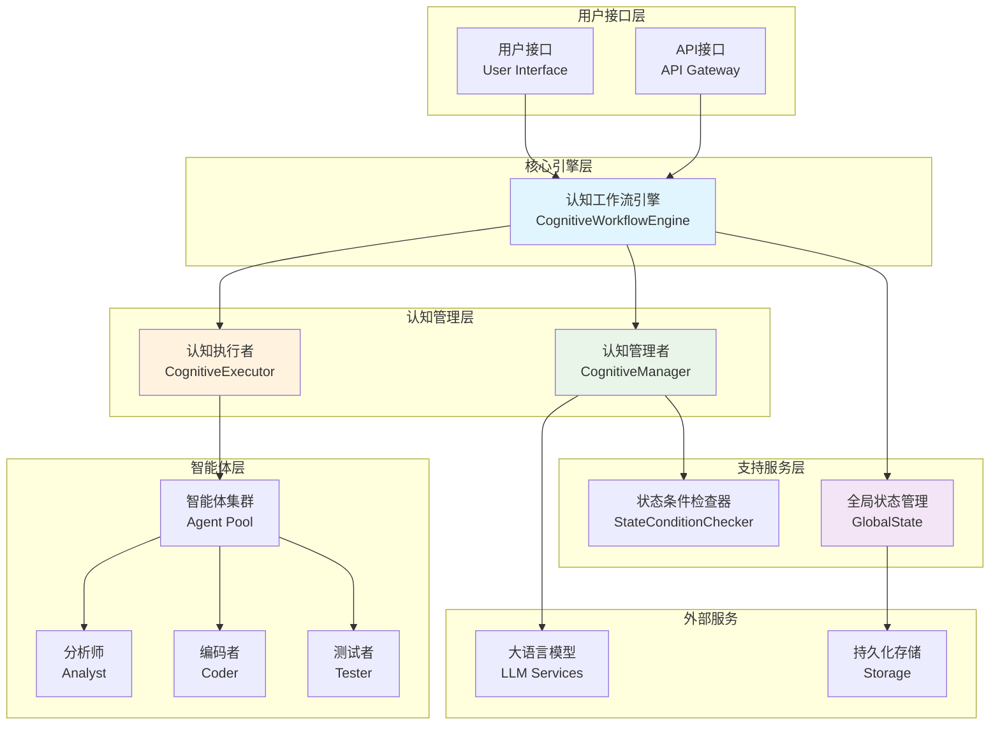
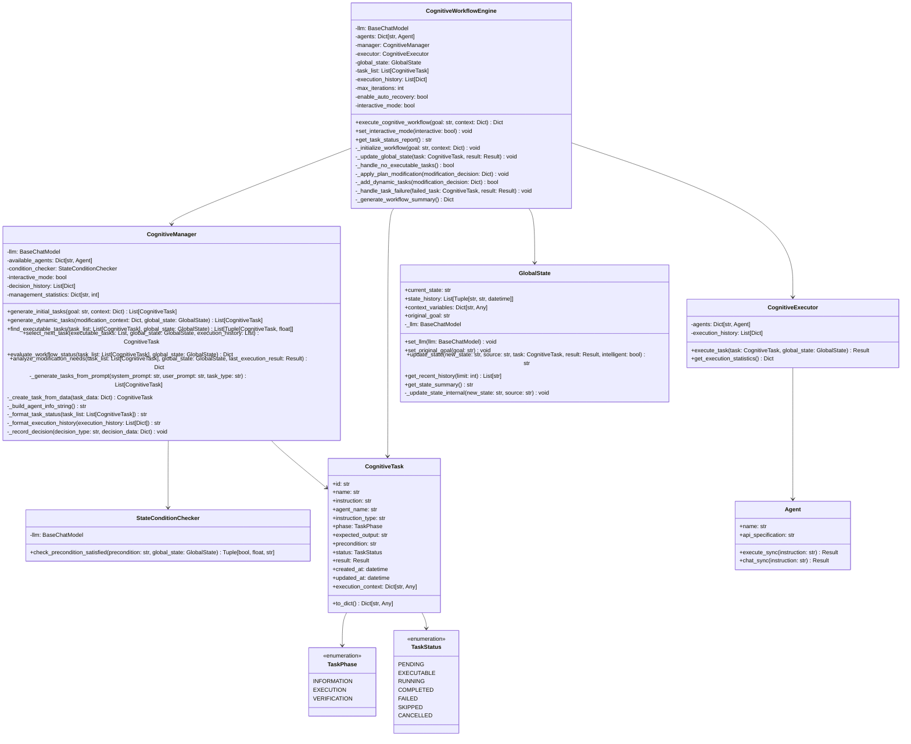
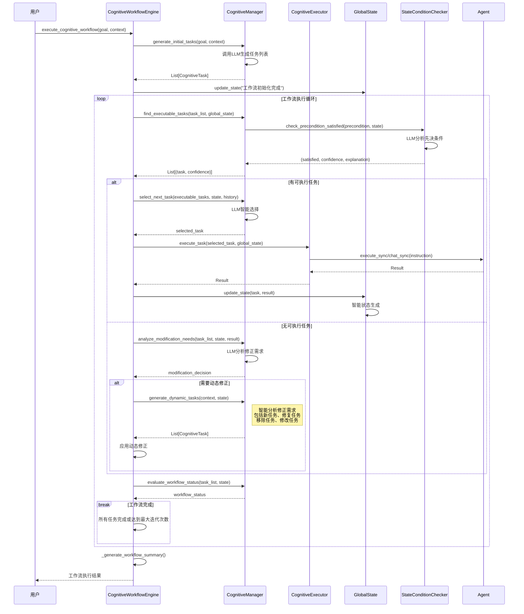
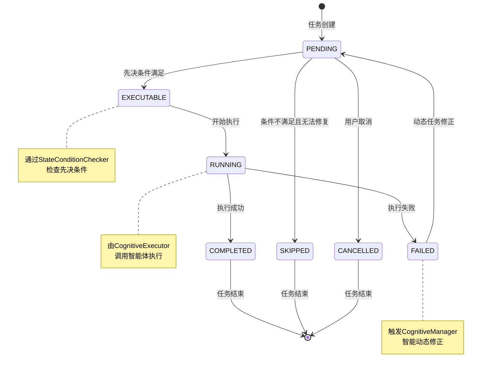
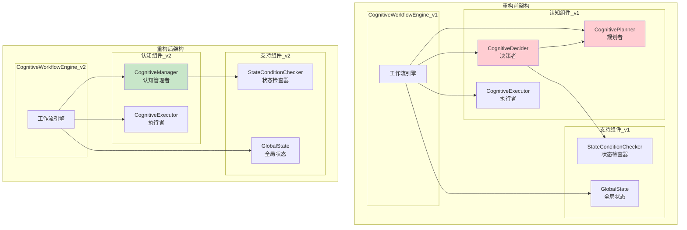

# 认知工作流系统架构文档

## 1. 系统概述

### 1.1 系统简介
认知工作流系统（CognitiveWorkflow）是一个基于大语言模型的智能任务管理和执行框架。系统通过认知管理者统一调度任务规划、决策和执行，实现自适应的工作流管理。

### 1.2 设计理念
- **认知驱动**: 基于AI的智能决策和任务管理
- **自适应性**: 动态调整任务计划和执行策略
- **状态感知**: 基于全局状态的上下文感知决策
- **模块化**: 清晰的职责分离和组件解耦

### 1.3 核心特性
- 🧠 智能任务规划和动态调整
- 🔄 自适应工作流执行
- 📊 全局状态管理和跟踪
- 🛠️ 多智能体协作执行
- 🔍 先决条件智能检查
- 📈 执行历史和决策追踪

## 2. 系统架构概览

### 2.1 整体架构图

## 3. 核心组件类图

### 3.1 系统类图设计

## 4. 核心交互流程

### 4.1 工作流执行主流程

### 4.2 任务状态转换图

## 5. 组件职责说明

### 5.1 CognitiveWorkflowEngine（认知工作流引擎）
- **核心职责**: 工作流生命周期管理和组件协调
- **主要功能**:
  - 工作流初始化和执行控制
  - 组件间协调和状态同步
  - 异常处理和恢复机制
  - 执行历史管理

### 5.2 CognitiveManager（认知管理者）
- **核心职责**: 统一的认知任务管理
- **主要功能**:
  - 任务规划：初始任务生成、动态任务修正（包括新任务添加、修复任务、任务移除/修改）
  - 任务决策：可执行任务查找、下一任务选择、工作流状态评估
  - 计划修正：需求分析、动态调整决策
  - 决策历史记录和统计

### 5.3 CognitiveExecutor（认知执行者）
- **核心职责**: 纯粹的任务执行
- **主要功能**:
  - 任务执行调度
  - 智能体交互管理
  - 执行结果处理
  - 执行统计收集

### 5.4 StateConditionChecker（状态条件检查器）
- **核心职责**: 智能状态分析
- **主要功能**:
  - 先决条件满足性检查
  - 置信度评估
  - 状态解释生成

### 5.5 GlobalState（全局状态）
- **核心职责**: 工作流状态管理
- **主要功能**:
  - 状态更新和历史记录
  - 上下文变量管理
  - 智能状态描述生成
  - 状态查询和摘要

## 6. 重构前后对比

### 6.1 架构演进图

### 6.2 重构优势
1. **简化架构**: 从3个核心组件减少到2个
2. **消除重复**: 统一任务生成和决策逻辑
3. **提高维护性**: 相关功能集中管理
4. **保持功能完整性**: 所有现有功能都会保留
5. **智能修复整合**: 将修复任务生成整合到动态任务修正中，避免功能重叠

### 6.3 修复任务整合说明
**设计决策**: 将传统的独立修复任务生成机制整合到动态任务修正机制中。

**原因分析**:
- 动态任务添加功能的 `analyze_modification_needs()` 方法已经能够智能分析失败情况
- 可以根据任务失败、执行结果和全局状态生成针对性的修复策略
- 避免了两套修复机制的功能重叠和代码重复

**实现方式**:
- `analyze_modification_needs()` 分析修正需求时，会检测任务失败情况
- 当检测到需要修复时，返回 `action: "add_tasks"` 的修正决策
- `generate_dynamic_tasks()` 根据修正上下文生成相应的修复任务
- 修复任务通过统一的动态任务添加流程加入工作流

**优势**:
- 统一的修复策略和决策逻辑
- 更智能的上下文感知修复
- 简化的架构和更少的代码重复
- 更好的可维护性和扩展性

## 7. 关键设计模式

### 7.1 策略模式（Strategy Pattern）
**应用场景**: 任务生成策略
- **初始任务生成**: 基于目标的发散性规划
- **动态任务修正**: 基于上下文的智能修正（包括新任务添加、修复任务、任务移除/修改）

### 7.2 状态模式（State Pattern）
**应用场景**: 任务状态管理
- 不同状态下的任务行为不同
- 状态转换的条件和动作

### 7.3 观察者模式（Observer Pattern）
**应用场景**: 状态变更通知
- 任务状态变更时通知相关组件
- 全局状态更新时的事件传播

### 7.4 命令模式（Command Pattern）
**应用场景**: 任务执行
- 将任务指令封装为可执行对象
- 支持任务的重试、撤销等操作

## 8. 技术特色

### 8.1 核心特性
- **认知驱动**: 基于AI的智能工作流管理
- **状态感知**: 全局状态的智能分析和更新
- **动态适应**: 运行时的任务动态调整
- **先决条件**: 自然语言描述的智能条件检查
- **三阶段规划**: 信息收集→执行→验证的标准流程

### 8.2 应用场景
- **自动化运维**: 智能化的系统运维任务
- **代码开发**: AI辅助的软件开发流程
- **数据处理**: 复杂数据分析和处理流程
- **业务流程**: 智能化的业务流程自动化
- **研究分析**: 科研和分析任务的智能化管理

## 9. 总结

### 9.1 架构优势
1. **统一管理**: CognitiveManager统一任务管理职责
2. **职责清晰**: Manager负责认知，Executor负责执行
3. **高度解耦**: 组件间通过明确接口交互
4. **智能化**: 基于LLM的智能决策和状态管理
5. **可扩展**: 支持水平和垂直扩展
6. **可靠性**: 完善的容错和恢复机制

### 9.2 实施建议
建议按照以下顺序进行重构：
1. **第1周**: 设计确认和准备
2. **第2周**: 核心开发（CognitiveManager骨架）
3. **第3周**: 功能迁移和引擎更新
4. **第4周**: 测试优化和清理

---

**版本**: v2.0  
**更新日期**: 2024-12-21  
**文档状态**: 架构设计完成，待实施验证 