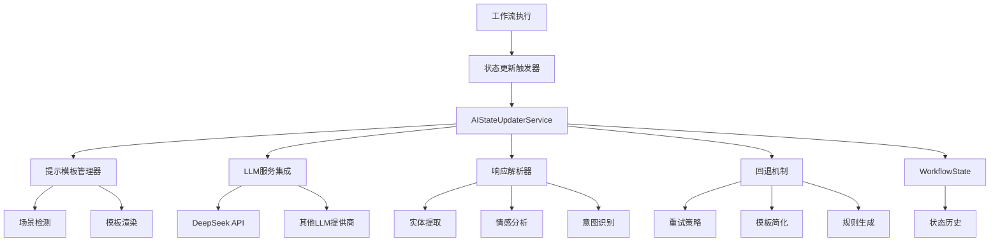
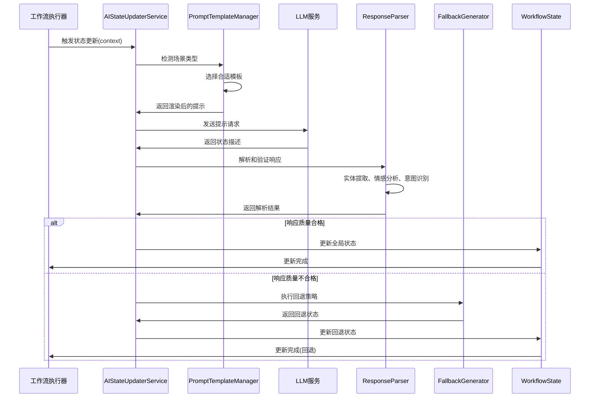

# AI状态更新器架构技术文档

## 概述

AI状态更新器是AI代理框架v2版本的核心组件，负责通过大语言模型(LLM)智能地分析工作流执行情况并生成语义化的状态描述。该系统结合了先进的提示工程、响应解析和回退机制，确保状态更新的准确性和可靠性。

## 系统架构

### 高层架构图



### 核心组件详解

#### 1. AIStateUpdaterService (主服务类)

AIStateUpdaterService是整个AI状态更新系统的核心协调器，负责：

- 管理LLM连接和配置
- 协调提示模板和响应解析
- 执行回退策略
- 提供性能统计和监控

**类结构:**
```python
class AIStateUpdaterService(AIStateUpdater):
    def __init__(self, 
                 llm_config: Dict[str, Any],
                 enable_sentiment_analysis: bool = True,
                 enable_intent_recognition: bool = True,
                 fallback_strategies: List[FallbackStrategy] = None):
        # 初始化各种组件
        
    async def update_state_async(self, context: Dict[str, Any]) -> str:
        # 异步状态更新主流程
        
    def update_state(self, context: Dict[str, Any]) -> str:
        # 同步状态更新接口
```

#### 2. PromptTemplateManager (提示模板管理)

负责管理不同场景下的提示模板，支持动态模板渲染和变量注入。

**支持的场景类型:**
```python
class PromptScenario(Enum):
    INITIALIZATION = "initialization"      # 工作流初始化
    SUCCESS_COMPLETION = "success"        # 成功完成步骤
    ERROR_HANDLING = "error"              # 错误处理
    STATE_TRANSITION = "transition"       # 状态转换
    PROGRESS_UPDATE = "progress"          # 进度更新
    SUMMARY = "summary"                   # 总结汇报
```

**模板示例:**
```python
# 成功完成场景模板
SUCCESS_TEMPLATE = PromptTemplate(
    system_message="""你是一个专业的工作流状态分析师。基于提供的执行信息，生成简洁而准确的状态描述。

要求：
1. 使用自然语言描述当前状态
2. 突出关键成就和进展
3. 简明扼要，避免技术细节
4. 保持积极和专业的语调""",

    user_message="""任务: $task_description
执行结果: $execution_result
当前时间: $timestamp
工作流统计: $workflow_stats

请基于以上信息生成状态描述。"""
)
```

#### 3. ResponseParser (响应解析器)

智能解析和验证LLM生成的状态描述，包含多维度分析功能。

**解析能力:**
- **实体提取**: 识别状态类型、时间引用、数值信息
- **情感分析**: 分析状态的情感倾向(积极/消极/中性)
- **意图识别**: 识别状态更新的意图类型
- **置信度评估**: 基于多因子模型评估响应质量

**数据结构:**
```python
@dataclass
class ParsedStateInfo:
    """解析后的状态信息"""
    original_text: str
    entities: Dict[str, List[str]]
    sentiment: str  # 'positive', 'negative', 'neutral'
    intent_type: str
    confidence_score: float
    quality_level: ResponseQuality
    improvement_suggestions: List[str]
```

#### 4. FallbackStateGenerator (回退机制)

当主要的AI状态更新失败时，提供多层次的回退策略。

**回退策略:**
```python
class FallbackStrategy(Enum):
    RETRY_SIMPLIFIED = "retry_simplified"      # 简化提示重试
    TEMPLATE_BASED = "template_based"          # 基于模板生成
    RULE_BASED = "rule_based"                  # 基于规则生成
    MINIMAL_STATE = "minimal_state"            # 最小状态生成
    NOTIFY_OPERATOR = "notify_operator"        # 通知操作员
```

## 数据流详解

### 状态更新完整流程



## 参考资料

- [全局状态架构文档](./GLOBAL_STATE_ARCHITECTURE.md)
- [配置和优化指南](./CONFIGURATION_OPTIMIZATION_GUIDE.md)
- [性能监控文档](../performance_monitor.py)
- [提示工程最佳实践](./PROMPT_ENGINEERING_BEST_PRACTICES.md)
