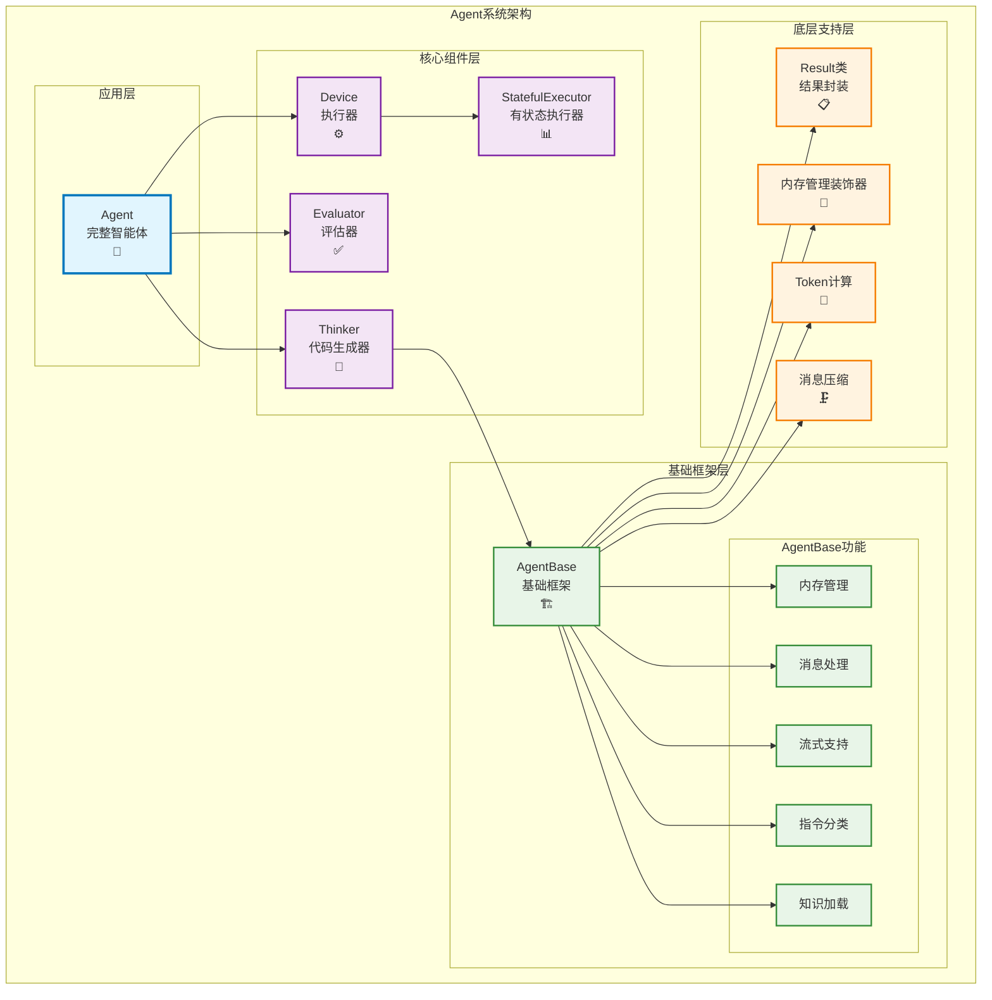

# Agent系统文档

## 概述

Agent系统是本框架的核心组件，提供了智能体的基础架构和功能。本文档详细介绍了Agent系统的完整架构，包括：

- **`agent_base.py`** 中的核心基础类：Result类、内存管理装饰器、AgentBase基类
- **`pythonTask.py`** 中的具体实现类：执行器类(Device、StatefulExecutor)、代码生成器(Thinker)、评估器(Evaluator)、完整智能体(Agent)

这些组件共同构成了一个完整的智能体系统，支持自然语言到代码的转换、执行、评估和优化。

## 系统架构

Agent系统采用分层和模块化的设计，各组件关系如下：



**组件职责说明：**
- **Agent**: 最高层的智能体类，整合所有组件，提供完整的智能体功能
- **Thinker**: 负责自然语言到代码的转换和执行循环
- **Evaluator**: 负责评估任务执行结果是否符合预期
- **Device/StatefulExecutor**: 负责实际的Python代码执行
- **AgentBase**: 提供所有智能体的基础功能和框架
- **底层组件**: 提供结果封装、内存管理等基础设施

## 核心组件

### 1. Result类 - 执行结果封装

`Result`类是用于封装智能体执行操作后结果信息的核心数据结构。

#### 类定义

```python
class Result:
    def __init__(self, success: bool, code: str, stdout: str = None, 
                 stderr: str = None, return_value: str = None):
        self.success = success
        self.code = code
        self.stdout = stdout
        self.stderr = stderr
        self.return_value = return_value
```

#### 属性说明

| 属性 | 类型 | 说明 |
|------|------|------|
| `success` | `bool` | 执行成功标志 |
| `code` | `str` | 根据指令由语言模型生成的代码 |
| `stdout` | `str` | 标准输出内容 |
| `stderr` | `str` | 标准错误输出内容 |
| `return_value` | `str` | 执行结果的返回值 |

#### 方法

- `__str__()`: 返回格式化的字符串表示
- `__repr__()`: 返回对象的字符串表示
- `to_dict()`: 转换为字典格式

#### 重要说明

对于单元测试或验证类指令，`success=True`表示成功完成了测试或验证操作，而不是测试结果是否通过。测试或验证的实际结果（通过/失败）记录在`return_value`中。

#### 使用示例

```python
# 成功执行的结果
result = Result(
    success=True,
    code="print('Hello, World!')",
    stdout="Hello, World!\n",
    stderr=None,
    return_value="Hello, World!"
)

# 转换为字典
result_dict = result.to_dict()
```

### 2. 内存管理装饰器

框架提供了两种内存管理装饰器来优化智能体的内存使用。

#### 2.1 标准内存管理装饰器

`@reduce_memory_decorator`是标准的内存管理装饰器，使用精确的Token计算和对话对保留策略。

##### 特性

- 使用tiktoken进行精确的Token计算
- 优先保留SystemMessage和标记为protected的消息
- 按(Human, AI)对保留最新的对话
- 支持动态配置max_tokens参数

##### 配置优先级

1. 装饰器参数：`@reduce_memory_decorator(max_tokens=value)`
2. 环境变量：`AGENT_MAX_TOKENS`
3. 全局常量：`MAX_TOKENS` (默认60000)

##### 使用方式

```python
# 直接装饰
@reduce_memory_decorator
def chat_sync(self, message: str):
    # 方法实现
    pass

# 带参数装饰
@reduce_memory_decorator(max_tokens=30000)
def execute_sync(self, instruction: str):
    # 方法实现
    pass
```

#### 2.2 压缩版内存管理装饰器

`@reduce_memory_decorator_compress`使用智能压缩策略来管理内存。

##### 特性

- 保留protected消息和最后10条消息
- 使用智能压缩算法处理中间消息
- 支持fallback到Token限制策略
- 提供详细的压缩过程日志

##### 压缩策略

1. **消息分类**：分离protected消息和普通消息
2. **智能压缩**：调用`compress_messages`函数压缩中间消息
3. **Token检查**：确保压缩后符合Token限制
4. **Fallback策略**：如果压缩失败，使用基于Token的选择策略

##### 使用示例

```python
@reduce_memory_decorator_compress
def execute_stream(self, instruction: str):
    # 方法实现，会自动进行内存压缩管理
    pass
```

### 3. 执行器类 - 代码执行组件

框架提供了两种代码执行器来处理Python代码的执行。

#### 3.1 Device类 - 基础执行器

`Device`类是基础的Python代码执行器，提供无状态的代码执行功能。

```python
class Device:
    def execute_code(self, code: str) -> Result:
        """执行给定的Python代码，并返回执行结果"""
```

**特性：**
- 无状态执行：每次执行都是独立的
- 使用临时文件执行代码
- 自动处理文件清理
- 返回标准的Result对象

**使用场景：**
- 简单的代码片段执行
- 不需要保持变量状态的场景
- 安全隔离的代码执行

#### 3.2 StatefulExecutor类 - 有状态执行器

`StatefulExecutor`继承自`Device`，提供有状态的Python代码执行功能。

```python
class StatefulExecutor(Device):
    def __init__(self):
        """初始化有状态执行器，创建IPython实例"""
    
    def execute_code(self, code: str) -> Result:
        """在持久的IPython环境中执行代码"""
    
    def get_variable(self, var_name: str):
        """获取IPython环境中的变量值"""
    
    def set_variable(self, var_name: str, value):
        """在IPython环境中设置变量值"""
```

**特性：**
- 基于IPython的持久执行环境
- 变量和状态在执行间保持
- 支持复杂的交互式计算
- 自动配置matplotlib等库
- 实时输出显示和捕获

**使用场景：**
- 需要保持变量状态的连续计算
- 数据分析和科学计算
- 交互式编程环境
- 复杂的多步骤任务

### 4. Thinker类 - 代码生成器

`Thinker`类是核心的代码生成器，负责将自然语言指令翻译成Python代码并执行。

```python
class Thinker(AgentBase):
    def __init__(self, llm: BaseChatModel, max_retries: int = 10, 
                 thinker_system_message: str = None,
                 thinker_chat_system_message: str = None,
                 device: Device = None):
```

#### 核心方法

##### 4.1 代码执行方法

```python
@reduce_memory_decorator_compress
def execute_sync(self, instruction: str = None) -> Result:
    """同步执行：生成代码并执行，包含代码修改循环"""

@reduce_memory_decorator_compress  
def execute_stream(self, instruction: str = None) -> Iterator[object]:
    """流式执行：实时返回代码生成和执行过程"""
```

**执行流程：**
1. 根据指令生成Python代码
2. 提取并验证代码
3. 执行代码获取结果
4. 如果失败，分析错误并重新生成
5. 重复直到成功或达到最大重试次数

**流式返回结构：**
- **前面的元素**：代码生成过程、执行状态、错误信息等日志
- **最后一个元素**：最终的执行结果（Result对象）

##### 4.2 聊天方法

```python
@reduce_memory_decorator_compress
def chat_stream(self, message: str, response_format: Optional[Dict] = None) -> Iterator[object]:
    """流式聊天：纯语言交互，无代码执行"""

@reduce_memory_decorator_compress
def chat_sync(self, message: str, response_format: Optional[Dict] = None) -> Result:
    """同步聊天：直接语言模型对话"""
```

**特性：**
- 临时切换到聊天模式系统消息
- 支持结构化输出（JSON等）
- 不影响代码执行状态

##### 4.3 结果生成方法

```python
def generateResult_sync(self, instruction: str, result: Result) -> str:
    """生成用户友好的最终回复"""

def generateResult_stream(self, instruction: str, result: Result) -> Iterator[str]:
    """流式生成最终回复"""
```

### 5. Evaluator类 - 行为评估器

`Evaluator`类用于评估任务执行结果是否符合预期。

```python
class Evaluator:
    def __init__(self, llm: BaseChatModel, systemMessage: str, thinker: Thinker = None):
        """初始化评估器"""
    
    def loadKnowledge(self, knowledge: str):
        """加载评估相关的知识"""
    
    def evaluate(self, instruction: str, result: Result) -> Tuple[bool, str]:
        """评估任务是否完成，返回(是否完成, 原因)"""
```

**评估策略：**
1. **AI评估**：使用LLM进行智能评估
2. **JSON解析**：提取结构化的评估结果
3. **兜底规则**：基于简单规则的后备评估
4. **多重尝试**：失败时自动重试

**评估流程：**
1. 使用模板化的评估提示
2. 调用LLM获取评估结果
3. 解析JSON格式的回复
4. 提取`taskIsComplete`和`reason`字段
5. 如果解析失败，使用兜底规则

### 6. Agent类 - 完整智能体

`Agent`类是完整的智能体实现，集成了代码生成、执行和评估功能。

```python
class Agent(AgentBase):
    def __init__(self, llm: BaseChatModel, stateful: bool = True,
                 evaluate_llm: BaseChatModel = None, max_retries: int = 10,
                 skip_evaluation: bool = False, skip_generation: bool = False,
                 thinker_system_message: str = None,
                 evaluation_system_messages: List[str] = None,
                 thinker_chat_system_message: str = None):
```

#### 核心组件

| 组件 | 类型 | 说明 |
|------|------|------|
| `thinker` | `Thinker` | 代码生成和执行器 |
| `device` | `Device/StatefulExecutor` | 代码执行器 |
| `evaluators` | `List[Evaluator]` | 多个评估器 |

#### 执行流程

**同步执行流程：**
1. 使用Thinker生成并执行代码
2. 如果执行成功，进行多重评估
3. 所有评估通过后，生成用户友好的回复
4. 如果评估失败，基于失败原因重新尝试

**流式执行流程：**
- 实时输出代码生成过程
- 显示执行状态和日志
- 流式返回评估过程
- 最终生成完整回复

#### 高级功能

##### 6.1 多重评估系统

```python
def loadEvaluationSystemMessage(self, evaluationSystemMessage: str):
    """添加新的评估器"""

def evaluate_all(self, result: Result, instruction: str = None) -> Tuple[bool, List[str]]:
    """使用所有评估器进行评估"""
```

**评估策略：**
- 支持多个并行评估器
- 任何一个评估器失败即认为任务失败
- 收集所有评估器的反馈信息

##### 6.2 知识和模块管理

```python
def loadKnowledge(self, knowledge: str):
    """加载知识到所有组件"""

def loadPythonModules(self, pythonModules: List[str]):
    """加载Python模块到执行环境"""
```

##### 6.3 API规范管理

```python
def set_api_specification(self, api_spec: str):
    """设置智能体的API规范说明"""

def set_agent_name(self, name: str):
    """设置智能体名称"""
```

### 7. AgentBase类 - 智能体基类

`AgentBase`是所有智能体的基础类，提供了核心的交互方法和内存管理功能。

#### 核心理念

该类基于哲学中的意向性（Intentionality）概念设计，将人类与世界的交互分为两种基本方式：

- **chat（思维）**：通过语言进行交流和思考，处理和表达意向性状态
- **execute（动作）**：通过行动改变或感知世界，将意向性状态转化为实际行动

#### 类结构

```python
class AgentBase:
    def __init__(self, llm: BaseChatModel = None, system_message: str = None):
        self.llm = llm
        self.system_message = system_message
        self.memory = []
        self.api_specification = None
        self.name = None
        self.memory_overloaded = False
```

#### 核心属性

| 属性 | 类型 | 说明 |
|------|------|------|
| `llm` | `BaseChatModel` | 语言模型实例 |
| `system_message` | `str` | 系统消息 |
| `memory` | `List[BaseMessage]` | 对话记忆 |
| `api_specification` | `str` | API规范说明 |
| `name` | `str` | 智能体名称 |
| `memory_overloaded` | `bool` | 内存超载标记 |

#### 核心方法

##### 3.1 知识管理

```python
def loadKnowledge(self, knowledge: str):
    """加载知识到agent的记忆中，确保消息交替"""
```

- 将知识以受保护的消息形式加载到记忆中
- 自动标记为protected，避免被内存管理删除
- 确保消息的交替模式（Human-AI-Human-AI）

##### 3.2 聊天方法

```python
def chat_stream(self, message: str, response_format: Optional[Dict] = None) -> Iterator[object]:
    """流式聊天方法"""

def chat_sync(self, message: str, response_format: Optional[Dict] = None) -> Result:
    """同步聊天方法"""
```

**特性说明：**
- 支持同步和流式两种交互模式
- 可选的response_format参数用于结构化输出
- 自动管理对话记忆

**流式方法返回结构：**
- `chat_stream`返回一个迭代器，其中：
  - **前面的元素**：字符串类型，表示LLM生成过程中的中间文本片段
  - **最后一个元素**：`Result`类型对象，包含完整的聊天结果

##### 3.3 执行方法

```python
def execute_stream(self, instruction: str = None) -> Iterator[object]:
    """执行流式方法"""

def execute_sync(self, instruction: str = None) -> Result:
    """同步执行方法"""
```

**特性说明：**
- 抽象方法，由子类实现具体功能
- 用于执行具体的智能体任务和操作

**流式方法返回结构：**
- `execute_stream`返回一个迭代器，遵循"过程 + 状态"的设计模式：
  - **前面的元素**：字符串类型，表示执行过程中的中间日志信息（如代码生成过程、执行进度、调试信息等）
  - **最后一个元素**：`Result`类型对象，包含最终的执行结果和状态

##### 3.4 指令分类

```python
def classify_instruction(self, instruction: str) -> bool:
    """判断用户指令是"思维"还是"动作"""
```

**思维（Thought）特征：**
- 仅与智能体内部记忆交互
- 不产生外部副作用
- 不调用外部工具或API
- 示例："请总结一下我们之前的对话"

**动作（Action）特征：**
- 调用工具对外部世界产生副作用
- 会修改外部世界（文件系统、网络请求等）
- 可能产生持久化变化
- 示例："请创建一个名为'project'的新文件夹"

##### 3.5 工具方法

```python
def calculate_memory_tokens(self, model_name: str = "gpt-3.5-turbo") -> int:
    """计算memory的token数量"""
```

## 最佳实践

### 1. 内存管理

- 为长时间运行的智能体使用内存管理装饰器
- 将重要的系统消息和知识标记为protected
- 监控`memory_overloaded`标志以了解内存状态

### 2. 消息保护

```python
# 标记消息为受保护
system_msg = SystemMessage("重要的系统消息")
system_msg.protected = True
```

### 3. 错误处理

- 检查Result对象的success字段判断执行状态
- 适当处理stderr中的错误信息
- 对于测试类指令，检查return_value获取实际结果

### 4. 性能优化

- 使用流式方法处理长时间运行的任务
- 适当配置max_tokens以平衡性能和功能性
- 监控Token使用情况

## 扩展指南

### 继承AgentBase

```python
class MyAgent(AgentBase):
    def __init__(self, llm, **kwargs):
        super().__init__(llm, **kwargs)
        # 自定义初始化
    
    @reduce_memory_decorator_compress
    def execute_sync(self, instruction: str) -> Result:
        # 实现具体的执行逻辑
        pass
    
    @reduce_memory_decorator_compress  
    def execute_stream(self, instruction: str) -> Iterator[object]:
        # 实现流式执行逻辑
        pass
```

### 自定义内存管理

如果需要自定义内存管理策略，可以：

1. 继承现有装饰器并修改`_reduce_memory`函数
2. 实现自己的内存管理逻辑
3. 使用protected标记保护重要消息

## 常见问题

### Q: 如何保护重要消息不被删除？

A: 将消息的`protected`属性设置为`True`：

```python
important_msg = HumanMessage("重要信息")
important_msg.protected = True
```

### Q: 如何调整内存限制？

A: 有三种方式：

1. 装饰器参数：`@reduce_memory_decorator(max_tokens=30000)`
2. 环境变量：`export AGENT_MAX_TOKENS=30000`
3. 修改全局常量：`MAX_TOKENS = 30000`

### Q: 流式和同步方法有什么区别？

A: 
- **同步方法**：等待完整结果后返回，适合简单交互
- **流式方法**：实时返回处理过程，适合长时间任务和需要实时反馈的场景

### Q: 流式方法的返回结果如何解析？

A: 流式方法返回迭代器，需要按顺序处理：

```python
# 处理chat_stream
for chunk in agent.chat_stream("你好"):
    if isinstance(chunk, str):
        print(chunk, end='', flush=True)  # 中间文本片段
    elif isinstance(chunk, Result):
        final_result = chunk  # 最终结果

# 处理execute_stream  
for item in agent.execute_stream("计算1+1"):
    if isinstance(item, str):
        print(f"日志: {item}")  # 执行过程日志
    elif isinstance(item, Result):
        final_result = item  # 最终执行结果
```

### Q: 如何判断内存是否被压缩？

A: 检查`agent.memory_overloaded`标志：

```python
if agent.memory_overloaded:
    print("内存已被压缩")
```

## 相关文档

- [用户快速入门指南](USER_QUICK_START_GUIDE.md)
- [配置优化指南](CONFIGURATION_OPTIMIZATION_GUIDE.md)
- [测试指南](TESTING_GUIDE.md)
- [最佳实践和故障排除](BEST_PRACTICES_TROUBLESHOOTING.md)

## 版本信息

当前文档版本：1.0  
最后更新时间：2025-01-21  
适用代码版本：agent_base.py v2.0+ 