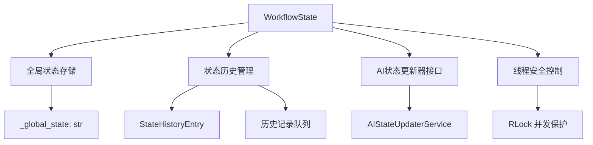

# 全局状态架构技术文档

## 概述

本文档详细介绍了AI代理框架v2版本中的全局状态管理功能。全局状态系统为工作流执行提供了持久化的上下文存储，支持AI驱动的状态更新和智能决策。

## 系统架构

### 核心组件



### WorkflowState 类架构

#### 核心数据结构

##### 1. 全局状态存储 (`_global_state`)

```python
# 数据类型: str
# 用途: 存储当前工作流的全局状态描述
# 特点: 自然语言格式，支持AI理解和更新

_global_state: str = ""
```

**示例状态格式:**
```
当前正在处理用户数据分析任务。
已完成数据收集阶段，包含1000条用户记录。
正在进行数据清洗，发现15%的记录存在缺失值。
下一步需要应用数据插值算法处理缺失数据。
```

##### 2. 状态历史跟踪

```python
from collections import deque
from dataclasses import dataclass
from datetime import datetime
from typing import Optional

@dataclass
class StateHistoryEntry:
    """状态历史条目"""
    timestamp: datetime
    state_snapshot: str
    source: str  # 'manual', 'ai_updater', 'system'

# 历史存储
_state_history: deque[StateHistoryEntry] = deque(maxlen=50)
```

**历史条目示例:**
```python
StateHistoryEntry(
    timestamp=datetime(2024, 1, 15, 10, 30, 45),
    state_snapshot="开始执行数据分析工作流",
    source="system"
)
```

##### 3. 状态更新控制

```python
# 状态更新开关
_state_update_enabled: bool = True

# 用途:
# - 控制是否允许状态更新
# - 调试时可以禁用状态变更
# - 性能优化时可暂时关闭
```

#### 线程安全机制

```python
import threading

# 可重入锁，支持同一线程多次获取
_state_lock: threading.RLock = threading.RLock()

# 使用示例:
with self._state_lock:
    # 所有状态操作都在锁保护下进行
    self._global_state = new_state
```

## API 参考

### 状态管理核心方法

#### 1. `set_global_state(new_state: str, source: Optional[str] = None) -> None`

设置全局状态并记录历史。

**参数:**
- `new_state` (str): 新的状态描述
- `source` (Optional[str]): 状态来源标识，默认为 "manual"

**异常:**
- `TypeError`: 当 new_state 不是字符串类型时

**使用示例:**
```python
# 手动设置状态
workflow_state.set_global_state("开始数据处理阶段")

# 指定来源
workflow_state.set_global_state(
    "AI检测到数据异常，需要人工干预", 
    source="ai_updater"
)
```

#### 2. `get_global_state() -> str`

获取当前全局状态。

**返回值:**
- `str`: 当前全局状态描述

**使用示例:**
```python
current_state = workflow_state.get_global_state()
print(f"当前状态: {current_state}")
```

#### 3. `get_state_history(limit: Optional[int] = None) -> List[StateHistoryEntry]`

获取状态历史记录。

**参数:**
- `limit` (Optional[int]): 限制返回的历史条目数量

**返回值:**
- `List[StateHistoryEntry]`: 状态历史列表，按时间倒序

**使用示例:**
```python
# 获取最近10条历史
recent_history = workflow_state.get_state_history(limit=10)

for entry in recent_history:
    print(f"{entry.timestamp}: {entry.state_snapshot} (来源: {entry.source})")
```

### 状态更新控制方法

#### 4. `enable_state_updates() -> None`

启用状态更新功能。

#### 5. `disable_state_updates() -> None`

禁用状态更新功能。

#### 6. `is_state_update_enabled() -> bool`

检查状态更新是否启用。

**使用示例:**
```python
# 临时禁用状态更新
workflow_state.disable_state_updates()

# 执行不需要状态跟踪的操作
perform_batch_operations()

# 重新启用状态更新
workflow_state.enable_state_updates()
```

### 状态清理和维护

#### 7. `clear_global_state() -> None`

清空全局状态和历史记录。

**使用示例:**
```python
# 重置状态（通常在工作流重新开始时使用）
workflow_state.clear_global_state()
```

#### 8. `get_memory_usage() -> Dict[str, Any]`

获取状态管理的内存使用情况。

**返回值:**
- `Dict[str, Any]`: 包含内存使用统计的字典

**使用示例:**
```python
memory_info = workflow_state.get_memory_usage()
print(f"状态字符串长度: {memory_info['state_length']}")
print(f"历史条目数量: {memory_info['history_count']}")
print(f"预估内存使用: {memory_info['estimated_memory_mb']} MB")
```

## 工作流集成

### 指令生成器集成

全局状态被集成到所有指令生成器中，支持状态感知的指令生成：

```python
class InstructionGenerator:
    def generate_instruction(self, task: str, global_state: Optional['WorkflowState'] = None) -> str:
        if global_state and global_state.is_state_update_enabled():
            current_state = global_state.get_global_state()
            # 根据当前状态调整指令内容
            return self._generate_context_aware_instruction(task, current_state)
        else:
            return self._generate_basic_instruction(task)
```

### 工作流执行集成

在每个工作流步骤执行后，系统会自动触发状态更新：

```python
def _execute_single_workflow_step(self, step: Dict[str, Any]) -> Any:
    # 执行步骤
    result = self._perform_step_execution(step)
    
    # 触发AI状态更新
    if self.workflow_state.is_state_update_enabled():
        self._trigger_ai_state_update(step, result)
    
    return result
```

### 决策点集成

全局状态影响工作流的条件分支和决策：

```python
def should_skip_step(self, step: Dict[str, Any]) -> bool:
    current_state = self.workflow_state.get_global_state()
    
    # 基于状态的智能跳过逻辑
    if "错误" in current_state and step.get("type") == "optional":
        return True
    
    return False
```

## 性能特性

### 内存优化

- **历史记录限制**: 使用 `deque(maxlen=50)` 自动限制历史记录数量
- **状态压缩**: 长状态描述会被智能压缩以节省内存
- **延迟加载**: AI更新器采用延迟初始化模式

### 并发安全

- **可重入锁**: 使用 `threading.RLock()` 支持同一线程的嵌套访问
- **原子操作**: 所有状态修改操作都是原子性的
- **无死锁设计**: 锁的获取顺序经过精心设计以避免死锁

### 性能监控

集成了性能监控系统，自动跟踪：
- 状态更新频率
- 状态字符串长度变化
- 内存使用趋势
- AI更新器调用统计

## 配置选项

### 基础配置

```yaml
# config.yaml
workflow_state:
  max_history_size: 50  # 最大历史记录数
  enable_compression: true  # 启用状态压缩
  auto_cleanup: true  # 自动清理过期状态
  
ai_state_updater:
  enabled: true  # 启用AI状态更新
  model: "deepseek-chat"  # 使用的LLM模型
  update_frequency: "after_each_step"  # 更新频率
```

### 高级配置

```python
# 程序化配置
workflow_state = WorkflowState()

# 自定义历史大小
workflow_state._max_history_size = 100

# 设置自定义AI更新器
custom_updater = MyCustomAIUpdater()
workflow_state.set_ai_updater(custom_updater)
```

## 最佳实践

### 1. 状态描述规范

- **使用自然语言**: 状态应该用自然、易懂的语言描述
- **包含关键信息**: 当前阶段、已完成工作、下一步计划
- **避免技术细节**: 专注于业务逻辑而非实现细节

**好的状态示例:**
```
正在处理客户订单数据，已验证80%的订单信息。
发现12个订单存在地址不完整的问题，需要联系客户确认。
预计在2小时内完成所有订单验证工作。
```

**不好的状态示例:**
```
执行了validate_orders()函数，返回了dict对象，包含error_list=[...]
```

### 2. 状态更新时机

- **关键节点**: 在工作流的重要节点更新状态
- **错误发生时**: 遇到错误或异常情况时及时更新
- **用户交互**: 需要用户干预时更新状态

### 3. 性能优化

- **批量操作时禁用**: 在大量重复操作时临时禁用状态更新
- **定期清理**: 在长时间运行的工作流中定期清理历史
- **监控内存**: 定期检查内存使用情况

## 故障排除

### 常见问题

#### 1. 状态更新不生效

**症状**: 调用 `set_global_state()` 但状态没有改变

**解决方案**:
```python
# 检查状态更新是否启用
if not workflow_state.is_state_update_enabled():
    workflow_state.enable_state_updates()

# 检查是否有异常
try:
    workflow_state.set_global_state("新状态")
except Exception as e:
    print(f"状态更新失败: {e}")
```

#### 2. 内存使用过高

**症状**: 程序运行时间长后内存占用持续增长

**解决方案**:
```python
# 检查内存使用
memory_info = workflow_state.get_memory_usage()
print(memory_info)

# 清理历史记录
if memory_info['history_count'] > 100:
    workflow_state.clear_global_state()
```

#### 3. 并发访问问题

**症状**: 多线程环境下状态不一致

**解决方案**:
- 确保所有状态访问都通过WorkflowState的公共方法
- 避免直接访问私有属性
- 在自定义代码中使用适当的锁机制

## 版本兼容性

### v2.0.0 新增功能
- 全局状态管理
- 状态历史跟踪
- AI驱动状态更新
- 线程安全支持

### 升级指南

从v1.x升级到v2.0：

1. **无破坏性变更**: 现有代码无需修改
2. **可选功能**: 全局状态功能默认启用但不影响现有逻辑
3. **新API**: 可以逐步采用新的状态管理API

## 参考资料

- [AI状态更新器技术文档](./AI_STATE_UPDATER_ARCHITECTURE.md)
- [配置和优化指南](./CONFIGURATION_OPTIMIZATION_GUIDE.md)
- [用户快速开始指南](./USER_QUICK_START_GUIDE.md)
- [API完整参考](./API_REFERENCE.md) 