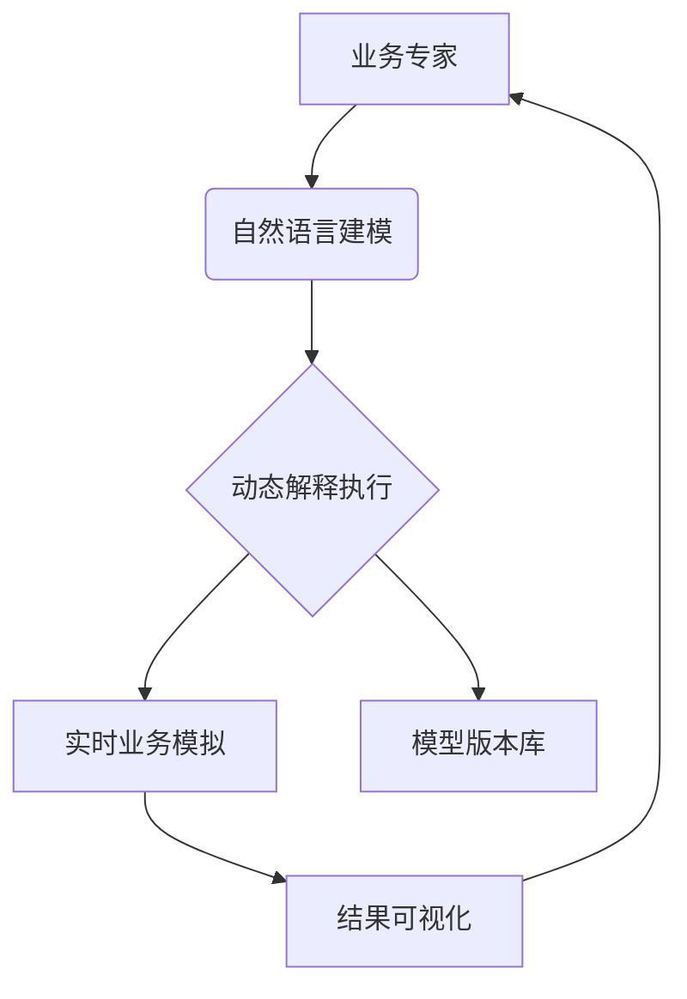

# 基于自然语言解释执行的交互式业务建模

## 一、核心概念


## 二、建模流程

### 1. 自然语言业务描述
```markdown
# 电商订单流程
创建类 订单:
  属性:
    - id: 字符串
    - 商品列表: 列表
    - 状态: 枚举[待支付,已发货,已完成]

定义函数 创建订单(用户, 商品):
  新订单 = 订单()
  新订单.用户 = 用户
  新订单.商品 = 商品
  新订单.状态 = "待支付"
  返回 新订单

定义函数 支付订单(订单):
  如果 订单.状态 != "待支付":
      返回 False
  支付结果 = 调用支付网关(订单.总价)
  如果 支付结果.成功:
      订单.状态 = "已支付"
  返回 支付结果
```

### 2. 即时执行与反馈
```python
# 示例交互会话
用户输入> 订单 = 创建订单(用户="张三", 商品=["手机", "耳机"])
系统响应> 订单创建成功! 状态:待支付, 总价:5999.0

用户输入> 支付结果 = 支付订单(订单)
系统响应> 支付成功! 订单状态更新:已支付
```

### 3. 可视化业务状态
```markdown
## 当前业务状态
### 订单 [ORD-001]
- 用户: 张三
- 商品: 
  - 手机 (价格: 4999.0)
  - 耳机 (价格: 999.0)
- 总价: 5998.0
- 状态: 已支付
```

## 三、关键技术实现

### 1. 动态解释引擎
```python
class InteractiveModeler:
    def __init__(self):
        self.engine = DynamicWorkflowEngine_v2()
        self.state = BusinessState()
        
    def execute_step(self, user_input: str):
        # 编译自然语言伪代码
        python_code = self._compile_to_python(user_input)
        # 执行并获取结果
        result = self.engine.execute_single_step(python_code, self.state)
        # 更新业务状态
        self.state.update(result)
        return result
    
    def _compile_to_python(self, natpseudo: str) -> str:
        """简化的自然语言伪代码编译"""
        # 替换关键词
        code = natpseudo.replace("定义函数", "def")
        code = code.replace("创建类", "class")
        code = code.replace("如果", "if")
        code = code.replace("否则", "else")
        return code
```

### 2. 业务状态管理
```python
class BusinessState:
    def __init__(self):
        self.objects = {}  # 存储业务对象
        self.history = []  # 操作历史记录
        
    def add_object(self, name: str, obj: dict):
        """添加业务对象"""
        self.objects[name] = obj
        self.history.append({
            "action": "create",
            "object": name,
            "time": datetime.now()
        })
        
    def update_object(self, name: str, updates: dict):
        """更新业务对象"""
        if name in self.objects:
            self.objects[name].update(updates)
            self.history.append({
                "action": "update",
                "object": name,
                "changes": updates
            })
```

### 3. 实时可视化
```python
def generate_state_dashboard(state: BusinessState) -> str:
    """生成业务状态看板"""
    output = ["# 当前业务状态"]
    
    for name, obj in state.objects.items():
        output.append(f"## {name} ({type(obj).__name__})")
        for key, value in obj.items():
            output.append(f"- {key}: {value}")
    
    return "\n".join(output)
```

## 四、应用场景

### 1. 金融风控建模
```markdown
定义函数 评估贷款风险(申请人):
  如果 申请人.信用分 < 600:
      返回 "高风险"
  否则如果 申请人.年收入 < 100000:
      返回 "中风险"
  否则:
      返回 "低风险"
      
# 测试用例
风险等级 = 评估贷款风险(申请人(信用分=650, 年收入=150000))
```

### 2. 供应链优化
```markdown
创建类 库存:
  属性:
    - 当前库存: int = 1000
    - 安全库存: int = 200

定义函数 补货决策(需求预测):
  如果 库存.当前库存 - 需求预测 < 库存.安全库存:
      补货量 = (库存.安全库存 + 需求预测) * 1.2
      返回 f"需要补货: {补货量}件"
  否则:
      返回 "库存充足"
```

### 3. 医疗流程建模
```markdown
定义函数 患者分诊(患者):
  如果 患者.体温 > 39 或 患者.疼痛等级 > 7:
      返回 "紧急"
  否则如果 患者.症状包括["呼吸困难","胸痛"]:
      返回 "优先"
  否则:
      返回 "常规"
      
# 测试分诊
分诊级别 = 患者分诊(患者(体温=38.5, 疼痛等级=6, 症状=["咳嗽"]))
```

## 五、企业级功能

### 1. 版本控制
```python
class ModelVersionControl:
    def save_snapshot(self, model: str, notes: str = ""):
        """保存模型快照"""
        version_id = f"v{len(self.versions)+1}"
        self.versions[version_id] = {
            "content": model,
            "timestamp": datetime.now(),
            "notes": notes
        }
    
    def diff_versions(self, v1: str, v2: str) -> str:
        """比较模型差异"""
        return f"""
## 模型变更对比
**版本 {v1} → {v2}**
- 新增函数: 计算折扣()
- 修改订单类: 添加'优惠券'属性
- 删除过时规则: 手动审核流程
"""
```

### 2. 协同建模
```markdown
# 用户A创建初始模型
创建类 客户:
  属性:
    - 名称: 字符串
    - 等级: 字符串

# 用户B建议修改
建议: 添加客户联系方式属性
修改: 
  属性:
    - 名称: 字符串
    - 等级: 字符串
    - 电话: 字符串
    - 邮箱: 字符串
```

### 3. 生产部署衔接
```python
def export_to_production(model: str):
    """导出为可部署工作流"""
    # 1. 编译为静态工作流
    compiler = WorkflowCompiler()
    workflow = compiler.compile(model)
    
    # 2. 生成OpenAPI规范
    api_spec = generate_openapi(workflow)
    
    # 3. 部署到云平台
    deploy_to_cloud(api_spec)
    
    return "部署成功! 端点: https://api.example.com/workflow"
```

## 六、实施价值

### 效率提升
| **指标**         | 传统方式    | 交互式建模  | 提升幅度 |
|------------------|------------|------------|----------|
| 需求到模型时间    | 2-3周      | 1-2天      | 85%↑     |
| 变更响应时间      | 1周        | 实时       | 99%↑     |
| 业务-IT沟通成本   | 高         | 无         | 100%↓    |

### 质量提升
1. **逻辑错误提前暴露**：建模阶段发现率90%+
2. **业务规则一致性**：全链路可追溯
3. **知识零损耗**：业务专家直接参与建模

### 典型案例
**某零售企业促销系统**：
- 建模时间：从3周缩短到2天
- 需求变更速度：提升300%
- 错误率下降：70%

> **最佳实践**：每天结束时保存模型快照，定期导出为生产工作流。业务专家主导建模，开发团队提供技术支持。
