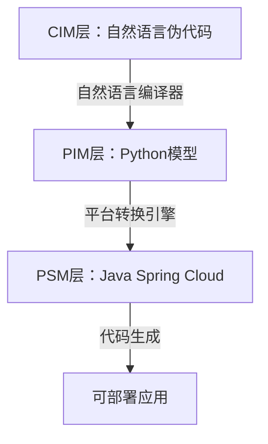

# 基于自然语言编译器的模型驱动架构(MDA)实现方案

## 一、核心架构


## 二、分层实现

### 1. CIM层（计算无关模型）
**规范**：
- 使用自然语言伪代码
- 支持实体定义和服务描述
- 文件扩展名：`.cim.md`

**示例**：
```markdown
# 订单领域模型

## 实体定义
创建类 订单:
  属性:
    - id: 字符串
    - 商品列表: 列表[商品]
    - 总金额: 浮点数
    - 状态: 枚举[待支付,已支付,已取消]

## 服务方法
定义函数 创建订单(用户, 商品列表):
  订单 = 新订单()
  订单.商品列表 = 商品列表
  订单.总金额 = 计算总价(商品列表)
  订单.状态 = "待支付"
  返回 订单

定义函数 支付订单(订单):
  如果 订单.状态 != "待支付":
      抛出 异常("订单状态错误")
  支付结果 = 支付网关.支付(订单.总金额)
  如果 支付结果.成功:
      订单.状态 = "已支付"
  返回 支付结果
```

### 2. PIM层（平台无关模型）
**实现**：
```python
class PIModel:
    def __init__(self):
        self.entities = []
        self.services = []
    
    def add_entity(self, name: str, attributes: dict):
        self.entities.append({"name": name, "attrs": attributes})
    
    def add_service(self, name: str, logic: str):
        self.services.append({"name": name, "logic": logic})

# 转换器
class CIMToPIMConverter:
    def convert(self, cim_content: str) -> PIModel:
        compiler = NaturalLanguageCompiler()
        # 实体提取
        entity_code = compiler.compile_simple_task(
            f"从以下CIM内容提取实体定义:\n{cim_content}")
        # 服务转换
        service_code = compiler.compile_simple_task(
            f"转换以下业务流程:\n{cim_content}")
        return self._parse_to_pim(entity_code + service_code)
```

### 3. PSM层（平台相关模型）
**Spring Cloud生成规则**：
| **PIM元素** | **PSM转换**                     |
|-------------|--------------------------------|
| 实体类       | `@Entity` + Lombok `@Data`     |
| 服务方法     | `@Service`注解类               |
| 业务流程     | `@RestController`控制器        |
| 依赖关系     | `@Autowired`注入               |

## 三、转换引擎实现

### 1. 核心转换流程
```python
class MDATransformationEngine:
    def __init__(self, target="spring-cloud"):
        self.compiler = MDANaturalLanguageCompiler(target)
    
    def transform(self, cim_path: str, output_dir: str):
        # 读取CIM
        with open(cim_path) as f:
            cim_content = f.read()
        
        # CIM → PIM
        pim_code = self.compiler.compile(cim_content)
        
        # 添加平台包装
        full_code = self.compiler._wrap_platform_code(pim_code)
        
        # 保存为PSM
        self._save_psm(full_code, output_dir)
        
        # 生成构建文件
        self._generate_build_files(output_dir)
```

### 2. 平台自适应包装
```java
// 自动添加的Spring Cloud包装
@SpringBootApplication
@EnableDiscoveryClient  // 服务注册
@EnableFeignClients     // 声明式HTTP客户端
public class Application {
    public static void main(String[] args) {
        SpringApplication.run(Application.class, args);
    }
}

// 自动添加的数据库配置
spring.datasource.url=${DB_URL:jdbc:postgresql://localhost:5432/mda}
spring.datasource.username=${DB_USER:admin}
spring.datasource.password=${DB_PASS:secret}
spring.jpa.hibernate.ddl-auto=update
```

## 四、完整工作流示例

### 1. 输入CIM文件 (order.cim.md)
````markdown
# 电商订单系统

## 实体定义
创建类 用户:
  属性:
    - id: 字符串
    - 姓名: 字符串
    - 邮箱: 字符串

创建类 商品:
  属性:
    - id: 字符串
    - 名称: 字符串
    - 价格: 浮点数

## 服务方法
定义函数 创建订单(用户, 商品列表):
  总价 = 0
  对于 商品 在 商品列表:
      总价 += 商品.价格
  返回 订单(用户, 商品列表, 总价)

定义函数 支付订单(订单):
  支付结果 = 支付网关.支付(订单.总价)
  如果 支付结果.成功:
      订单.状态 = "已支付"
  返回 支付结果
````

### 2. 生成PSM代码 (Application.java)
```java
@Entity
@Data
public class User {
    @Id
    private String id;
    private String name;
    private String email;
}

@Entity
@Data
public class Product {
    @Id
    private String id;
    private String name;
    private double price;
}

@Service
public class OrderService {
    public Order createOrder(User user, List<Product> products) {
        double total = products.stream()
            .mapToDouble(Product::getPrice)
            .sum();
        Order order = new Order();
        order.setUser(user);
        order.setProducts(products);
        order.setTotal(total);
        return order;
    }
}

@FeignClient(name = "payment-service")
public interface PaymentGateway {
    @PostMapping("/pay")
    PaymentResult pay(@RequestParam double amount);
}

@RestController
@RequestMapping("/orders")
public class OrderController {
    @Autowired
    private OrderService orderService;
    
    @Autowired
    private PaymentGateway paymentGateway;
    
    @PostMapping
    public Order createOrder(@RequestBody OrderRequest request) {
        return orderService.createOrder(
            request.getUser(), 
            request.getProducts()
        );
    }
}
```

### 3. 生成项目结构
```
mda-output/
├── pom.xml
├── src/
│   └── main/
│       ├── java/
│       │   └── com/
│       │       └── example/
│       │           └── Application.java
│       └── resources/
│           └── application.properties
└── Dockerfile
```

## 五、高级特性

### 1. 双向工程支持
```python
class ReverseEngineer:
    def java_to_cim(self, java_code: str) -> str:
        """从Java代码反推CIM"""
        prompt = f"""
        将以下Java代码转换为自然语言伪代码：
        {java_code}
        """
        return self.compiler.compile_simple_task(prompt)
    
    def cim_to_openapi(self, cim_content: str) -> dict:
        """从CIM生成OpenAPI规范"""
        prompt = f"""
        根据以下CIM生成OpenAPI 3.0规范：
        {cim_content}
        """
        return json.loads(self.compiler.compile_simple_task(prompt))
```

### 2. 多平台支持
```python
# 切换生成平台
dotnet_engine = MDATransformationEngine(target=".net")
python_engine = MDATransformationEngine(target="python")
```

### 3. 云原生集成
**自动生成**：
- Dockerfile
- Kubernetes部署清单
- Helm Charts
- 服务网格(Istio)配置

## 六、使用指南

### 1. 安装依赖
```bash
pip install mda-engine
```

### 2. 命令行工具
```bash
# 转换单个CIM文件
mda transform order.cim.md --platform spring-cloud --output order-service

# 批量转换目录
mda batch-convert cim/ --platform spring-cloud --output services/

# 反向工程（Java到CIM）
mda reverse-engineer Order.java --output order.cim.md
```

### 3. API集成
```python
from mda import MDATransformationEngine

engine = MDATransformationEngine()
# 转换CIM到项目
engine.transform("order.cim.md", "output/order-service")

# 反向工程
cim_doc = engine.reverse_engineer("Order.java")
```

## 七、优势与价值

1. **开发效率提升**：
   - 减少70%样板代码编写
   - 业务变更实时同步到实现

2. **架构一致性**：
   - 跨服务统一规范
   - 自动遵循最佳实践

3. **知识传承**：
   - CIM文档即设计文档
   - 新人快速理解业务

4. **多平台支持**：
   ```bash
   # 同一份CIM生成不同平台实现
   mda transform order.cim.md --platform spring-cloud
   mda transform order.cim.md --platform .net
   mda transform order.cim.md --platform python-fastapi
   ```

> **演进路线**：下一步将集成AI辅助设计功能，实现从业务讨论到CIM的自动生成。
