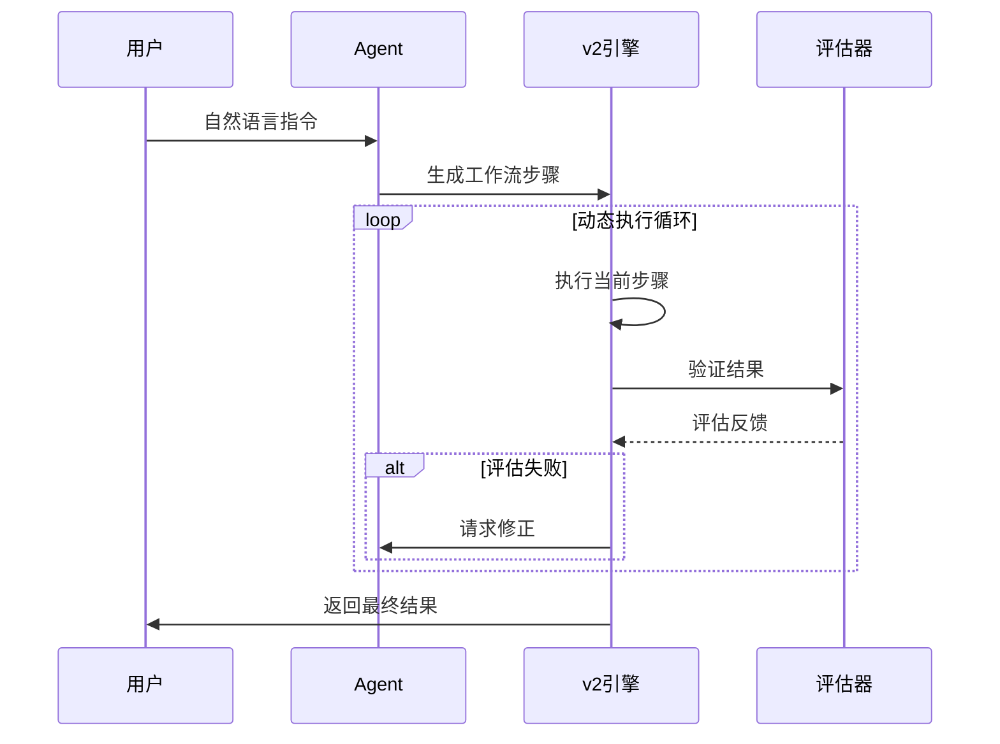
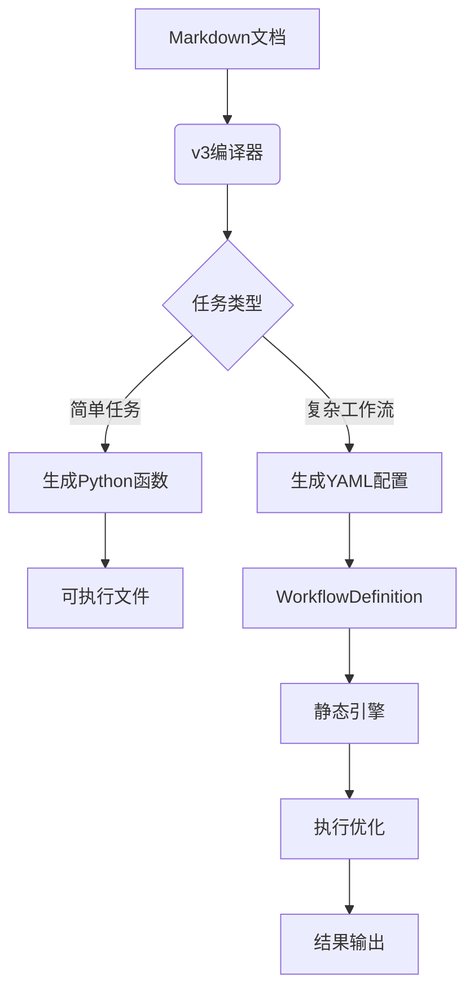
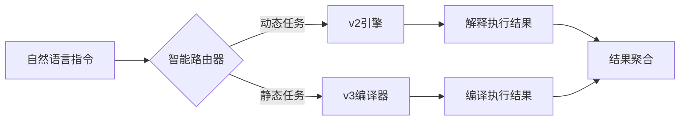

# 自然语言伪代码的执行模型：解释执行 vs 编译执行

## 一、核心概念对比
| **特性**         | 解释执行                     | 编译执行                  |
|------------------|----------------------------|--------------------------|
| **执行时机**     | 运行时动态翻译              | 预先静态编译             |
| **LLM依赖**      | 必需（运行时）              | 仅需（编译时）           |
| **性能**         | 较高延迟（100-500ms）       | 原生性能（10-50ms）      |
| **资源消耗**     | 高（维护交互状态）          | 低（独立进程）           |
| **调试支持**     | 交互式实时调试              | 需传统调试工具           |
| **输出产物**     | 自然语言结果                | 可执行文件/函数返回值    |

## 二、解释执行（动态工作流引擎v2）
### 执行流程


### 技术实现
```python
class DynamicWorkflowEngine_v2:
    @reduce_memory_decorator_compress
    def execute(self, instruction: str):
        # 步骤1: 动态生成工作流
        plan = self.plan_execution(instruction)
        
        # 步骤2: 循环执行
        while step := self.select_next_step(plan):
            result = self.execute_single_step(step)
            
            # 步骤3: 实时评估
            if not self.evaluators.evaluate(result):
                # 动态修正工作流
                self.regenerate_step(step, result)
```

### 适用场景
1. **探索性任务**：未知步骤路径的问题求解
2. **交互式调试**：需要人工干预的复杂流程
3. **实时决策**：基于最新数据的动态调整
4. **小规模任务**：步骤数 < 5 的轻量级工作流

## 三、编译执行（静态工作流引擎v3）
### 执行流程


### 技术实现
```python
class StaticWorkflowEngine_v3:
    def compile(self, markdown: str) -> str:
        # 工作流配置解析
        workflow_def = self._parse_markdown(markdown)
        
        # 生成可执行代码
        return f"""
from static_workflow import StaticEngine
engine = StaticEngine.load('''{workflow_def.to_yaml()}''')
engine.execute()
        """
    
    def execute_compiled(self, code: str):
        # 独立进程执行
        process = subprocess.run(["python", "-c", code], capture_output=True)
        return Result(process.returncode == 0, code, 
                     process.stdout, process.stderr)
```

### 适用场景
1. **标准化流程**：月度报表/定时任务
2. **高性能需求**：大数据批处理
3. **生产环境**：无LLM依赖的部署
4. **复杂工作流**：步骤数 > 10 的固定流程

## 四、双引擎混合执行模式
### 架构设计


### 混合执行用例
```markdown
# 金融风控系统
主流程:
  引擎: v3
  步骤:
    - 数据提取
    - 指标计算

异常处理:
  引擎: v2
  条件: 波动率 > 30%
  步骤: 
    1. 启动压力测试
    2. 生成应急预案
```

### 路由决策逻辑
```python
def route_engine(instruction: str) -> str:
    """自动选择执行引擎"""
    # 规则1: 包含动态关键词
    if any(keyword in instruction for keyword in ["实时", "交互", "动态"]):
        return "v2"
    
    # 规则2: 检测预定义工作流
    if "步骤:" in instruction and "id:" in instruction:
        return "v3"
    
    # 规则3: 基于步骤数决策
    step_count = instruction.count("- ")
    return "v2" if step_count <= 5 else "v3"
```

## 五、性能优化策略
### 解释执行优化
1. **增量编译**：仅重新生成变更步骤
2. **结果缓存**：哈希存储相同输入输出
3. **状态快照**：定期保存执行上下文
```python
# v2引擎优化示例
class OptimizedDynamicEngine(DynamicWorkflowEngine_v2):
    def execute_step(self, step):
        # 检查缓存
        if cached := self.cache.get(step.hash()):
            return cached
            
        # 执行并缓存
        result = super().execute_step(step)
        self.cache.set(step.hash(), result)
        return result
```

### 编译执行优化
1. **预编译字节码**：`.pyc` 文件生成
2. **并行步骤**：多核执行独立步骤
3. **资源池**：重用数据库连接等
```python
# v3引擎优化示例
class ParallelStaticEngine(StaticWorkflowEngine_v3):
    def execute(self):
        with ThreadPoolExecutor() as executor:
            # 并行执行独立步骤
            futures = {executor.submit(self.run_step, step) 
                      for step in self.independent_steps}
            
            # 处理依赖步骤
            for step in self.dependent_steps:
                wait_dependencies(step.deps)
                self.run_step(step)
```

## 六、选择指南
### 使用解释执行当：
1. 任务路径无法预先确定
2. 需要人工实时干预
3. 执行环境有LLM可用
4. 任务步骤少于5步

### 使用编译执行当：
1. 工作流固定且重复执行
2. 性能要求严苛（>1000次/秒）
3. 需要在无网络环境运行
4. 任务步骤超过10步

> **最佳实践**：开发阶段使用v2引擎快速迭代，生产环境通过v3编译器固化为静态工作流。二者通过`WorkflowDefinition`规范实现无缝转换。
