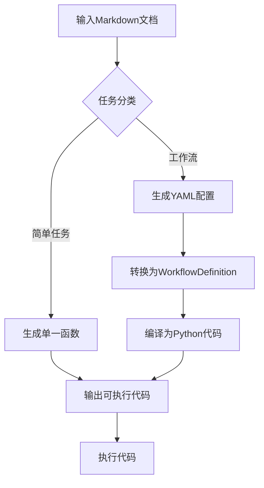

# 自然语言编译器设计方案

## 概述
自然语言编译器是一种将Markdown文档描述的任务转换为可执行Python代码的工具。它支持两种任务类型：
1. **简单任务**：生成单一Python函数
2. **复杂工作流**：生成基于WorkflowDefinition配置的完整工作流

## 核心架构


## 实现代码

```python
class NaturalLanguageCompiler:
    def __init__(self, llm: BaseChatModel):
        """
        自然语言编译器
        输入: Markdown文档
        输出: 可执行Python代码
        
        参数:
            llm: 语言模型实例
        """
        self.llm = llm
        self.agent_compiler = AgentCompiler()
        self.workflow_compiler = WorkflowCompiler()
        
        # 系统提示词模板
        self.compiler_prompt = """
        # 角色：高级自然语言编译器
        你将自然语言描述的Markdown文档转换为可执行的Python代码。
        
        ## 编译规则：
        1. 分析文档结构，识别任务类型（简单任务/工作流）
        2. 简单任务：生成单一Python函数
        3. 复杂工作流：生成基于WorkflowDefinition的配置
        4. 保留所有关键业务逻辑
        5. 添加必要的注释说明
        
        ## 输出要求：
        - 代码必须是完整可执行的
        - 包含必要的导入语句
        - 使用清晰的命名规范
        - 添加类型注解
        
        ## 输入文档：
        {markdown_content}
        """

    def classify_task(self, markdown: str) -> str:
        """
        任务分类：判断文档描述的是简单任务还是工作流
        """
        classification_prompt = f"""
        分析以下Markdown内容，判断任务类型：
        [简单任务]：单一目标，无多个步骤
        [工作流]：包含多个步骤和依赖关系
        
        Markdown内容：
        ```markdown
        {markdown[:1000]}  # 截取部分内容
        ```
        
        只需返回：'simple' 或 'workflow'
        """
        response = self.llm.invoke(classification_prompt).content
        return 'workflow' if 'workflow' in response.lower() else 'simple'

    def compile_simple_task(self, markdown: str) -> str:
        """
        编译简单任务：生成单一函数
        """
        prompt = self.compiler_prompt.format(markdown_content=markdown)
        response = self.llm.invoke(prompt).content
        
        # 提取生成的代码
        code_blocks = extract_code(response)
        return '\n\n'.join(code for _, code in code_blocks if _ == 'python')

    def compile_workflow(self, markdown: str) -> str:
        """
        编译工作流：生成WorkflowDefinition配置
        """
        # 步骤1: 生成工作流YAML配置
        yaml_generation_prompt = f"""
        将以下Markdown描述的工作流转换为YAML格式的WorkflowDefinition配置：
        
        {markdown}
        
        输出要求：
        1. 严格遵循WorkflowDefinition的schema
        2. 使用合理的步骤命名和ID
        3. 添加必要的控制流规则
        4. 包含错误处理配置
        """
        yaml_config = self.llm.invoke(yaml_generation_prompt).content
        
        # 步骤2: 将YAML转换为WorkflowDefinition对象
        workflow_def = self._yaml_to_workflow_def(yaml_config)
        
        # 步骤3: 编译为可执行代码
        return self.workflow_compiler.compile(workflow_def)

    def compile(self, markdown: str) -> str:
        """
        主编译方法
        """
        # 任务分类
        task_type = self.classify_task(markdown)
        
        if task_type == 'simple':
            return self.compile_simple_task(markdown)
        else:
            return self.compile_workflow(markdown)
    
    def compile_and_run(self, markdown: str) -> dict:
        """
        编译并立即执行生成的代码
        """
        compiled_code = self.compile(markdown)
        
        # 创建执行环境
        exec_globals = {}
        exec(compiled_code, exec_globals)
        
        # 执行入口函数
        if 'main' in exec_globals:
            return exec_globals['main']()
        elif 'run_workflow' in exec_globals:
            return exec_globals['run_workflow']()
        else:
            raise ValueError("生成的代码缺少可执行入口")

    def _yaml_to_workflow_def(self, yaml_str: str) -> WorkflowDefinition:
        """
        将YAML字符串转换为WorkflowDefinition对象
        """
        try:
            # 清理YAML字符串
            cleaned_yaml = re.sub(r'```yaml|```', '', yaml_str).strip()
            data = yaml.safe_load(cleaned_yaml)
            
            # 转换为WorkflowDefinition对象
            return WorkflowDefinition(
                metadata=WorkflowMetadata(**data['metadata']),
                steps=[WorkflowStep(**step) for step in data['steps']]
            )
        except Exception as e:
            logger.error(f"YAML转换失败: {str(e)}")
            raise CompilationError("工作流配置解析失败") from e

class CompilationError(Exception):
    """自定义编译异常"""
    pass
```

## 使用示例

### 示例1：编译简单任务
```python
# 初始化编译器
compiler = NaturalLanguageCompiler(llm=llm_claude_3_5_sonnet)

# Markdown文档
markdown_doc = """
# 数据清洗任务
清洗销售数据中的异常值：
1. 移除价格为负数的记录
2. 填充缺失的客户名称为'未知'
3. 将日期格式统一为YYYY-MM-DD
"""

# 编译并执行
result = compiler.compile_and_run(markdown_doc)
```

### 示例2：编译工作流
```python
# Markdown文档
markdown_doc = """
# 月度销售报告工作流

## 步骤：
1. **数据提取**：从数据库获取销售数据
   - 数据库：sales_db
   - 查询：SELECT * FROM sales WHERE date >= '2023-10-01'
   
2. **数据清洗**：
   - 处理缺失值
   - 移除异常值
   
3. **指标计算**：
   - 总销售额
   - 平均订单值
   - 热门产品TOP 10
   
4. **生成报告**：
   - 创建PDF报告
   - 邮件发送给管理层
   
## 控制流：
- 如果数据提取失败，重试3次
- 指标计算必须在数据清洗完成后执行
"""

# 编译并执行
result = compiler.compile_and_run(markdown_doc)
```

## 典型输出

### 简单任务输出
```python
def clean_sales_data(data: pd.DataFrame) -> pd.DataFrame:
    \"\"\"清洗销售数据\"\"\"
    # 1. 移除价格为负数的记录
    cleaned = data[data['price'] >= 0]
    
    # 2. 填充缺失的客户名称
    cleaned['customer_name'] = cleaned['customer_name'].fillna('未知')
    
    # 3. 统一日期格式
    cleaned['date'] = pd.to_datetime(cleaned['date']).dt.strftime('%Y-%m-%d')
    
    return cleaned
```

### 工作流输出
```python
from static_workflow import WorkflowDefinition, WorkflowStep

workflow_def = WorkflowDefinition(
    metadata={"name": "月度销售报告", "version": "1.0"},
    steps=[
        WorkflowStep(
            id="extract",
            name="数据提取",
            agent="db_agent",
            parameters={"query": "SELECT * FROM sales..."},
            error_handling={"retry_count": 3}
        ),
        WorkflowStep(
            id="clean",
            name="数据清洗",
            dependencies=["extract"],
            agent="data_cleaning_agent"
        ),
        WorkflowStep(
            id="metrics",
            name="指标计算",
            dependencies=["clean"],
            agent="metrics_agent"
        )
    ]
)

def run_workflow():
    engine = StaticWorkflowEngine()
    return engine.execute(workflow_def)
```

## 应用场景
1. **业务自动化**：将流程文档直接转化为可执行代码
2. **快速原型开发**：跳过编码阶段直接验证业务逻辑
3. **知识传承**：保留业务专家知识到可执行资产
4. **教育领域**：将课程案例自动转化为编程练习
5. **遗留系统迁移**：将文档化流程转换为现代工作流
