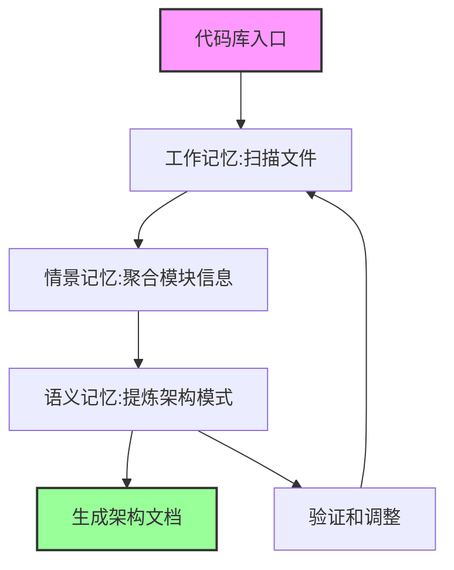

# 代码库理解与架构文档生成方法

## 1. 概述

本文档描述如何运用三层记忆管理理论，使Agent能够理解大型代码库并自动生成高质量的架构文档。

## 2. 理论映射

### 2.1 记忆层与代码理解的对应关系

| 记忆层 | 代码理解任务 | 存储内容 | 处理规模 |
|--------|-------------|---------|----------|
| 工作记忆 | 当前代码片段分析 | 函数调用栈、变量值、临时推断 | 10-100行代码 |
| 情景记忆 | 模块/组件理解 | 模块职责、接口定义、依赖关系 | 100-1000个文件 |
| 语义记忆 | 架构模式识别 | 设计模式、架构风格、领域模型 | 整个代码库 |

### 2.2 认知过程模拟



## 3. 工作记忆层：代码探索策略

### 3.1 入口点识别算法

```python
class CodeExplorer:
    def __init__(self):
        self.working_memory = WorkingMemory(capacity=7)
        self.entry_patterns = [
            # Web应用入口
            r"(main|index|app)\.(py|js|ts|java|go)$",
            r"(server|application|startup)\.(py|js|ts)$",
            
            # CLI工具入口
            r"__main__\.py$",
            r"bin/.*",
            
            # 配置文件
            r"(package|pom|build|setup)\.(json|xml|gradle|py)$"
        ]
    
    def find_entry_points(self, codebase_path):
        entries = []
        for pattern in self.entry_patterns:
            matches = self.scan_files(codebase_path, pattern)
            for match in matches:
                self.working_memory.add({
                    'type': 'entry_point',
                    'path': match,
                    'pattern': pattern,
                    'priority': self._calculate_priority(match)
                })
                entries.append(match)
        return entries
```

### 3.2 深度优先探索

```python
def trace_execution_path(self, entry_point):
    """追踪从入口点开始的执行路径"""
    stack = [entry_point]
    visited = set()
    execution_flow = []
    
    while stack and len(self.working_memory.items) < self.working_memory.capacity:
        current = stack.pop()
        if current in visited:
            continue
            
        visited.add(current)
        
        # 分析当前文件
        analysis = self.analyze_file(current)
        self.working_memory.add({
            'type': 'code_analysis',
            'file': current,
            'imports': analysis['imports'],
            'exports': analysis['exports'],
            'calls': analysis['function_calls']
        })
        
        # 添加依赖到栈
        for dep in analysis['imports']:
            if self._is_internal_dependency(dep):
                stack.append(dep)
        
        execution_flow.append({
            'file': current,
            'level': len(stack),
            'dependencies': analysis['imports']
        })
    
    return execution_flow
```

### 3.3 关键路径识别

```python
def identify_critical_paths(self):
    """识别代码库中的关键执行路径"""
    paths = {
        'request_handling': self._trace_http_handlers(),
        'data_flow': self._trace_data_pipeline(),
        'startup_sequence': self._trace_initialization(),
        'error_handling': self._trace_exception_flow()
    }
    
    # 保存到工作记忆
    for path_type, path_info in paths.items():
        self.working_memory.add({
            'type': 'critical_path',
            'category': path_type,
            'nodes': path_info
        }, trigger_type='path_discovery')
    
    return paths
```

## 4. 情景记忆层：模块理解与组织

### 4.1 模块信息聚合

```python
class ModuleAnalyzer:
    def __init__(self, episodic_memory):
        self.memory = episodic_memory
        
    def analyze_module(self, module_path):
        """深度分析一个模块/包"""
        module_info = {
            'path': module_path,
            'timestamp': datetime.now(),
            'metadata': {
                'files_count': 0,
                'total_lines': 0,
                'languages': set()
            },
            'structure': {
                'submodules': [],
                'classes': [],
                'functions': []
            },
            'interfaces': {
                'public_api': [],
                'internal_api': []
            },
            'dependencies': {
                'internal': [],
                'external': []
            },
            'patterns': []
        }
        
        # 递归分析模块内容
        self._analyze_recursively(module_path, module_info)
        
        # 识别模块模式
        module_info['patterns'] = self._identify_patterns(module_info)
        
        # 保存到情景记忆
        self.memory.store_episode({
            'event': 'module_analysis',
            'module': module_path,
            'context': module_info,
            'insights': self._generate_insights(module_info)
        })
        
        return module_info
```

### 4.2 架构决策考古

```python
def archaeological_analysis(self, repo_path):
    """从代码历史中推断架构决策"""
    decisions = []
    
    # 分析重大重构
    refactorings = self._identify_refactorings(repo_path)
    for refactor in refactorings:
        decision = {
            'type': 'refactoring',
            'date': refactor['date'],
            'before': refactor['before_structure'],
            'after': refactor['after_structure'],
            'rationale': self._infer_rationale(refactor),
            'impact': self._assess_impact(refactor)
        }
        decisions.append(decision)
    
    # 分析技术栈演进
    tech_evolution = self._trace_technology_changes(repo_path)
    for change in tech_evolution:
        decision = {
            'type': 'technology_adoption',
            'date': change['date'],
            'technology': change['tech'],
            'replaced': change.get('replaced_tech'),
            'rationale': self._infer_tech_rationale(change)
        }
        decisions.append(decision)
    
    # 保存到情景记忆
    self.memory.store_episode({
        'event': 'architecture_archaeology',
        'repository': repo_path,
        'decisions': decisions,
        'timeline': self._create_timeline(decisions)
    })
    
    return decisions
```

### 4.3 集成点映射

```python
def map_integration_points(self):
    """识别系统的所有集成点"""
    integrations = {
        'apis': self._find_api_endpoints(),
        'databases': self._find_db_connections(),
        'message_queues': self._find_mq_clients(),
        'external_services': self._find_service_calls(),
        'file_systems': self._find_file_operations(),
        'caches': self._find_cache_usage()
    }
    
    # 为每个集成点创建详细画像
    for category, points in integrations.items():
        for point in points:
            self.memory.store_episode({
                'event': 'integration_point_discovered',
                'category': category,
                'location': point['location'],
                'details': {
                    'protocol': point.get('protocol'),
                    'data_format': point.get('format'),
                    'authentication': point.get('auth_method'),
                    'error_handling': point.get('error_strategy')
                }
            })
    
    return integrations
```

## 5. 语义记忆层：架构模式提炼

### 5.1 架构风格识别

```python
class ArchitecturePatternExtractor:
    def __init__(self, semantic_memory):
        self.memory = semantic_memory
        self.known_patterns = {
            'layered': self._check_layered_architecture,
            'microservices': self._check_microservices,
            'event_driven': self._check_event_driven,
            'hexagonal': self._check_hexagonal,
            'mvc': self._check_mvc_pattern,
            'cqrs': self._check_cqrs_pattern
        }
    
    def identify_architecture_style(self, codebase_analysis):
        """识别代码库的主要架构风格"""
        scores = {}
        
        for style, checker in self.known_patterns.items():
            score, evidence = checker(codebase_analysis)
            scores[style] = {
                'confidence': score,
                'evidence': evidence
            }
        
        # 确定主导架构风格
        dominant_style = max(scores.items(), key=lambda x: x[1]['confidence'])
        
        # 存储到语义记忆
        self.memory.add_concept({
            'type': 'architecture_style',
            'name': dominant_style[0],
            'confidence': dominant_style[1]['confidence'],
            'evidence': dominant_style[1]['evidence'],
            'hybrid_elements': self._identify_hybrid_elements(scores)
        })
        
        return dominant_style
```

### 5.2 设计模式目录

```python
def extract_design_patterns(self, codebase):
    """从代码中提取使用的设计模式"""
    patterns_catalog = {}
    
    # GoF模式检测
    gof_patterns = {
        'singleton': self._find_singleton_pattern,
        'factory': self._find_factory_pattern,
        'observer': self._find_observer_pattern,
        'strategy': self._find_strategy_pattern,
        'decorator': self._find_decorator_pattern
    }
    
    for pattern_name, detector in gof_patterns.items():
        instances = detector(codebase)
        if instances:
            patterns_catalog[pattern_name] = {
                'instances': instances,
                'locations': [inst['location'] for inst in instances],
                'variations': self._analyze_variations(instances)
            }
    
    # 领域特定模式
    domain_patterns = self._extract_domain_patterns(codebase)
    patterns_catalog.update(domain_patterns)
    
    # 更新语义记忆
    self.memory.add_concept({
        'type': 'design_patterns_catalog',
        'patterns': patterns_catalog,
        'statistics': self._calculate_pattern_statistics(patterns_catalog)
    })
    
    return patterns_catalog
```

### 5.3 领域模型提取

```python
def extract_domain_model(self, codebase):
    """提取领域驱动设计的核心概念"""
    domain_model = {
        'entities': [],
        'value_objects': [],
        'aggregates': [],
        'domain_services': [],
        'domain_events': []
    }
    
    # 实体识别（有ID的业务对象）
    entities = self._identify_entities(codebase)
    for entity in entities:
        domain_model['entities'].append({
            'name': entity['name'],
            'attributes': entity['attributes'],
            'business_rules': self._extract_business_rules(entity),
            'lifecycle': self._analyze_entity_lifecycle(entity)
        })
    
    # 聚合根识别
    aggregates = self._identify_aggregate_roots(entities)
    domain_model['aggregates'] = aggregates
    
    # 领域事件识别
    events = self._identify_domain_events(codebase)
    domain_model['domain_events'] = events
    
    # 构建领域关系图
    relationships = self._build_domain_relationships(domain_model)
    
    # 存储到语义记忆
    self.memory.add_concept({
        'type': 'domain_model',
        'model': domain_model,
        'relationships': relationships,
        'ubiquitous_language': self._extract_ubiquitous_language(domain_model)
    })
    
    return domain_model
```

## 6. 记忆整合与文档生成

### 6.1 多层记忆融合

```python
class ArchitectureDocumentGenerator:
    def __init__(self, memory_layers):
        self.working_memory = memory_layers['working']
        self.episodic_memory = memory_layers['episodic']
        self.semantic_memory = memory_layers['semantic']
    
    def generate_architecture_document(self):
        """整合三层记忆生成架构文档"""
        document = {
            'metadata': self._generate_metadata(),
            'executive_summary': self._generate_summary(),
            'architecture_views': {}
        }
        
        # C4模型视图
        document['architecture_views']['context'] = self._generate_context_diagram()
        document['architecture_views']['container'] = self._generate_container_diagram()
        document['architecture_views']['component'] = self._generate_component_diagram()
        
        # 补充视图
        document['architecture_views']['deployment'] = self._generate_deployment_view()
        document['architecture_views']['data_flow'] = self._generate_data_flow_view()
        
        # 架构决策记录
        document['architecture_decisions'] = self._compile_adrs()
        
        # 质量属性
        document['quality_attributes'] = self._analyze_quality_attributes()
        
        return document
```

### 6.2 C4模型生成

```python
def _generate_context_diagram(self):
    """生成系统上下文图"""
    # 从语义记忆获取系统边界
    system_boundary = self.semantic_memory.recall('system_boundary')
    
    # 从情景记忆获取外部系统
    external_systems = self.episodic_memory.query('integration_points')
    
    context = {
        'system': {
            'name': system_boundary['name'],
            'description': system_boundary['description'],
            'responsibilities': system_boundary['responsibilities']
        },
        'actors': self._identify_actors(),
        'external_systems': [
            {
                'name': sys['name'],
                'description': sys['description'],
                'interactions': sys['interactions']
            }
            for sys in external_systems
        ]
    }
    
    return context

def _generate_container_diagram(self):
    """生成容器图"""
    # 从情景记忆获取主要模块
    modules = self.episodic_memory.query('module_analysis')
    
    containers = []
    for module in modules:
        if self._is_container_level(module):
            containers.append({
                'name': module['name'],
                'technology': self._extract_technology(module),
                'responsibilities': module['insights']['main_responsibility'],
                'interfaces': module['interfaces']['public_api'],
                'dependencies': module['dependencies']
            })
    
    # 添加数据存储
    datastores = self._identify_datastores()
    containers.extend(datastores)
    
    return {
        'containers': containers,
        'relationships': self._analyze_container_relationships(containers)
    }
```

### 6.3 架构决策记录（ADR）生成

```python
def _compile_adrs(self):
    """编译架构决策记录"""
    adrs = []
    
    # 从情景记忆提取历史决策
    historical_decisions = self.episodic_memory.query('architecture_archaeology')
    
    for decision in historical_decisions:
        adr = {
            'id': f"ADR-{len(adrs) + 1:03d}",
            'title': self._generate_adr_title(decision),
            'status': 'Accepted',
            'context': decision['context'],
            'decision': decision['rationale'],
            'consequences': {
                'positive': decision['impact']['benefits'],
                'negative': decision['impact']['drawbacks']
            },
            'alternatives_considered': self._infer_alternatives(decision)
        }
        adrs.append(adr)
    
    # 从语义记忆添加架构原则
    principles = self.semantic_memory.recall('architecture_principles')
    for principle in principles:
        adr = {
            'id': f"ADR-{len(adrs) + 1:03d}",
            'title': f"Architecture Principle: {principle['name']}",
            'status': 'Accepted',
            'context': principle['rationale'],
            'decision': principle['statement'],
            'consequences': principle['implications']
        }
        adrs.append(adr)
    
    return adrs
```

## 7. 实施流程

### 7.1 五阶段理解流程

```python
class CodebaseUnderstandingPipeline:
    def __init__(self):
        self.phases = {
            'phase1': self.scanning_and_indexing,
            'phase2': self.critical_path_exploration,
            'phase3': self.module_deep_analysis,
            'phase4': self.pattern_recognition,
            'phase5': self.document_generation
        }
    
    def execute(self, codebase_path):
        """执行完整的代码库理解流程"""
        results = {}
        
        # Phase 1: 扫描和建立索引
        print("Phase 1: Scanning and Indexing...")
        index = self.scanning_and_indexing(codebase_path)
        results['index'] = index
        
        # Phase 2: 关键路径探索
        print("Phase 2: Critical Path Exploration...")
        paths = self.critical_path_exploration(index)
        results['critical_paths'] = paths
        
        # Phase 3: 模块深度分析
        print("Phase 3: Module Deep Analysis...")
        modules = self.module_deep_analysis(index, paths)
        results['modules'] = modules
        
        # Phase 4: 架构模式识别
        print("Phase 4: Architecture Pattern Recognition...")
        patterns = self.pattern_recognition(modules)
        results['patterns'] = patterns
        
        # Phase 5: 文档生成
        print("Phase 5: Document Generation...")
        document = self.document_generation(results)
        
        return document
```

### 7.2 增量理解策略

```python
def incremental_understanding(self, codebase_path, previous_analysis=None):
    """支持增量理解，避免重复分析"""
    if previous_analysis:
        # 加载之前的记忆状态
        self.load_memory_state(previous_analysis)
        
        # 检测变更
        changes = self.detect_changes(codebase_path, previous_analysis['timestamp'])
        
        # 仅分析变更部分
        if changes['files_modified']:
            self.update_working_memory(changes)
            affected_modules = self.identify_affected_modules(changes)
            self.update_episodic_memory(affected_modules)
            
            # 重新评估架构模式
            if self.significant_changes(changes):
                self.update_semantic_memory()
    else:
        # 全新分析
        return self.execute(codebase_path)
```

## 8. 输出示例

### 8.1 架构摘要

```markdown
# 系统架构文档

## 执行摘要

**系统名称**: E-Commerce Platform
**架构风格**: 微服务架构（置信度: 85%）+ 事件驱动（置信度: 70%）
**技术栈**: Node.js, React, PostgreSQL, Redis, RabbitMQ
**规模**: 156个模块, 45,230 LOC

## 关键发现

1. **领域划分清晰**: 识别出5个边界上下文（用户、商品、订单、支付、物流）
2. **异步通信为主**: 80%的服务间通信使用消息队列
3. **数据一致性策略**: 采用Saga模式处理分布式事务
4. **性能优化充分**: 3层缓存策略（CDN、Redis、应用层）
```

### 8.2 架构决策记录示例

```markdown
## ADR-001: 采用微服务架构

**状态**: 已接受
**日期**: 2023-03-15（从代码历史推断）

**背景**: 
- 单体应用达到15万行代码，部署时间超过30分钟
- 团队规模扩展到5个小组，代码冲突频繁
- 不同模块的扩展需求差异很大

**决策**:
将单体应用拆分为基于领域边界的微服务

**后果**:
✓ 团队可以独立开发和部署
✓ 服务可以独立扩展
✗ 增加了运维复杂度
✗ 需要处理分布式事务
```

## 9. 总结

通过应用三层记忆管理理论，Agent能够：

1. **系统化理解**：从代码细节到架构全局的完整认知
2. **知识积累**：将理解过程中的发现转化为可复用的知识
3. **持续学习**：支持增量分析，不断完善对代码库的理解
4. **高质量输出**：生成专业的架构文档，包含多个视角和充分的决策依据

这种方法让Agent能像经验丰富的架构师一样，快速理解并文档化大型代码库的架构。