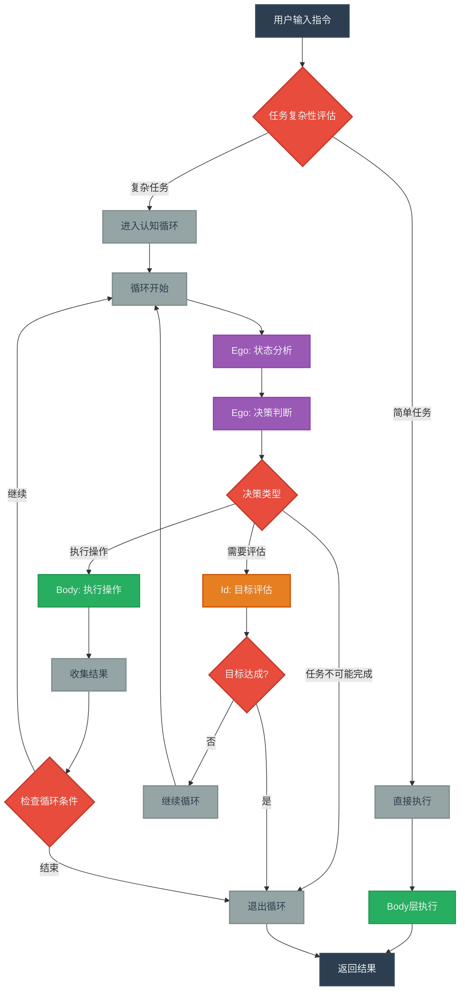
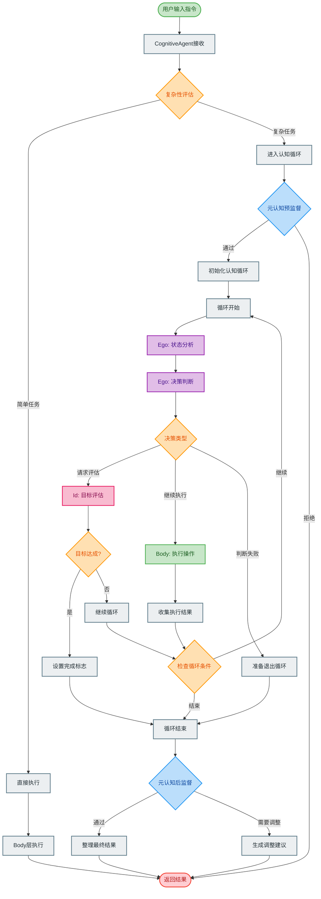
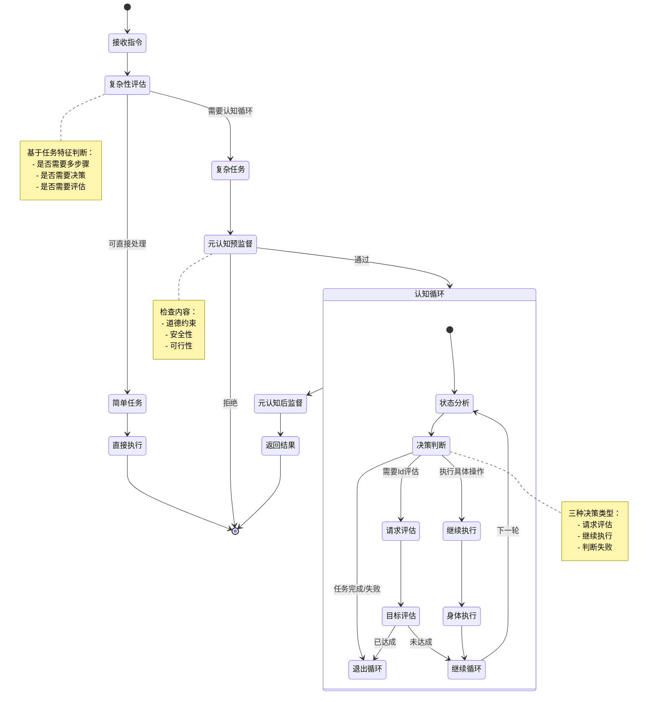
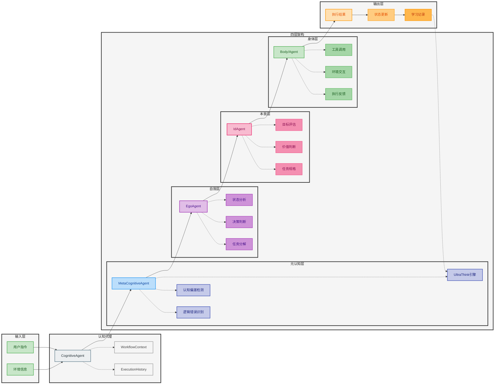
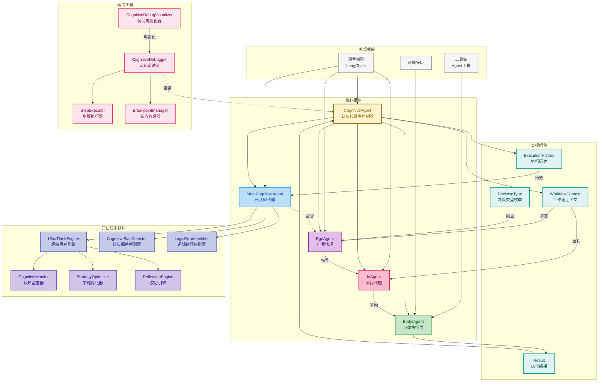
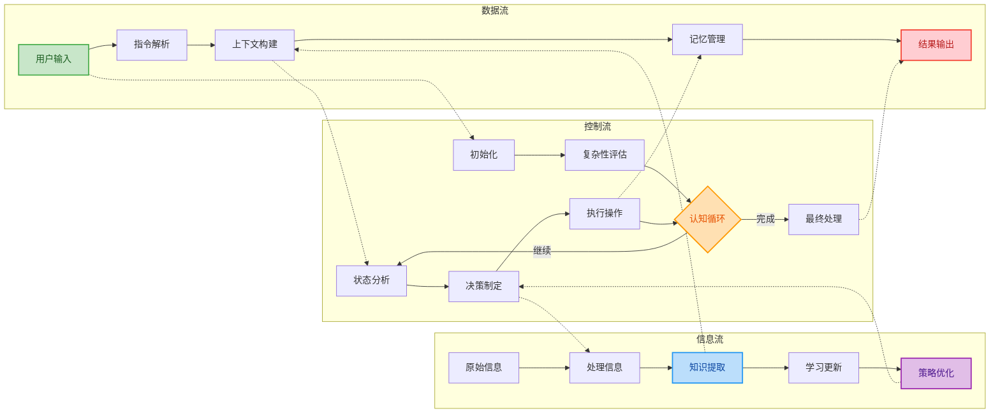
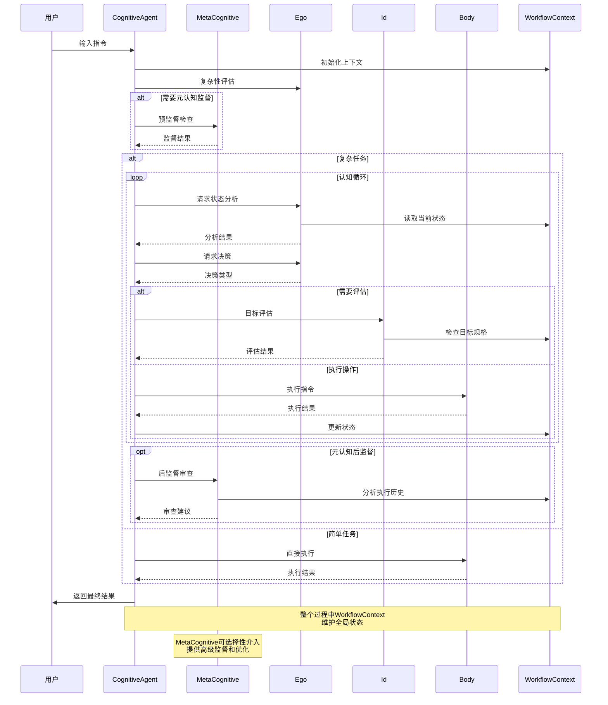

# 具身认知工作流技术实现架构文档

## 概述

具身认知工作流（Embodied Cognitive Workflow）是一个基于认知科学和人工智能理论的智能代理系统架构。该系统通过模拟人类认知过程的分层结构，实现了高效的任务处理和决策制定。

## 核心组件

### 四大组件

系统包含四个核心组件：

1. **元认知（MetaCognitive）** - 高级认知控制中心
2. **自我（Ego）** - 执行控制层
3. **本我（Id）** - 基本驱动和响应
4. **身体（Body）** - Agent的具体执行环境

### 核心原理

#### 1. Agent二元性（Agent Duality）
每个agent都具有双重性质：既是工具也是认知主体。

#### 2. Agent相对性（Agent Relativity）
Agent的状态和行为都是相对的，取决于其所在的mind和tool环境。

#### 3. Agent自相似性（Agent Self-Similarity）
系统具有分形特性，不同层次的agent都遵循相似的模式。

#### 4. 本体屏蔽（Ontological Shielding）
通过抽象层保护agent不受底层复杂性的影响。

## 技术实现

### CognitiveAgent（认知代理）

**文件名**: `embodied_cognitive_workflow.py`

**主要功能**:
- 管理整体认知流程
- 协调各子系统
- 处理高级决策
- 维护系统状态

**关键方法**:
- 初始化各个子系统
- 执行工作流程
- 状态管理

### EgoAgent（自我代理）

**文件名**: `ego_agent.py`

**主要功能**:
- 任务分解和调度
- 执行控制和监督
- 错误处理和恢复
- Id层的管理和协调

**核心特性**:
- 智能任务分解
- 动态执行调度
- 容错机制

### IdAgent（本我代理）

**文件名**: `id_agent.py`

**主要功能**:
- 处理底层工具调用
- 基本响应
- 状态反馈
- 执行具体操作

**工具集成**:
- 支持多种工具类型
- 统一的工具接口
- 自动错误处理

### MetaCognitiveAgent（元认知代理）

**文件名**: `meta_cognitive_agent.py`

**核心职责**:
- 高级策略制定
- 目标设定和调整
- 反思和学习
- 全局优化和控制
- UltraThink高级认知能力

**特性**:
- 战略思考
- 自我反思和学习
- 全局优化

### Body（身体层）

**说明**: 通过底层Agent或工具实现（如`python_core.py`）

**职责**:
- 执行具体的agent操作
- 提供环境接口
- 维护执行状态
- 执行实际的工具调用

## 工作流程

### 认知流程

#### 1. 输入处理阶段
- **功能**: 接收agent请求和环境信息
- **组件**: 主要由元认知层处理
- **输出**: 处理后的任务和目标

#### 2. 决策执行阶段
- **功能**: agent制定具体执行计划
- **组件**: 主要由Ego负责
- **输出**: 具体的执行步骤和资源分配

### 状态管理

**核心理念**:
- 通过抽象层保护系统复杂性
- 使用统一schema管理状态
- 支持动态状态更新
- 保证系统一致性

**实现机制**:
1. 定义清晰的状态模型
2. 状态变更的事务处理
3. 状态一致性检查
4. 错误状态的恢复机制

## 关键特性

### 协调机制

**功能**:
- 多agent协调
- 动态任务调度
- 资源管理
- 冲突解决

**实现流程**:
1. Ego任务分解
2. 工作流程规划
3. Body层执行
4. Id状态反馈
5. 结果整合

### 优化

#### 1. 性能优化
- **文件**: `optimized_llm_loader.py`
- **作用**: 优化大语言模型加载和推理性能

#### 2. 元认知优化
- **文件**: `embodied_cognitive_workflow_optimized.py`
- **作用**: 战略思考优化

#### 3. 模型集成
- 支持Gemini、DeepSeek等多种LLM
- 异步模型调用
- 一致性保证

### 调试

#### 核心工具
- **核心模块**: `cognitive_debugger.py`
- **主要功能**:
  - 追踪工作流状态
  - 分析性能指标
  - 错误诊断
  - 系统监控

#### 可视化
- **文件**: `cognitive_debug_visualizer.py`
- **功能**: 可视化认知过程和数据流

## 预定义工具

### 集成第三方Agent

#### Claude Code工具Agent
- **文件**: `predefined_agent/claude_code_tool.py`
- **功能**: 集成Claude Code工具
- **用途**: 代码生成

#### Aider工具Agent
- **文件**: `predefined_agent/aider_tool.py`
- **功能**: 集成Aider工具
- **用途**: 代码自动化编辑

### 扩展能力

**扩展机制**:
- 通过插件系统扩展新工具
- 统一的工具接口规范
- 灵活的配置机制
- 动态工具加载和卸载
- 工具间的互操作性

## 系统架构图

### 整体架构

```
用户输入 → CognitiveAgent
    ↓
MetaCognitive（战略思考）
    ↓
Ego（任务分解和调度）
    ↓
Id（基本响应）
    ↓
Body（具体执行）
    ↓
结果输出
```

### 数据流

**WorkflowContext管理**:
- 全局状态
- 任务队列
- 执行历史
- 系统配置

## 执行指令流程图

### 简化版执行流程



### 详细执行流程



### 认知循环决策流程



### 四层架构交互流程



## 核心组件关系图

### 组件依赖关系



### 数据流与控制流



### 模块交互时序



## 技术优势

### 预定义工具
- 支持Body层agent
- 统一的agent接口标准
- 模块化设计

### 执行能力
- 支持认知流程的灵活配置
- 全局工作流状态管理
- 智能任务分解

### 性能
- 优化的LLM加载机制
- 异步处理能力
- 内存管理优化

### 可扩展性
- 插件化的工具系统
- 模块化的架构设计
- 可配置的认知流程

### 容错性
- 多层次调试机制
- 智能错误恢复
- 灵活的降级策略

## 应用场景

### 1. 代码生成和优化
**能力**:
- 智能代码生成
- 代码优化
- 执行结果验证

### 2. 工作流程自动化
**适用**:
- LLM-Python 工具链整合
- 复杂任务自动化
- 流程编排

### 3. 可视化分析
**用途**:
- 认知过程可视化
- 性能分析和优化
- 错误诊断

### 4. 基本驱动响应
**功能**:
- Id层的智能响应
- 基本操作处理
- 状态反馈

### 5. 高级认知控制
**能力**:
- 基于元认知的高级策略
- 战略思考控制
- 复杂决策支持

## 部署配置

### 基础配置
- **环境依赖**: 支持多种认知框架
- **模型配置**: 灵活模型切换
- **资源管理**: 智能资源分配

### 高级配置
- **agent个性化配置**: 可自定义认知模式
- **工具集成配置**: 灵活的工具管理
- **性能调优**: 针对不同场景优化

## 使用指南

### 快速开始
1. **agent初始化**:
   - 配置认知参数
   - 工具集成
   - 环境准备

2. **工作流程配置**:
   - 定义认知流程
   - 配置执行策略
   - 设置监控规则

3. **执行和监控**:
   - 启动认知流程
   - 实时监控
   - 结果分析

4. **优化和调试**:
   - Agent认知模式调优
   - 性能优化
   - 问题诊断

5. **扩展和定制**:
   - 自定义工具扩展
   - 认知模式定制
   - 业务逻辑集成

### 最佳实践
- 认知流程设计
- 异步处理优化
- 状态管理最佳实践
- 错误处理策略

## 总结

具身认知工作流是一个综合性的认知智能系统，通过模拟人类认知过程来实现智能代理的协调和执行。系统具有高度的可扩展性和灵活性，能够适应不同的应用场景和需求。该架构的核心优势在于其分层的认知结构和统一的接口设计，使得系统既能处理复杂的战略思考，又能执行具体的操作任务。