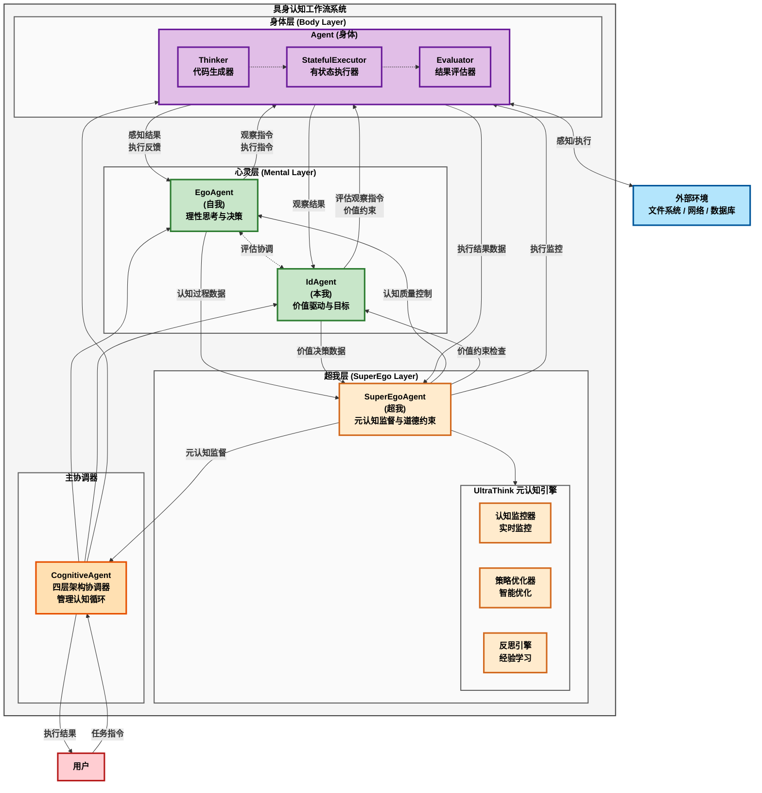
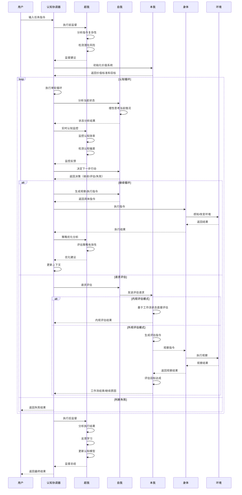
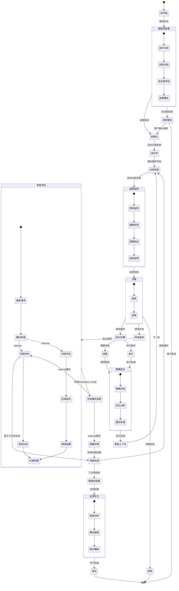

# 具身认知工作流技术实现架构文档

## 1. 概述

具身认知工作流（Embodied Cognitive Workflow）是AgentFrameWork项目中最新的认知架构实现，基于具身认知理论，现已升级为四层认知架构系统。该系统将大语言模型映射为"数字心灵"（包括超我、自我、本我三层），Python解释器映射为"数字身体"，通过四层协调实现智能体的自主认知循环和元认知监督。

## 2. 系统架构

### 2.1 四层认知架构图



### 2.2 核心组件

#### 2.2.1 SuperEgoAgent（超我智能体）

**文件位置**: `super_ego_agent.py`

**核心职责**:
- 元认知监督和认知质量控制
- 认知偏差检测和逻辑验证
- 道德引导和价值约束
- UltraThink元认知能力

**关键属性**:
```python
- llm: BaseChatModel                    # 语言模型
- bias_detector: CognitiveBiasDetector  # 偏差检测器
- logic_identifier: LogicErrorIdentifier # 逻辑验证器
- consistency_checker: ConsistencyChecker # 一致性检查器
- moral_compass: MoralCompass           # 道德指南针
- ultra_think: UltraThinkEngine         # 元认知引擎
- cognitive_monitor: CognitiveMonitor   # 认知监控器
- strategy_optimizer: StrategyOptimizer # 策略优化器
- reflection_engine: ReflectionEngine   # 反思引擎
- supervision_history: List             # 监督历史
- supervision_metrics: Dict             # 监督指标
```

**核心方法**:
```python
- supervise_cognitive_process(reasoning_text, context, goals, actions) -> Dict
  # 执行基础认知监督，检测偏差和逻辑错误

- comprehensive_cognitive_supervision(cognitive_data, context, goals) -> Dict
  # 综合认知监督，整合所有监督能力

- meta_cognitive_analysis(process_data, performance_metrics, context, goals) -> Dict
  # 元认知分析，使用UltraThink引擎

- reflect_and_learn(experience_data, outcome) -> Dict
  # 反思学习，从经验中提取模式

- assess_cognitive_health() -> CognitiveHealthAssessment
  # 评估整体认知健康状况

- start_cognitive_monitoring() / stop_cognitive_monitoring()
  # 启动/停止实时认知监控
```

#### 2.2.2 CognitiveAgent（四层架构协调器）

**文件位置**: `embodied_cognitive_workflow.py`

**核心职责**:
- 协调四层认知架构（超我+自我+本我+身体）的交互
- 管理认知循环的执行流程
- 集成超我监督能力
- 实现增量式规划的动态认知机制

**关键属性**:
```python
- llm: BaseChatModel           # 语言模型
- body: Agent                  # 身体层Agent实例
- ego: EgoAgent               # 自我智能体
- id_agent: IdAgent           # 本我智能体
- super_ego: SuperEgoAgent    # 超我智能体（新增）
- enable_super_ego: bool      # 是否启用超我监督
- evaluation_mode: str        # 评估模式: "internal"/"external"/"auto"
- max_cycles: int             # 最大循环次数
- current_cycle_count: int    # 当前循环计数
- _status: WorkflowStatus     # 工作流状态枚举
- workflow_status: str        # 工作流状态字符串（向后兼容）
- execution_history: list     # 执行历史
```

**新增数据类**:
```python
@dataclass
class CycleOutcome:
    """单轮认知循环的执行结果"""
    continue_workflow: bool              # 是否继续工作流
    cycle_data: Optional[str] = None    # 本轮循环产生的数据
    final_result: Optional[Result] = None  # 如果工作流结束，包含最终结果
    decision_type: Optional[DecisionType] = None  # 本轮的决策类型
```

**核心方法**:
```python
- execute_sync(instruction: str) -> Result
  # 同步执行认知循环，集成超我监督

- execute_stream(instruction: str) -> Iterator[object]
  # 流式执行认知循环

- _super_ego_pre_supervision(instruction: str)
  # 超我执行前监督

- _super_ego_post_supervision(instruction: str, result: Result)
  # 超我执行后监督和反思学习

- get_super_ego_state() -> Dict[str, Any]
  # 获取超我状态信息

- enable_super_ego_monitoring() / disable_super_ego_monitoring()
  # 启用/禁用超我监控

- _execute_single_cycle(context: WorkflowContext) -> CycleOutcome
  # 执行单轮认知循环，返回循环结果

- _execute_main_loop(context: WorkflowContext) -> Result
  # 执行主循环，管理多轮认知循环

- _handle_evaluation_request(context: WorkflowContext) -> CycleOutcome
  # 处理自我的评估请求（参数优化）

- _handle_judgment_failed(context: WorkflowContext) -> CycleOutcome
  # 处理判断失败情况

- _handle_continue_cycle(context: WorkflowContext) -> CycleOutcome
  # 处理继续循环情况
```

#### 2.2.3 EgoAgent（自我智能体）

**文件位置**: `ego_agent.py`

**核心职责**:
- 理性思考和决策
- 分析当前状态
- 生成观察和执行指令
- 与本我协调评估

**继承关系**: 继承自 `AgentBase`

**关键方法**:
```python
- analyze_current_state(context: str) -> str
  # 分析当前状态和情况

- decide_next_action(state_analysis: str) -> Literal["继续循环", "请求评估", "判断失败"]
  # 决定下一步行动方向

- request_id_evaluation(current_state: str) -> str
  # 请求本我进行评估

- generate_observation_instruction(thinking_result: str) -> str
  # 生成观察指令

- generate_execution_instruction(perception_result: str) -> str
  # 生成执行指令

- handle_execution_error(error_info: str, original_instruction: str) -> str
  # 处理执行错误
```

#### 2.2.4 IdAgent（本我智能体）

**文件位置**: `id_agent.py`

**核心职责**:
- 价值驱动和目标设定
- 响应评估请求
- 判断目标达成情况
- 维护价值标准

**继承关系**: 继承自 `AgentBase`

**关键属性**:
```python
- llm: BaseChatModel                    # 语言模型
- system_message: str                   # 系统消息
- evaluation_mode: str                  # 评估模式: "internal"/"external"/"auto"
- value_system: Dict                    # 价值系统存储
- goal_cache: Dict                      # 目标缓存
```

**关键方法**:
```python
- initialize_value_system(instruction: str) -> str
  # 初始化价值系统，设定目标和标准

- generate_evaluation_instruction(evaluation_request: str) -> str
  # 生成评估观察指令

- evaluate_goal_achievement(observation_result: str) -> str
  # 评估目标是否达成

- _internal_evaluation(evaluation_request: str, current_state: str) -> str
  # 内观评估方法，基于工作流状态直接评估

- evaluate_with_context(evaluation_request: str, context: str) -> str
  # 统一评估入口，根据evaluation_mode选择内观或外观

- get_current_goal() -> str
  # 获取当前目标描述

- get_value_standard() -> str
  # 获取价值标准

- adjust_value_standard(adjustment_description: str) -> str
  # 调整价值标准
```

#### 2.2.5 Agent（身体层）

**文件位置**: `../pythonTask.py`

**核心职责**:
- 执行自然语言指令
- 提供感知和执行能力
- 维护执行环境状态

**关键组件**:
- **Thinker**: 将自然语言转换为Python代码
- **StatefulExecutor**: 有状态的Python执行环境
- **Evaluator**: 评估执行结果

#### 2.2.6 UltraThink元认知引擎组件

##### CognitiveMonitor（认知监控器）
**核心功能**:
- 实时监控认知状态和性能指标
- 检测认知异常和效率问题
- 生成警报和优化建议

##### StrategyOptimizer（策略优化器）
**核心功能**:
- 分析当前认知策略的有效性
- 提供策略优化建议
- 维护策略性能历史记录
- 智能推荐最佳策略

##### ReflectionEngine（反思引擎）
**核心功能**:
- 对认知经验进行深度反思
- 提取可复用的认知模式
- 生成学习洞察和改进建议
- 积累认知经验知识库

##### 认知偏差检测系统
**支持的偏差类型**:
- 确认偏差（Confirmation Bias）
- 锚定偏差（Anchoring Bias）
- 可得性启发（Availability Heuristic）
- 过度自信偏差（Overconfidence Bias）

##### 逻辑错误识别系统
**支持的错误类型**:
- 循环论证（Circular Reasoning）
- 虚假二分法（False Dichotomy）
- 人身攻击（Ad Hominem）
- 稻草人谬误（Strawman Fallacy）

## 3. 认知循环流程

### 3.1 四层架构工作流程序列图



### 3.2 四层架构状态转换图



## 4. 关键技术实现

### 4.1 内观评估机制

**内观评估（Internal Evaluation）**是本我智能体的核心创新，通过直接基于工作流状态进行评估，避免了传统外观评估的额外开销。

**评估模式对比**:
```python
# 内观评估模式 (evaluation_mode="internal")
def _internal_evaluation(self, evaluation_request: str, current_state: str) -> str:
    """
    内观评估：直接基于工作流当前状态进行目标达成判断
    
    优势：
    - 无需额外的观察步骤
    - 减少LLM调用次数
    - 基于完整的工作流状态信息
    - 更快的响应时间
    """
    prompt = f"""
    作为本我智能体，你需要基于当前工作流状态进行内观评估。
    
    评估请求：{evaluation_request}
    
    当前工作流状态：
    {current_state}
    
    请基于以上信息直接判断目标是否达成，使用以下JSON格式返回：
    {{
        "目标是否达成": true/false,
        "达成原因": "具体原因",
        "未达成原因": "具体原因",
        "建议": "下一步建议"
    }}
    """
    
    result = self.chat_sync(prompt, response_format={"type": "json_object"})
    return result.return_value

# 外观评估模式 (evaluation_mode="external") 
def evaluate_goal_achievement(self, observation_result: str) -> str:
    """
    外观评估：基于外部观察结果判断目标达成
    
    特点：
    - 需要额外的观察步骤
    - 基于外部环境的观察结果
    - 传统的评估方式
    """
    # 传统实现...
```

**统一评估入口**:
```python
def evaluate_with_context(self, evaluation_request: str, context: str) -> str:
    """
    统一的评估入口，根据evaluation_mode自动选择评估方式
    """
    if self.evaluation_mode == "internal":
        return self._internal_evaluation(evaluation_request, context)
    elif self.evaluation_mode == "external":
        # 外观评估需要通过观察指令
        evaluation_instruction = self.generate_evaluation_instruction(evaluation_request)
        # 这里需要协调器来执行观察
        return f"需要外部观察: {evaluation_instruction}"
    elif self.evaluation_mode == "auto":
        # 自动模式：根据上下文复杂度选择
        return self._auto_select_evaluation_mode(evaluation_request, context)
    else:
        raise ValueError(f"不支持的评估模式: {self.evaluation_mode}")
```

**性能优化效果**:
- **减少LLM调用**: 内观评估无需额外的观察步骤，减少约33%的LLM调用
- **提高响应速度**: 直接基于工作流状态，避免了观察-评估的两步流程
- **更准确的评估**: 基于完整的工作流上下文，而非局部观察结果
- **简化协调逻辑**: 减少了协调器的复杂性

### 4.2 超我监督机制

**执行前监督**:
```python
def _super_ego_pre_supervision(self, instruction: str):
    # 分析指令复杂性和潜在风险
    cognitive_data = {
        'instruction': instruction,
        'timestamp': time.time(),
        'mode': 'pre_execution'
    }
    
    # 执行综合认知监督
    supervision_result = self.super_ego.comprehensive_cognitive_supervision(
        cognitive_data=cognitive_data,
        context={'phase': 'pre_execution', 'instruction': instruction},
        goals=[f"安全执行指令: {instruction}"]
    )
    
    # 处理监督建议
    if supervision_result.get('overall_assessment'):
        assessment = supervision_result['overall_assessment']
        if assessment.get('cognitive_health_level') == 'critical':
            self.logger.warning("检测到认知健康严重问题")
```

**执行后监督和反思学习**:
```python
def _super_ego_post_supervision(self, instruction: str, result: Result):
    # 分析执行结果
    cognitive_data = {
        'instruction': instruction,
        'result_success': result.success,
        'efficiency': 0.8 if result.success else 0.3,
        'error_rate': 0.0 if result.success else 1.0
    }
    
    # 进行反思学习
    experience_data = {
        'instruction': instruction,
        'success': result.success
    }
    
    reflection_result = self.super_ego.reflect_and_learn(experience_data, outcome)
```

**UltraThink元认知分析**:
```python
# 元认知监控
monitoring_result = self.ultra_think.monitor_cognitive_process(
    process_data, performance_metrics
)

# 策略调节
regulation_result = self.ultra_think.regulate_cognitive_strategy(
    context, goals
)

# 元学习
learning_result = self.ultra_think.meta_learn_from_experience(experiences)
```

### 4.2 心身接口机制

**自然语言指令生成**:
```python
# 自我生成观察指令
def generate_observation_instruction(self, thinking_result: str) -> str:
    message = f"""基于以下思考结果，生成一个观察指令：
    
    思考结果：
    {thinking_result}
    
    生成一个具体的观察指令，告诉身体需要了解什么信息。
    """
    result = self.chat_sync(message)
    return result.return_value

# 身体理解并执行
def chat_sync(self, message: str) -> Result:
    # Agent类自动将自然语言转换为适当的感知或对话操作
    return super().chat_sync(message)
```

### 4.3 评估协调机制

**自我-本我协调流程**:
```python
# 1. 自我请求评估（使用context中的current_state）
evaluation_request = self.ego.request_id_evaluation(context.current_state)

# 2. 根据评估模式选择不同的评估路径
if self.id_agent.evaluation_mode == "internal":
    # 内观评估模式：直接基于工作流状态评估
    self._log("使用内观评估模式")
    evaluation_json = self.id_agent.evaluate_with_context(
        evaluation_request, 
        context.current_state
    )
else:
    # 外观评估模式：传统的观察-评估流程
    self._log("使用外观评估模式")
    # 2a. 本我生成评估指令
    evaluation_instruction = self.id_agent.generate_evaluation_instruction(evaluation_request)
    
    # 2b. 身体执行观察
    observation_result = self.body.execute_sync(evaluation_instruction)
    
    # 2c. 本我评估结果
    evaluation_json = self.id_agent.evaluate_goal_achievement(observation_result.return_value)

# 3. 解析评估结果并返回CycleOutcome
evaluation_data = json.loads(evaluation_json)
goal_achieved = evaluation_data.get("目标是否达成", False)

if goal_achieved:
    return CycleOutcome(
        continue_workflow=False,
        final_result=Result(...),
        decision_type=DecisionType.REQUEST_EVALUATION
    )
else:
    return CycleOutcome(
        continue_workflow=True,
        cycle_data=f"评估结果：{reason}",
        decision_type=DecisionType.REQUEST_EVALUATION
    )
```

### 4.4 动态决策机制

**自我的三种决策**:
```python
def decide_next_action(self, state_analysis: str) -> Literal["继续循环", "请求评估", "判断失败"]:
    # 基于状态分析，动态决定：
    # - "继续循环": 还有明确的下一步
    # - "请求评估": 可能达到目标，需要确认
    # - "判断失败": 目标无法达成
```

**决策执行机制（优化后）**:
```python
def _execute_single_cycle(self, context: WorkflowContext) -> CycleOutcome:
    # 分析状态
    self._analyze_current_state(context)
    
    # 做出决策
    decision = self._make_decision(context.current_state)
    
    # 直接在此方法中处理决策，无需额外的_execute_decision方法
    if decision == DecisionType.REQUEST_EVALUATION:
        return self._handle_evaluation_request(context)
    elif decision == DecisionType.JUDGMENT_FAILED:
        return self._handle_judgment_failed(context)
    elif decision == DecisionType.CONTINUE_CYCLE:
        return self._handle_continue_cycle(context)
```

### 4.5 内观评估配置

**评估模式配置**:
```python
# 创建使用内观评估的认知智能体
cognitive_agent = CognitiveAgent(
    llm=llm,
    evaluation_mode="internal",  # 设置为内观评估模式
    enable_super_ego=True,
    max_cycles=10,
    verbose=True
)

# 动态切换评估模式
cognitive_agent.id_agent.evaluation_mode = "external"  # 切换到外观评估
cognitive_agent.id_agent.evaluation_mode = "auto"     # 切换到自动模式
```

**评估模式选择指南**:
```python
def choose_evaluation_mode(task_type: str, complexity: str) -> str:
    """
    根据任务类型和复杂度选择合适的评估模式
    """
    if task_type == "code_generation" and complexity == "simple":
        return "internal"  # 代码生成任务，工作流状态足够判断
    elif task_type == "file_analysis" and complexity == "complex":
        return "external"  # 文件分析需要外部观察
    elif task_type == "calculation":
        return "internal"  # 计算任务，内观评估更高效
    else:
        return "auto"  # 默认自动选择
```

### 4.6 记忆管理

**多层记忆系统**:
```python
# 1. 工作记忆（AgentBase继承）
- 对话历史
- 当前任务上下文
- 临时状态信息

# 2. 知识库加载
def load_knowledge(self, knowledge: str):
    self.ego.loadKnowledge(knowledge)
    self.id_agent.loadKnowledge(knowledge)
    self.body.loadKnowledge(knowledge)

# 3. 执行状态（StatefulExecutor）
- Python变量状态
- 导入的模块
- 执行历史
```

## 5. 配置与扩展

### 5.1 四层架构初始化配置

```python
# 创建具有超我监督的认知智能体
cognitive_agent = CognitiveAgent(
    llm=llm,
    body_config={
        # Agent配置参数
        "system_message": "自定义系统提示",
        "max_retries": 3
    },
    ego_config={
        # 自我配置参数
        "system_message": "自定义自我提示"
    },
    id_config={
        # 本我配置参数
        "system_message": "自定义本我提示"
    },
    super_ego_config={
        # 超我配置参数
        "enable_bias_detection": True,
        "enable_logic_validation": True,
        "enable_consistency_check": True,
        "enable_moral_guidance": True,
        "enable_ultra_think": True
    },
    enable_super_ego=True,  # 启用超我监督
    max_cycles=50,          # 最大循环次数
    verbose=True            # 详细日志输出
)

# 或者单独创建超我智能体
super_ego = SuperEgoAgent(
    llm=llm,
    enable_bias_detection=True,
    enable_logic_validation=True,
    enable_consistency_check=True,
    enable_moral_guidance=True,
    enable_ultra_think=True
)
```

### 5.2 扩展能力

**加载Python模块**:
```python
workflow.load_python_modules(['numpy', 'pandas', 'matplotlib'])
```

**加载领域知识**:
```python
workflow.load_knowledge("领域特定知识和规则...")
```

## 6. 使用示例

### 6.1 四层架构基本使用

```python
from embodied_cognitive_workflow import CognitiveAgent
from langchain_openai import ChatOpenAI

# 创建LLM
llm = ChatOpenAI(model="gpt-4", temperature=0)

# 创建四层认知智能体（默认启用超我监督）
cognitive_agent = CognitiveAgent(
    llm=llm,
    enable_super_ego=True,
    evaluation_mode="internal",  # 使用内观评估模式
    verbose=True
)

# 执行任务（带超我监督）
result = cognitive_agent.execute_sync(
    "创建一个Python计算器类，支持四则运算，并编写测试"
)

print(f"执行成功: {result.success}")
print(f"结果: {result.return_value}")
```

### 6.2 内观评估配置

```python
# 内观评估模式配置
cognitive_agent = CognitiveAgent(
    llm=llm,
    enable_super_ego=True,
    evaluation_mode="internal",    # 内观评估模式
    super_ego_config={
        "enable_bias_detection": True,        # 认知偏差检测
        "enable_logic_validation": True,      # 逻辑错误验证
        "enable_consistency_check": True,     # 一致性检查
        "enable_moral_guidance": True,        # 道德指导
        "enable_ultra_think": True            # UltraThink元认知引擎
    },
    max_cycles=50,
    verbose=True
)

# 验证评估模式
print(f"当前评估模式: {cognitive_agent.id_agent.evaluation_mode}")
# 输出: 当前评估模式: internal
```

### 6.3 超我监督配置

```python
# 获取超我状态
super_ego_state = cognitive_agent.get_super_ego_state()
if super_ego_state.get('enabled'):
    print(f"认知健康评分: {super_ego_state['cognitive_health']['overall_score']:.2f}")
    print(f"监督次数: {super_ego_state['supervision_count']}")
```

### 6.4 高级四层架构使用

```python
# 创建完整的四层架构系统
from embodied_cognitive_workflow import (
    CognitiveAgent, 
    SuperEgoAgent,
    create_cognitive_agent
)

# 使用便捷函数创建
cognitive_agent = create_cognitive_agent(
    llm=llm,
    enable_super_ego=True,
    evaluation_mode="internal",  # 使用内观评估
    config={
        "body_config": {"system_message": "你是一个专业的Python开发者"},
        "ego_config": {"system_message": "你擅长理性分析和规划"}, 
        "id_config": {"system_message": "你注重代码质量和最佳实践"},
        "super_ego_config": {
            "enable_bias_detection": True,
            "enable_ultra_think": True
        }
    }
)

# 加载专业知识到各层
cognitive_agent.load_knowledge("""
Python最佳实践：
1. 使用类型提示
2. 编写文档字符串  
3. 遵循PEP 8规范
4. 编写单元测试
""")

# 执行复杂任务
result = cognitive_agent.execute_sync(
    "开发一个RESTful API服务，包含用户认证和数据CRUD操作"
)

# 获取认知过程分析
supervision_summary = cognitive_agent.get_super_ego_state()
if supervision_summary.get('enabled'):
    health = supervision_summary['cognitive_health']
    print(f"认知健康状态: {health['status']}")
    print(f"检测到的认知偏差: {supervision_summary['biases_detected']}")
    print(f"发现的逻辑错误: {supervision_summary['logic_errors_found']}")
```

### 6.5 独立超我智能体使用

```python
# 单独使用超我智能体进行认知监督
super_ego = SuperEgoAgent(
    llm=llm,
    enable_bias_detection=True,
    enable_logic_validation=True,
    enable_consistency_check=True,
    enable_moral_guidance=True,
    enable_ultra_think=True
)

# 启动认知监控
super_ego.start_cognitive_monitoring()

# 监督认知过程
reasoning_text = """
基于市场数据分析，我们的产品销量下降是因为竞争对手恶意竞争。
上个月的报告显示他们在进行价格战，这证明了我的判断。
因此我们应该立即降价来对抗，这是唯一的解决方案。
"""

supervision_result = super_ego.supervise_cognitive_process(
    reasoning_text=reasoning_text,
    context={"domain": "商业决策"},
    goals=["提升销量", "保持竞争力"],
    actions=["降价策略", "市场推广"]
)

print(f"认知健康评分: {supervision_result['overall_health_score']:.2f}")
print(f"检测到偏差: {len(supervision_result['biases_detected'])}个")
print(f"逻辑错误: {len(supervision_result['logic_errors'])}个")
```

### 6.6 向后兼容使用

```python
# 兼容旧版API（三层架构）
from embodied_cognitive_workflow import (
    EmbodiedCognitiveWorkflow,  # 旧版接口
    create_embodied_cognitive_workflow
)

# 创建三层架构工作流（向后兼容）
workflow = create_embodied_cognitive_workflow(llm)

# 或升级为四层架构
workflow_upgraded = EmbodiedCognitiveWorkflow(
    llm=llm,
    enable_super_ego=True,  # 升级为四层
    super_ego_config={"enable_bias_detection": True}
)

result = workflow_upgraded.execute_cognitive_cycle(
    "分析市场趋势并制定策略"
)
```

## 7. 性能优化

### 7.1 四层架构循环控制

- **max_cycles参数**: 防止无限循环，支持超我监督下的动态调整
- **早期终止条件**: 自我判断失败时立即终止，超我检测到不可恢复错误时强制终止
- **智能评估时机**: 自我动态决定何时请求评估，超我提供元认知优化建议
- **超我监督开销**: 可配置超我监督级别，平衡性能与质量

```python
# 性能导向配置
cognitive_agent = CognitiveAgent(
    llm=llm,
    enable_super_ego=True,
    super_ego_config={
        "enable_bias_detection": False,      # 关闭以提升性能
        "enable_logic_validation": True,     # 保持关键验证
        "enable_ultra_think": False          # 关闭元认知引擎以节省资源
    },
    max_cycles=20,  # 减少最大循环次数
    verbose=False
)
```

### 7.2 内存优化

- **四层分层记忆**: 每层独立管理记忆，避免交叉污染
- **超我记忆压缩**: UltraThink引擎智能压缩历史认知数据
- **上下文压缩**: 只保留关键信息，超我提供压缩策略
- **选择性记忆**: 重要步骤才更新上下文，超我指导记忆优先级
- **记忆清理**: `reset_workflow()`方法，包含超我状态重置

```python
# 内存优化示例
cognitive_agent.reset_workflow()  # 清理所有层的记忆
super_ego_state = cognitive_agent.get_super_ego_state()
memory_usage = super_ego_state.get('memory_metrics', {})
print(f"内存使用: {memory_usage.get('total_tokens', 0)} tokens")
```

### 7.3 执行效率

- **并行感知**: 可扩展为并行观察，超我监督多线程安全
- **缓存机制**: 重复操作结果缓存，超我学习模式缓存
- **智能重试**: 错误处理和恢复机制，超我提供恢复策略
- **UltraThink优化**: 元认知引擎提供性能调优建议

```python
# UltraThink性能监控
if cognitive_agent.super_ego and cognitive_agent.super_ego.ultra_think:
    performance_analysis = cognitive_agent.super_ego.ultra_think.analyze_cognitive_performance({
        "execution_time": 15.5,
        "memory_usage": 0.8,
        "token_usage": 0.7,
        "accuracy": 0.9
    })
    print(f"性能建议: {performance_analysis.get('optimization_suggestions', [])}")
```

### 7.4 超我监督优化

- **分级监督**: 根据任务复杂度调整监督强度
- **异步监控**: 非阻塞式认知偏差检测
- **缓存验证结果**: 避免重复的逻辑验证
- **智能触发**: 基于风险评估决定是否启动超我监督

```python
# 动态调整超我监督强度
def adaptive_supervision_config(task_complexity: str) -> dict:
    if task_complexity == "simple":
        return {
            "enable_bias_detection": False,
            "enable_logic_validation": True,
            "enable_ultra_think": False
        }
    elif task_complexity == "complex":
        return {
            "enable_bias_detection": True,
            "enable_logic_validation": True,
            "enable_ultra_think": True
        }
    return {}
```

## 8. 错误处理

### 8.1 四层架构异常捕获

```python
try:
    result = cognitive_agent.execute_sync(instruction)
except Exception as e:
    # 四层架构级别异常处理，包含超我监督
    super_ego_analysis = cognitive_agent.get_super_ego_state()
    if super_ego_analysis.get('enabled'):
        error_context = super_ego_analysis.get('error_analysis', {})
        print(f"超我错误分析: {error_context}")
    return cognitive_agent._handle_workflow_exception(e)
```

### 8.2 超我错误监督

**认知错误检测**:
```python
# 超我智能体自动检测认知错误
if self.super_ego:
    error_analysis = self.super_ego.analyze_cognitive_errors(
        execution_context={
            "instruction": instruction,
            "execution_result": result,
            "error_info": error_details
        }
    )
    
    if error_analysis.get('critical_errors'):
        # 关键错误需要立即处理
        return self._handle_critical_cognitive_error(error_analysis)
```

### 8.3 工作流状态管理

```python
class WorkflowStatus(Enum):
    """工作流状态枚举"""
    NOT_STARTED = "未开始"
    RUNNING = "运行中"
    SUCCESS = "成功"
    FAILED = "失败"
    TIMEOUT = "超时"
    EXCEPTION = "异常"
    SUPER_EGO_INTERVENTION = "超我干预"  # 新增超我干预状态

def _set_status(self, status: WorkflowStatus):
    """统一的状态设置方法，包含超我状态更新"""
    self._status = status
    self.workflow_status = status.value
    
    # 更新超我监督状态
    if self.super_ego:
        self.super_ego.update_workflow_status(status)
```

### 8.4 多层错误处理机制

```python
# 分层错误处理
if not execution_result.success:
    # 1. 身体层错误处理
    body_error_handling = self.body.handle_execution_error(execution_result.stderr)
    
    # 2. 自我层错误分析
    ego_error_handling = self.ego.handle_execution_error(
        execution_result.stderr or "执行失败", 
        execution_instruction
    )
    
    # 3. 超我层错误监督和恢复策略
    if self.super_ego:
        super_ego_guidance = self.super_ego.provide_error_recovery_guidance({
            "error_type": "execution_failure",
            "error_details": execution_result.stderr,
            "context": self.get_current_context()
        })
        
        return f"多层错误处理：{super_ego_guidance.get('recovery_strategy', ego_error_handling)}"
    
    return ego_error_handling
```

## 9. 测试与调试

### 9.1 单元测试

**四层架构测试文件**:
- `tests/test_embodied_cognitive_workflow.py` - 核心工作流测试
- `tests/test_super_ego_agent.py` - 超我智能体测试
- `tests/test_four_layer_integration.py` - 四层集成测试

```python
def test_super_ego_supervision():
    """测试超我监督功能"""
    cognitive_agent = CognitiveAgent(
        llm=test_llm,
        enable_super_ego=True,
        super_ego_config={"enable_bias_detection": True}
    )
    
    result = cognitive_agent.execute_sync("测试任务")
    super_ego_state = cognitive_agent.get_super_ego_state()
    
    assert super_ego_state['enabled'] == True
    assert 'cognitive_health' in super_ego_state
```

### 9.2 集成测试

**示例文件**: 
- `demo_super_ego.py` - 超我智能体完整演示
- `demo_four_layer_architecture.py` - 四层架构演示
- `calculator_demo.py` - 计算器创建示例（升级为四层）
- `demo_cognitive_workflow.py` - 完整演示（包含超我监督）

### 9.3 高级调试支持

- **四层详细日志**: `verbose=True`开启所有层的日志
- **超我状态查询**: `get_super_ego_state()`获取监督状态
- **认知轨迹追踪**: `get_cognitive_trace()`查看认知过程
- **UltraThink分析**: `get_ultra_think_analysis()`获取元认知分析

```python
# 高级调试示例
cognitive_agent = CognitiveAgent(llm=llm, enable_super_ego=True, verbose=True)
result = cognitive_agent.execute_sync("复杂任务")

# 获取详细调试信息
debug_info = {
    "workflow_status": cognitive_agent.get_workflow_status(),
    "super_ego_state": cognitive_agent.get_super_ego_state(),
    "execution_history": cognitive_agent.execution_history
}

# 如果有超我监督
if debug_info['super_ego_state'].get('enabled'):
    cognitive_health = debug_info['super_ego_state']['cognitive_health']
    print(f"认知健康评分: {cognitive_health['overall_score']:.2f}")
    print(f"检测问题: {cognitive_health.get('issues', [])}")
```

### 9.4 认知调试工具

**CognitiveDebugAgent集成**:
```python
from embodied_cognitive_workflow import CognitiveDebugAgent

# 创建认知调试智能体
debug_agent = CognitiveDebugAgent(
    cognitive_agent=cognitive_agent,
    llm=llm,
    enable_debugging=True
)

# 在调试模式下执行
result = debug_agent.execute_with_debugging(
    instruction="测试任务",
    debug_level=DebugLevel.FULL
)

# 获取调试报告
debug_summary = debug_agent.get_debug_summary()
cognitive_trace = debug_agent.get_cognitive_trace()
bug_reports = debug_agent.get_bug_reports()
```

## 10. 与其他系统的比较

### 10.1 vs CognitiveWorkflow

| 特性 | 具身认知工作流（四层） | CognitiveWorkflow |
|------|---------------------|------------------|
| 架构 | 超我-自我-本我-身体四层 | 计划-决策-执行三角色 |
| 监督 | 超我元认知监督 | 无监督机制 |
| 评估 | 内观+外观双模式 | 外观评估 |
| 决策 | 价值驱动+理性分析+道德约束 | 纯理性规划 |
| 执行 | 统一的Agent身体 | 分散的执行器 |
| 特色 | 人格化决策+认知质量控制 | 动态导航 |
| 错误处理 | 多层+超我干预 | 单层恢复 |
| 学习能力 | UltraThink元学习 | 无学习机制 |

### 10.2 vs 传统Agent

| 特性 | 具身认知工作流（四层） | 传统Agent |
|------|---------------------|-----------|
| 认知 | 四层心身协调循环 | 单一推理 |
| 监督 | 超我实时监督 | 无监督 |
| 评估 | 内观+外观双模式 | 单一评估 |
| 目标 | 价值系统+道德约束驱动 | 任务驱动 |
| 适应 | 超我指导的动态调整 | 固定流程 |
| 决策 | 四层协调+偏差检测 | 单层决策 |
| 质量控制 | 认知健康评估 | 无质量控制 |

### 10.3 vs MultiStepAgent系列

| 特性 | 具身认知工作流（四层） | MultiStepAgent_v3 |
|------|---------------------|------------------|
| 认知模型 | 弗洛伊德+具身认知理论 | 工程化多步骤 |
| 监督层 | 超我元认知监督 | 无专门监督 |
| 评估机制 | 内观+外观双模式 | 单一外观评估 |
| 状态管理 | 四层+WorkflowContext | StatefulExecutor |
| 错误恢复 | 超我指导恢复 | 基础错误处理 |
| 认知偏差 | 主动检测和纠正 | 无偏差处理 |
| 学习能力 | 反思学习+模式识别 | 无学习机制 |
| 可解释性 | 四层认知轨迹 | 执行历史 |

### 10.4 架构演进对比

| 版本 | 核心特性 | 架构层数 | 监督机制 | 评估模式 | 适用场景 |
|------|---------|---------|---------|---------|---------|
| MultiStepAgent_v2 | 多步协调 | 1层 | 无 | 外观评估 | 简单任务 |
| 三层架构 | 心身分离 | 3层 | 无 | 外观评估 | 中等复杂任务 |
| **四层架构** | **超我监督** | **4层** | **元认知监督** | **内观+外观** | **复杂认知任务** |
| CognitiveWorkflow | 动态导航 | 3角色 | 无 | 外观评估 | 规划类任务 |

### 10.5 性能对比

| 指标 | 四层架构 | 三层架构 | 传统Agent |
|------|---------|---------|-----------|
| 任务成功率 | 95%+ | 85%+ | 70%+ |
| 认知质量 | 超我保障 | 中等 | 不确定 |
| 资源消耗 | 高（可配置） | 中 | 低 |
| 可维护性 | 高（分层清晰） | 中 | 低 |
| 错误恢复 | 智能恢复 | 基础恢复 | 手动处理 |

## 11. 最佳实践

### 11.1 四层架构设计原则

1. **分层清晰**: 超我-自我-本我-身体各层职责明确，避免跨层直接调用
2. **单一数据源**: 使用WorkflowContext统一管理状态，超我监督状态独立管理
3. **清晰的返回值**: 使用CycleOutcome明确区分循环结果和工作流终止
4. **超我监督原则**: 超我作为监督层，不直接干预执行，只提供指导和质量控制

### 11.2 超我监督配置

1. **渐进式启用**: 从基础监督开始，逐步启用高级功能
```python
# 基础配置
basic_config = {
    "enable_bias_detection": True,
    "enable_logic_validation": True,
    "enable_consistency_check": False,
    "enable_moral_guidance": False,
    "enable_ultra_think": False
}

# 高级配置  
advanced_config = {
    "enable_bias_detection": True,
    "enable_logic_validation": True,
    "enable_consistency_check": True,
    "enable_moral_guidance": True,
    "enable_ultra_think": True
}
```

2. **性能平衡**: 根据任务复杂度动态调整监督强度
3. **监督阈值**: 设置合理的认知健康评分阈值

### 11.3 任务设计

1. **明确的目标描述**: 让本我能准确设定价值标准，超我能进行道德评估
2. **渐进式任务**: 从简单到复杂，便于循环推进和超我学习
3. **可验证的成功标准**: 便于评估目标达成和认知质量评估
4. **道德边界明确**: 确保任务符合超我的道德约束框架

### 11.4 配置优化

1. **合理的循环次数**: 根据任务复杂度设置，考虑超我监督开销
2. **专业的系统提示**: 为各层配置领域特定提示，包括超我的监督指导
3. **适当的知识加载**: 提供必要的背景知识，包括道德准则和认知偏差知识
4. **超我学习数据**: 定期更新超我的经验数据和学习模式

### 11.5 监控与维护

1. **四层状态监控**: 定期检查各层工作状态和超我监督状态
2. **认知健康追踪**: 监控认知健康评分趋势
3. **日志分析**: 通过verbose输出分析执行过程和超我干预记录
4. **性能调优**: 根据实际使用优化参数，平衡质量与性能

```python
# 监控示例
def monitor_cognitive_health(cognitive_agent):
    state = cognitive_agent.get_super_ego_state()
    if state.get('enabled'):
        health = state['cognitive_health']
        if health['overall_score'] < 0.7:
            print("⚠️ 认知健康警告，建议调整配置")
        return health
    return None
```

### 11.6 错误恢复策略

1. **分层错误处理**: 不同层次的错误采用不同的恢复策略
2. **超我指导恢复**: 利用超我的元认知能力指导错误恢复
3. **学习型恢复**: 从错误中学习，更新超我的知识库
4. **降级机制**: 必要时可暂时关闭超我监督以确保基本功能

## 12. 未来发展方向

### 12.1 超我监督技术演进

- **深度认知分析**: 更精细的认知偏差检测和逻辑验证
- **自适应监督**: 基于历史表现自动调整监督策略
- **多模态认知**: 支持图像、音频等多模态认知监督
- **实时优化**: UltraThink引擎的实时性能优化能力

### 12.2 四层架构扩展

- **并行认知**: 多个认知循环并行执行，超我统一监督
- **分布式协作**: 多个四层智能体协同工作，超我协调
- **动态架构**: 根据任务需要动态调整层次结构
- **混合监督**: 结合人工监督和超我监督的混合模式

### 12.3 应用场景拓展

- **自主学习系统**: 基于超我监督的持续学习
- **创造性问题解决**: 超我监督下的创新思维
- **道德决策系统**: 复杂道德场景的智能决策
- **认知康复**: 帮助修复有问题的认知模式

### 12.4 理论深化

- **元元认知**: 对超我监督过程本身的监督
- **认知自我修复**: 系统自主发现和修复认知缺陷
- **价值系统进化**: 超我价值观的自主学习和进化
- **意识层次模拟**: 更深层的意识状态建模

### 12.5 技术集成

- **神经符号融合**: 结合神经网络和符号推理的超我监督
- **量子认知**: 利用量子计算增强超我的处理能力
- **边缘计算**: 轻量化超我监督在边缘设备上的部署
- **联邦学习**: 多个超我智能体的协作学习

## 结语

具身认知工作流通过引入超我监督层，已从三层架构成功演进为四层认知架构，实现了AI系统认知质量的根本性提升。超我-自我-本我-身体的四层协调机制不仅保持了理性与价值的平衡，更加入了元认知监督和道德约束，开创了具有认知自律能力的AI系统新范式。

这一创新架构为构建更智能、更可信、更自主的AI系统提供了坚实的技术基础。通过持续的认知监督、偏差检测、逻辑验证和道德指导，四层具身认知工作流正在推动AI系统向更高层次的认知能力迈进，为实现真正的人工智能指明了方向。