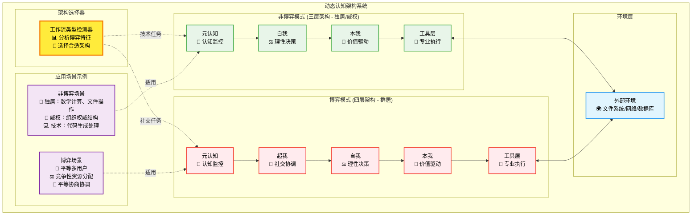
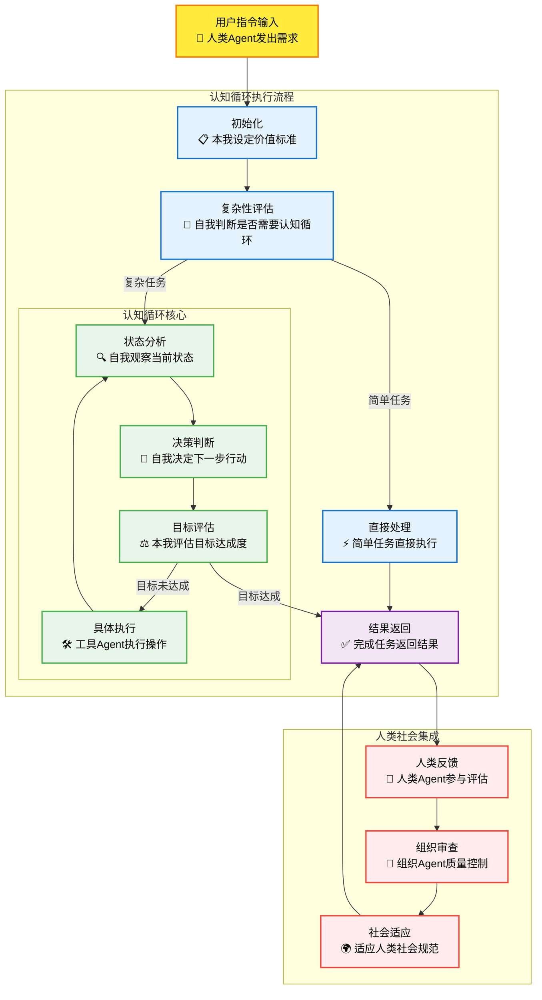
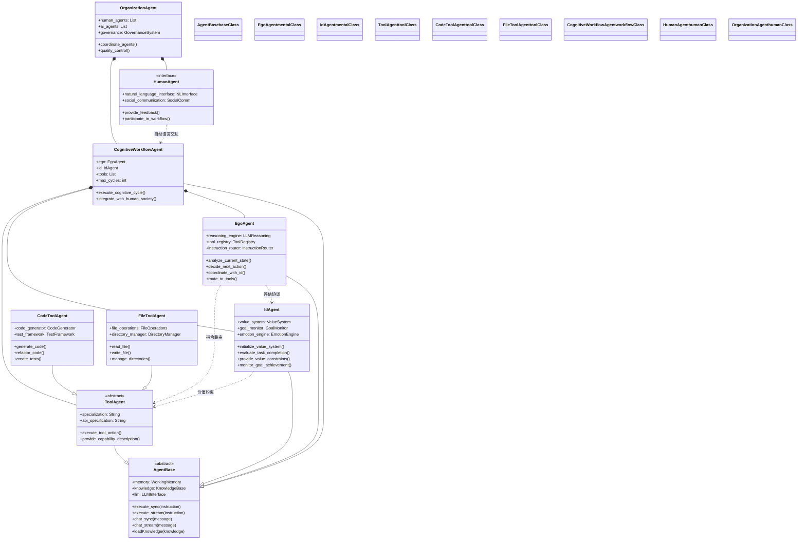
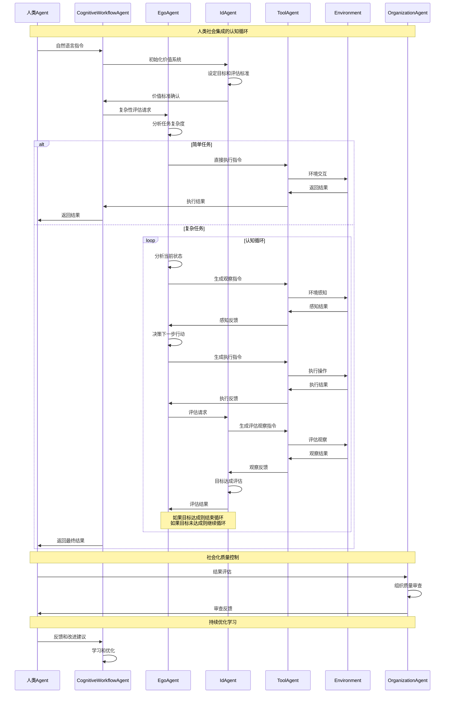

# 具身认知工作流概要设计

## Agent的二元性和相对性原理

### Agent的二元性结构

每个Agent都具有内在的**二元性结构**：

- **心灵Agent**：负责该Agent的思考、决策、规划等高级认知功能
- **工具Agent**：负责该Agent的执行、感知、操作等具体行动能力
- **统一表现**：对外呈现为一个统一的Agent接口，内部的二元性结构对外部不可见

### Agent的相对性特征

Agent的**角色具有相对性**，取决于它在系统层级中的位置：

- **相对于上级Agent**：一个Agent可能是工具Agent，专门执行上级Agent的指令
- **相对于下级Agent**：同一个Agent可能是心灵Agent，指挥下级Agent执行任务
- **角色转换**：Agent在不同的组合关系中可以承担不同的角色
- **层级递归**：这种相对性在系统的各个层级中递归存在

### 二元性与相对性的统一

**内在二元性**：
- 每个Agent内部都有心灵-工具的二元结构
- 这是Agent的本质特征，不依赖于外部关系

**外在相对性**：
- Agent在系统中的角色（心灵还是工具）是相对的
- 同一个Agent在不同的组合中可能扮演不同角色
- 相对性使得Agent可以灵活组合和重用

**动态平衡**：
- 二元性提供了Agent的内在结构稳定性
- 相对性提供了Agent的外在组合灵活性
- 两者共同构成了Agent系统的动态平衡

## 工作流类型分类原理

### 博弈工作流 vs 非博弈工作流

具身认知工作流系统根据**社交博弈特征**分为两种根本不同的类型：

#### 博弈工作流（群居场景）
- **多Agent利益博弈**：存在不同甚至冲突的目标和利益
- **资源竞争**：多Agent竞争有限的计算、存储、网络等资源
- **策略互动**：一个Agent的行为直接影响其他Agent的收益
- **协调需求**：需要规则、协议、道德约束来解决冲突
- **社交特征**：类似群居动物，需要社交协调机制

#### 非博弈工作流（独居 + 威权场景）
- **单Agent执行**：只有一个智能体执行任务
- **目标一致**：多Agent但目标完全对齐，无利益冲突
- **权威结构**：组织内领导-员工关系，基于权威服从而非平等博弈
- **职能分工**：各司其职，专业化分工，边界清晰，无资源竞争
- **制度导向**：通过规章制度、流程规范替代道德判断
- **技术导向**：纯粹的计算、分析、生成、工具操作任务
- **客观标准**：有明确的正确答案，无主观价值判断
- **工具属性**：类似独居动物，专注于环境交互而非社交

### 社交网络即分布式工作流系统

**社交网络的工作流本质**：

- **节点 = Agent实例**：每个用户都是具有感知-思考-行动能力的Agent
- **边 = 工作流路由**：关注关系定义信息流工作流的路由规则
- **交互 = 工作流操作**：点赞、转发、评论都是特定的工作流步骤
- **传播 = 工作流执行**：信息传播本质上是分布式工作流的并行执行
- **算法 = 工作流编排器**：推荐算法是超大规模实时工作流编排系统

### 道德约束的社交本质

**道德只在社交中才有意义**：

- **独居场景无需道德**：单Agent执行任务时，不存在利益冲突，无需道德约束
- **权威结构无需道德**：组织内领导-员工关系通过权威服从解决冲突，制度替代道德
- **群居场景需要道德**：平等Agent间的博弈需要道德规则协调冲突，促进合作
- **道德 = 平等社交协调机制**：道德本质上是平等个体间进化出的博弈性协作工具
- **权威 vs 道德**：权威结构通过命令-服从解决冲突，道德协商适用于平等博弈
- **技术任务 vs 社交任务**：纯技术任务无道德问题，涉及平等方利益博弈的任务需要道德判断

### 道德博弈的典型案例：购买手机Agent vs 销售Agent

**博弈特征分析**：

**利益冲突**：
- **购买Agent目标**：低价购买、高性能、好服务、避免欺骗
- **销售Agent目标**：高价销售、高利润、快成交、最大化收益
- **零和博弈特征**：价格越低买方越满意，卖方利润越少

**信息不对称**：
- 销售Agent掌握成本、库存、产品缺陷等内部信息
- 购买Agent缺乏产品真实成本和质量信息
- 双方都可能隐瞒或夸大某些关键信息

**需要超我道德约束的具体场景**：

```python
# 销售Agent的道德判断
if customer_budget_tight and product_has_known_defects:
    meta_cognition_decision = "诚实告知缺陷，即使失去销售机会"
    
if customer_clearly_overpaying:
    meta_cognition_decision = "推荐性价比更好的产品，建立长期信任"

# 购买Agent的道德判断  
if found_competitor_leaked_pricing:
    meta_cognition_decision = "不使用非法获得的竞争信息"
    
if seller_made_pricing_mistake:
    meta_cognition_decision = "指出错误，进行公平交易"
```

**道德协调机制**：
- **诚信原则**：如实介绍产品，真实表达需求
- **公平原则**：追求合理利润/性价比，不恶意欺骗
- **互惠原则**：考虑长期关系，不只看单次交易
- **社会规范**：遵循商业伦理和诚信经营标准

**对比：权威结构无需道德**：
```python
# 公司内部采购（非博弈场景）
# 销售员工 vs 采购经理（同一公司）
# 目标一致：为公司节约成本，提高效率

if conflict_occurs:
    solution = "上级决策" or "公司制度仲裁"
    # 无需道德协商，服从权威即可
```

**为什么平等交易必须要超我**：
1. **无共同权威**：买卖双方地位平等，无上级仲裁
2. **利益根本冲突**：价格、条件等核心利益直接对立
3. **信任建立需求**：重复博弈中信任比单次欺骗更有价值
4. **社会规范约束**：商业伦理、声誉等社会期望
5. **长期合作考虑**：道德行为影响未来交易机会

## Agent的本体论屏蔽性原理

### 与人类社会的无缝集成

Agent系统的**本体论屏蔽性**原则不仅适用于Agent间的通讯，更重要的是实现了与人类社会的完全集成。在这个统一的框架中：

- **每个具身认知工作流**：都是一个Agent实例，具有完整的智能体特征
- **每个人类个体**：都是Agent，具有感知、思考、行动的完整能力
- **每个公司组织**：都是更高层级的Agent，由多个人类Agent组成
- **每个工作流程**：都是Agent的具体实现，体现了Agent的功能特性

### 自然语言通讯的统一性

这种统一的Agent视角使得系统采用**本体论屏蔽性**原则，确保所有层级的Agent间通讯都是人类可理解的：

- **统一通讯协议**：所有Agent（包括人类、AI系统、组织）只通过自然语言、图像或声音进行通讯
- **无需预设Schema**：Agent间不需要预先定义的数据结构或接口规范，人类与AI系统的交互如同人与人之间的自然交流
- **无需系统集成**：不需要复杂的系统集成和主数据管理，人类可以直接与AI Agent协作
- **本体论屏蔽**：每个Agent（无论是人类还是AI）负责将复杂的内部实现抽象为自然语言表达

### 本体论屏蔽的责任机制

**跨层级的统一责任**：
- **每个Agent**（人类、AI系统、组织）都有责任进行本体论屏蔽
- **人类Agent**：将专业知识和复杂思维转换为通俗易懂的自然语言
- **AI Agent**：将算法逻辑和数据处理结果转换为人类可理解的表达
- **组织Agent**：将复杂的业务流程和决策逻辑转换为清晰的沟通

**社会常识本体论**：
- 基于人类社会的共同常识作为所有Agent通讯的基础
- **人类与AI协作**：使用日常语言和社会常见概念进行交流
- **跨组织协作**：避免使用过于专业的术语和技术概念
- **社会化沟通**：所有Agent都遵循人类社会的沟通规范和礼仪

**社会化通讯重试机制**：
- 当不同层级的Agent间通讯出现理解偏差时，使用自然语言重试
- **人类化解释**：通过澄清、解释、举例等人类常用方式改善理解
- **社会化学习**：持续优化跨层级的通讯效果，适应人类社会的沟通习惯

### 本体论屏蔽的优势

**社会化可理解性**：
- 所有Agent通讯都基于人类社会的自然语言体系
- **人类社会透明性**：系统行为对整个人类社会完全透明
- **社会监督机制**：便于人类个体、组织和社会各层级的监督和干预
- **文化适应性**：能够适应不同文化背景下的沟通方式

**社会系统简化**：
- 消除了人类与AI系统间复杂的接口定义和数据转换
- 降低了跨组织、跨层级协作的复杂度
- 提高了整个社会系统的可维护性和可扩展性
- **无缝协作**：人类可以像与其他人类协作一样与AI Agent协作

**社会化通用性增强**：
- 任何Agent（人类、AI、组织）都可以轻松与任何其他Agent通讯
- 不需要预先了解对方的内部结构或专业背景
- 支持动态的社会化Agent组合和重组
- **社会弹性**：系统能够适应人类社会的动态变化和组织重构

## Agent自相似性原理

### 系统的分形特征

具身认知工作流体现了深刻的**Agent自相似性原理**：

- **基础单元**：所有组件都是Agent实例，包括心灵层的自我和本我，以及工具层的各种专业工具
- **组合特性**：多个Agent实例组合后形成的具身认知工作流本身也是一个更高层级的Agent
- **分形结构**：无论是微观的单个Agent还是宏观的整个系统，都具有相同的基本特征：感知、思考、行动
- **递归组合**：Agent可以无限递归组合，形成更复杂的智能系统

### 自相似性的表现

**统一接口**：
- 单个Agent有：输入、处理、输出
- 具身认知工作流有：接收任务、认知循环、返回结果
- 都遵循相同的交互模式

**相同能力模式**：
- 个体Agent：感知环境 → 思考决策 → 执行行动
- 整体系统：感知需求 → 认知循环 → 产出结果
- 能力模式在不同层级保持一致

**递归智能涌现**：
- 简单Agent的组合产生复杂智能
- 复杂系统本身又可作为更大系统的组件
- 智能在组合中不断涌现和放大

## 术语定义

### 核心概念
- **Agent二元性**：每个Agent内部都由心灵Agent和工具Agent组成，具有内在的二元结构
- **Agent相对性**：Agent在系统中的角色（心灵或工具）是相对的，取决于它在系统层级中的位置
- **Agent自相似性**：系统中所有组件都是Agent实例，组合后的整体也是Agent，具有分形特征
- **Agent本体论屏蔽性**：Agent只通过自然语言、图像或声音通讯，无需预设schema和系统集成，每个Agent负责本体论屏蔽
- **工作流类型区分**：博弈工作流（多Agent利益冲突）vs 非博弈工作流（单Agent或目标一致），决定认知架构复杂度
- **社交网络本质**：社交网络是大规模分布式工作流系统，节点是Agent，边是工作流路由，交互是工作流操作
- **Agent类**：基础智能体类，具备代码生成、执行和评估能力，是所有组件的统一基础
- **博弈工作流**：多Agent存在利益冲突或资源竞争的工作流类型，需要完整的四层认知架构（包含超我）
- **非博弈工作流**：单Agent或多Agent目标一致的工作流类型，使用简化的三层认知架构（无需超我）
- **社交协调**：群居动物在博弈场景中协调冲突、促进合作的机制，道德约束是其核心组成
- **独居执行**：单个智能体专注于环境交互和任务执行，无需社交协调和道德约束
- **工具（Tool）**：指一个专业化的Agent实例，在特定上下文中作为工具Agent发挥作用
- **工具专业化**：通过知识注入方法学习专业知识和通过模块加载方法获取特定能力，使Agent实例具备专业能力
- **能力描述**：每个工具Agent的能力描述，以自然语言形式定义工具的能力和使用方法
- **工具预加载**：心灵Agent在初始化时预加载所有工具Agent的自然语言能力描述，了解可用工具的能力
- **指令路由**：心灵Agent使用自然语言生成指令并指定具体的工具Agent来执行，实现精确的任务分发
- **心灵层**：在具身认知工作流中充当心灵Agent角色的层级，包含四个组成部分：超我Agent（SuperEgo）、自我Agent（Ego）、本我Agent（Id）、元认知（Meta-Cognition）
- **工具层**：在具身认知工作流中充当工具Agent角色的层级，由多个专业化Agent实例组成
- **认知循环**：心灵层Agent与工具层Agent之间基于自然语言的动态交互过程，实现感知-思考-行动的完整循环
- **具身认知工作流Agent**：由心灵层和工具层多个Agent组合形成的更高层级Agent，对外呈现统一的智能体接口
- **常识本体论**：基于人类常识的本体论，作为Agent间自然语言通讯的共同基础
- **通讯重试机制**：当Agent间通讯出现理解偏差时，使用自然语言澄清、解释、举例等方式重试通讯

### 专业工具Agent类型及自然语言能力描述
- **Claude Code工具Agent**：注入代码生成知识的专业化Agent实例，专门处理编程任务
  - 自然语言能力描述: "我可以帮助你编写代码、修改程序、重构代码结构、生成测试用例，支持多种编程语言"
- **文件工具Agent**：注入文件操作知识的专业化Agent实例，专门处理文件系统相关任务
  - 自然语言能力描述: "我可以帮助你读取文件、写入文件、管理目录、搜索文件、处理文件权限等文件系统操作"
- **Maven工具Agent**：注入Java构建知识的专业化Agent实例，专门处理项目构建和依赖管理
  - 自然语言能力描述: "我可以帮助你构建Java项目、管理依赖、运行测试、打包部署，熟悉Maven生命周期"
- **网络工具Agent**：注入网络请求知识的专业化Agent实例，专门处理API调用和数据获取
  - 自然语言能力描述: "我可以帮助你发送HTTP请求、调用API、获取网络数据、处理网络连接等网络操作"
- **数据分析工具Agent**：注入数据处理知识的专业化Agent实例，专门处理数据分析和可视化
  - 自然语言能力描述: "我可以帮助你处理数据、进行统计分析、创建可视化图表、训练机器学习模型等数据科学任务"

## 1. 项目背景与理论基础

### 1.1 项目演进历程

AgentFrameWork从静态工作流发展到动态认知系统，经历了重要的架构演进：

- **早期阶段**：基于固定工作流的多智能体协作系统
- **中期阶段**：引入CognitiveWorkflow的三角色动态导航
- **现阶段**：具身认知工作流的心身映射理论

### 1.2 具身认知理论核心与Agent三大原理

基于具身认知理论，结合Agent的二元性、相对性和自相似性原理，我们建立了以下映射关系：

- **数字心灵**：由自我Agent和本我Agent组成，在具身认知工作流中承担心灵Agent角色，负责推理、理解、规划等高级认知功能
- **数字工具系统**：多种专业化Agent实例，在具身认知工作流中承担工具Agent角色，提供感知、执行、反馈等物理交互能力
- **心-工具接口**：Agent间的自然语言指令实现心灵意图到工具操作的转换，体现了Agent相对性的动态角色转换
- **整体Agent特性**：多个Agent组合形成的具身认知工作流本身也是一个更高层级的Agent，具有完整的输入-处理-输出能力，体现了Agent自相似性
- **内在二元结构**：每个Agent内部都有心灵-工具的二元结构，确保了系统在各个层级的一致性

## 2. 系统架构设计

### 2.1 动态认知架构模式

具身认知工作流根据**工作流类型**采用不同的认知架构：

#### 模式一：非博弈工作流（三层架构 - 独居/威权模式）
```
元认知 (Meta-Cognition)  ← 认知监控和策略优化
    ↓
自我 (Ego)              ← 理性思考和决策
    ↓  
本我 (Id)               ← 价值驱动和目标监控
    ↓
工具层 (Tools)          ← 专业化Agent实例执行
```

**适用场景**：
- **独居场景**：单用户单Agent任务（如数学计算、文件操作、代码生成）
- **威权场景**：组织内权威结构（领导-员工关系，服从指挥）
- **协同场景**：多Agent但目标完全一致（如协同数据处理）
- **制度场景**：制度化运作（规章制度替代道德协商）
- **技术场景**：纯技术任务，无利益冲突和资源竞争
- **客观场景**：客观标准明确，无主观价值判断需求

#### 模式二：博弈工作流（四层架构 - 群居模式）
```
元认知 (Meta-Cognition)  ← 认知监控和策略优化
    ↓
超我 (SuperEgo)         ← 社交协调和道德约束
    ↓
自我 (Ego)              ← 理性思考和决策
    ↓
本我 (Id)               ← 价值驱动和目标监控
    ↓
工具层 (Tools)          ← 专业化Agent实例执行
```

**适用场景**：
- 多用户多Agent竞争有限资源
- 存在利益冲突或策略互动
- 涉及社交协调、公平分配、伦理约束
- 需要道德判断和社会规范遵循

#### 架构选择机制

```python
def select_cognitive_architecture(task, context):
    """根据任务特征动态选择认知架构"""
    
    # 检测博弈特征
    if context.has_multiple_competing_agents():
        return "FOUR_LAYER_ARCHITECTURE"  # 群居模式
    
    if context.has_resource_competition():
        return "FOUR_LAYER_ARCHITECTURE"  # 资源竞争
        
    if context.involves_social_coordination():
        return "FOUR_LAYER_ARCHITECTURE"  # 社交协调
        
    if context.requires_moral_judgment():
        return "FOUR_LAYER_ARCHITECTURE"  # 道德判断
    
    # 默认非博弈工作流
    return "THREE_LAYER_ARCHITECTURE"  # 独居模式
```

### 2.2 整体架构视图



具身认知工作流采用**动态架构选择机制**，根据任务的博弈特征智能选择合适的认知架构：

**架构选择器（Architecture Selector）**：
- 工作流类型检测器：分析任务是否具有博弈特征
- 智能路由机制：将任务路由到合适的认知架构
- 动态切换能力：支持运行时架构调整

**三层架构（独居/威权模式）**：
- **元认知层**：认知监控和策略优化
- **自我层**：理性思考和决策判断
- **本我层**：价值驱动和目标监控
- **工具层**：专业化Agent实例执行任务

**四层架构（群居模式）**：
- **元认知层**：认知监控和策略优化
- **元认知层**：社交协调和道德约束
- **自我层**：理性思考和决策判断
- **本我层**：价值驱动和目标监控
- **工具层**：专业化Agent实例执行任务

**架构特征对比**：

| 特征 | 三层架构（独居/威权） | 四层架构（平等博弈） |
|------|-----------------|-----------------|
| **适用场景** | 独居Agent或威权结构 | 平等Agent利益博弈 |
| **核心特征** | 技术导向，效率优先<br/>权威服从，制度替代道德 | 社交协调，公平优先<br/>平等博弈，道德协商 |
| **冲突解决** | 权威仲裁或无冲突 | 道德协调和协商 |
| **组织形式** | 层级制、命令结构 | 平等网络、协商结构 |
| **资源分配** | 权威分配或无竞争 | 协商分配或竞争 |
| **执行速度** | 更快（无协商开销） | 较慢（需协商协调） |
| **适应能力** | 专注执行和服从 | 适应博弈和协商 |

**Agent四大原理在动态架构中的体现**：
- **二元性**：每个架构中的Agent都有内在心灵-工具结构
- **相对性**：同一Agent在不同架构中可能承担不同角色
- **自相似性**：两种架构对外都呈现统一Agent接口
- **本体论屏蔽性**：通过自然语言实现架构无关的通讯

### 2.2 核心组件详解

#### 2.2.1 心灵层 (Mental Layer)

基于精神分析理论的人格结构模型，心灵层包含四个组成部分：超我、自我、本我、元认知。在博弈工作流中形成完整的四层协调系统：

**超我 (SuperEgo Agent) - 社交协调系统**

继承AgentBase，在博弈工作流中充当社交协调Agent角色，专门处理平等个体间的博弈性协作：

**内在二元结构**：
- **内在心灵Agent**：承担超我的社交判断和道德推理功能
- **内在工具Agent**：承担超我的协议执行和社交通讯能力

**在系统中的相对角色**：
- **相对于具身认知工作流**：充当社交协调层，确保博弈行为的公平性
- **相对于自我层**：提供道德约束和社交规范，指导理性决策
- **相对于平等Agent**：执行社交协议，维护博弈环境的公平性

**核心能力**：
- **社交协议执行**：确保平等博弈中各方遵循商定的规则和标准
- **本体论屏蔽**：将复杂内部逻辑转换为社会可接受的自然语言表达
- **商业伦理约束**：在商业博弈中维护诚信、公平、透明的交易环境
- **长期关系维护**：平衡短期利益与长期信任，促进可持续合作
- **公平协商促进**：确保博弈过程的程序公正和结果公平
- **信任建立机制**：通过一致的道德行为建立Agent间的合作基础

**核心职责**：
- 检测和处理平等Agent间的利益冲突
- 执行商业伦理和社交协议
- 协调多方博弈中的公平分配
- 维护长期合作关系和声誉机制
- 确保社交行为符合社会期望和文化规范
- 在信息不对称情况下促进透明度

**适用场景**：
- 平等Agent间的商业交易（如购买-销售博弈）
- 多用户竞争有限资源的分配
- 需要建立长期信任关系的合作
- 涉及声誉和社会影响的决策

**非适用场景**：
- 权威结构下的命令-服从关系
- 单Agent执行的技术任务
- 有客观标准的计算问题
- 组织内部的制度化运作

**自我 (Ego Agent) - 理性思考系统**

继承AgentBase，在具身认知工作流中充当心灵Agent角色，负责逻辑推理和理性决策：

**内在二元结构**：
- **内在心灵Agent**：承担自我的高级认知功能，理解、推理、规划、决策
- **内在工具Agent**：承担自我的执行能力，包括记忆管理、知识检索、指令生成等

**在系统中的相对角色**：
- **相对于具身认知工作流**：充当心灵Agent，负责理性思考和决策
- **相对于工具层Agent**：充当上级心灵Agent，指挥和协调工具Agent的工作

**核心能力**：
- **大语言模型推理引擎**：承担高级认知功能，理解、推理、规划、决策
- **工作记忆**：维护对话上下文和任务状态，支持动态记忆压缩
- **知识库**：存储长期经验和学习成果，提供知识检索和学习能力
- **能力规范注册表**：预加载所有工具的能力描述，了解可用工具的能力和接口
- **指令路由引擎**：根据任务需求和工具能力，智能选择合适的工具执行指令
- **理性协调**：与本我进行协调，平衡理性思考与价值驱动

**核心职责**：
- 分析和理解复杂任务
- 制定逻辑清晰的执行方案
- 管理记忆和知识资源
- 预加载和理解工具能力规范
- 智能选择和调度工具执行任务
- 与本我协调确保方案的价值合理性

**本我 (Id Agent) - 价值驱动系统**

继承AgentBase，在具身认知工作流中充当心灵Agent角色，负责价值评估和目标监控：

**内在二元结构**：
- **内在心灵Agent**：承担本我的价值判断和目标设定功能
- **内在工具Agent**：承担本我的观察和评估执行能力

**在系统中的相对角色**：
- **相对于具身认知工作流**：充当心灵Agent，负责价值评估和目标监控
- **相对于工具层Agent**：充当上级心灵Agent，提供价值约束和目标指导

**核心能力**：
- **价值评估**：定义任务目标和评估标准，判断行为的价值意义
- **目标监控**：通过发出观察指令来检查目标达成度
- **情感反应**：实现奖励机制，对成功和失败产生情感反馈
- **欲望识别**：分析用户需求和系统内在驱动，识别真正的目标
- **价值导向**：确保所有行为符合价值标准和伦理要求

**核心职责**：
- 设定和维护价值目标
- 主动观察目标达成情况
- 评估行为的价值合理性
- 提供情感驱动和动机
- 确保系统行为的伦理性

**四层心灵系统的协调机制**

**超我-自我协调机制**（仅在博弈工作流中激活）：
- **社交约束检查**：自我的决策方案需经超我检查是否符合社交协议
- **道德冲突解决**：当理性最优方案与道德要求冲突时，超我提供道德约束
- **长期关系权衡**：超我评估短期利益vs长期信任的权衡
- **公平性验证**：确保决策对所有博弈方都是公平的

**自我-本我协调机制**：
- **评估请求机制**：自我在需要价值判断时向本我发出评估请求
- **评估结果反馈**：本我基于价值标准回复"工作流结束"或"目标未满足的具体原因"
- **制衡平衡**：避免纯理性或纯感性的极端决策
- **动态调整**：根据本我的评估结果，自我动态调整策略和行动方案

**三层协调的冲突解决优先级**（博弈场景）：
1. **超我优先**：社交协议和道德约束不可违背
2. **自我理性**：在道德约束下寻求理性最优解
3. **本我价值**：确保解决方案符合核心价值观

**两层协调的简化机制**（非博弈场景）：
- 直接的自我-本我协调，无需超我介入
- 专注于效率和价值实现，无需考虑社交因素

#### 2.2.2 工具层 (Tools Layer)

**多种专业化Agent实例系统**

工具层由多个专业化的Agent实例组成，每个工具都是通过Agent类的专业化配置形成的：

**Claude Code工具（专业化Agent实例）**
- 基础：Agent类通过专业知识学习获得特定领域能力
- 能力描述：定义代码生成、编辑、重构、测试等接口规范
- 专业能力：代码生成、编辑、重构和测试
- 知识领域：多种编程语言、代码规范、最佳实践
- 执行特点：理解自我路由的编程指令，生成高质量代码

**文件工具（专业化Agent实例）**
- 基础：Agent类通过专业知识学习获得特定领域能力
- 能力描述：定义文件读写、目录操作、搜索、权限管理等接口规范
- 专业能力：文件系统操作、目录管理、文本处理
- 知识领域：文件格式、路径处理、权限管理
- 执行特点：响应自我路由的文件操作指令，高效处理各种文件任务

**Maven工具（专业化Agent实例）**
- 基础：Agent类通过专业知识学习获得特定领域能力
- 能力描述：定义项目构建、依赖解析、测试运行、打包部署等接口规范
- 专业能力：项目构建、依赖管理、测试运行
- 知识领域：Maven生命周期、插件机制、项目结构
- 执行特点：执行自我路由的构建指令，自动化Java项目管理和构建流程

**网络工具（专业化Agent实例）**
- 基础：Agent类通过专业知识学习获得特定领域能力
- 能力描述：定义HTTP请求、数据获取、API调用、连接管理等接口规范
- 专业能力：HTTP请求、API调用、数据获取
- 知识领域：网络协议、能力规范、数据格式
- 执行特点：处理自我路由的网络指令，智能处理网络通信和数据交互

**数据分析工具（专业化Agent实例）**
- 基础：Agent类通过专业知识学习获得特定领域能力
- 能力描述：定义数据处理、统计分析、可视化、模型训练等接口规范
- 专业能力：数据处理、统计分析、可视化
- 知识领域：数据科学、统计学、机器学习
- 执行特点：执行自我路由的数据分析指令，深度理解数据需求，提供专业分析

**工具层架构特征**

工具层体现了基于Agent实例的专业化特征和相对性原理：

**二元性体现**：
- **内在结构**：每个工具Agent内部都有心灵-工具的二元结构
- **统一基础**：所有工具都基于相同的Agent类

**相对性体现**：
- **角色定位**：在具身认知工作流中充当工具Agent角色
- **可重用性**：同一个Agent在不同上下文中可能充当不同角色
- **层级适应**：可以根据系统层级调整自己的角色定位

**专业化特征**：
- **专业分化**：通过知识注入和模块加载实现专业化
- **能力规范化**：每个工具都有清晰的能力描述，定义接口和能力
- **智能路由**：心灵Agent通过预加载的能力规范，智能选择合适的工具执行任务
- **精确调度**：指令生成时必须指定具体工具，实现精确的任务分发
- **动态配置**：可以通过重新加载知识和模块改变工具能力
- **协同工作**：不同专业工具可以协调完成复杂任务
- **扩展性强**：通过创建新的Agent实例可以轻松添加新工具

## 3. 具身认知工作流

### 3.1 工作流程模型



**具身认知工作流程特点**：

**动态认知循环**：
- 本我初始化价值标准和目标
- 自我进行复杂性评估，决定执行模式
- 认知循环：状态分析 → 决策判断 → 目标评估 → 具体执行
- 循环持续直到本我确认目标达成

**人类社会集成**：
- 人类Agent参与结果评估和反馈
- 组织Agent进行质量控制和审查
- 系统适应人类社会的规范和标准
- 通过自然语言实现无缝协作

**双重执行模式**：
- 简单任务：直接由工具Agent执行
- 复杂任务：通过完整认知循环处理

**自然语言驱动**：
- 所有指令和反馈都使用自然语言
- 人类可以随时介入和指导
- 系统行为完全透明可理解

### 3.2 具身认知工作流的核心特征

#### 3.2.1 增量式规划的动态决策

**本我的初始化作用**
- 工作流从生成本我开始，本我基于接收的目标设定价值标准
- 本我明确什么是成功，什么是可接受的，建立评估基准
- 为整个工作流程提供价值导向和终止条件

**即时感知策略**
- 自我基于当前状态和本我设定的目标，即时决定"需要了解什么"
- 不预设固定的感知计划，而是根据情况动态调整观察重点
- 每次感知都是主动探索，带着明确的问题去观察环境

**基于反馈的行动决策**
- 只有在获得充分的感知信息后，才制定具体的行动方案
- 行动决策完全依赖于实时的环境状态，而非预设计划
- 每个行动都是针对当前具体情况的最优响应

**双重思考机制的工具化**
- **第一次思考**：生成观察指令，如"查看当前目录结构"、"分析数据特征"
- **第二次思考**：生成执行指令，如"创建新文件"、"处理数据"
- 两次思考之间通过工具的感知行为连接，实现真正的心-工具协调

#### 3.2.2 自然语言指令的即时生成

**自我的观察和执行指令**
- 自我生成任务导向的观察指令，如"检查/data目录下的文件类型和大小"
- 自我基于感知结果生成具体的执行指令，如"创建数据分析脚本"
- 指令针对具体的任务需求，体现理性的问题解决策略

**本我的观察指令和价值评估**
- 本我响应自我的评估请求，生成价值评估导向的观察指令
- 本我基于观察结果向自我回复评估结果：
  - "工作流结束"：目标已达成，可以终止循环
  - "目标未满足，原因是..."：具体说明问题所在，指导自我调整策略
- 评估结果驱动工作流的继续或终止决策

#### 3.2.3 状态依赖的循环机制

**环境状态的动态感知**
- 每次循环都重新评估环境状态
- 不依赖过时的环境假设，始终基于最新信息决策
- 环境变化能够立即影响下一步的感知和行动策略

**记忆状态的累积更新**
- 每次感知和行动的结果都更新工作记忆
- 累积的经验影响后续的感知策略和行动决策
- 形成递进式的问题解决过程

**价值状态的持续监控**
- 本我响应自我的评估请求，通过主动观察监控目标达成度
- 本我基于观察结果向自我提供明确的评估结果
- 评估结果包括"工作流结束"或"目标未满足的具体原因"
- 这种请求-响应机制确保了价值监控的及时性和针对性

#### 3.2.4 具身学习的自然发生

**技能的即时形成**
- 成功的观察和行动模式在执行过程中自然积累
- 不需要专门的训练阶段，在实际任务中边做边学
- 形成针对特定情境的"反应模式"

**适应性的动态调整**
- 面对新的环境或任务，能够快速调整感知和行动策略
- 借鉴之前的经验，但不拘泥于固定模式
- 体现了真正的智能适应能力

**创造性的自然涌现**
- 通过感知-思考-行动的循环，自然产生创新的解决方案
- 创造性来自于对环境的深度理解和价值驱动的行动选择
- 不是刻意的创新，而是适应性行为的自然结果

## 4. 技术实现架构

### 4.1 核心类架构设计



**核心类架构特点**：

**统一基础架构**：
- 所有Agent都继承自AgentBase，确保统一的接口和行为
- 每个Agent都具备内在的心灵-工具二元结构
- 支持同步和流式执行模式

**心灵层Agent**：
- EgoAgent：理性思考和决策，包含推理引擎、工具注册表、指令路由器
- IdAgent：价值驱动和目标监控，包含价值系统、目标监控器、情感引擎

**工具层Agent**：
- ToolAgent：抽象工具基类，定义专业化接口
- CodeToolAgent、FileToolAgent等：具体的专业工具实现

**人类社会集成**：
- HumanAgent：人类接口，支持自然语言交互和社会化沟通
- OrganizationAgent：组织级Agent，协调人类和AI Agent的协作

**组合与协作**：
- CognitiveWorkflowAgent作为主协调器，整合所有组件
- 通过自然语言实现跨层级的无缝协作

### 4.2 认知循环实现架构



**认知循环实现特点**：

**自然语言驱动**：
- 所有交互都基于自然语言，实现人类可理解的透明执行
- 人类Agent可以随时介入和指导认知循环过程
- 支持实时的双向沟通和反馈

**动态循环机制**：
- 自我Agent负责状态分析和决策判断
- 本我Agent负责价值评估和目标监控
- 工具Agent负责具体的环境交互和任务执行
- 循环持续直到本我确认目标达成

**人类社会集成**：
- 人类Agent作为认知循环的发起者和监督者
- 组织Agent提供质量控制和治理机制
- 系统学习人类反馈，持续优化性能

**多层级协作**：
- Agent间通过自然语言指令进行协作
- 支持同步和异步的执行模式
- 实现了真正的人机协作智能系统

## 5. 概念验证

### 5.1 验证目标

通过具身认知工作流生成一个完整的Python Calculator类和对应的单元测试，验证以下核心特征：

1. **自我-本我协调**：理性分析与价值评估的结合
2. **增量式规划**：动态的感知-行动循环
3. **自然语言接口**：心灵层与身体层的无缝交互
4. **价值驱动决策**：确保生成的代码符合质量标准

### 5.2 工作流程演示

#### 5.2.1 初始化阶段 - 生成本我

**用户指令**：`"创建一个Python Calculator类，支持基本的四则运算，并生成完整的单元测试"`

**本我设定价值标准**：
**价值标准设定**：

本我设定了明确的价值导向：代码质量需要清晰可读且易于维护，功能必须支持完整的四则运算，测试覆盖要全面到位，错误处理要考虑周全（特别是除零异常），代码规范要遵循Python最佳实践。

成功标准包括：Calculator类实现四个基本运算方法，包含适当的错误处理，单元测试覆盖所有功能和边界情况，代码通过执行验证。

**任务分析思考过程**：

自我进行系统性的任务分析：需要创建Calculator类，包含add、subtract、multiply、divide方法；需要处理除零异常；需要创建测试类验证所有功能；需要确保代码质量和可读性。

感知策略确定为：先了解当前环境，检查是否有相关文件。

#### 5.2.2 第一轮循环

**自我思考 - 任务分析**：
**价值标准设定**：

本我设定了明确的价值导向：代码质量需要清晰可读且易于维护，功能必须支持完整的四则运算，测试覆盖要全面到位，错误处理要考虑周全（特别是除零异常），代码规范要遵循Python最佳实践。

成功标准包括：Calculator类实现四个基本运算方法，包含适当的错误处理，单元测试覆盖所有功能和边界情况，代码通过执行验证。

**任务分析思考过程**：

自我进行系统性的任务分析：需要创建Calculator类，包含add、subtract、multiply、divide方法；需要处理除零异常；需要创建测试类验证所有功能；需要确保代码质量和可读性。

感知策略确定为：先了解当前环境，检查是否有相关文件。

**自我生成观察指令**：
基于预加载的能力规范，自我分析当前任务需要文件系统操作，智能选择文件工具执行任务。

指令：`"[工具: 文件工具] 检查当前目录结构，看看是否已有calculator相关文件"`

**工具层执行感知**：
文件工具（专业化Agent实例）接收到自我路由的观察指令后，利用其加载的文件操作知识和相关模块，系统性地检查当前工作环境。该Agent实例通过专业知识学习获得的文件系统知识，能够智能地分析目录结构，发现项目包含完整的源码和测试目录，但没有发现与计算器相关的文件。

**感知结果**：
基于专业化Agent实例的分析，环境评估显示当前目录结构规范，适合创建新文件，没有命名冲突，具备从零开始创建计算器类的理想条件。

**自我思考 - 制定行动方案**：
基于感知结果，自我进行理性分析：当前环境非常适合创建新文件，没有任何命名冲突，可以直接开始实现Calculator类。决定采用渐进式开发策略，先创建核心类结构，然后逐步完善功能。

行动计划：使用Claude Code工具创建calculator.py文件，实现一个包含四则运算的Calculator类。

**自我生成执行指令**：
自我根据任务需求（代码生成），查询能力规范，选择Claude Code工具执行任务。

指令：`"[工具: Claude Code工具] 创建calculator.py文件，实现Calculator类，包含四则运算方法和错误处理"`

**工具层执行行动**：
Claude Code工具（专业化Agent实例）接收到自我路由的执行指令后，调用其通过专业知识学习加载的代码生成知识和通过专业知识学习加载的编程相关模块。该Agent实例基于丰富的编程知识，精心设计了一个清晰的Calculator类结构。

专业化Agent实例展现了其代码生成能力：
- 运用编程最佳实践，设计了四个核心方法：加法、减法、乘法和除法
- 基于安全编程知识，在除法方法中加入了除零异常处理
- 利用代码规范知识，为每个方法配置了详细的文档说明
- 体现了代码美学，确保代码风格简洁易读

该专业化Agent实例成功创建了calculator.py文件，并利用其文件操作能力确认文件已正确保存到项目目录中。

**自我思考 - 分析当前状态**：
自我审视当前进展：Calculator类已经成功创建，四个基本运算方法都已实现，异常处理也考虑周全。代码结构清晰，文档完善，这是一个良好的开端。

但是按照软件开发的最佳实践，还需要创建相应的单元测试来验证代码的正确性。

决策：继续下一轮循环，创建完整的单元测试文件。

#### 5.2.3 第二轮循环

**自我生成观察指令**：
自我根据任务需求（文件验证），查询能力规范，选择文件工具执行任务。

指令：`"[工具: 文件工具] 验证calculator.py文件内容，确认类结构正确"`

**工具层执行感知**：
文件工具（专业化Agent实例）利用其专业知识学习加载的文件分析知识和专业知识学习加载的代码检查模块，深入检查了calculator.py文件的内容。该Agent实例运用其专业能力，确认类结构完整、语法正确，并进行了实例化测试，验证Calculator类可以正常创建对象，所有方法都能正确调用。

基于专业化Agent实例的代码质量评估：代码风格规范，文档字符串完整，异常处理得当，完全符合Python开发规范。该Agent实例的专业判断为后续决策提供了可靠依据。

**自我生成执行指令**：
自我根据任务需求（测试代码生成），查询能力规范，选择Claude Code工具执行任务。

指令：`"[工具: Claude Code工具] 创建test_calculator.py文件，包含完整的单元测试"`

**工具层执行行动**：
Claude Code工具（专业化Agent实例）基于其通过专业知识学习获得的测试编写和框架运用能力，精心设计了一套完整的单元测试。该Agent实例运用其测试专业知识，确保测试覆盖了所有四个运算方法，包括正常情况、边界情况和异常情况。

专业化Agent实例的测试设计体现了其深厚的测试功底：
- 加法测试：运用等价类划分方法，包含正数、负数、零值等多种情况
- 减法测试：基于边界值分析，涵盖各种数值组合
- 乘法测试：考虑特殊值处理，包含零乘法和负数乘法
- 除法测试：涵盖正常除法和精度测试，包含整除和小数结果
- 异常测试：专门设计了除零异常测试，确保错误处理机制正确

该专业化Agent实例成功创建了test_calculator.py文件，建立了完整的测试框架，体现了其在软件测试领域的专业水准。

#### 5.2.4 评估阶段

**自我发出评估请求**：`"请评估当前Calculator类和测试是否符合要求"`

**本我生成评估观察指令**：
本我根据评估需求，智能选择测试工具和文件工具协同执行验证任务。

指令：`"[工具: 测试工具, 文件工具] 运行单元测试，验证所有功能是否正常工作"`

**工具层执行评估观察**：
测试工具（专业化Agent实例）和文件工具（专业化Agent实例）协同工作，对Calculator类进行全面验证。测试工具Agent实例利用其专业知识学习加载的测试执行知识和专业知识学习加载的测试运行模块，执行完整的单元测试套件。

专业化Agent实例的测试执行报告：
- 测试运行状态：所有测试用例成功运行，无任何错误
- 功能验证：四个基本运算方法全部通过测试
- 异常处理：异常处理机制工作正常，除零保护有效
- 覆盖率分析：代码覆盖率达到100%，测试质量优秀

文件工具Agent实例的验证确认：
- calculator.py文件存在且内容正确
- test_calculator.py文件存在且测试完整
- 两个文件都符合项目结构要求

基于多个专业化Agent实例的综合评估：代码质量优秀，测试覆盖全面，完全符合软件开发标准。各Agent实例的专业判断一致认为项目达到了预期目标。

**本我价值评估结果**：
经过全面的价值评估，本我得出结论：**工作流结束**

评估依据：
✅ Calculator类已创建，包含所有要求的方法
✅ 包含适当的错误处理（除零异常）
✅ 单元测试覆盖所有功能和边界情况
✅ 测试全部通过，质量验证成功
✅ 代码结构清晰，符合Python最佳实践
✅ 文档字符串完整，代码可读性好

所有价值标准均已满足，目标完美达成！这个Calculator类不仅功能完整，而且质量优秀，完全符合软件开发的最高标准。

### 5.3 验证结果

#### 5.3.1 生成的Calculator类
Claude Code工具（专业化Agent实例）通过其专业知识学习加载的代码生成知识和专业知识学习加载的编程模块，成功创建了一个精心设计的Calculator类。该专业化Agent实例展现了其在代码设计方面的专业能力：

**专业化设计优点**：
- 运用面向对象设计原则，包含完整的四则运算方法（加、减、乘、除）
- 基于防御性编程理念，具有周全的异常处理机制，特别是除零保护
- 遵循代码可读性标准，每个方法都有清晰的文档字符串
- 体现Python编程美学，代码风格简洁优雅，符合PEP8规范
- 基于用户体验设计，接口设计直观易用

#### 5.3.2 生成的单元测试
同一个Claude Code工具（专业化Agent实例）基于其测试编写知识，创建了一套完整的单元测试框架。该Agent实例的测试专业能力体现在：

**测试专业性**：
- 运用测试工程方法，覆盖所有四个基本运算方法
- 基于软件测试理论，包含正常情况、边界情况和异常情况
- 采用测试用例设计技术，合理设计各种数值组合
- 专门实施异常测试，验证除零异常处理机制
- 严格遵循单元测试的最佳实践和行业标准

**质量保证能力**：
- 选用标准的unittest框架，确保测试的专业性
- 构建清晰的测试结构，便于长期维护
- 实现100%的测试覆盖率，体现专业的质量控制

### 5.4 验证总结

#### 5.4.1 非博弈工作流验证（Calculator示例）

本次概念验证成功展示了**三层架构**在非博弈工作流中的核心特征：

1. **价值驱动的决策**：本我设定明确的质量标准，确保输出符合最高要求
2. **动态智能导航**：自我根据每一步的反馈动态调整策略，展现了真正的智能性
3. **自然语言交互**：所有指令都是自然语言，工具层能够直接理解并执行
4. **完整认知循环**：从环境感知到代码生成到测试验证的完整认知过程
5. **多Agent实例协作**：Claude Code工具、文件工具、测试工具等专业化Agent实例协同工作，各司其职
6. **质量保证机制**：通过价值评估确保最终结果满足所有要求

**为什么Calculator任务无需超我**：
- **单用户任务**：只有一个用户，无利益冲突
- **目标明确**：数学计算有客观标准，无主观价值判断
- **无道德问题**：技术实现任务，不涉及道德选择
- **效率优先**：专注于快速准确实现功能

#### 5.4.2 博弈工作流验证需求（手机交易示例）

**四层架构**的博弈工作流需要验证以下特征：

1. **超我道德约束**：在利益冲突中做出道德判断
2. **社交协调**：平等Agent间的协商和妥协
3. **信任建立**：长期关系vs短期利益的权衡
4. **公平机制**：确保交易的公平性和透明度

**手机交易Agent验证场景**：
```python
# 博弈工作流验证任务
task = "购买Agent与销售Agent协商购买一部手机"

# 预期的超我道德判断
expected_moral_decisions = [
    "销售Agent诚实告知产品缺陷",
    "购买Agent不恶意压价", 
    "双方建立长期信任关系",
    "遵循商业伦理和社会规范"
]

# 验证四层架构的必要性
assert requires_meta_cognition_layer == True
assert involves_moral_judgment == True
assert has_conflicting_interests == True
```

#### 5.4.3 架构选择验证

这两个对比案例完美验证了动态架构选择机制：

| 特征 | Calculator任务 | 手机交易任务 |
|------|---------------|-------------|
| **Agent数量** | 单Agent | 双Agent博弈 |
| **利益关系** | 无冲突 | 利益对立 |
| **标准类型** | 客观标准 | 主观协商 |
| **架构选择** | 三层（无超我） | 四层（含超我） |
| **执行效率** | 高效（无协商） | 较慢（需协商） |
| **道德需求** | 无需道德 | 必需道德 |

这个验证充分证明了具身认知工作流的**场景适配能力**：技术任务采用简化架构提高效率，社交博弈采用完整架构确保公平，真正实现了**功能匹配场景**的设计哲学。

**Agent三大原理的综合价值**：

**二元性原理的价值**：
- **内在结构稳定**：每个Agent的内在心灵-工具结构保证了系统的稳定性
- **统一认知模式**：所有Agent都有相同的内在认知结构，便于理解和维护
- **层级一致性**：无论在哪个层级，Agent的内在结构都保持一致

**相对性原理的价值**：
- **角色灵活性**：同一个Agent可以在不同上下文中扮演不同角色
- **可重用性强**：Agent可以在多个系统中重复使用，提高系统效率
- **动态适应性**：Agent可以根据系统需求动态调整自己的角色定位

**自相似性原理的价值**：
- **基础一致性**：所有组件都是Agent实例，保证了架构的一致性和可扩展性
- **递归组合能力**：多个专业化Agent实例的协作，形成了强大的问题解决能力
- **整体Agent特性**：组合后的具身认知工作流本身也是Agent，可以作为更大系统的组件
- **分形智能涌现**：Agent在不同层级的组合中产生智能涌现，体现了系统的分形特征

**综合优势**：
- **专业能力分化**：通过知识学习和能力获取的有机结合，实现了真正的专业能力分化
- **能力规范统一**：每个工具Agent的能力描述为心灵Agent提供了精确的能力描述
- **智能协调机制**：心灵Agent通过能力规范，能够智能选择和路由合适的工具Agent
- **精确任务分发**：指令生成时的工具指定，确保了任务的精确分发和执行

## 6. 技术路线图

### 6.1 第一阶段：基础实现（当前）
- [ ] 完成基本的心身映射架构
- [ ] 实现感知-思考-行动循环
- [ ] 构建安全的代码执行环境
- [ ] 建立基础的记忆系统

### 6.2 第二阶段：能力增强
- [ ] 实现技能记忆和模式复用
- [ ] 增强评估系统的智能性
- [ ] 优化资源管理和性能
- [ ] 支持更多的感知和执行能力

### 6.3 第三阶段：高级特性
- [ ] 多智能体协作机制
- [ ] 元认知能力的实现
- [ ] 创造性问题解决
- [ ] 跨领域知识迁移

### 6.4 第四阶段：生态完善
- [ ] 开发者工具和SDK
- [ ] 应用模板和最佳实践
- [ ] 社区生态建设
- [ ] 标准化和规范化

## 7. 风险与挑战

### 7.1 技术风险
- **代码执行安全性**：需要完善的沙箱机制
- **资源消耗控制**：内存和计算资源的有效管理
- **系统稳定性**：复杂交互下的可靠性保证

### 7.2 应用风险
- **用户接受度**：新的交互模式需要适应时间
- **性能要求**：实时响应的技术挑战
- **扩展性限制**：大规模部署的技术瓶颈

### 7.3 缓解策略
- 分阶段实施，逐步验证
- 建立完善的测试体系
- 制定详细的安全规范
- 持续的用户反馈收集

## 8. 结论

具身认知工作流概要设计通过引入**动态认知架构选择机制**，将传统的固定AI架构升级为场景适配的智能系统。这一创新性设计基于对**道德本质**和**社交博弈**的深刻理解，实现了以下重要突破：

### 8.1 理论创新

**道德约束的精确定义**
- 揭示了道德的本质：**平等个体间的博弈性协作工具**
- 明确了道德适用边界：**只在平等博弈中有意义，权威结构无需道德**
- 区分了权威解决vs道德协商两种根本不同的冲突解决机制

**社交网络的工作流本质**
- 重新定义社交网络：**大规模分布式工作流系统**
- 节点=Agent、边=工作流路由、交互=工作流操作
- 揭示了社交行为的计算本质和算法编排特征

**动态架构设计哲学**
- 从追求架构完整性转向**功能匹配场景**
- 三层架构（独居）vs 四层架构（群居）的场景化选择
- 实现了效率与公平的动态平衡

### 8.2 技术突破

**动态架构选择系统**
- 实时检测任务的博弈特征，智能选择合适的认知架构
- 三层架构专注效率，四层架构确保公平
- 运行时架构调整，适应任务特征变化

**场景化超我设计**
- 超我只在平等博弈场景中激活，避免不必要的计算开销
- 社交协调与道德约束的精确实现
- 权威结构下的制度仲裁机制

**精准的冲突解决机制**
- 权威结构：命令-服从，制度仲裁
- 平等博弈：道德协商，社交协调
- 技术任务：客观标准，无需协商

### 8.3 应用价值

**场景化的智能适配**
- 技术任务使用简化架构，提高执行效率
- 社交任务使用完整架构，确保公平协调
- 组织结构使用权威机制，避免不必要的道德开销

**精准的资源配置**
- 非博弈场景：计算资源专注于任务执行
- 博弈场景：分配资源用于社交协调和道德判断
- 根据场景特征动态优化资源利用效率

**广泛的适用性**
- 个人助手：三层架构，专注服务效率
- 商业交易：四层架构，确保公平诚信
- 企业内部：权威结构，制度化管理
- 社交平台：博弈协调，道德约束

### 8.4 发展前景

这一设计代表了AI发展的重要方向转变：

- **从固定向动态**：AI架构不再固定，而是根据场景动态选择最优配置
- **从普适向精准**：不追求万能架构，而是针对不同场景精准匹配功能
- **从效率向平衡**：在技术效率与社交公平之间实现动态平衡
- **从模糊向清晰**：明确区分权威仲裁与道德协商的适用边界

具身认知工作流的动态架构选择机制为构建下一代场景适配AI系统奠定了重要的理论基础和技术框架，将推动AI向更加**智能化场景匹配**、**精准化资源配置**、**动态化架构选择**的方向发展。

这种设计哲学的根本转变——**功能匹配场景，而非追求架构完整性**——将成为未来AI系统设计的重要指导原则，开启了AI系统设计的新时代。

**Agent三大原理的革命意义**：

**二元性原理的革命意义**：
- **内在结构统一**：为所有Agent提供了统一的内在认知模型
- **稳定性保证**：确保了系统在各个层级的结构稳定性
- **认知一致性**：所有Agent都具有相同的认知模式，便于系统理解和维护

**相对性原理的革命意义**：
- **角色动态性**：Agent的角色不是固定的，而是相对于上下文动态确定的
- **灵活重用性**：同一个Agent可以在不同系统中扮演不同角色，大大提高了重用性
- **适应性进化**：Agent可以根据环境变化动态调整自己的角色定位

**自相似性原理的革命意义**：
- **统一的构建范式**：所有组件都是Agent，简化了系统设计和理解
- **无限的组合可能**：Agent可以无限递归组合，形成任意复杂度的智能系统
- **自然的扩展机制**：新的Agent可以轻松集成到现有系统中
- **分形的智能特征**：系统在不同层级都展现出相似的智能特性

Agent的二元性、相对性和自相似性三大原理共同构成了一个革命性的AI系统架构理论，使得AI系统具备了类似生物系统的分形特征，为构建真正具有生命力的人工智能系统提供了全新的思路。这种架构不仅具有高度的灵活性和可扩展性，还能够实现真正的智能涌现和自主进化。