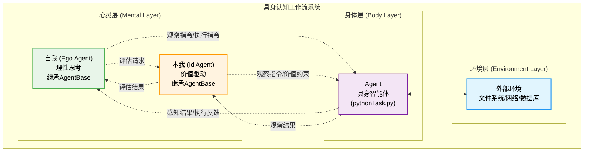
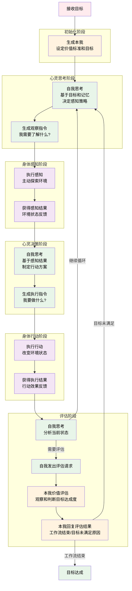
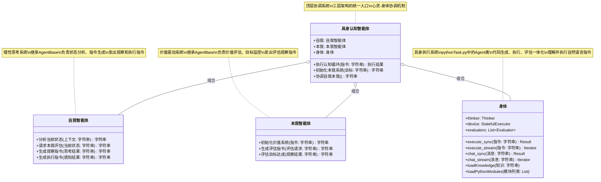
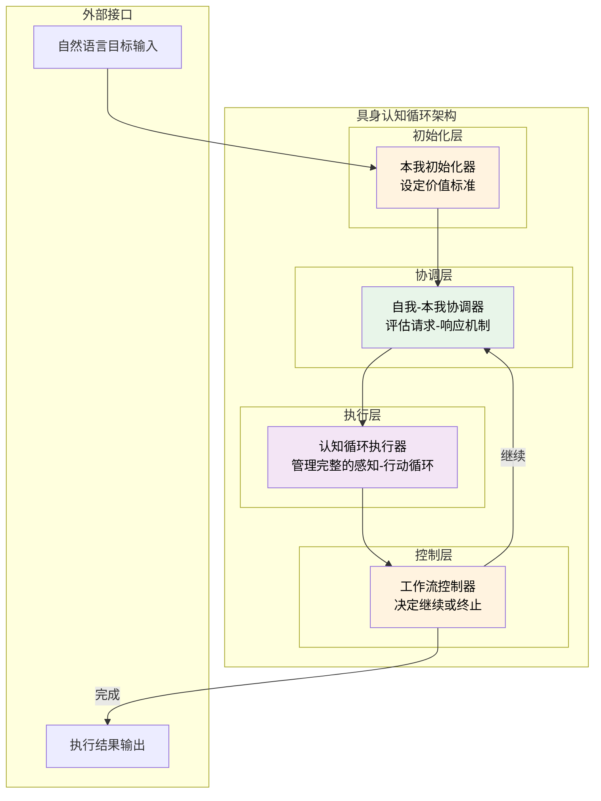

# 具身认知工作流概要设计

## 1. 项目背景与理论基础

### 1.1 项目演进历程

AgentFrameWork从静态工作流发展到动态认知系统，经历了重要的架构演进：

- **早期阶段**：基于固定工作流的多智能体协作系统
- **中期阶段**：引入CognitiveWorkflow的三角色动态导航
- **现阶段**：具身认知工作流的心身映射理论

### 1.2 具身认知理论核心

基于具身认知理论，我们建立了以下映射关系：

- **数字心灵**：LLM承担推理、理解、规划等高级认知功能
- **数字身体**：Python解释器提供感知、执行、反馈等物理交互能力
- **心身接口**：Python代码实现心灵意图到身体动作的转换

## 2. 系统架构设计

### 2.1 整体架构



### 2.2 核心组件详解

#### 2.2.1 心灵层 (Mental Layer)

基于精神分析理论的人格结构模型，心灵层分为自我和本我两个相互协调的智能体子系统：

**自我 (Ego Agent) - 理性思考系统**

继承AgentBase，负责逻辑推理和理性决策：

- **大语言模型推理引擎**：承担高级认知功能，理解、推理、规划、决策
- **工作记忆**：维护对话上下文和任务状态，支持动态记忆压缩
- **知识库**：存储长期经验和学习成果，提供知识检索和学习能力
- **理性协调**：与本我进行协调，平衡理性思考与价值驱动

**核心职责**：
- 分析和理解复杂任务
- 制定逻辑清晰的执行方案
- 管理记忆和知识资源
- 与本我协调确保方案的价值合理性

**本我 (Id Agent) - 价值驱动系统**

继承AgentBase，负责价值评估和目标监控：

- **价值评估**：定义任务目标和评估标准，判断行为的价值意义
- **目标监控**：通过发出观察指令来检查目标达成度
- **情感反应**：实现奖励机制，对成功和失败产生情感反馈
- **欲望识别**：分析用户需求和系统内在驱动，识别真正的目标
- **价值导向**：确保所有行为符合价值标准和伦理要求

**核心职责**：
- 设定和维护价值目标
- 主动观察目标达成情况
- 评估行为的价值合理性
- 提供情感驱动和动机
- 确保系统行为的伦理性

**自我与本我的协调机制**

- **评估请求机制**：自我在需要价值判断时向本我发出评估请求
- **评估结果反馈**：本我基于价值标准回复"工作流结束"或"目标未满足的具体原因"
- **制衡平衡**：避免纯理性或纯感性的极端决策
- **动态调整**：根据本我的评估结果，自我动态调整策略和行动方案
- **冲突解决**：当理性方案与价值标准冲突时，通过评估反馈机制协调

#### 2.2.2 身体层 (Body Layer)

**Agent - 具身智能体**

pythonTask.py中的Agent类是完整的具身智能体实现，整合了以下核心组件：

**Thinker (代码生成器)**
- 将心灵层的意图转化为可执行的Python代码
- 支持同步和流式代码生成
- 包含错误处理和代码优化循环

**Evaluator (代码评估器)**
- 评估代码执行结果是否符合预期
- 支持多重评估策略
- 提供任务完成度判断

**StatefulExecutor (有状态执行器)**
- 基于IPython的持久执行环境
- 维护变量状态和执行上下文
- 支持复杂的交互式计算

**感知执行能力**

通过Python代码实现的统一感知和执行能力：

- **文件系统访问**：读取、搜索、监控文件
- **网络请求**：API调用、数据爬取
- **数据分析**：处理和分析各种数据格式
- **文件操作**：创建、修改、删除文件
- **API调用**：与外部服务交互
- **自动化操作**：执行复杂的业务流程

**具身化特征**

Agent类体现了真正的具身化特征：
- 感知和执行共享同一个Python解释器环境
- 代码既是思维的表达，也是行动的指令
- 执行结果直接反馈到工作记忆，形成完整的感知-行动循环

## 3. 具身认知工作流

### 3.1 工作流程模型



### 3.2 具身认知工作流的核心特征

#### 3.2.1 增量式规划的动态决策

**本我的初始化作用**
- 工作流从生成本我开始，本我基于接收的目标设定价值标准
- 本我明确什么是成功，什么是可接受的，建立评估基准
- 为整个工作流程提供价值导向和终止条件

**即时感知策略**
- 自我基于当前状态和本我设定的目标，即时决定"需要了解什么"
- 不预设固定的感知计划，而是根据情况动态调整观察重点
- 每次感知都是主动探索，带着明确的问题去观察环境

**基于反馈的行动决策**
- 只有在获得充分的感知信息后，才制定具体的行动方案
- 行动决策完全依赖于实时的环境状态，而非预设计划
- 每个行动都是针对当前具体情况的最优响应

**双重思考机制的具身化**
- **第一次思考**：生成观察指令，如"查看当前目录结构"、"分析数据特征"
- **第二次思考**：生成执行指令，如"创建新文件"、"处理数据"
- 两次思考之间通过身体的感知行为连接，实现真正的心身协调

#### 3.2.2 自然语言指令的即时生成

**自我的观察和执行指令**
- 自我生成任务导向的观察指令，如"检查/data目录下的文件类型和大小"
- 自我基于感知结果生成具体的执行指令，如"创建数据分析脚本"
- 指令针对具体的任务需求，体现理性的问题解决策略

**本我的观察指令和价值评估**
- 本我响应自我的评估请求，生成价值评估导向的观察指令
- 本我基于观察结果向自我回复评估结果：
  - "工作流结束"：目标已达成，可以终止循环
  - "目标未满足，原因是..."：具体说明问题所在，指导自我调整策略
- 评估结果驱动工作流的继续或终止决策

#### 3.2.3 状态依赖的循环机制

**环境状态的动态感知**
- 每次循环都重新评估环境状态
- 不依赖过时的环境假设，始终基于最新信息决策
- 环境变化能够立即影响下一步的感知和行动策略

**记忆状态的累积更新**
- 每次感知和行动的结果都更新工作记忆
- 累积的经验影响后续的感知策略和行动决策
- 形成递进式的问题解决过程

**价值状态的持续监控**
- 本我响应自我的评估请求，通过主动观察监控目标达成度
- 本我基于观察结果向自我提供明确的评估结果
- 评估结果包括"工作流结束"或"目标未满足的具体原因"
- 这种请求-响应机制确保了价值监控的及时性和针对性

#### 3.2.4 具身学习的自然发生

**技能的即时形成**
- 成功的观察和行动模式在执行过程中自然积累
- 不需要专门的训练阶段，在实际任务中边做边学
- 形成针对特定情境的"反应模式"

**适应性的动态调整**
- 面对新的环境或任务，能够快速调整感知和行动策略
- 借鉴之前的经验，但不拘泥于固定模式
- 体现了真正的智能适应能力

**创造性的自然涌现**
- 通过感知-思考-行动的循环，自然产生创新的解决方案
- 创造性来自于对环境的深度理解和价值驱动的行动选择
- 不是刻意的创新，而是适应性行为的自然结果

## 4. 技术实现架构

### 4.1 核心类架构设计



### 4.2 认知循环实现架构



## 5. 概念验证

### 5.1 验证目标

通过具身认知工作流生成一个完整的Python Calculator类和对应的单元测试，验证以下核心特征：

1. **自我-本我协调**：理性分析与价值评估的结合
2. **增量式规划**：动态的感知-行动循环
3. **自然语言接口**：心灵层与身体层的无缝交互
4. **价值驱动决策**：确保生成的代码符合质量标准

### 5.2 工作流程演示

#### 5.2.1 初始化阶段 - 生成本我

**用户指令**：`"创建一个Python Calculator类，支持基本的四则运算，并生成完整的单元测试"`

**本我设定价值标准**：
```
核心价值：
- 代码质量：清晰、可读、可维护
- 功能完整：支持加减乘除运算
- 测试覆盖：完整的单元测试
- 错误处理：处理除零等异常情况
- 代码规范：遵循Python最佳实践

成功标准：
- Calculator类实现四个基本运算方法
- 包含适当的错误处理
- 单元测试覆盖所有功能和边界情况
- 代码通过执行验证
```

#### 5.2.2 第一轮循环

**自我思考 - 任务分析**：
```
任务分析：
1. 需要创建Calculator类，包含add、subtract、multiply、divide方法
2. 需要处理除零异常
3. 需要创建测试类验证所有功能
4. 需要确保代码质量和可读性

感知策略：先了解当前环境，检查是否有相关文件
```

**自我生成观察指令**：`"检查当前目录结构，看看是否已有calculator相关文件"`

**身体层执行感知**：
```python
import os
print("当前目录文件：", os.listdir('.'))
print("当前工作目录：", os.getcwd())
```

**感知结果**：
```
当前目录文件： ['README.md', 'src', 'tests', ...]
当前工作目录： /home/user/project
没有发现calculator相关文件，可以从零开始创建
```

**自我思考 - 制定行动方案**：
```
基于感知结果：
- 当前目录适合创建新文件
- 没有冲突的calculator文件
- 可以直接创建Calculator类和测试文件

行动计划：创建calculator.py文件，包含Calculator类
```

**自我生成执行指令**：`"创建calculator.py文件，实现Calculator类，包含四则运算方法和错误处理"`

**身体层执行行动**：
```python
calculator_code = '''
class Calculator:
    """一个简单的计算器类，支持基本的四则运算"""
    
    def add(self, a, b):
        """加法运算"""
        return a + b
    
    def subtract(self, a, b):
        """减法运算"""
        return a - b
    
    def multiply(self, a, b):
        """乘法运算"""
        return a * b
    
    def divide(self, a, b):
        """除法运算，处理除零异常"""
        if b == 0:
            raise ValueError("不能除以零")
        return a / b
'''

with open('calculator.py', 'w', encoding='utf-8') as f:
    f.write(calculator_code)

print("calculator.py文件已创建")
```

**自我思考 - 分析当前状态**：
```
当前状态分析：
- Calculator类已创建，包含四个基本运算方法
- 包含了除零异常处理
- 代码结构清晰，有文档字符串
- 但还需要创建单元测试

决策：继续下一轮循环，创建单元测试
```

#### 5.2.3 第二轮循环

**自我生成观察指令**：`"验证calculator.py文件内容，确认类结构正确"`

**身体层执行感知**：
```python
with open('calculator.py', 'r', encoding='utf-8') as f:
    content = f.read()
    print("Calculator类内容：")
    print(content)

# 验证类是否可以正确导入
try:
    exec(content)
    calc = Calculator()
    print("Calculator类可以正常实例化")
except Exception as e:
    print(f"发现问题：{e}")
```

**自我生成执行指令**：`"创建test_calculator.py文件，包含完整的单元测试"`

**身体层执行行动**：
```python
test_code = '''
import unittest
from calculator import Calculator

class TestCalculator(unittest.TestCase):
    
    def setUp(self):
        self.calc = Calculator()
    
    def test_add(self):
        """测试加法运算"""
        self.assertEqual(self.calc.add(2, 3), 5)
        self.assertEqual(self.calc.add(-1, 1), 0)
        self.assertEqual(self.calc.add(0, 0), 0)
    
    def test_subtract(self):
        """测试减法运算"""
        self.assertEqual(self.calc.subtract(5, 3), 2)
        self.assertEqual(self.calc.subtract(1, 1), 0)
        self.assertEqual(self.calc.subtract(0, 5), -5)
    
    def test_multiply(self):
        """测试乘法运算"""
        self.assertEqual(self.calc.multiply(3, 4), 12)
        self.assertEqual(self.calc.multiply(0, 10), 0)
        self.assertEqual(self.calc.multiply(-2, 3), -6)
    
    def test_divide(self):
        """测试除法运算"""
        self.assertEqual(self.calc.divide(10, 2), 5)
        self.assertEqual(self.calc.divide(7, 2), 3.5)
    
    def test_divide_by_zero(self):
        """测试除零异常"""
        with self.assertRaises(ValueError):
            self.calc.divide(10, 0)

if __name__ == '__main__':
    unittest.main()
'''

with open('test_calculator.py', 'w', encoding='utf-8') as f:
    f.write(test_code)

print("test_calculator.py文件已创建")
```

#### 5.2.4 评估阶段

**自我发出评估请求**：`"请评估当前Calculator类和测试是否符合要求"`

**本我生成评估观察指令**：`"运行单元测试，验证所有功能是否正常工作"`

**身体层执行评估观察**：
```python
import subprocess
import sys

# 运行单元测试
result = subprocess.run([sys.executable, '-m', 'unittest', 'test_calculator.py'], 
                       capture_output=True, text=True)

print("测试结果：")
print("返回码：", result.returncode)
print("标准输出：", result.stdout)
if result.stderr:
    print("错误输出：", result.stderr)

# 检查文件是否存在且内容正确
import os
files_created = []
if os.path.exists('calculator.py'):
    files_created.append('calculator.py')
if os.path.exists('test_calculator.py'):
    files_created.append('test_calculator.py')

print("已创建文件：", files_created)
```

**本我价值评估结果**：
```
评估结果：工作流结束

评估依据：
✅ Calculator类已创建，包含所有要求的方法
✅ 包含适当的错误处理（除零异常）
✅ 单元测试覆盖所有功能和边界情况
✅ 测试全部通过，返回码为0
✅ 代码结构清晰，符合Python最佳实践
✅ 文档字符串完整，代码可读性好

所有价值标准均已满足，目标达成！
```

### 5.3 验证结果

#### 5.3.1 生成的Calculator类
```python
class Calculator:
    """一个简单的计算器类，支持基本的四则运算"""
    
    def add(self, a, b):
        """加法运算"""
        return a + b
    
    def subtract(self, a, b):
        """减法运算"""
        return a - b
    
    def multiply(self, a, b):
        """乘法运算"""
        return a * b
    
    def divide(self, a, b):
        """除法运算，处理除零异常"""
        if b == 0:
            raise ValueError("不能除以零")
        return a / b
```

#### 5.3.2 生成的单元测试
```python
import unittest
from calculator import Calculator

class TestCalculator(unittest.TestCase):
    
    def setUp(self):
        self.calc = Calculator()
    
    def test_add(self):
        """测试加法运算"""
        self.assertEqual(self.calc.add(2, 3), 5)
        self.assertEqual(self.calc.add(-1, 1), 0)
        self.assertEqual(self.calc.add(0, 0), 0)
    
    def test_subtract(self):
        """测试减法运算"""
        self.assertEqual(self.calc.subtract(5, 3), 2)
        self.assertEqual(self.calc.subtract(1, 1), 0)
        self.assertEqual(self.calc.subtract(0, 5), -5)
    
    def test_multiply(self):
        """测试乘法运算"""
        self.assertEqual(self.calc.multiply(3, 4), 12)
        self.assertEqual(self.calc.multiply(0, 10), 0)
        self.assertEqual(self.calc.multiply(-2, 3), -6)
    
    def test_divide(self):
        """测试除法运算"""
        self.assertEqual(self.calc.divide(10, 2), 5)
        self.assertEqual(self.calc.divide(7, 2), 3.5)
    
    def test_divide_by_zero(self):
        """测试除零异常"""
        with self.assertRaises(ValueError):
            self.calc.divide(10, 0)

if __name__ == '__main__':
    unittest.main()
```

### 5.4 验证总结

本次概念验证成功展示了具身认知工作流的核心特征：

1. **价值驱动**：本我设定明确的质量标准，确保输出符合要求
2. **动态决策**：自我根据每一步的反馈动态调整策略
3. **自然交互**：所有指令都是自然语言，身体层直接理解执行
4. **完整循环**：从感知环境到生成代码到测试验证的完整流程
5. **质量保证**：通过价值评估确保最终结果满足所有要求

这个验证展示了具身认知工作流在代码生成任务中的有效性，证明了该架构能够产生高质量、可靠的软件开发成果。

## 6. 技术路线图

### 6.1 第一阶段：基础实现（当前）
- [ ] 完成基本的心身映射架构
- [ ] 实现感知-思考-行动循环
- [ ] 构建安全的代码执行环境
- [ ] 建立基础的记忆系统

### 6.2 第二阶段：能力增强
- [ ] 实现技能记忆和模式复用
- [ ] 增强评估系统的智能性
- [ ] 优化资源管理和性能
- [ ] 支持更多的感知和执行能力

### 6.3 第三阶段：高级特性
- [ ] 多智能体协作机制
- [ ] 元认知能力的实现
- [ ] 创造性问题解决
- [ ] 跨领域知识迁移

### 6.4 第四阶段：生态完善
- [ ] 开发者工具和SDK
- [ ] 应用模板和最佳实践
- [ ] 社区生态建设
- [ ] 标准化和规范化

## 7. 风险与挑战

### 7.1 技术风险
- **代码执行安全性**：需要完善的沙箱机制
- **资源消耗控制**：内存和计算资源的有效管理
- **系统稳定性**：复杂交互下的可靠性保证

### 7.2 应用风险
- **用户接受度**：新的交互模式需要适应时间
- **性能要求**：实时响应的技术挑战
- **扩展性限制**：大规模部署的技术瓶颈

### 7.3 缓解策略
- 分阶段实施，逐步验证
- 建立完善的测试体系
- 制定详细的安全规范
- 持续的用户反馈收集

## 8. 结论

具身认知工作流概要设计通过引入自我-本我的心灵层架构，将传统的AI系统从单一智能体模式升级为多层协调的人格化智能系统。这一创新性设计实现了以下重要突破：

### 8.1 理论创新

**心理学理论的数字化实现**
- 将精神分析理论中的人格结构模型成功应用于AI系统设计
- 创造性地实现了理性与感性的动态平衡机制
- 建立了价值驱动的智能决策框架

**具身认知的深化发展**
- 从简单的心身映射扩展为心灵层的内在结构化
- 实现了意图、价值、执行的多层次具身化
- 构建了完整的心-身-环境交互循环

### 8.2 技术突破

**多智能体协调架构**
- 自我与本我的对话协调机制
- 理性分析与价值评估的并行处理
- 冲突解决和妥协决策的智能化实现

**人格化AI系统**
- 具有连续性和一致性的人格特征
- 能够自主进行价值判断和伦理决策
- 实现了真正意义上的"智能体人格发展"

### 8.3 应用价值

**更自然的人机交互**
- 基于人格化决策过程的直观交互
- 理解用户深层需求和价值偏好
- 建立长期信任和协作关系

**更可靠的AI系统**
- 内置的价值检查和伦理约束机制
- 可解释的多层次决策过程
- 自主的合理性判断和纠错能力

### 8.4 发展前景

这一设计代表了AI发展的重要方向转变：

- **从工具型向人格型**：AI不再是被动的工具，而是具有人格特征的协作伙伴
- **从单维向多维**：不仅关注执行效率，更关注价值合理性和伦理性
- **从静态向成长型**：具备真正的学习成长和人格发展能力

具身认知工作流的自我-本我架构为构建下一代人格化AI系统奠定了重要的理论基础和技术框架，将推动AI向更加智能、可信、可解释的方向发展。