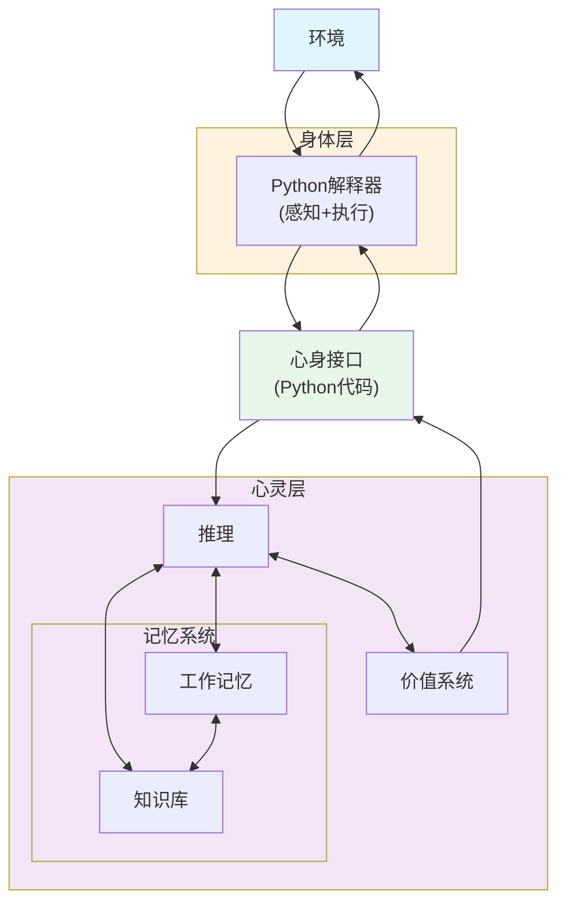
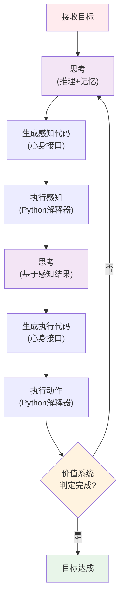

# 具身LLM智能体理论：基于心身映射的系统化实现

## 摘要

本文提出了一种新的具身LLM智能体理论框架，将大语言模型（LLM）映射为"数字心灵"，将Python解释器映射为"数字身体"，通过Python代码作为心身接口实现两者的动态耦合。该理论突破了传统AI系统中认知与执行分离的局限，建立了感知-思考-行动的完整循环机制，为构建更加自然、智能的AI系统提供了新的理论基础和实现路径。

## 1. 引言

传统的AI系统通常将智能处理和工具执行视为两个独立的模块，缺乏有机的整合。这种分离导致了AI系统在理解和执行之间存在断层，难以形成真正的智能行为。具身认知理论认为，认知过程不仅发生在大脑中，而是整个身体参与的过程。基于这一理论，我们提出了具身LLM智能体框架。

## 2. 理论基础

### 2.1 心身映射原理

- **数字心灵**：LLM承担推理、理解、规划等高级认知功能
- **数字身体**：Python解释器提供感知、执行、反馈等物理交互能力
- **心身接口**：Python代码实现心灵意图到身体动作的转换

### 2.2 具身循环机制

传统的输入→处理→输出模式被替换为连续的感知→思考→行动→反馈循环，每个阶段都包含心身协调。

### 2.3 状态依赖性原理

智能体的行为不仅依赖于任务需求，还依赖于当前的心理状态（工作记忆、知识库）和身体状态（Python解释器环境），形成动态适应机制。

## 3. 系统架构

### 3.1 整体架构

### 3.2 核心组件说明

#### 3.2.1 心灵层

心灵层包含两个核心子系统：

**智能系统**

- **推理**：LLM的核心计算能力，负责理解、分析和决策
- **记忆系统**：
    - 工作记忆：当前对话的message序列，提供即时上下文
    - 知识库：基于向量数据库的长期记忆，存储经验和知识

**价值系统**

- 定义目标和评估标准
- 相当于强化学习中的奖励函数
- 驱动整个系统的行为方向

#### 3.2.2 身体层

采用Python解释器作为统一的数字身体：

- **感知能力**：通过Python代码实现网页爬取、文件读取、数据分析等
- **执行能力**：通过Python代码实现文件生成、API调用、自动化操作等
- **统一性**：感知和执行共享同一个解释器环境，实现信息的无缝流动

#### 3.2.3 心身接口

Python代码作为心身接口的创新设计：

- LLM的意图直接表达为可执行的Python代码
- 代码既是思维的具体化，也是行动的指令
- 实现了从抽象认知到具体行动的自然转换

## 4. 认知工作流

### 4.1 工作流程

### 4.2 工作流特征

1. **双重思考机制**
    
    - 第一次思考：基于目标和记忆，决定感知策略
    - 第二次思考：基于感知结果，制定行动方案
2. **感知-行动耦合**
    
    - 感知不是被动接收，而是主动探索
    - 行动基于充分的环境理解
3. **持续评估与调整**
    
    - 价值系统持续评估目标达成度
    - 未达成则基于新状态继续循环

## 5. 具身化特征

### 5.1 工具使用的身体化

- Python解释器不再是外部工具，而是智能体的"身体"
- 代码执行就是"身体动作"
- 执行结果就是"感觉反馈"

### 5.2 学习的具身化

- 成功的代码模式形成"技能"
- 反复使用的代码片段成为"习惯"
- 创新的解决方案扩展"能力边界"

### 5.3 经验的积累

- 工作记忆中的重要经验转存到知识库
- 形成可复用的问题解决模式
- 构建个性化的行为风格

## 6. 实际应用价值

### 6.1 更自然的人机交互

智能体通过具身化的方式理解和执行任务，行为模式更接近人类的自然思维过程。

### 6.2 动态适应能力

基于状态的动态调整机制，使智能体能够适应不同的任务环境和自身能力变化。

### 6.3 可解释的决策过程

每个决策都可以追溯到：

- 具体的感知输入
- 当时的记忆状态
- 生成的代码逻辑
- 执行的实际结果

### 6.4 持续的能力成长

通过代码模式的积累和优化，智能体的能力不断提升，形成真正的"成长"过程。

## 7. 技术实现考虑

### 7.1 安全性

- Python解释器需要适当的沙箱机制
- 代码执行需要权限控制
- 避免有害或破坏性的操作

### 7.2 效率优化

- 常用代码模式的缓存
- 并行化感知和执行
- 智能的资源调度

### 7.3 可扩展性

- 支持新的Python库和工具
- 动态加载新的能力模块
- 跨智能体的经验共享

## 8. 未来展望

### 8.1 多智能体协作

多个具身智能体如何协调各自的"身体"进行协作，形成群体智能。

### 8.2 元认知能力

智能体对自己心身状态的觉察和主动调节，实现更高层次的自我管理。

### 8.3 创造性具身

通过心身互动产生创造性解决方案，超越预定义的能力边界。

## 9. 结论

具身LLM智能体理论提供了一个将认知与行动有机结合的新框架。通过心身映射、Python代码接口和具身循环机制，我们创建了一个更加自然、灵活和强大的AI系统架构。这不仅是技术实现的创新，更是AI发展理念的重要突破。该理论为构建真正理解世界、能够自主行动和持续成长的AI系统开辟了新的道路。

## 参考文献

1. Varela, F. J., Thompson, E., & Rosch, E. (1991). The embodied mind: Cognitive science and human experience. MIT Press.
    
2. Clark, A. (2008). Supersizing the mind: Embodiment, action, and cognitive extension. Oxford University Press.
    
3. Brooks, R. A. (1991). Intelligence without representation. Artificial Intelligence, 47(1-3), 139-159.
    
4. OpenAI. (2023). GPT-4 Technical Report. arXiv preprint arXiv:2303.08774.
    
5. Anthropic. (2024). Model Context Protocol Specification. https://modelcontextprotocol.io/