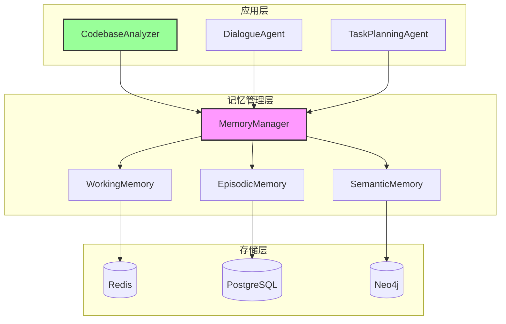

# 记忆管理架构设计

## 1. 设计决策：组合优于继承

### 1.1 核心决策
**使用组合（关联）而非继承**来实现代码库理解器与记忆管理系统的关系。

### 1.2 决策理由

| 评估维度 | 继承方案 | 组合方案（推荐） |
|---------|---------|----------------|
| 耦合度 | 高 - 子类依赖父类实现 | 低 - 仅依赖接口 |
| 灵活性 | 低 - 编译时绑定 | 高 - 运行时可切换 |
| 可测试性 | 困难 - 难以Mock父类 | 简单 - 易于注入Mock |
| 职责分离 | 混合 - 记忆管理与业务逻辑耦合 | 清晰 - 各司其职 |
| 扩展性 | 受限 - 单继承限制 | 开放 - 可组合多个服务 |

### 1.3 设计原则支撑

1. **单一职责原则（SRP）**
   - 记忆管理：负责存储、检索、生命周期管理
   - 代码库理解：负责代码分析、模式识别、文档生成

2. **开闭原则（OCP）**
   - 新的记忆存储策略不需要修改现有代码
   - 新的分析领域可以复用记忆管理组件

3. **依赖倒置原则（DIP）**
   - 高层模块（代码库理解）不依赖低层模块（具体存储）
   - 两者都依赖抽象（记忆管理接口）

4. **组合复用原则（CRP）**
   - 优先使用对象组合，而非类继承

## 2. 架构设计

### 2.1 整体架构



### 2.2 接口定义

```python
# 基础记忆接口
from abc import ABC, abstractmethod
from typing import Any, Dict, List, Optional
from datetime import datetime

class IMemory(ABC):
    """记忆层基础接口"""
    
    @abstractmethod
    def store(self, key: str, content: Any, metadata: Dict[str, Any] = None) -> str:
        """存储记忆项"""
        pass
    
    @abstractmethod
    def recall(self, query: str, limit: int = 10) -> List[Dict[str, Any]]:
        """检索记忆"""
        pass
    
    @abstractmethod
    def forget(self, key: str) -> bool:
        """删除记忆"""
        pass
    
    @abstractmethod
    def update(self, key: str, content: Any, metadata: Dict[str, Any] = None) -> bool:
        """更新记忆"""
        pass

class IWorkingMemory(IMemory):
    """工作记忆接口"""
    
    @abstractmethod
    def add_with_trigger(self, content: Any, trigger_type: str) -> Optional[str]:
        """基于触发器的记忆添加"""
        pass
    
    @abstractmethod
    def decay(self) -> int:
        """执行时间衰减，返回清理的项数"""
        pass
    
    @abstractmethod
    def get_attention_weights(self) -> Dict[str, float]:
        """获取注意力权重"""
        pass

class IEpisodicMemory(IMemory):
    """情景记忆接口"""
    
    @abstractmethod
    def store_episode(self, event: str, context: Dict[str, Any]) -> str:
        """存储情景事件"""
        pass
    
    @abstractmethod
    def query_timeline(self, start: datetime, end: datetime) -> List[Dict[str, Any]]:
        """按时间线查询"""
        pass
    
    @abstractmethod
    def get_project_context(self, project_id: str) -> Dict[str, Any]:
        """获取项目上下文"""
        pass

class ISemanticMemory(IMemory):
    """语义记忆接口"""
    
    @abstractmethod
    def add_concept(self, concept: Dict[str, Any]) -> str:
        """添加概念知识"""
        pass
    
    @abstractmethod
    def find_patterns(self, domain: str) -> List[Dict[str, Any]]:
        """查找领域模式"""
        pass
    
    @abstractmethod
    def get_knowledge_graph(self, root_concept: str, depth: int = 2) -> Dict[str, Any]:
        """获取知识图谱"""
        pass
```

### 2.3 记忆管理器实现

```python
class MemoryManager:
    """记忆管理器 - 协调三层记忆"""
    
    def __init__(self, 
                 working_memory: IWorkingMemory,
                 episodic_memory: IEpisodicMemory,
                 semantic_memory: ISemanticMemory):
        self.working = working_memory
        self.episodic = episodic_memory
        self.semantic = semantic_memory
        self._memory_transformers = self._init_transformers()
    
    def _init_transformers(self):
        """初始化记忆转换器"""
        return {
            'working_to_episodic': WorkingToEpisodicTransformer(),
            'episodic_to_semantic': EpisodicToSemanticTransformer(),
            'semantic_to_episodic': SemanticToEpisodicTransformer(),
            'episodic_to_working': EpisodicToWorkingTransformer()
        }
    
    def process_information(self, info: Dict[str, Any], source: str = 'external'):
        """处理新信息，决定存储层级"""
        importance = self._assess_importance(info)
        
        if importance < 0.3:
            # 低重要性 - 仅工作记忆
            self.working.add_with_trigger(info, source)
        elif importance < 0.7:
            # 中等重要性 - 工作记忆 + 情景记忆
            key = self.working.add_with_trigger(info, source)
            if key:
                self._promote_to_episodic(key, info)
        else:
            # 高重要性 - 全部三层
            key = self.working.add_with_trigger(info, source)
            episode_key = self._promote_to_episodic(key, info)
            self._consider_semantic_extraction(episode_key)
    
    def _promote_to_episodic(self, working_key: str, info: Dict[str, Any]) -> str:
        """将工作记忆提升到情景记忆"""
        transformer = self._memory_transformers['working_to_episodic']
        episode = transformer.transform(info)
        return self.episodic.store_episode(episode['event'], episode['context'])
    
    def _consider_semantic_extraction(self, episode_key: str):
        """考虑是否提取语义知识"""
        # 检查是否有足够的相似情景
        similar_episodes = self.episodic.recall(episode_key, limit=5)
        if len(similar_episodes) >= 3:
            transformer = self._memory_transformers['episodic_to_semantic']
            concept = transformer.extract_pattern(similar_episodes)
            if concept:
                self.semantic.add_concept(concept)
    
    def recall_with_context(self, query: str, context: Dict[str, Any] = None):
        """基于上下文的多层记忆召回"""
        results = {
            'working': [],
            'episodic': [],
            'semantic': []
        }
        
        # 1. 先查工作记忆（最相关的即时信息）
        results['working'] = self.working.recall(query, limit=5)
        
        # 2. 查情景记忆（历史经验）
        if context and 'project_id' in context:
            project_context = self.episodic.get_project_context(context['project_id'])
            results['episodic'] = self._contextual_recall(self.episodic, query, project_context)
        else:
            results['episodic'] = self.episodic.recall(query, limit=10)
        
        # 3. 查语义记忆（通用知识）
        results['semantic'] = self.semantic.recall(query, limit=10)
        
        # 4. 整合和排序结果
        return self._integrate_recall_results(results, context)
```

### 2.4 代码库分析器实现

```python
class CodebaseAnalyzer:
    """代码库分析器 - 使用记忆管理系统"""
    
    def __init__(self, memory_manager: MemoryManager):
        self.memory = memory_manager  # 组合关系
        self.analyzer_config = self._load_config()
    
    def analyze_codebase(self, path: str) -> Dict[str, Any]:
        """分析代码库主入口"""
        project_id = self._init_project(path)
        
        # Phase 1: 扫描和索引（使用工作记忆）
        self._scan_and_index(path, project_id)
        
        # Phase 2: 关键路径分析（工作记忆 → 情景记忆）
        self._analyze_critical_paths(project_id)
        
        # Phase 3: 模块深度分析（情景记忆）
        self._deep_module_analysis(project_id)
        
        # Phase 4: 架构模式识别（情景记忆 → 语义记忆）
        self._extract_architecture_patterns(project_id)
        
        # Phase 5: 生成文档（整合三层记忆）
        return self._generate_documentation(project_id)
    
    def _scan_and_index(self, path: str, project_id: str):
        """扫描代码库，结果存入工作记忆"""
        for file_path in self._walk_codebase(path):
            # 分析单个文件
            file_info = self._analyze_file(file_path)
            
            # 存入工作记忆
            self.memory.process_information({
                'type': 'file_scan',
                'project_id': project_id,
                'path': file_path,
                'info': file_info
            }, source='code_scanner')
    
    def _analyze_critical_paths(self, project_id: str):
        """分析关键路径，结果提升到情景记忆"""
        # 从工作记忆获取入口点
        entry_points = self.memory.working.recall('entry_point', limit=10)
        
        for entry in entry_points:
            # 追踪执行路径
            execution_path = self._trace_execution(entry['path'])
            
            # 重要路径存入情景记忆
            self.memory.process_information({
                'type': 'critical_path',
                'project_id': project_id,
                'entry': entry['path'],
                'path': execution_path,
                'importance': 0.8  # 高重要性
            }, source='path_analyzer')
    
    def _extract_architecture_patterns(self, project_id: str):
        """从情景记忆提取架构模式到语义记忆"""
        # 获取项目的所有情景记忆
        project_episodes = self.memory.episodic.get_project_context(project_id)
        
        # 识别架构模式
        patterns = self._identify_patterns(project_episodes)
        
        for pattern in patterns:
            # 高置信度的模式存入语义记忆
            if pattern['confidence'] > 0.7:
                self.memory.semantic.add_concept({
                    'type': 'architecture_pattern',
                    'name': pattern['name'],
                    'characteristics': pattern['characteristics'],
                    'examples': pattern['examples'],
                    'domain': 'software_architecture'
                })
```

## 3. 扩展性设计

### 3.1 新增分析领域

```python
# 对话管理Agent - 复用相同的记忆管理系统
class DialogueAgent:
    def __init__(self, memory_manager: MemoryManager):
        self.memory = memory_manager  # 同样使用组合
        
    def process_dialogue(self, utterance: str, user_id: str):
        # 存储到工作记忆
        self.memory.process_information({
            'type': 'user_utterance',
            'user_id': user_id,
            'text': utterance,
            'timestamp': datetime.now()
        }, source='dialogue')
        
        # 检索相关历史
        context = {'user_id': user_id}
        memories = self.memory.recall_with_context(utterance, context)
        
        # 生成回复...

# 任务规划Agent
class TaskPlanningAgent:
    def __init__(self, memory_manager: MemoryManager):
        self.memory = memory_manager
        
    def create_plan(self, goal: str):
        # 从语义记忆检索相关模式
        patterns = self.memory.semantic.find_patterns('task_planning')
        
        # 从情景记忆获取类似任务
        similar_tasks = self.memory.episodic.recall(f"goal similar to {goal}")
        
        # 生成计划...
```

### 3.2 新增存储策略

```python
# 分布式记忆存储实现
class DistributedWorkingMemory(IWorkingMemory):
    def __init__(self, redis_cluster: RedisCluster):
        self.storage = redis_cluster
        
    def store(self, key: str, content: Any, metadata: Dict = None) -> str:
        # 分布式存储逻辑
        pass

# 图数据库语义记忆
class GraphSemanticMemory(ISemanticMemory):
    def __init__(self, neo4j_driver: Neo4jDriver):
        self.graph = neo4j_driver
        
    def add_concept(self, concept: Dict[str, Any]) -> str:
        # 图数据库存储逻辑
        pass

# 注入不同实现
memory_manager = MemoryManager(
    working_memory=DistributedWorkingMemory(redis_cluster),
    episodic_memory=PostgreSQLEpisodicMemory(pg_conn),
    semantic_memory=GraphSemanticMemory(neo4j_driver)
)

# 所有Agent无需修改即可使用新的存储策略
analyzer = CodebaseAnalyzer(memory_manager)
```

## 4. 测试策略

### 4.1 单元测试

```python
# 易于Mock的测试
class TestCodebaseAnalyzer:
    def test_analyze_codebase(self):
        # 创建Mock记忆管理器
        mock_memory = Mock(spec=MemoryManager)
        mock_memory.process_information.return_value = "test_key"
        mock_memory.recall_with_context.return_value = {
            'working': [],
            'episodic': [{'type': 'test_episode'}],
            'semantic': []
        }
        
        # 注入Mock
        analyzer = CodebaseAnalyzer(mock_memory)
        
        # 测试分析功能
        result = analyzer.analyze_codebase("/test/path")
        
        # 验证记忆管理器被正确调用
        assert mock_memory.process_information.called
        assert mock_memory.recall_with_context.called
```

### 4.2 集成测试

```python
# 使用内存版记忆管理器进行集成测试
def test_integration():
    # 使用轻量级内存实现
    memory_manager = MemoryManager(
        working_memory=InMemoryWorkingMemory(),
        episodic_memory=InMemoryEpisodicMemory(),
        semantic_memory=InMemorySemanticMemory()
    )
    
    analyzer = CodebaseAnalyzer(memory_manager)
    result = analyzer.analyze_codebase("./test_project")
    
    assert 'architecture_style' in result
    assert 'patterns' in result
```

## 5. 性能优化

### 5.1 懒加载策略

```python
class LazyMemoryManager(MemoryManager):
    """延迟初始化的记忆管理器"""
    
    def __init__(self):
        self._working = None
        self._episodic = None
        self._semantic = None
    
    @property
    def working(self):
        if self._working is None:
            self._working = self._create_working_memory()
        return self._working
    
    # 类似的懒加载其他记忆层...
```

### 5.2 缓存策略

```python
class CachedMemoryManager(MemoryManager):
    """带缓存的记忆管理器"""
    
    def __init__(self, *args, **kwargs):
        super().__init__(*args, **kwargs)
        self._recall_cache = LRUCache(maxsize=1000)
    
    def recall_with_context(self, query: str, context: Dict = None):
        cache_key = self._make_cache_key(query, context)
        
        if cache_key in self._recall_cache:
            return self._recall_cache[cache_key]
        
        result = super().recall_with_context(query, context)
        self._recall_cache[cache_key] = result
        return result
```

## 6. 总结

### 6.1 组合方案的优势

1. **解耦**：代码库分析逻辑与记忆管理完全分离
2. **复用**：多个Agent可共享同一记忆管理系统
3. **灵活**：可在运行时切换不同的记忆存储策略
4. **可测**：易于创建Mock进行单元测试
5. **扩展**：新功能通过组合而非修改实现

### 6.2 架构收益

- **维护成本降低**：修改记忆管理不影响业务逻辑
- **团队协作改善**：不同团队可独立开发记忆管理和业务逻辑
- **性能优化空间**：可针对不同记忆层独立优化
- **部署灵活性**：记忆管理可作为独立服务部署

### 6.3 设计模式应用

- **策略模式**：不同的记忆存储策略
- **工厂模式**：创建不同类型的记忆实例
- **观察者模式**：记忆变化通知
- **适配器模式**：适配不同的存储后端

这种基于组合的设计为构建灵活、可扩展的Agent记忆系统奠定了坚实基础。