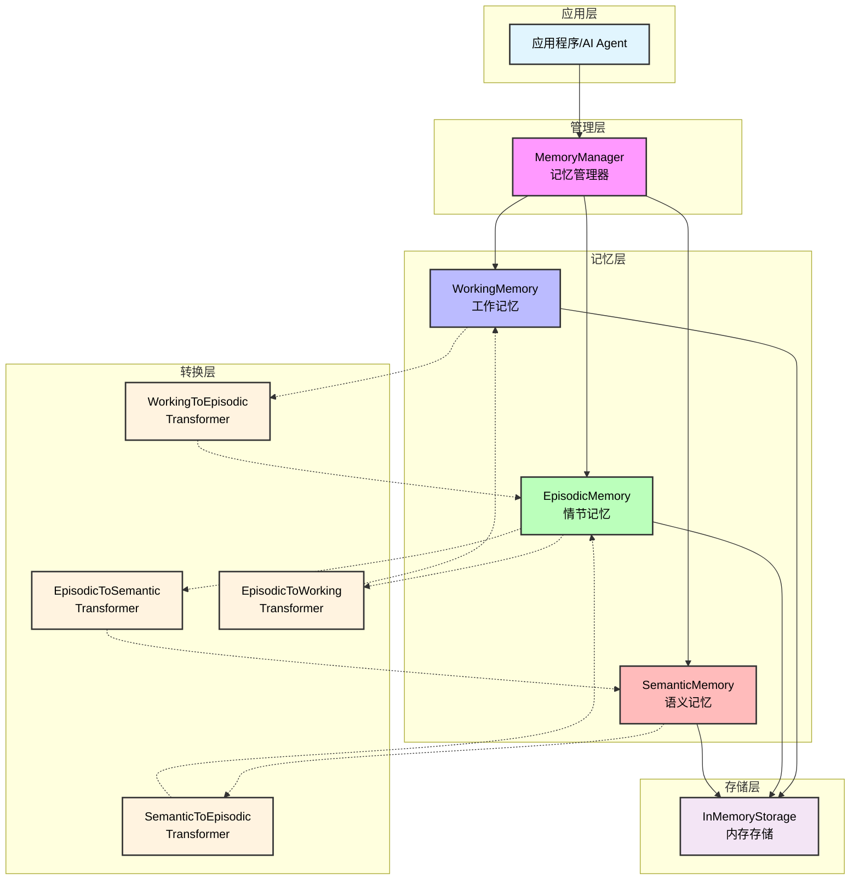
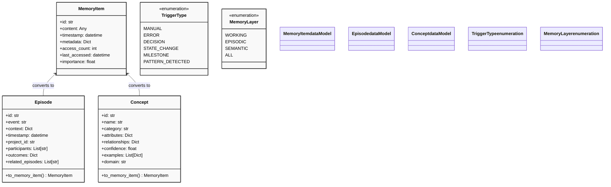
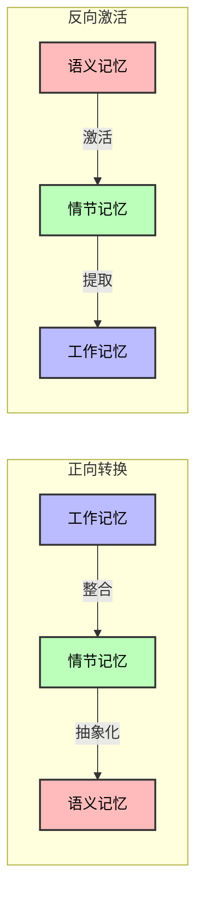

# 记忆管理系统架构文档

## 1. 概述

### 1.1 系统简介
记忆管理系统是一个多层次的认知架构，模拟人类记忆的工作方式，为AI智能体提供持久化的记忆能力和上下文感知能力。

### 1.2 核心特点
- **多层次**：工作记忆、情节记忆、语义记忆三层架构
- **动态转换**：记忆在不同层次间自动流转和转换
- **上下文感知**：基于上下文的智能检索
- **模式识别**：自动发现和学习行为模式

### 1.3 应用场景
- AI智能体的长期记忆
- 知识管理系统
- 对话系统上下文保持
- 项目经验积累
- 模式识别和学习

## 2. 系统架构

### 2.1 整体架构



### 2.2 类图结构

```mermaid
classDiagram
    class IMemory {
        <<interface>>
        +store(key, content, metadata) str
        +recall(query, limit) List[MemoryItem]
        +forget(key) bool
        +update(key, content, metadata) bool
        +exists(key) bool
        +get(key) MemoryItem
        +list_all(limit, offset) List[MemoryItem]
        +clear() int
        +size() int
    }
    
    class IWorkingMemory {
        <<interface>>
        +add_with_trigger(content, trigger_type) str
        +decay() int
        +get_attention_weights() Dict
        +update_attention(key, weight_delta) bool
        +get_capacity() int
        +set_capacity(capacity) None
    }
    
    class IEpisodicMemory {
        <<interface>>
        +store_episode(event, context) str
        +query_timeline(start, end, project_id) List[Episode]
        +get_project_context(project_id) Dict
        +link_episodes(id1, id2, relationship) bool
        +get_related_episodes(id, relationship) List[Episode]
    }
    
    class ISemanticMemory {
        <<interface>>
        +add_concept(concept) str
        +find_patterns(domain, min_confidence) List[Concept]
        +get_knowledge_graph(root, depth) Dict
        +update_concept_confidence(id, delta) bool
        +merge_concepts(id1, id2) str
        +get_concepts_by_category(category) List[Concept]
    }
    
    class BaseMemory {
        -storage: InMemoryStorage
        +store(key, content, metadata) str
        +recall(query, limit) List[MemoryItem]
        +get_statistics() Dict
    }
    
    class WorkingMemory {
        -capacity: int
        -decay_threshold: timedelta
        -attention_weights: Dict
        -trigger_config: Dict
        +consolidate() Dict
    }
    
    class EpisodicMemory {
        -project_index: Dict
        -timeline: List
        -relationships: Dict
        +find_similar_episodes(id, limit) List[Episode]
        +analyze_patterns(project_id, min_occurrences) List[Dict]
    }
    
    class SemanticMemory {
        -category_index: Dict
        -domain_index: Dict
        -concept_cache: Dict
        +extract_concept_from_examples(examples, category) Concept
        +calculate_concept_similarity(id1, id2) float
    }
    
    class MemoryManager {
        +working: IWorkingMemory
        +episodic: IEpisodicMemory
        +semantic: ISemanticMemory
        -transformers: Dict
        +process_information(info, source, trigger_type) Dict
        +recall_with_context(query, context, layers) Dict
        +promote_memory(source_layer, target_layer, id) str
        +analyze_memory_patterns(time_window, min_occurrences) Dict
    }
    
    IMemory <|-- IWorkingMemory
    IMemory <|-- IEpisodicMemory
    IMemory <|-- ISemanticMemory
    
    IMemory <|.. BaseMemory
    BaseMemory <|-- WorkingMemory
    BaseMemory <|-- EpisodicMemory
    BaseMemory <|-- SemanticMemory
    
    IWorkingMemory <|.. WorkingMemory
    IEpisodicMemory <|.. EpisodicMemory
    ISemanticMemory <|.. SemanticMemory
    
    MemoryManager --> IWorkingMemory
    MemoryManager --> IEpisodicMemory
    MemoryManager --> ISemanticMemory
    
    classDef default fill:#f9f9f9,stroke:#333,stroke-width:2px,color:#000
    classDef interface fill:#e3f2fd,stroke:#1976d2,stroke-width:2px,color:#000
    classDef concrete fill:#f3e5f5,stroke:#7b1fa2,stroke-width:2px,color:#000
    classDef manager fill:#e8f5e8,stroke:#388e3c,stroke-width:2px,color:#000
    
    class IMemory interface
    class IWorkingMemory interface
    class IEpisodicMemory interface
    class ISemanticMemory interface
    class BaseMemory concrete
    class WorkingMemory concrete
    class EpisodicMemory concrete
    class SemanticMemory concrete
    class MemoryManager manager
```



### 2.3 数据模型



## 3. 核心组件详解

### 3.1 工作记忆（Working Memory）

#### 核心功能
- **容量限制**：有限的存储空间和注意力分配
- **时间衰减**：记忆项随时间自动衰减
- **触发机制**：基于不同事件类型的自动触发
- **注意力权重**：动态调整记忆项的重要性
- **整合机制**：将短期记忆整合为长期记忆

#### 核心算法

**衰减公式**
```python
新权重 = 当前权重 * (1 + 重要性加权) / (1 + 时间衰减因子)
```

**触发类型**
- `MANUAL`：手动触发
- `ERROR`：错误事件
- `DECISION`：决策事件
- `STATE_CHANGE`：状态变化
- `MILESTONE`：里程碑事件
- `PATTERN_DETECTED`：模式检测

### 3.2 情节记忆（Episodic Memory）

#### 核心功能
- **事件存储**：存储具体的事件和情境记忆
- **时间线索**：基于时间顺序的检索
- **关系链接**：事件之间的关联关系
- **模式分析**：识别重复出现的事件模式
- **项目上下文**：按项目组织的记忆

#### 索引结构
1. **项目索引**：`project_id -> [episode_ids]`
2. **时间索引**：`[(timestamp, episode_id)]`（已排序）
3. **关系索引**：`episode_id -> {relationship -> [related_ids]}`

### 3.3 语义记忆（Semantic Memory）

#### 核心功能
- **概念存储**：存储抽象概念和知识
- **模式识别**：从具体事件中提取抽象模式
- **知识图谱**：构建概念间的关系网络
- **置信度管理**：动态调整概念的可信度
- **领域分类**：按领域组织知识

#### 核心机制
- **概念提取**：从具体事件中抽象出概念
- **关系建模**：建立概念间的语义关系
- **置信度计算**：基于证据更新概念置信度
- **知识推理**：基于已有知识进行推理

### 3.4 记忆管理器（Memory Manager）

#### 核心职责
1. **信息处理**：统一处理输入信息并分发到各层
2. **层间协调**：协调不同记忆层之间的交互
3. **记忆转换**：控制记忆在不同层次间的转换
4. **上下文检索**：提供基于上下文的智能检索
5. **模式分析**：跨层次的模式识别和分析

#### 重要性评估

| 重要性区间 | 处理策略 |
|-----------|---------|
| 0.0 - 0.3 | 仅保留在工作记忆 |
| 0.3 - 0.7 | 工作记忆 + 可能转换为情节记忆 |
| 0.7 - 1.0 | 全层次存储 |

## 4. 记忆转换机制

### 4.1 转换流程



### 4.2 转换器详解

#### WorkingToEpisodicTransformer
- **触发条件**：工作记忆中重要性超过阈值的记忆项
- **转换过程**：
  1. 评估工作记忆中的记忆项
  2. 识别具有情节特征的内容
  3. 构建情节上下文和参与者信息
  4. 创建情节记忆
  5. 建立关联关系

#### EpisodicToSemanticTransformer
- **触发条件**：发现重复的事件模式
- **转换过程**：
  1. 分析情节记忆中的事件模式
  2. 识别重复出现的要素
  3. 抽象化形成概念
  4. 建立概念间的关系
  5. 更新语义知识

#### SemanticToEpisodicTransformer
- **应用场景**：基于概念知识激活相关情节
- **转换过程**：
  1. 根据语义查询
  2. 激活相关概念
  3. 基于概念激活相关情节
  4. 提供情节上下文

#### EpisodicToWorkingTransformer
- **应用场景**：根据当前情境激活相关工作记忆
- **转换过程**：
  1. 分析当前情节的关键要素
  2. 查找相关的工作记忆片段
  3. 调整重要性权重
  4. 激活到工作记忆

## 5. 核心算法

### 5.1 相似度计算

```python
def calculate_similarity(text1: str, text2: str) -> float:
    """Jaccard相似度计算"""
    words1 = set(extract_words(text1))
    words2 = set(extract_words(text2))
    
    intersection = words1.intersection(words2)
    union = words1.union(words2)
    
    return len(intersection) / len(union) if union else 0.0
```

### 5.2 重要性评估

```python
def calculate_importance(content: Any, metadata: dict) -> float:
    importance = 0.5  # 基础值
    
    # 内容长度权重
    if len(str(content)) > 500:
        importance += 0.1
    
    # 特殊事件权重
    if metadata.get('has_error'):
        importance += 0.2
    if metadata.get('is_decision'):
        importance += 0.2
    
    return min(1.0, importance)
```

### 5.3 模式识别

```python
def analyze_patterns(episodes: List[Episode], min_occurrences: int) -> List[Pattern]:
    # 按事件类型分组
    event_patterns = defaultdict(list)
    
    for episode in episodes:
        event_key = normalize_event(episode.event)
        event_patterns[event_key].append(episode)
    
    # 识别重复模式
    patterns = []
    for event_key, episodes in event_patterns.items():
        if len(episodes) >= min_occurrences:
            patterns.append(create_pattern(event_key, episodes))
    
    return patterns
```

## 6. 使用示例

### 6.1 基本使用

```python
from memory_manager import MemoryManager
from interfaces import TriggerType

# 初始化记忆管理器
mm = MemoryManager()

# 存储信息
result = mm.process_information(
    "发现安全漏洞",
    trigger_type=TriggerType.ERROR,
    metadata={'severity': 'critical', 'importance': 0.9}
)

# 检索记忆
memories = mm.recall_with_context(
    "安全问题",
    context={'project_id': 'security_audit'}
)
```

### 6.2 情节记忆操作

```python
# 存储项目事件
episode_id = mm.episodic.store_episode(
    event="代码审查完成",
    context={
        'reviewer': 'alice',
        'issues_found': 5,
        'severity': 'medium'
    },
    project_id="backend_v2"
)

# 查询项目上下文
project_context = mm.episodic.get_project_context("backend_v2")
print(f"项目共有 {project_context['episodes_count']} 个事件")
```

### 6.3 高级功能

```python
# 模式分析
patterns = mm.analyze_memory_patterns(
    min_pattern_occurrences=3
)

# 手动提升记忆层次
mm.promote_memory(
    MemoryLayer.WORKING,
    MemoryLayer.EPISODIC,
    memory_id
)
```

## 7. 扩展性

### 7.1 自定义存储后端

```python
class RedisStorage(InMemoryStorage):
    def __init__(self, redis_client):
        self.redis = redis_client
    
    def put(self, key: str, item: MemoryItem):
        # Redis存储实现
        self.redis.set(key, serialize(item))
    
    def get(self, key: str) -> MemoryItem:
        # Redis检索实现
        data = self.redis.get(key)
        return deserialize(data) if data else None
```

### 7.2 自定义触发器

```python
class CustomWorkingMemory(WorkingMemory):
    def __init__(self, *args, **kwargs):
        super().__init__(*args, **kwargs)
        
        # 添加自定义触发器
        self._trigger_config[TriggerType.CUSTOM] = self._custom_trigger
    
    def _custom_trigger(self, content: Any, **kwargs) -> bool:
        # 自定义触发逻辑
        return 'important_keyword' in str(content)
```

### 7.3 集成到AI Agent

```python
class CognitiveAgent:
    def __init__(self):
        self.memory = MemoryManager()
    
    def process_task(self, task):
        # 记录任务开始
        self.memory.process_information(
            f"开始执行任务: {task.name}",
            trigger_type=TriggerType.STATE_CHANGE
        )
        
        # 执行任务...
        result = self.execute(task)
        
        # 记录任务结果
        self.memory.process_information(
            f"任务完成: {result}",
            trigger_type=TriggerType.MILESTONE,
            metadata={'task_id': task.id, 'success': result.success}
        )
```

## 8. 优势

### 8.1 架构优势
- **分层清晰**：明确的工作记忆、情节记忆、语义记忆分层
- **动态转换**：自动化的记忆层次转换
- **可扩展性**：良好的接口设计支持扩展

### 8.2 功能优势
- **智能检索**：基于上下文的智能记忆检索
- **模式识别**：自动发现事件模式和知识抽象
- **项目隔离**：支持多项目的记忆隔离

### 8.3 性能优势
- **内存优化**：合理的记忆衰减和转换机制
- **缓存机制**：多层次的缓存提升检索性能
- **异步处理**：支持异步的记忆处理

## 9. 最佳实践

### 9.1 设计原则
1. **分层明确**：明确区分不同层次的记忆职责
2. **触发驱动**：基于事件触发的记忆转换
3. **上下文感知**：充分利用上下文信息提升检索质量

### 9.2 性能优化
1. **合理阈值**：根据应用场景调整重要性阈值
2. **索引优化**：为频繁查询的字段建立索引
3. **批处理**：对大量记忆操作进行批处理

### 9.3 记忆管理
1. **定期清理**：定期清理过期和低重要性的记忆
2. **知识整合**：定期进行知识整合和去重
3. **监控分析**：监控记忆系统的运行状况

## 10. 监控与分析

### 10.1 核心指标

| 指标 | 描述 | 计算方法 |
|-----|---------|---------|
| 记忆转换率 | 记忆层次转换的成功率 | 成功转换数/总转换数 |
| 检索准确率 | 查询结果的准确性 | 相关结果数/总结果数 |
| 转换延迟 | 记忆转换的平均延迟 | 总转换时间/转换次数 |
| 容量利用率 | 各层记忆的容量使用率 | 已用容量/总容量 |

### 10.2 监控方法
1. 使用 `get_statistics()` 获取统计信息
2. 设置记忆层次转换的监控点
3. 定期分析记忆转换的效果
4. 监控系统资源使用情况

## 11. 应用场景

### 11.1 适用场景
- 智能客服系统
- Agent项目开发
- 对话式AI系统
- 知识管理平台
- 决策支持系统

### 11.2 技术栈
- 机器学习框架
- 自然语言处理
- 图数据库
- 向量数据库
- 分布式存储

## 12. 总结

记忆管理系统提供了一个完整的认知架构，模拟人类记忆的分层结构和转换机制。通过工作记忆、情节记忆和语义记忆的有机结合，系统能够为AI智能体提供持久化的记忆能力和上下文感知能力。这种架构不仅支持短期的工作记忆管理，还能够通过智能转换机制将重要信息转化为长期记忆，从而实现真正的认知智能。

系统具有良好的扩展性和可定制性，能够适应不同应用场景的需求。通过合理的配置和优化，可以构建出高性能、高可用的记忆管理系统，为AI应用提供强大的记忆支持。