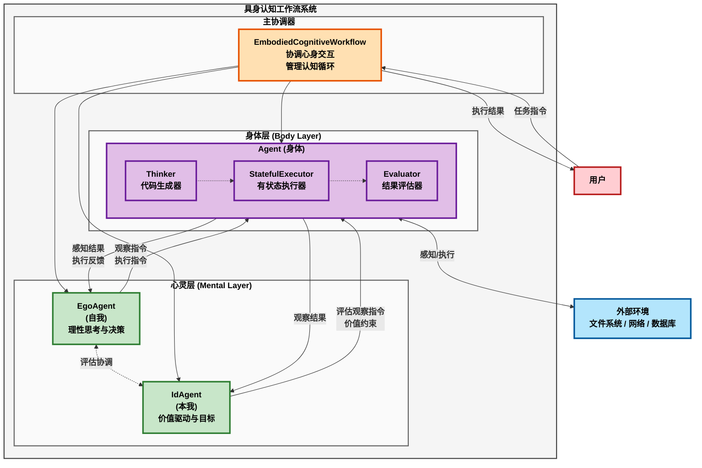
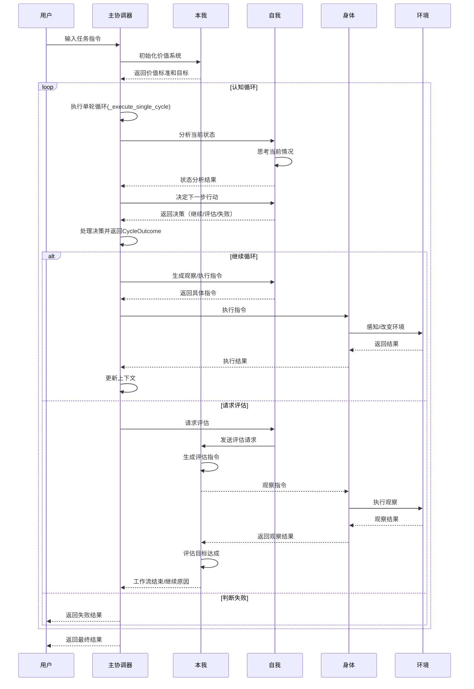
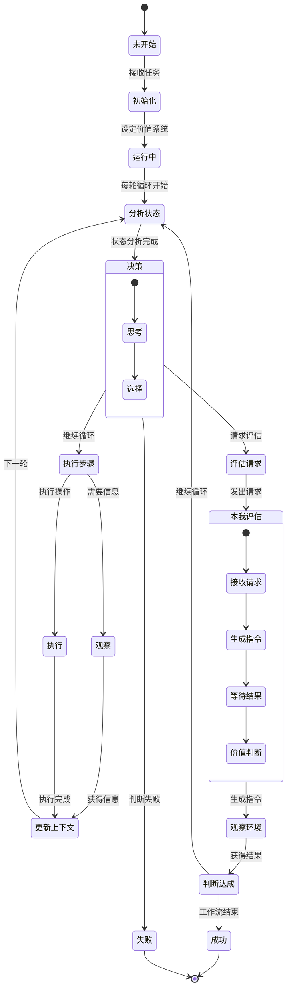

# 具身认知工作流技术实现架构文档

## 1. 概述

具身认知工作流（Embodied Cognitive Workflow）是AgentFrameWork项目中最新的认知架构实现，基于具身认知理论，将大语言模型映射为"数字心灵"，Python解释器映射为"数字身体"，通过心身协调实现智能体的自主认知循环。

## 2. 系统架构

### 2.1 整体架构图



### 2.2 核心组件

#### 2.2.1 EmbodiedCognitiveWorkflow（主协调器）

**文件位置**: `embodied_cognitive_workflow.py`

**核心职责**:
- 协调心灵层（自我+本我）和身体层的交互
- 管理认知循环的执行流程
- 实现"走一步看一步"的动态认知机制

**关键属性**:
```python
- llm: BaseChatModel           # 语言模型
- body: Agent                  # 身体层Agent实例
- ego: EgoAgent               # 自我智能体
- id_agent: IdAgent           # 本我智能体
- max_cycles: int             # 最大循环次数
- current_cycle_count: int    # 当前循环计数
- _status: WorkflowStatus     # 工作流状态枚举
- workflow_status: str        # 工作流状态字符串（向后兼容）
- execution_history: list     # 执行历史
```

**新增数据类**:
```python
@dataclass
class CycleOutcome:
    """单轮认知循环的执行结果"""
    continue_workflow: bool              # 是否继续工作流
    cycle_data: Optional[str] = None    # 本轮循环产生的数据
    final_result: Optional[Result] = None  # 如果工作流结束，包含最终结果
    decision_type: Optional[DecisionType] = None  # 本轮的决策类型
```

**核心方法**:
```python
- execute_cognitive_cycle(instruction: str) -> Result
  # 执行完整的具身认知工作流

- _execute_single_cycle(context: WorkflowContext) -> CycleOutcome
  # 执行单轮认知循环，返回循环结果

- _execute_main_loop(context: WorkflowContext) -> Result
  # 执行主循环，管理多轮认知循环

- _handle_evaluation_request(context: WorkflowContext) -> CycleOutcome
  # 处理自我的评估请求（参数优化）

- _handle_judgment_failed(context: WorkflowContext) -> CycleOutcome
  # 处理判断失败情况

- _handle_continue_cycle(context: WorkflowContext) -> CycleOutcome
  # 处理继续循环情况

- _execute_cognitive_step(context: WorkflowContext) -> Optional[str]
  # 执行一个认知步骤（观察或执行），使用完整上下文信息
```

#### 2.2.2 EgoAgent（自我智能体）

**文件位置**: `ego_agent.py`

**核心职责**:
- 理性思考和决策
- 分析当前状态
- 生成观察和执行指令
- 与本我协调评估

**继承关系**: 继承自 `AgentBase`

**关键方法**:
```python
- analyze_current_state(context: str) -> str
  # 分析当前状态和情况

- decide_next_action(state_analysis: str) -> Literal["继续循环", "请求评估", "判断失败"]
  # 决定下一步行动方向

- request_id_evaluation(current_state: str) -> str
  # 请求本我进行评估

- generate_observation_instruction(thinking_result: str) -> str
  # 生成观察指令

- generate_execution_instruction(perception_result: str) -> str
  # 生成执行指令

- handle_execution_error(error_info: str, original_instruction: str) -> str
  # 处理执行错误
```

#### 2.2.3 IdAgent（本我智能体）

**文件位置**: `id_agent.py`

**核心职责**:
- 价值驱动和目标设定
- 响应评估请求
- 判断目标达成情况
- 维护价值标准

**继承关系**: 继承自 `AgentBase`

**关键方法**:
```python
- initialize_value_system(instruction: str) -> str
  # 初始化价值系统，设定目标和标准

- generate_evaluation_instruction(evaluation_request: str) -> str
  # 生成评估观察指令

- evaluate_goal_achievement(observation_result: str) -> str
  # 评估目标是否达成

- get_current_goal() -> str
  # 获取当前目标描述

- get_value_standard() -> str
  # 获取价值标准

- adjust_value_standard(adjustment_description: str) -> str
  # 调整价值标准
```

#### 2.2.4 Agent（身体层）

**文件位置**: `../pythonTask.py`

**核心职责**:
- 执行自然语言指令
- 提供感知和执行能力
- 维护执行环境状态

**关键组件**:
- **Thinker**: 将自然语言转换为Python代码
- **StatefulExecutor**: 有状态的Python执行环境
- **Evaluator**: 评估执行结果

## 3. 认知循环流程

### 3.1 工作流程序列图



### 3.2 状态转换图



## 4. 关键技术实现

### 4.1 心身接口机制

**自然语言指令生成**:
```python
# 自我生成观察指令
def generate_observation_instruction(self, thinking_result: str) -> str:
    message = f"""基于以下思考结果，生成一个观察指令：
    
    思考结果：
    {thinking_result}
    
    生成一个具体的观察指令，告诉身体需要了解什么信息。
    """
    result = self.chat_sync(message)
    return result.return_value

# 身体理解并执行
def chat_sync(self, message: str) -> Result:
    # Agent类自动将自然语言转换为适当的感知或对话操作
    return super().chat_sync(message)
```

### 4.2 评估协调机制

**自我-本我协调流程**:
```python
# 1. 自我请求评估（使用context中的current_state）
evaluation_request = self.ego.request_id_evaluation(context.current_state)

# 2. 本我生成评估指令
evaluation_instruction = self.id_agent.generate_evaluation_instruction(evaluation_request)

# 3. 身体执行观察
observation_result = self.body.execute_sync(evaluation_instruction)

# 4. 本我评估结果（返回JSON格式）
evaluation_json = self.id_agent.evaluate_goal_achievement(observation_result.return_value)

# 5. 解析评估结果并返回CycleOutcome
evaluation_data = json.loads(evaluation_json)
goal_achieved = evaluation_data.get("目标是否达成", False)

if goal_achieved:
    return CycleOutcome(
        continue_workflow=False,
        final_result=Result(...),
        decision_type=DecisionType.REQUEST_EVALUATION
    )
else:
    return CycleOutcome(
        continue_workflow=True,
        cycle_data=f"评估结果：{reason}",
        decision_type=DecisionType.REQUEST_EVALUATION
    )
```

### 4.3 动态决策机制

**自我的三种决策**:
```python
def decide_next_action(self, state_analysis: str) -> Literal["继续循环", "请求评估", "判断失败"]:
    # 基于状态分析，动态决定：
    # - "继续循环": 还有明确的下一步
    # - "请求评估": 可能达到目标，需要确认
    # - "判断失败": 目标无法达成
```

**决策执行机制（优化后）**:
```python
def _execute_single_cycle(self, context: WorkflowContext) -> CycleOutcome:
    # 分析状态
    self._analyze_current_state(context)
    
    # 做出决策
    decision = self._make_decision(context.current_state)
    
    # 直接在此方法中处理决策，无需额外的_execute_decision方法
    if decision == DecisionType.REQUEST_EVALUATION:
        return self._handle_evaluation_request(context)
    elif decision == DecisionType.JUDGMENT_FAILED:
        return self._handle_judgment_failed(context)
    elif decision == DecisionType.CONTINUE_CYCLE:
        return self._handle_continue_cycle(context)
```

### 4.4 记忆管理

**多层记忆系统**:
```python
# 1. 工作记忆（AgentBase继承）
- 对话历史
- 当前任务上下文
- 临时状态信息

# 2. 知识库加载
def load_knowledge(self, knowledge: str):
    self.ego.loadKnowledge(knowledge)
    self.id_agent.loadKnowledge(knowledge)
    self.body.loadKnowledge(knowledge)

# 3. 执行状态（StatefulExecutor）
- Python变量状态
- 导入的模块
- 执行历史
```

## 5. 配置与扩展

### 5.1 初始化配置

```python
workflow = EmbodiedCognitiveWorkflow(
    llm=llm,
    body_config={
        # Agent配置参数
        "system_message": "自定义系统提示",
        "max_retries": 3
    },
    ego_config={
        # 自我配置参数
        "system_message": "自定义自我提示"
    },
    id_config={
        # 本我配置参数
        "system_message": "自定义本我提示"
    },
    max_cycles=50,      # 最大循环次数
    verbose=True        # 详细日志输出
)
```

### 5.2 扩展能力

**加载Python模块**:
```python
workflow.load_python_modules(['numpy', 'pandas', 'matplotlib'])
```

**加载领域知识**:
```python
workflow.load_knowledge("领域特定知识和规则...")
```

## 6. 使用示例

### 6.1 基本使用

```python
from embodied_cognitive_workflow import create_embodied_cognitive_workflow
from langchain_openai import ChatOpenAI

# 创建LLM
llm = ChatOpenAI(model="gpt-4", temperature=0)

# 创建工作流
workflow = create_embodied_cognitive_workflow(llm)

# 执行任务
result = workflow.execute_cognitive_cycle(
    "创建一个Python计算器类，支持四则运算，并编写测试"
)

print(result.message)
```

### 6.2 高级使用

```python
# 配置自定义参数
workflow = EmbodiedCognitiveWorkflow(
    llm=llm,
    body_config={"system_message": "你是一个专业的Python开发者"},
    ego_config={"system_message": "你擅长理性分析和规划"},
    id_config={"system_message": "你注重代码质量和最佳实践"},
    max_cycles=30,
    verbose=True
)

# 加载专业知识
workflow.load_knowledge("""
Python最佳实践：
1. 使用类型提示
2. 编写文档字符串
3. 遵循PEP 8规范
4. 编写单元测试
""")

# 执行复杂任务
result = workflow.execute_cognitive_cycle(
    "开发一个RESTful API服务，包含用户认证和数据CRUD操作"
)
```

## 7. 性能优化

### 7.1 循环控制

- **max_cycles参数**: 防止无限循环
- **早期终止条件**: 自我判断失败时立即终止
- **智能评估时机**: 自我动态决定何时请求评估

### 7.2 内存优化

- **上下文压缩**: 只保留关键信息
- **选择性记忆**: 重要步骤才更新上下文
- **记忆清理**: `reset_workflow()`方法

### 7.3 执行效率

- **并行感知**: 可扩展为并行观察
- **缓存机制**: 重复操作结果缓存
- **智能重试**: 错误处理和恢复机制

## 8. 错误处理

### 8.1 异常捕获

```python
try:
    result = workflow.execute_cognitive_cycle(instruction)
except Exception as e:
    # 工作流级别异常处理
    return self._handle_workflow_exception(e)
```

### 8.2 工作流状态管理

```python
class WorkflowStatus(Enum):
    """工作流状态枚举"""
    NOT_STARTED = "未开始"
    RUNNING = "运行中"
    SUCCESS = "成功"
    FAILED = "失败"
    TIMEOUT = "超时"
    EXCEPTION = "异常"

def _set_status(self, status: WorkflowStatus):
    """统一的状态设置方法"""
    self._status = status
    self.workflow_status = status.value  # 保持向后兼容
```

### 8.3 执行错误处理

```python
if not execution_result.success:
    # 自我处理执行错误
    error_handling = self.ego.handle_execution_error(
        execution_result.stderr or "执行失败", 
        execution_instruction
    )
    return f"执行失败，错误处理方案：{error_handling}"
```

## 9. 测试与调试

### 9.1 单元测试

**测试文件**: `tests/test_embodied_cognitive_workflow.py`

### 9.2 集成测试

**示例文件**: 
- `calculator_demo.py` - 计算器创建示例
- `demo_cognitive_workflow.py` - 完整演示

### 9.3 调试支持

- **详细日志**: `verbose=True`开启
- **状态查询**: `get_workflow_status()`
- **执行历史**: `execution_history`属性

## 10. 与其他系统的比较

### 10.1 vs CognitiveWorkflow

| 特性 | 具身认知工作流 | CognitiveWorkflow |
|------|--------------|------------------|
| 架构 | 自我-本我双层心灵 | 计划-决策-执行三角色 |
| 决策 | 价值驱动+理性分析 | 纯理性规划 |
| 执行 | 统一的Agent身体 | 分散的执行器 |
| 特色 | 人格化决策 | 动态导航 |

### 10.2 vs 传统Agent

| 特性 | 具身认知工作流 | 传统Agent |
|------|--------------|-----------|
| 认知 | 心身协调循环 | 单一推理 |
| 目标 | 价值系统驱动 | 任务驱动 |
| 适应 | 动态调整 | 固定流程 |
| 决策 | 多层协调 | 单层决策 |

## 11. 最佳实践

### 11.1 代码设计原则

1. **单一数据源**: 使用WorkflowContext统一管理状态，避免参数冗余
2. **清晰的返回值**: 使用CycleOutcome明确区分循环结果和工作流终止
3. **扁平化调用**: 减少方法调用层级，如移除_execute_decision方法

### 11.2 任务设计

1. **明确的目标描述**: 让本我能准确设定价值标准
2. **渐进式任务**: 从简单到复杂，便于循环推进
3. **可验证的成功标准**: 便于评估目标达成

### 11.3 配置优化

1. **合理的循环次数**: 根据任务复杂度设置
2. **专业的系统提示**: 为各组件配置领域特定提示
3. **适当的知识加载**: 提供必要的背景知识

### 11.4 监控与维护

1. **状态监控**: 定期检查工作流状态
2. **日志分析**: 通过verbose输出分析执行过程
3. **性能调优**: 根据实际使用优化参数

## 12. 未来发展方向

### 12.1 技术演进

- **多模态感知**: 支持图像、音频等多模态输入
- **并行认知**: 多个认知循环并行执行
- **分布式协作**: 多个具身智能体协同工作

### 12.2 应用拓展

- **自主学习系统**: 基于经验自主改进
- **创造性问题解决**: 超越预定义能力边界
- **情感计算集成**: 加入情感因素的决策

### 12.3 理论深化

- **元认知能力**: 对自身认知过程的认知
- **自我意识模拟**: 更深层的自我觉察
- **价值演化机制**: 价值系统的自主进化

## 结语

具身认知工作流通过创新的心身映射架构，实现了AI系统认知与执行的有机融合。自我-本我的协调机制不仅提供了理性与价值的平衡，更开创了人格化AI系统的新范式。这一技术架构为构建更智能、更可信、更自然的AI系统提供了坚实的技术基础。